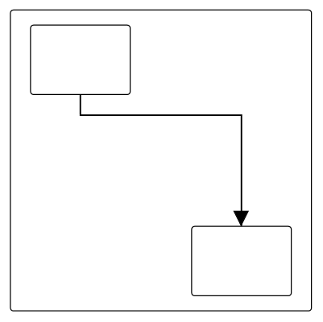
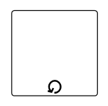
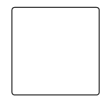
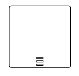
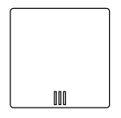
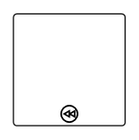
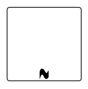
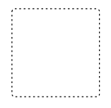
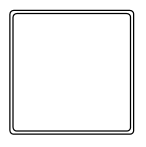

# Expanded SubProcess in WPF Diagram (SfDiagram)

A ExpandedSubProcess is used to frame a part of the diagram, shows that elements included in it are logically belong together and does not have any other semantics other than organizing elements. It is represented by a rounded rectangle.

ExpandedSubProcess is the extended version of Group.

## Create BPMN ExpandedSubProcess

To create a ExpandedSubProcess, you have to define the BpmnGroupViewModel object and enable the [IsExpandedSubProcess](https://help.syncfusion.com/cr/wpf/Syncfusion.UI.Xaml.Diagram.BpmnGroupViewModel.html#Syncfusion_UI_Xaml_Diagram_BpmnGroupViewModel_IsExpandedSubProcess) property and add that to the groups collection of the diagram .

The following code example explains how to create a BPMN group.



 <!--Initialize the SfDiagram-->
<syncfusion:SfDiagram x:Name="Diagram">
   <syncfusion:SfDiagram.Nodes>
     <syncfusion:NodeCollection/>
   </syncfusion:SfDiagram.Nodes>
   <syncfusion:SfDiagram.Connectors>
      <syncfusion:ConnectorCollection/>
   </syncfusion:SfDiagram.Connectors>
   <syncfusion:SfDiagram.Groups>
    <!--Initialize the Group Collection-->
    <syncfusion:GroupCollection>
    <!--Initialize the BpmnGroupViewModel-->
      <syncfusion:BpmnGroupViewModel OffsetX="300" OffsetY="300" UnitHeight="300" UnitWidth="250" IsExpandedSubProcess="True"></syncfusion:BpmnGroupViewModel>
     </syncfusion:GroupCollection>
    </syncfusion:SfDiagram.Groups>
</syncfusion:SfDiagram>




//Initialize the diagram.
SfDiagram diagram = new SfDiagram();

 //Initialize the BpmnGroupViewModel.
BpmnGroupViewModel group = new BpmnGroupViewModel()
{
  OffsetX = 300,
  OffsetY = 300,
  UnitWidth = 300,
  UnitHeight = 250,
  IsExpandedSubProcess = true
 };
 // Add the group into the Group's collection.
(Diagram.Groups as GroupCollection).Add(group);




## Add BPMNNode into BPMNGroup

To add a [BpmnNodeViewModel](https://help.syncfusion.com/cr/wpf/Syncfusion.UI.Xaml.Diagram.BpmnNodeViewModel.html) into BPMNGroup, you have to define the BpmnNodeViewModel object and add that to the nodes collection of the BPMNGroup.

The following code example explains how to create a BPMN group.



 <!--Initialize the SfDiagram-->
<syncfusion:SfDiagram x:Name="Diagram">
  <syncfusion:SfDiagram.Nodes>
     <syncfusion:NodeCollection/>
   </syncfusion:SfDiagram.Nodes>
   <syncfusion:SfDiagram.Connectors>
      <syncfusion:ConnectorCollection/>
   </syncfusion:SfDiagram.Connectors>
   <syncfusion:SfDiagram.Groups>
    <!--Initialize the Group Collection-->
    <syncfusion:GroupCollection>
    <!--Initialize the BpmnGroupViewModel-->
       <syncfusion:BpmnGroupViewModel OffsetX="300" OffsetY="300" UnitHeight="300" UnitWidth="300" IsExpandedSubProcess="True" >
       <syncfusion:BpmnGroupViewModel.Nodes>
         <syncfusion:NodeCollection>
           <syncfusion:BpmnNodeViewModel ID="node1" OffsetX="220" OffsetY="200" UnitHeight="70" UnitWidth="100"></syncfusion:BpmnNodeViewModel>
           <syncfusion:BpmnNodeViewModel ID="node2" OffsetX="380" OffsetY="400" UnitHeight="70" UnitWidth="100"></syncfusion:BpmnNodeViewModel>
         </syncfusion:NodeCollection>
        </syncfusion:BpmnGroupViewModel.Nodes>
        <syncfusion:BpmnGroupViewModel.Connectors>
          <syncfusion:ConnectorCollection>
           <syncfusion:BpmnFlowViewModel SourceNodeID="node1" TargetNodeID="node2"></syncfusion:BpmnFlowViewModel>
          </syncfusion:ConnectorCollection>
        </syncfusion:BpmnGroupViewModel.Connectors>
        </syncfusion:BpmnGroupViewModel>
     </syncfusion:GroupCollection>
    </syncfusion:SfDiagram.Groups>
</syncfusion:SfDiagram>




//Initialize the diagram.
SfDiagram diagram = new SfDiagram();

 //Initialize the BpmnGroupViewModel.
BpmnGroupViewModel group = new BpmnGroupViewModel()
{
  OffsetX = 300,
  OffsetY = 300,
  UnitWidth = 300,
  UnitHeight = 300,
  IsExpandedSubProcess = true
 };
 //Initialize the BpmnNodeViewModel.
 BpmnNodeViewModel node1 = new BpmnNodeViewModel()
 {
    OffsetX = 220,
    OffsetY = 200,
    UnitWidth = 100,
    UnitHeight = 70,
    Type = BpmnShapeType.Activity,
 };
 //Initialize the BpmnNodeViewModel.
 BpmnNodeViewModel node2 = new BpmnNodeViewModel()
 {
    OffsetX = 380,
    OffsetY = 400,
    UnitWidth = 100,
    UnitHeight = 70,
    Type = BpmnShapeType.Activity,
 };
 //Initialize the BpmnFlowViewModel.
 BpmnFlowViewModel flow = new BpmnFlowViewModel()
 {
    SourceNode = node1,
    TargetNode = node2,
 };
 // Add the node into the Node's collection.
(group.Nodes as NodeCollection).Add(node1);
// Add the node into the Node's collection.
(group.Nodes as NodeCollection).Add(node2);
// Add the connector into the Connector's collection.
(group.Connectors as ConnectorCollection).Add(flow);
 // Add the group into the Group's collection.
(Diagram.Groups as GroupCollection).Add(group);




## Add ExpandedSubProcess from stencil

The ExpandedSubProcess can be predefined and added to the stencil and can be dropped into the diagram when needed. For more information about adding nodes from Stencil, refer to the [Stencil](/wpf/sfdiagram/stencil "Stencil") and [BPMN-Shapes-Palette](/wpf/sfdiagram/BPMN-Shapes/BPMN-Shapes-Palette "BPMN-Shapes-Palette").

## Add BPMN Nodes/Groups into BPMN ExpandedSubProcess at runtime
You can add BPMN Nodes or Groups into the BPMN ExpandedSubProcess at runtime in two ways.
 1. Drag and drop the BPMN Nodes or Groups from stencil to the BPMN ExpandedSubProcess.
 2. Drag and drop the BPMN Nodes or Groups from diagram to the BPMN ExpandedSubProcess.

 * While resizing or dragging the child element, if the child element bounds with in the ExpandedSubProcess bounds, the ExpandedSubProcess size will be updated along with that.

 The following image shows how to add BPMNNode into the BPMN ExpandedSubProcess at runtime.

## BPMN activity sub process

A Sub-process is a group of tasks that is used to hide or reveal details of additional levels.

### Loop

The [`LoopActivity`](https://help.syncfusion.com/cr/wpf/Syncfusion.UI.Xaml.Diagram.BpmnGroupViewModel.html#Syncfusion_UI_Xaml_Diagram_BpmnGroupViewModel_LoopActivity) is a task that is internally being looped. The LoopActivity property of BpmnGroupViewModel allows you to define the type of loop. The default value for `LoopActivity` is **None**.

You can define the loop property in the subprocess BPMN shape as shown in the following code.



 <!--Initialize the SfDiagram-->
<syncfusion:SfDiagram x:Name="Diagram">
   <syncfusion:SfDiagram.Nodes>
     <syncfusion:NodeCollection/>
   </syncfusion:SfDiagram.Nodes>
   <syncfusion:SfDiagram.Connectors>
      <syncfusion:ConnectorCollection/>
   </syncfusion:SfDiagram.Connectors>
   <syncfusion:SfDiagram.Groups>
    <!--Initialize the Group Collection-->
    <syncfusion:GroupCollection>
    <!--Initialize the BpmnGroupViewModel-->
      <syncfusion:BpmnGroupViewModel OffsetX="300" OffsetY="300" UnitHeight="300" UnitWidth="250" IsExpandedSubProcess="True" LoopActivity="Standard"></syncfusion:BpmnGroupViewModel>
     </syncfusion:GroupCollection>
    </syncfusion:SfDiagram.Groups>
</syncfusion:SfDiagram>




//Initialize the diagram.
SfDiagram diagram = new SfDiagram();

 //Initialize the BpmnGroupViewModel.
BpmnGroupViewModel group = new BpmnGroupViewModel()
{
  OffsetX = 300,
  OffsetY = 300,
  UnitWidth = 300,
  UnitHeight = 250,
  IsExpandedSubProcess = true,
  LoopActivity = LoopCharacteristic.Standard
 };
 // Add the group into the Group's collection.
(Diagram.Groups as GroupCollection).Add(group);




The following table contains various types of the BPMN loops.

| Loops | Task | Description |
| -------- | -------- | -------- |
| None | | None of the shape shows in the sub-process | 
| Standard |   | Loop marker indicates that the sub-process repeats itself in sequence|
| SequenceMultiInstance |  |Multi-Instance marker indicates that the sub-process can run with other identical sub-processes simultaneously.Three horizontal lines indicate sequential execution|  
| ParallelMultiInstance |  |Multi-Instance marker indicates that the sub-process can run with other identical sub-processes simultaneously.Three vertical lines indicate that the instances will be executed in parallel|

### Compensation

Compensation is triggered when the operation is partially failed. To create a Compensation, you have to enable the [IsCompensationActivity](https://help.syncfusion.com/cr/wpf/Syncfusion.UI.Xaml.Diagram.BpmnGroupViewModel.html#Syncfusion_UI_Xaml_Diagram_BpmnGroupViewModel_IsCompensationActivity) property of the BPMNGroupViewModel.

>Note: By default, the IsCompensationActivity property is False.



 <!--Initialize the SfDiagram-->
<syncfusion:SfDiagram x:Name="Diagram">
   <syncfusion:SfDiagram.Nodes>
     <syncfusion:NodeCollection/>
   </syncfusion:SfDiagram.Nodes>
   <syncfusion:SfDiagram.Connectors>
      <syncfusion:ConnectorCollection/>
   </syncfusion:SfDiagram.Connectors>
   <syncfusion:SfDiagram.Groups>
    <!--Initialize the Group Collection-->
    <syncfusion:GroupCollection>
    <!--Initialize the BpmnGroupViewModel-->
      <syncfusion:BpmnGroupViewModel OffsetX="300" OffsetY="300" UnitHeight="300" UnitWidth="250" IsExpandedSubProcess="True" IsCompensationActivity="True"></syncfusion:BpmnGroupViewModel>
     </syncfusion:GroupCollection>
    </syncfusion:SfDiagram.Groups>
</syncfusion:SfDiagram>




//Initialize the diagram.
SfDiagram diagram = new SfDiagram();

 //Initialize the BpmnGroupViewModel.
BpmnGroupViewModel group = new BpmnGroupViewModel()
{
  OffsetX = 300,
  OffsetY = 300,
  UnitWidth = 300,
  UnitHeight = 250,
  IsExpandedSubProcess = true,
  IsCompensationActivity = true
 };
 // Add the group into the Group's collection.
(Diagram.Groups as GroupCollection).Add(group);




### Ad-Hoc

An ad-hoc subprocess is a group of tasks that are executed in any order or skipped in order to fulfill the end condition. To create a ad-hoc activity, you have to enable the [`IsAdhocActivity`](https://help.syncfusion.com/cr/wpf/Syncfusion.UI.Xaml.Diagram.BpmnGroupViewModel.html#Syncfusion_UI_Xaml_Diagram_BpmnGroupViewModel_IsAdhocActivity) property of the BpmnGroupViewModel.

>Note: By default, the IsAdhocActivity property is False.



 <!--Initialize the SfDiagram-->
<syncfusion:SfDiagram x:Name="Diagram">
   <syncfusion:SfDiagram.Nodes>
     <syncfusion:NodeCollection/>
   </syncfusion:SfDiagram.Nodes>
   <syncfusion:SfDiagram.Connectors>
      <syncfusion:ConnectorCollection/>
   </syncfusion:SfDiagram.Connectors>
   <syncfusion:SfDiagram.Groups>
    <!--Initialize the Group Collection-->
    <syncfusion:GroupCollection>
    <!--Initialize the BpmnGroupViewModel-->
      <syncfusion:BpmnGroupViewModel OffsetX="300" OffsetY="300" UnitHeight="300" UnitWidth="250" IsExpandedSubProcess="True" IsAdhocActivity="True"></syncfusion:BpmnGroupViewModel>
     </syncfusion:GroupCollection>
    </syncfusion:SfDiagram.Groups>
</syncfusion:SfDiagram>




//Initialize the diagram.
SfDiagram diagram = new SfDiagram();

 //Initialize the BpmnGroupViewModel.
BpmnGroupViewModel group = new BpmnGroupViewModel()
{
  OffsetX = 300,
  OffsetY = 300,
  UnitWidth = 300,
  UnitHeight = 250,
  IsExpandedSubProcess = true,
  IsAdhocActivity = true
 };
 // Add the group into the Group's collection.
(Diagram.Groups as GroupCollection).Add(group);




### SubProcessType

SubProcessType represents the type of task that is being processed. The [`SubProcessType`](https://help.syncfusion.com/cr/wpf/Syncfusion.UI.Xaml.Diagram.BpmnGroupViewModel.html#Syncfusion_UI_Xaml_Diagram_BpmnGroupViewModel_SubProcessType) property of the BpmnGroupViewModel allows you to define the type of SubProcess. By default, it is set to **Default**.



 <!--Initialize the SfDiagram-->
<syncfusion:SfDiagram x:Name="Diagram">
   <syncfusion:SfDiagram.Nodes>
     <syncfusion:NodeCollection/>
   </syncfusion:SfDiagram.Nodes>
   <syncfusion:SfDiagram.Connectors>
      <syncfusion:ConnectorCollection/>
   </syncfusion:SfDiagram.Connectors>
   <syncfusion:SfDiagram.Groups>
    <!--Initialize the Group Collection-->
    <syncfusion:GroupCollection>
    <!--Initialize the BpmnGroupViewModel-->
      <syncfusion:BpmnGroupViewModel OffsetX="300" OffsetY="300" UnitHeight="300" UnitWidth="250" IsExpandedSubProcess="True" SubProcessType="Event"></syncfusion:BpmnGroupViewModel>
     </syncfusion:GroupCollection>
    </syncfusion:SfDiagram.Groups>
</syncfusion:SfDiagram>




//Initialize the diagram.
SfDiagram diagram = new SfDiagram();

 //Initialize the BpmnGroupViewModel.
BpmnGroupViewModel group = new BpmnGroupViewModel()
{
  OffsetX = 300,
  OffsetY = 300,
  UnitWidth = 300,
  UnitHeight = 250,
  IsExpandedSubProcess = true,
  SubProcessType = SubProcessType.Event
 };
 // Add the group into the Group's collection.
(Diagram.Groups as GroupCollection).Add(group);




The following table contains various types of the BPMN SubProcess.

| SubProcessType | Symbol | Description |
| -------- | -------- | -------- |
| Call |  |It is a global sub-process that is reused at various points in the business flow|
| Event |  |The event subprocess is a subprocess that is triggered by an event. An event subprocess can be added at the process level or at any subprocess level|
| Default |  |The task that is performed in a business process. It is represented by a rounded rectangle|
| Transaction |  |It is a specialized sub-process that involves payment|
