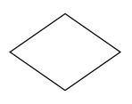
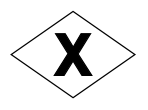
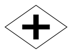
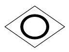
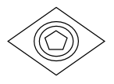
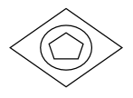
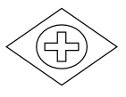

# BPMN gateway and its customization

Gateway is used to control the flow of a process and it is represented as a diamond shape. To create a gateway shape, the `Type` property of the `BpmnNodeViewModel` should be set to [Gateway](https://help.syncfusion.com/cr/wpf/Syncfusion.UI.Xaml.Diagram.Controls.BpmnShapeType.html#fields#GateWay) and the `GatewayType` property can be set to any of the appropriate [[GatewayType]](https://help.syncfusion.com/cr/wpf/Syncfusion.UI.Xaml.Diagram.Controls.GatewayType.html). The default[GatewayType](https://help.syncfusion.com/cr/wpf/Syncfusion.UI.Xaml.Diagram.BpmnNodeViewModel.html#Syncfusion_UI_Xaml_Diagram_BpmnNodeViewModel_GatewayType) will be **None**. The following code example explains how to create a BPMN Gateway.



<!--Initialize the SfDiagram-->
<syncfusion:SfDiagram x:Name="diagram">
    <!--Initialize the Node-->
    <syncfusion:SfDiagram.Nodes>
        <!--Initialize the Node Collection-->
        <syncfusion:NodeCollection>
            <!--Initialize the BpmnNodeViewModel-->
            <syncfusion:BpmnNodeViewModel UnitHeight="70" UnitWidth="100" OffsetX="100" OffsetY="100" Type="Gateway" GatewayType="None"> 
            </syncfusion:BpmnNodeViewModel>
        </syncfusion:NodeCollection>
    </syncfusion:SfDiagram.Nodes>
</syncfusion:SfDiagram>




//Initialize the diagram.
SfDiagram diagram = new SfDiagram();

//Initialize the BpmnNodeViewModel.
BpmnNodeViewModel node = new BpmnNodeViewModel()
{
  OffsetX = 100,
  OffsetY = 100,
  UnitHeight = 70,
  UnitWidth = 100,
  Type = BpmnShapeType.Gateway,
  GatewayType = GatewayType.None
};

// Add the node into the Node's collection.
(Diagram.Nodes as NodeCollection).Add(node);




The following table shows the different types of gateways:

| GatewayType | Symbol |Description|
| -------- | -------- | -------- |
| None |  |It is represented as a diamond shape. None of the symbol shows inside this shape|
| Exclusive |  |It is a state of the business process and based on the condition, breaks the flow into one or more mutually exclusive paths|
| Parallel |  |The Parallel gateways are used to represent two concurrent tasks in a business flow|
| Inclusive |  |Breaks the process flow into one or more flows|
| Complex |  |These gateways are only used for the most complex flows in a business process|
| EventBased |  |The event-based Gateway allows you to make a decision based on events|
| ExclusiveEventBased |  |Starts a new process instance with each occurrence of a subsequent event|
| ParallelEventBased |  |This gateway is similar to a parallel gateway. It allows for multiple processes to happen at the same time but unlike the parallel gateway, the processes are event-dependent|
