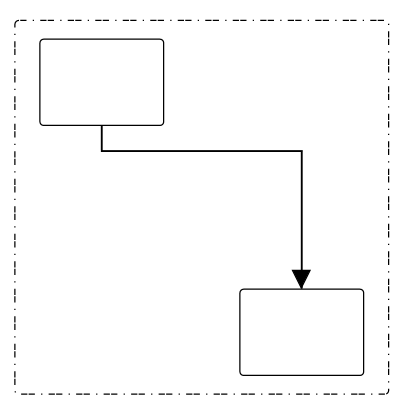
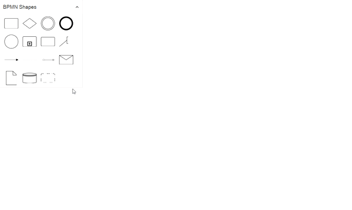

# BPMN Group and its customization

A group is used to frame a part of the diagram, shows that elements included in it are logically belong together and does not have any other semantics other than organizing elements. 

## Create BPMN Group

To create a [BpmnGroupViewModel](https://help.syncfusion.com/cr/wpf/Syncfusion.UI.Xaml.Diagram.BpmnGroupViewModel.html), you have to define the BpmnGroupViewModel object and add that to groups collection of the Diagram.

The following code example explains how to create a BPMN group.



 <!--Initialize the SfDiagram-->
<syncfusion:SfDiagram x:Name="Diagram">
   <syncfusion:SfDiagram.Groups>
    <!--Initialize the Group Collection-->
    <syncfusion:GroupCollection>
    <!--Initialize the BpmnGroupViewModel-->
      <syncfusion:BpmnGroupViewModel OffsetX="300" OffsetY="300" UnitHeight="300" UnitWidth="250" ></syncfusion:BpmnGroupViewModel>
     </syncfusion:GroupCollection>
    </syncfusion:SfDiagram.Groups>
</syncfusion:SfDiagram>




//Initialize the diagram
SfDiagram diagram = new SfDiagram();

 //Initialize the BpmnGroupViewModel
BpmnGroupViewModel group = new BpmnGroupViewModel()
{
  OffsetX = 300,
  OffsetY = 300,
  UnitWidth = 300,
  UnitHeight = 250,
 };
 // Add the group into Group's collection
(Diagram.Groups as GroupCollection).Add(group);




## Add BPMNNode into BPMNGroup by Programmatically

To add a [BpmnNodeViewModel](https://help.syncfusion.com/cr/wpf/Syncfusion.UI.Xaml.Diagram.BpmnNodeViewModel.html) into BPMNGroup, you have to define the BpmnNodeViewModel object and add that to nodes collection of the BPMNGroup.

The following code example explains how to create a BPMN group.



 <!--Initialize the SfDiagram-->
<syncfusion:SfDiagram x:Name="Diagram">
   <syncfusion:SfDiagram.Groups>
    <!--Initialize the Group Collection-->
    <syncfusion:GroupCollection>
    <!--Initialize the BpmnGroupViewModel-->
       <syncfusion:BpmnGroupViewModel OffsetX="300" OffsetY="300" UnitHeight="300" UnitWidth="300" >
       <syncfusion:BpmnGroupViewModel.Nodes>
         <syncfusion:NodeCollection>
           <syncfusion:BpmnNodeViewModel ID="node1" OffsetX="220" OffsetY="200" UnitHeight="70" UnitWidth="100"></syncfusion:BpmnNodeViewModel>
           <syncfusion:BpmnNodeViewModel ID="node2" OffsetX="380" OffsetY="400" UnitHeight="70" UnitWidth="100"></syncfusion:BpmnNodeViewModel>
         </syncfusion:NodeCollection>
        </syncfusion:BpmnGroupViewModel.Nodes>
        <syncfusion:BpmnGroupViewModel.Connectors>
          <syncfusion:ConnectorCollection>
           <syncfusion:BpmnFlowViewModel SourceNodeID="node1" TargetNodeID="node2"></syncfusion:BpmnFlowViewModel>
          </syncfusion:ConnectorCollection>
        </syncfusion:BpmnGroupViewModel.Connectors>
        </syncfusion:BpmnGroupViewModel>
     </syncfusion:GroupCollection>
    </syncfusion:SfDiagram.Groups>
</syncfusion:SfDiagram>




//Initialize the diagram
SfDiagram diagram = new SfDiagram();

 //Initialize the BpmnGroupViewModel
BpmnGroupViewModel group = new BpmnGroupViewModel()
{
  OffsetX = 300,
  OffsetY = 300,
  UnitWidth = 300,
  UnitHeight = 300,
 };
 //Initialize the BpmnNodeViewModel
 BpmnNodeViewModel node1 = new BpmnNodeViewModel()
 {
    OffsetX = 220,
    OffsetY = 200,
    UnitWidth = 100,
    UnitHeight = 70,
    Type = BpmnShapeType.Activity,
 };
 //Initialize the BpmnNodeViewModel
 BpmnNodeViewModel node2 = new BpmnNodeViewModel()
 {
    OffsetX = 380,
    OffsetY = 400,
    UnitWidth = 100,
    UnitHeight = 70,
    Type = BpmnShapeType.Activity,
 };
 //Initialize the BpmnFlowViewModel
 BpmnFlowViewModel flow = new BpmnFlowViewModel()
 {
    SourceNode = node1,
    TargetNode = node2,
 };
 // Add the node into Node's collection
(group.Nodes as NodeCollection).Add(node1);
// Add the node into Node's collection
(group.Nodes as NodeCollection).Add(node2);
// Add the connector into Connector's collection
(group.Connectors as ConnectorCollection).Add(flow);
 // Add the group into Group's collection
(Diagram.Groups as GroupCollection).Add(group);




## Add Group from stencil

Groups can be predefined and added to the stencil and can be dropped into the Diagram when needed. For more information about adding Nodes from Stencil, refer to the [Stencil](/wpf/sfdiagram/stencil "Stencil") and [BPMN-Shapes-Palette](/wpf/sfdiagram/BPMN-Shapes/BPMN-Shapes-Palette "BPMN-Shapes-Palette").

## Add BPMNNode into BPMNGroup at runtime
we can add BPMNNode into BPMNGroup at runtime by drag and drop the BPMNNode from stencil to BPMN Group and drag and drop the BPMNNode from diagram to BPMN Group.

 * While resize/drag the child Node, if the child node bounds with in the group bounds, the group size will be updated along with that.

 The following image shows how to add BPMNNode into BPMNGroup at runtime.

