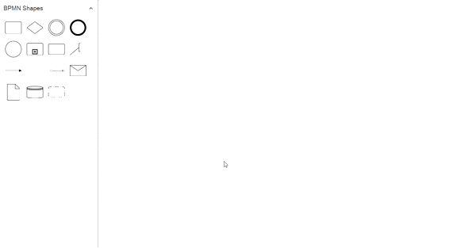
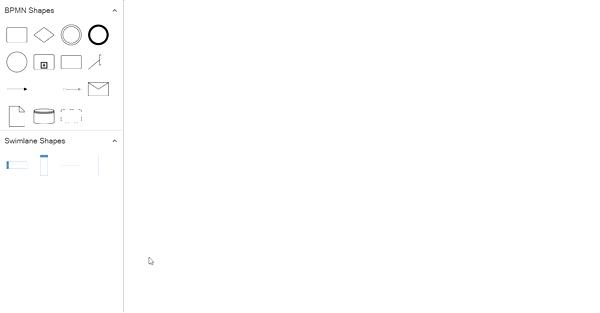

# Shapes Palette in WPF Diagram (SfDiagram)
  Diagram provides the support to add BPMN shapes to Stencil. 

## Add BPMN shapes into stencil

BPMN Nodes can be predefined and added to the stencil and can be dropped into the diagram when needed.

The following code sample shows how to add the BPMN shapes to palette.



 <syncfusion:Stencil x:Name="stencil"  BorderThickness="0,0,1,0" ExpandMode="All">
     <syncfusion:Stencil.SymbolSource>
         <syncfusion:SymbolCollection>
         <syncfusion:BpmnNodeViewModel Key="BPMN Shapes" UnitHeight="100" UnitWidth="100" Type="Activity" ActivityType="Task"></syncfusion:BpmnNodeViewModel>
        <syncfusion:BpmnNodeViewModel Key="BPMN Shapes" UnitHeight="100" UnitWidth="100" Type="Gateway" GatewayType="None"></syncfusion:BpmnNodeViewModel>
        <syncfusion:BpmnNodeViewModel Key="BPMN Shapes" UnitHeight="100" UnitWidth="100" Type="Event" EventType="Start"></syncfusion:BpmnNodeViewModel>
        <syncfusion:BpmnNodeViewModel Key="BPMN Shapes" UnitHeight="100" UnitWidth="100" Type="Event" EventType="End"></syncfusion:BpmnNodeViewModel>
        <syncfusion:BpmnNodeViewModel Key="BPMN Shapes" UnitHeight="100" UnitWidth="100" Type="Activity" ActivityType="CollapsedSubProcess"></syncfusion:BpmnNodeViewModel>
        <syncfusion:BpmnNodeViewModel Key="BPMN Shapes" UnitHeight="100" UnitWidth="100" Type="TextAnnotation" ></syncfusion:BpmnNodeViewModel>
        <syncfusion:BpmnNodeViewModel Key="BPMN Shapes" UnitHeight="100" UnitWidth="100" Type="Message" ></syncfusion:BpmnNodeViewModel>
        <syncfusion:BpmnNodeViewModel Key="BPMN Shapes" UnitHeight="100" UnitWidth="100" Type="DataObject" ></syncfusion:BpmnNodeViewModel>
        <syncfusion:BpmnNodeViewModel Key="BPMN Shapes" UnitHeight="100" UnitWidth="100" Type="DataStore" ></syncfusion:BpmnNodeViewModel>
        <syncfusion:BpmnFlowViewModel Key="BPMN Shapes" SourcePoint="100,100" TargetPoint="200,100" FlowType="SequenceFlow" ></syncfusion:BpmnFlowViewModel>
        <syncfusion:BpmnFlowViewModel Key="BPMN Shapes" SourcePoint="100,100" TargetPoint="200,100" FlowType="Association" ></syncfusion:BpmnFlowViewModel>
        <syncfusion:BpmnFlowViewModel Key="BPMN Shapes" SourcePoint="100,100" TargetPoint="200,100" FlowType="MessageFlow" ></syncfusion:BpmnFlowViewModel>
        <syncfusion:BpmnGroupViewModel Key="BPMN Shapes" UnitHeight="100" UnitWidth="100" IsExpandedSubProcess="True" ></syncfusion:BpmnGroupViewModel>
        <syncfusion:BpmnGroupViewModel Key="BPMN Shapes" UnitHeight="100" UnitWidth="100" ></syncfusion:BpmnGroupViewModel>
         </syncfusion:SymbolCollection>
       </syncfusion:Stencil.SymbolSource>
         <syncfusion:Stencil.SymbolGroups>
             <syncfusion:SymbolGroups>
               <!--Separate groups based on the key-->
             <syncfusion:SymbolGroupProvider MappingName="Key"/>
         </syncfusion:SymbolGroups>
    </syncfusion:Stencil.SymbolGroups>
 </syncfusion:Stencil>




## Add BPMN shapes to palette using the category

You can add the BPMN shapes using the category. For more information, refer to the [Symbol categories](/wpf/sfdiagram/stencil#symbol-categories "Symbol categories"). 

## Interactions

* Drag and drop support for BPMN shapes have been provided.
* When you drag and drop the BPMN shape, if the diagram already contains BPMNGroup or Expanded subprocess, the element will be added and stacked inside a BPMN based on the order. 

The following image shows how to drag symbol from palette.

## How to create Swimlane objects in BPMN.

The following code sample shows how to add the BPMN shapes to palette.



 <syncfusion:Stencil x:Name="stencil" BorderThickness="0,0,1,0" ExpandMode="All">
      <syncfusion:Stencil.Categories>
         <syncfusion:StencilCategoryCollection>
          <!--Specify the basic shapes category with title and resource key-->
           <syncfusion:StencilCategory Title="BPMN Shapes" Keys="{StaticResource BPMNEditorShapes}"/>
           <syncfusion:StencilCategory Title="Swimlane Shapes" Keys="{StaticResource SwimlaneShapes}"/>
           </syncfusion:StencilCategoryCollection>
         </syncfusion:Stencil.Categories>
         <syncfusion:Stencil.SymbolGroups>
             <syncfusion:SymbolGroups>
               <!--Separate groups based on the key-->
             <syncfusion:SymbolGroupProvider MappingName="Key"/>
         </syncfusion:SymbolGroups>
    </syncfusion:Stencil.SymbolGroups>
 </syncfusion:Stencil>

  <syncfusion:SfDiagram  x:Name="Diagram">
     <syncfusion:SfDiagram.Nodes>                        
        <syncfusion:NodeCollection/>
    </syncfusion:SfDiagram.Nodes>
     <syncfusion:SfDiagram.Connectors>
          <syncfusion:ConnectorCollection/>
     </syncfusion:SfDiagram.Connectors>
     <syncfusion:SfDiagram.Swimlanes>
       <syncfusion:SwimlaneCollection/>
     </syncfusion:SfDiagram.Swimlanes>
  </syncfusion:SfDiagram>




