# BPMN Shapes in WPF Diagram (SfDiagram)

BPMN(Business Process Model and Notation) shapes are used to represent the internal business procedure in a graphical notation and enable you to communicate the procedures in a standard manner. To create BPMN shapes, you have to initialize [BpmnNodeViewModel]((https://help.syncfusion.com/cr/wpf/Syncfusion.UI.Xaml.Diagram.BpmnNodeViewModel.html)) with the [Type](https://help.syncfusion.com/cr/wpf/Syncfusion.UI.Xaml.Diagram.BpmnNodeViewModel.html#Syncfusion_UI_Xaml_Diagram_BpmnNodeViewModel_Type) property. The Type property can be set to any one of the built-in bpmn shapes using the BpmnShapeType enumeration. The default value for the Type property of BpmnNodeViewModel is "Activity".

The following code example explains how to create a simple business process.



<!--Initialize the SfDiagram-->
<syncfusion:SfDiagram x:Name="diagram">
    <!--Initialize the Node-->
    <syncfusion:SfDiagram.Nodes>
        <!--Initialize the Node Collection-->
        <syncfusion:NodeCollection>
            <!--Initialize the BpmnNodeViewModel-->
            <syncfusion:BpmnNodeViewModel UnitHeight="70" UnitWidth="100" OffsetX="100" OffsetY="100" Type="Activity">
            </syncfusion:BpmnNodeViewModel>
        </syncfusion:NodeCollection>
    </syncfusion:SfDiagram.Nodes>
</syncfusion:SfDiagram>




//Initialize the diagram.
SfDiagram diagram = new SfDiagram();

//Initialize the BpmnNodeViewModel.
BpmnNodeViewModel node = new BpmnNodeViewModel()
{
  OffsetX = 100,
  OffsetY = 100,
  UnitHeight = 70,
  UnitWidth = 100,
  Type = BpmnShapeType.Activity,
};

// Add the node into the Node's collection.
(Diagram.Nodes as NodeCollection).Add(node);




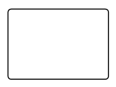

The list of supported BPMN shapes are as follows:

| Shape | Symbol | Description
| -------- | -------- | --------|
| Event | 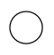 |Event shape represents something happens during a business process|
| Gateway | 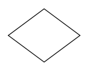 |Gateway is used to control the flow of a process|
| Activity | 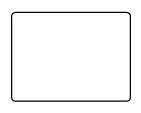 | Activities describe the kind of work being done in a particular process instance |
| Message |  | The message is just the content of the communication|
| DataStore | 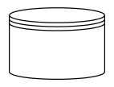 |DataStore is used to store or access data associated with a business process|
| DataObject | 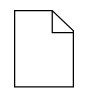 |A DataObject represents information flowing using the process, such as data placed into the process, data resulting from the process, data that needs to be collected, or data that must be stored|
| TextAnnotation | 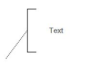 |A TextAnnotation points at or references the another BPMN shape, which we call as the TextAnnotationTarget of the TextAnnotation|
| Group |  |Organize tasks or processes that have significance in the overall process.|
| Expandedsubprocess | 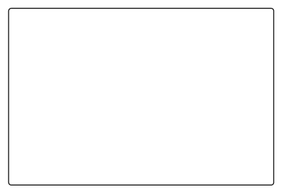 |ExpandedSubProcess is the extended version of the Group|
| Sequenceflow | 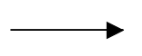 |Sequence flows represent the typical path between two flow objects.|
| DefaultSequenceflow | 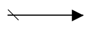 |Default sequence flows are represented by an arrow with a tic mark on the one end|
| ConditionalSequenceflow | 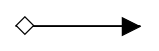 |Conditional sequence flows are used to control the flow of a process based on the certain conditions|
| Association | 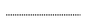 |An Association is represented as a dotted graphical line with an opened arrow.|
| DirectionalAssociation | 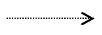 | DirectionalAssociation is represented as a dotted graphical line with one side arrow.|
| BiDirectionalAssociation | 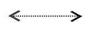 |BiDirectionalAssociation is represented as a dotted graphical line with the double side arrow.|
| MessageFlow | 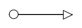 |A MessageFlow flow shows the flow of messages between two participants and is represented by line.|
| InitiatingMessageflow |  | An activity or event in one pool can initiate a message to another pool|
| NonInitiatingMessageflow |  | An activity or event in one pool cann't initiate a message to another pool|

Please find the BPMN Editor sample as follows.

[View BPMN Editor sample in GitHub](https://github.com/SyncfusionExamples/WPF-Diagram-Examples/tree/master/Samples/BPMNEditor/Sample)
