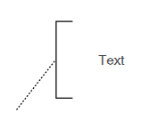
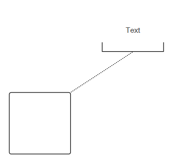
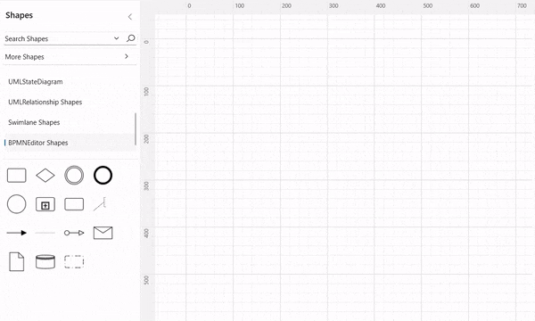

# BPMN text annotation

* A TextAnnotation points at or references another BPMN shape,which we call the [TextAnnotationTarget](https://help.syncfusion.com/cr/wpf/Syncfusion.UI.Xaml.Diagram.BpmnNodeViewModel.html#Syncfusion_UI_Xaml_Diagram_BpmnNodeViewModel_TextAnnotationTarget) of the TextAnnotation. When a target shape is moved, copied or deleted, any TextAnnotations attached to the shape will be moved, copied or deleted too.  Thus TextAnnotations stay with their target shapes, though you can reposition the TextAnnotation to any offset from its target. The TextAnnotationTarget property of the node is used to connect an annotation element to the BPMN node.

* The annotation element can be switched from a BPMN node to another BPMN node simply by dragging the source end of the annotation connector into the other BPMN node.

* By default, the TextAnnotation shape having a connection.

* The [TextAnnotationDirection](https://help.syncfusion.com/cr/wpf/Syncfusion.UI.Xaml.Diagram.BpmnNodeViewModel.html#Syncfusion_UI_Xaml_Diagram_BpmnNodeViewModel_TextAnnotationDirection) property is used to set the direction of the text annotation.

* To set the size for text annotation, use UnitWidth and UnitHeight properties.

* The OffsetX and OffsetY property is used to set the distance between the BPMN shape and the annotation.

* The TextAnnotation element can be moved (if their have connected with any BPMN Node) while dragging the BPMN node.

The following code example represent, how to create a TextAnnotation.




//Initialize the diagram
SfDiagram diagram = new SfDiagram();

 //Initialize the BpmnNodeViewModel with type as TextAnnotation
BpmnNodeViewModel textannotation = new BpmnNodeViewModel()
{
   OffsetX = 300,
   OffsetY = 100,
   UnitWidth = 100,
   UnitHeight = 70,
   Type = BpmnShapeType.TextAnnotation,
   TextAnnotationDirection = TextAnnotationDirection.Left,
   Annotations = new ObservableCollection<IAnnotation>()
   {
     new AnnotationEditorViewModel()
     {
        Content="Text"
     }
   }
};

// Add the node into Node's collection
(diagram.Nodes as NodeCollection).Add(textannotation);

The following code example represent how to create a TextAnnotation and make a connection between Activity and TextAnnotation shapes.







//Initialize the diagram
SfDiagram diagram = new SfDiagram();

//Initialize the BpmnNodeViewModel
BpmnNodeViewModel node = new BpmnNodeViewModel()
{
   OffsetX = 150,
   OffsetY = 250,
   UnitWidth = 100,
   UnitHeight = 100,
   Type = BpmnShapeType.Activity,
};

 //Initialize the BpmnNodeViewModel with type as TextAnnotation
BpmnNodeViewModel textannotation = new BpmnNodeViewModel()
{
   OffsetX = 300,
   OffsetY = 100,
   UnitWidth = 100,
   UnitHeight = 70,
   Type = BpmnShapeType.TextAnnotation,
   TextAnnotationTarget = node,
   Annotations = new ObservableCollection<IAnnotation>()
   {
     new AnnotationEditorViewModel()
     {
        Content="Text"
     }
   }
};

// Add the node into Node's collection
(diagram.Nodes as NodeCollection).Add(node);
(diagram.Nodes as NodeCollection).Add(textannotation);




## How to create a connection between TextAnnotation to BPMNNode

By drag and drop any bpmn shapes from stencil to diagram and make a connection between BPMN Node and TextAnnotation.

The following image shows how to drag symbol from palette and create a connection between TextAnnotation to BPMNNode with interaction.

