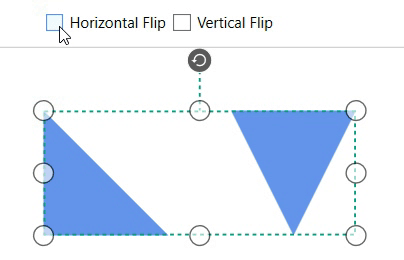

# Flip Command in WPF SfDiagram

The [`Flip`](https://help.syncfusion.com/cr/wpf/Syncfusion.UI.Xaml.Diagram.IDiagramCommands.html#Syncfusion_UI_Xaml_Diagram_IDiagramCommands_Flip) command is used to mirror the selected object's content and port in the [WPF Diagram](https://www.syncfusion.com/diagram-sdk/wpf-diagram) page in both horizontal and vertical directions. 





<Button Height="50" Content="Flip" Name="Flip" Command="Syncfusion:DiagramCommands.Flip"></Button>





//Initialize the SfDiagram 
SfDiagram Diagram = new SfDiagram();

IGraphInfo graphinfo = Diagram.Info as IGraphInfo;
// Apply flip to selected objects.
graphinfo.Commands.Flip.Execute(null);




## Flip parameter

The [Flip parameter](https://help.syncfusion.com/cr/wpf/Syncfusion.UI.Xaml.Diagram.FlipParameter.html) is used to customize the flip mode and flip direction. If the parameter is null, then the object will be flipped both horizontally and vertically.

### Flip mode 

The [FlipMode](https://help.syncfusion.com/cr/wpf/Syncfusion.UI.Xaml.Diagram.FlipMode.html) is used to control the behaviour of the flip object. The default value of `FlipMode` is `None`.

| FlipMode | Description |
| --- | --- |
| Content | It is used to enable or disables the flip for object's content. |
| Port | It is used to enable or disables the flip for object's port. |
| FlipMode | It is used to enable or disables the flip for both object's content and port. |
| None | It is used to disables all flip mode behavior. |

### Flip

The [Flip](https://help.syncfusion.com/cr/wpf/Syncfusion.UI.Xaml.Diagram.Flip.html) is used to specify the flip direction in flip command. The default value of the `Flip` is ``None`.

| Flip | Description |
| --- | --- |
| Flip | It is used to flip the node or port is mirrored across both the horizontal and vertical axes.|
| HorizontalFlip | It is used to flip the node or port is mirrored across the horizontal axis.|
| VerticalFlip | It is used to flip the node or port is mirrored across the vertical axis. |
| None | It is used to disables all the flip behavior. |




//Initialize the SfDiagram 
SfDiagram Diagram = new SfDiagram();

IGraphInfo graphinfo = Diagram.Info as IGraphInfo;

FlipParameter parameter = new FlipParameter()
{
    Flip = Syncfusion.UI.Xaml.Diagram.Flip.HorizontalFlip,

    FlipMode = FlipMode.Content
};

graphinfo.Commands.Flip.Execute(parameter);




### Group Flip

When the Flip command is applied to the group, it enables the transformation of its content, including nodes, connectors, and ports, in accordance with their positions within the group, aligning with the specified flip direction.

[View sample in GitHub](https://github.com/SyncfusionExamples/WPF-Diagram-Examples/tree/master/Samples/Commands/Flip%20Command)