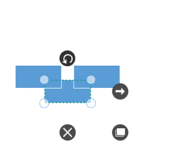
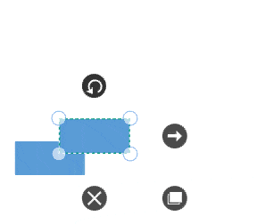

# Z-Order Commands in WPF SfDiagram

Z – Order commands are used to visually arrange the selected objects such as Nodes and Connectors on the [WPF Diagram](https://www.syncfusion.com/diagram-sdk/wpf-diagram) page with its Z-order values.

Z-order determines the visual stacking order of diagram elements on the page. When two or more elements overlap, the element with a higher Z-order value appears in front of elements with lower Z-order values. Z-Order commands can be used to change this stacking order and control the visibility of overlapping elements.

## BringToFront

The [`BringToFront`](https://help.syncfusion.com/cr/wpf/Syncfusion.UI.Xaml.Diagram.IDiagramCommands.html#Syncfusion_UI_Xaml_Diagram_IDiagramCommands_BringToFront) command is used to visually bring the selected element to the front over all other overlapped elements. 

N> If the selected element is already at the highest Z-order level, executing the `BringToFront` command will not produce any visible change.





<Button Height="50" Content="BringToFront" Name="BringToFront" Command="Syncfusion:DiagramCommands.BringToFront"></Button>





//Initialize the SfDiagram 
SfDiagram diagramcontrol = new SfDiagram();

IGraphInfo graphinfo = diagramcontrol.Info as IGraphInfo;

//Brings to front
graphinfo.Commands.BringToFront.Execute(null);




## SendToBack

The [`SendToBack`](https://help.syncfusion.com/cr/wpf/Syncfusion.UI.Xaml.Diagram.IDiagramCommands.html#Syncfusion_UI_Xaml_Diagram_IDiagramCommands_SendToBack) command visually moves the selected elements behind all other overlapped elements. 

N> If the selected element is already at the lowest Z-order level, executing the `SendToBack` command will not produce any visible change.





<Button Height="50" Content="SendToBack" Name="SendToBack" Command="Syncfusion:DiagramCommands.SendToBack"></Button>





//Initialize the SfDiagram 
SfDiagram diagramcontrol = new SfDiagram();

IGraphInfo graphinfo = diagramcontrol.Info as IGraphInfo;

// Send To Back
graphinfo.Commands.SendToBack.Execute(null);




## SendBackward

The [`SendBackward`](https://help.syncfusion.com/cr/wpf/Syncfusion.UI.Xaml.Diagram.IDiagramCommands.html#Syncfusion_UI_Xaml_Diagram_IDiagramCommands_SendBackward) command visually moves the selected elements behind the underlying element.

N> The `SendBackward` command moves the selected element one level backward in the Z-order stack. If no element exists behind it, the command will not produce any visible change.





<Button Height="50" Content="SendBackward" Name="SendBackward" Command="Syncfusion:DiagramCommands.SendBackward"></Button>





//Initialize the SfDiagram 
SfDiagram diagramcontrol = new SfDiagram();

IGraphInfo graphinfo = diagramcontrol.Info as IGraphInfo;

// Send To Backward
graphinfo.Commands.SendBackward.Execute(null);




## BringForward

The [`BringForward`](https://help.syncfusion.com/cr/wpf/Syncfusion.UI.Xaml.Diagram.IDiagramCommands.html#Syncfusion_UI_Xaml_Diagram_IDiagramCommands_BringForward) command visually moves the selected element over the nearest overlapping element.

N> The `BringForward` command moves the selected element one level forward in the Z-order stack. If no element exists in front of it, the command will not produce any visible change.





<Button Height="50" Content="BringForward" Name="BringForward" Command="Syncfusion:DiagramCommands.BringForward"></Button>





//Initialize the SfDiagram 
SfDiagram diagramcontrol = new SfDiagram();

IGraphInfo graphinfo = diagramcontrol.Info as IGraphInfo;

// Brings To Forward
graphinfo.Commands.BringForward.Execute(null);




[View sample in GitHub](https://github.com/SyncfusionExamples/WPF-Diagram-Examples/tree/master/Samples/Commands/Z-Order%20Commands)