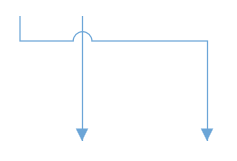

# Appearance and Validation in WPF Diagram (SfDiagram)

The source point, target point, and segements path of a connector can be customized to change their appearance and it can be validated to customize their original functionalities.

## Decorator

The start and end points of a connector can be decorated with some customizable shapes like arrows, circles, diamond, or any path. You can decorate the connection end points using the [SourceDecorator](https://help.syncfusion.com/cr/wpf/Syncfusion.UI.Xaml.Diagram.Connector.html#Syncfusion_UI_Xaml_Diagram_Connector_SourceDecorator) and [TargetDecorator](https://help.syncfusion.com/cr/wpf/Syncfusion.UI.Xaml.Diagram.Connector.html#Syncfusion_UI_Xaml_Diagram_Connector_TargetDecorator) properties of connector. 

The [SourceDecoratorStyle](https://help.syncfusion.com/cr/wpf/Syncfusion.UI.Xaml.Diagram.Connector.html#Syncfusion_UI_Xaml_Diagram_Connector_SourceDecoratorStyle) and [TargetDecoratorStyle](https://help.syncfusion.com/cr/wpf/Syncfusion.UI.Xaml.Diagram.Connector.html#Syncfusion_UI_Xaml_Diagram_Connector_TargetDecoratorStyle) properties allows you to define the styles of the decorators shapes.




<!--Common style for connector geometry lines-->

<!--Common style for filled decortors-->

<!--Initialize the connector with source and target decorators and their styles-->
<syncfusion:ConnectorViewModel SourcePoint="100,100" TargetPoint="200,200" 
                               ConnectorGeometryStyle="{StaticResource connectorLineStyle}" 
                               SourceDecorator="{StaticResource Ellipse}" 
                               SourceDecoratorStyle="{StaticResource DecoratorFillStyle}" 
                               TargetDecorator="{StaticResource ClosedSharp}" 
                               TargetDecoratorStyle="{StaticResource DecoratorFillStyle}">
</syncfusion:ConnectorViewModel>

<!--Initialize the connector with source and target decorators and their styles-->
<syncfusion:ConnectorViewModel SourcePoint="300,100" TargetPoint="400,200"                    
                               ConnectorGeometryStyle="{StaticResource connectorLineStyle}" 
                               SourceDecorator="{StaticResource Rectangle}" 
                               SourceDecoratorStyle="{StaticResource DecoratorFillStyle}" 
                               TargetDecorator="{StaticResource OpenSharp}" 
                               TargetDecoratorStyle="{StaticResource DecoratorFillStyle}">
</syncfusion:ConnectorViewModel>




//Define the Connector
ConnectorViewModel EllipseDecorator = new ConnectorViewModel()
{
    SourcePoint = new Point(100, 100),
    TargetPoint = new Point(200, 200),
    ConnectorGeometryStyle = this.Resources["connectorLineStyle"] as Style,
    //Specifies ellipse shape source decorator
    SourceDecorator = this.Resources["Ellipse"],
    //Specifies the style for source decorator
    SourceDecoratorStyle = this.Resources["DecoratorFillStyle"] as Style,
    //Specifies arrow shape target decorator
    TargetDecorator = this.Resources["ClosedSharp"],
    //Specifies the style for target decorator
    TargetDecoratorStyle = this.Resources["DecoratorFillStyle"] as Style
};

ConnectorViewModel RectangleDecorator = new ConnectorViewModel()
{
    SourcePoint = new Point(300, 100),
    TargetPoint = new Point(400, 200),
    ConnectorGeometryStyle = this.Resources["connectorLineStyle"] as Style,
    //Specifies diamond shape source decorator
    SourceDecorator = this.Resources["Rectangle"],
    //Specifies style for source decorator
    SourceDecoratorStyle = this.Resources["DecoratorFillStyle"] as Style,
    //Specifies Open arrow shape decorator
    TargetDecorator = this.Resources["OpenSharp"],
    //Specifies style for target decorator
    TargetDecoratorStyle = this.Resources["DecoratorFillStyle"] as Style
};




Each decorator shapes can be changed as hollow type shapes, which contains a hole or empty space inside the shape. To change the normal shape as hollow type shape, you should change the style of the decorator shapes. 



<!--Common style for hollow type decortors-->

<!--Initialize the connector with hollow style for source and target decortors-->
<syncfusion:ConnectorViewModel SourcePoint="500,100" TargetPoint="600,200" 
                               ConnectorGeometryStyle="{StaticResource connectorLineStyle}" 
                               SourceDecorator="{StaticResource Ellipse}" 
                               SourceDecoratorStyle="{StaticResource DecoratorHollowStyle}" 
                               TargetDecorator="{StaticResource ClosedSharp}" 
                               TargetDecoratorStyle="{StaticResource DecoratorHollowStyle}">
</syncfusion:ConnectorViewModel>

<!--Initialize the connector with hollow style for source and target decortors-->
<syncfusion:ConnectorViewModel SourcePoint="700,100" TargetPoint="800,200" 
                               ConnectorGeometryStyle="{StaticResource connectorLineStyle}"
                               SourceDecorator="{StaticResource Rectangle}" 
                               SourceDecoratorStyle="{StaticResource DecoratorHollowStyle}" 
                               TargetDecorator="{StaticResource OpenSharp}" 
                               TargetDecoratorStyle="{StaticResource DecoratorHollowStyle}">
</syncfusion:ConnectorViewModel>



//Define the Connector
ConnectorViewModel HollowEllipseDecorator = new ConnectorViewModel()
{
    SourcePoint = new Point(500, 100),
    TargetPoint = new Point(600, 200),
    ConnectorGeometryStyle = this.Resources["connectorLineStyle"] as Style,
    SourceDecorator = this.Resources["Ellipse"],
    //Specify the hollow style for source decorator
    SourceDecoratorStyle = this.Resources["DecoratorHollowStyle"] as Style,
    TargetDecorator = this.Resources["ClosedSharp"],
    //Specify the hollow style for target decorator
    TargetDecoratorStyle = this.Resources["DecoratorHollowStyle"] as Style
};

//Define the Connector
ConnectorViewModel HollowRectangleDecorator = new ConnectorViewModel()
{
    SourcePoint = new Point(700, 100),
    TargetPoint = new Point(800, 200),
    ConnectorGeometryStyle = this.Resources["connectorLineStyle"] as Style,
    SourceDecorator = this.Resources["Rectangle"],
    //Specify the hollow style for source decorator
    SourceDecoratorStyle = this.Resources["DecoratorHollowStyle"] as Style,
    TargetDecorator = this.Resources["OpenSharp"],
    //Specify the hollow style for target decorator
    TargetDecoratorStyle = this.Resources["DecoratorHollowStyle"] as Style
};



Following table shows available decorators shapes in the diagram control,

| Shape name | Shape Style | Output |
|---|---|---|
| Open90 |  Stroke = "#6BA5D7" | |
| Closed90 | Stroke = "#6BA5D7"   Fill = "#6BA5D7" |  |
| Closed90 | Stroke = "#6BA5D7"   Fill = "White" |  |
| OpenSharp | Stroke = "#6BA5D7"|  |
| ClosedSharp | Stroke = "#6BA5D7"   Fill = "#6BA5D7" |  |
| ClosedSharp | Stroke = "#6BA5D7"   Fill = "White" |  |
| IndentedClosed | Stroke = "#6BA5D7"   Fill = "#6BA5D7" | |
| IndentedClosed | Stroke = "#6BA5D7"   Fill = "White" | |
| OutdentedClosed | Stroke = "#6BA5D7"   Fill = "#6BA5D7" |  |
| OutdentedClosed | Stroke = "#6BA5D7"   Fill = "White" | |
| OpenFletch | Stroke = "#6BA5D7"   Fill = "#6BA5D7" | |
| ClosedFlench | Stroke = "#6BA5D7"   Fill = "#6BA5D7" | |
| ClosedFlench | Stroke = "#6BA5D7"   Fill = "White" |  |
| DimensionLine | Stroke = "#6BA5D7" |  |
| Ellipse | Stroke = "#6BA5D7"   Fill = "#6BA5D7" |  |
| Ellipse | Stroke = "#6BA5D7"   Fill = "White" | |
| Rectangle | Stroke = "#6BA5D7"   Fill = "#6BA5D7" | |
| Rectangle | Stroke = "#6BA5D7"   Fill = "White" | |
| OpenASME | Stroke = "#6BA5D7" |  |
| ClosedASME | Stroke = "#6BA5D7"   Fill = "#6BA5D7" | |
| ClosedASME | Stroke = "#6BA5D7"   Fill = "White" |  |
| BlackSlash | Stroke = "#6BA5D7" |  |
| OpenOnedDash | Stroke = "#6BA5D7" | |
| OpenTwoDash | Stroke = "#6BA5D7" |  |
| Open3Dash | Stroke = "#6BA5D7" | |
| Fork | Stroke = "#6BA5D7" | |
| ClosedFork | Stroke = "#6BA5D7"   Fill = "White" |  |
| ClosedPlus | Stroke = "#6BA5D7"   Fill = "White" |  |
| ClosedOneDash | Stroke = "#6BA5D7"   Fill = "White" | |
| ClosedOneDash | Stroke = "#6BA5D7"   Fill = "#6BA5D7" |  |
| ClosedTwoDash | Stroke = "#6BA5D7"   Fill = "White"|  |
| ClosedTwoDash | Stroke = "#6BA5D7"   Fill = "#6BA5D7" |  |
| ClosedThreeDash | Stroke = "#6BA5D7"   Fill = "White"|  |
| ClosedThreeDash | Stroke = "#6BA5D7"   Fill = "#6BA5D7" | |
| Diamond | Stroke = "#6BA5D7"   Fill = "White"|  |
| Diamond | Stroke = "#6BA5D7"   Fill = "#6BA5D7" | |
| ClosedDouble | Stroke = "#6BA5D7"   Fill = "#6BA5D7" | |
| ClosedDouble | Stroke = "#6BA5D7"   Fill = "White" |  |
| OpenDouble | Stroke = "#6BA5D7" |  |
| OpenArrowSingleDash | Stroke = "#6BA5D7" |  |
| OpenDoubleArrowSingleDash | Stroke = "#6BA5D7" | |

### How to position the decorators shapes 

The [SourceDecoratorPivot](https://help.syncfusion.com/cr/wpf/Syncfusion.UI.Xaml.Diagram.Connector.html#Syncfusion_UI_Xaml_Diagram_Connector_SourceDecoratorPivot) and [TargetDecoratorPivot](https://help.syncfusion.com/cr/wpf/Syncfusion.UI.Xaml.Diagram.Connector.html#Syncfusion_UI_Xaml_Diagram_Connector_TargetDecoratorPivot) properties allows you to customize the position of the decorators in the connector within 0-1 range. The default pivot value of source and target decorator is (1, 0.5).



<!--Initialize the connector with source and decorator pivots-->
<syncfusion:ConnectorViewModel SourcePoint="900,100" TargetPoint="1000,200" ConnectorGeometryStyle="{StaticResource connectorLineStyle}" SourceDecoratorPivot="0,0" SourceDecorator="{StaticResource Ellipse}" SourceDecoratorStyle="{StaticResource DecoratorFillStyle}" TargetDecoratorPivot="0,0" TargetDecorator="{StaticResource ClosedSharp}" TargetDecoratorStyle="{StaticResource DecoratorFillStyle}">
</syncfusion:ConnectorViewModel>


ConnectorViewModel PivotDecorator = new ConnectorViewModel()
{
    SourcePoint = new Point(900, 100),
    TargetPoint = new Point(1000, 200),
    ConnectorGeometryStyle = this.Resources["connectorLineStyle"] as Style,
    //Defines source pivot position
    SourceDecoratorPivot = new Point(0,0),
    SourceDecorator = this.Resources["Ellipse"],
    SourceDecoratorStyle = App.Current.Resources["DecoratorFillStyle"] as Style,
    //Defines target pivot position
    TargetDecoratorPivot = new Point(0,0),
    TargetDecorator = this.Resources["ClosedSharp"],
    TargetDecoratorStyle = this.Resources["DecoratorFillStyle"] as Style
};



| Pivot value | Output |
|---|---|
| (0,0) |  |
| (0,1) |  |
| (1,0) |  | 
| (1,1) |  |

### Segment decorators
 
The [SegmentDecorator](https://help.syncfusion.com/cr/wpf/Syncfusion.UI.Xaml.Diagram.SegmentDecorator.html) class allows you to customize the shape within the segments line. The [SegmentDecoratorStyle](https://help.syncfusion.com/cr/wpf/Syncfusion.UI.Xaml.Diagram.Connector.html#Syncfusion_UI_Xaml_Diagram_Connector_SegmentDecoratorStyle) property allows to customize the Style of SegmentDecorator. You can add any shape to the segments of the connector from resource dictionary. The [Length](https://help.syncfusion.com/cr/wpf/Syncfusion.UI.Xaml.Diagram.SegmentDecorator.html#Syncfusion_UI_Xaml_Diagram_SegmentDecorator_Length) property of `SegmentDecorator` class is used to set the position of the segment decorator on the segment path. By default, the segment decorator will be added at the center of the segment, which is of length 0.5d.
 


<!--Common style for segment decortors-->

<!--Initialize the connector with segment decorator shape, its style and length-->
<syncfusion:ConnectorViewModel SourcePoint="1100,300" TargetPoint="1200,400" 
                               ConnectorGeometryStyle="{StaticResource connectorLineStyle}" 
                               TargetDecorator="{StaticResource ClosedSharp}" 
                               TargetDecoratorStyle="{StaticResource DecoratorFillStyle}" 
                               SegmentDecoratorStyle="{StaticResource SegmentDecoratorStyle}">
    <syncfusion:ConnectorViewModel.SegmentDecorators>
        <local:SegmentDecoratorCollection>
            <syncfusion:SegmentDecorator Shape="{StaticResource OpenSharp}" Length="0.4"/>
        </local:SegmentDecoratorCollection>
    </syncfusion:ConnectorViewModel.SegmentDecorators>
</syncfusion:ConnectorViewModel>
 
 
/// 

/// Creating segment decorators collection class which is collection of ISegmentDecorator.
/// 

public class SegmentDecoratorCollection: ObservableCollection<ISegmentDecorator>
{
}

// creating new connector
ConnectorViewModel SegmentDecorator = new ConnectorViewModel()
{
    SourcePoint = new Point(1100, 300),
    TargetPoint = new Point(1200, 400),
    ConnectorGeometryStyle = this.Resources["connectorLineStyle"] as Style,
    TargetDecorator = this.Resources["ClosedSharp"] as object,
    TargetDecoratorStyle = this.Resources["DecoratorFillStyle"] as Style,
    //Define the collection of SegmentDecorator
    SegmentDecorators = new ObservableCollection<ISegmentDecorator>()
    {
        //Define the SegmentDecorator
        new SegmentDecorator()
        {
            //Define the Shape of segment decorator
            Shape = this.Resources["OpenSharp"] as object,
            //Defines the positon of the decorator on connector
            Length = 0.4
        }
    },
    //Defines the style of the segment decorator
    SegmentDecoratorStyle = this.Resources["SegmentDecoratorStyle"] as Style,
};
 
 
 
 

## Customizing corners of the connector

The [CornerRadius](https://help.syncfusion.com/cr/wpf/Syncfusion.UI.Xaml.Diagram.ConnectorViewModel.html#Syncfusion_UI_Xaml_Diagram_ConnectorViewModel_CornerRadius) property allows you to create connectors with rounded corners.



<!--Initialize the connector with corner radious property-->
<syncfusion:ConnectorViewModel SourcePoint="1300,300" TargetPoint="1400,400" 
                               CornerRadius="10" 
                               ConnectorGeometryStyle="{StaticResource connectorLineStyle}" 
                               TargetDecorator="{StaticResource ClosedSharp}" 
                               TargetDecoratorStyle="{StaticResource DecoratorFillStyle}">
</syncfusion:ConnectorViewModel>



ConnectorViewModel cornerRadious = new ConnectorViewModel()
{
    SourcePoint = new Point(1300, 300),
    TargetPoint = new Point(1400, 400),
    //Defines the corner radious value
    CornerRadius = 10,
    ConnectorGeometryStyle = this.Resources["connectorLineStyle"] as Style,
    TargetDecorator = this.Resources["OutdentedClosed"] as object,
    TargetDecoratorStyle = this.Resources["DecoratorFillStyle"] as Style
};



## Padding

Padding is used to leave space between the connector’s end point and the object to where it is connected. The [SourcePadding](https://help.syncfusion.com/cr/wpf/Syncfusion.UI.Xaml.Diagram.ConnectorViewModel.html#Syncfusion_UI_Xaml_Diagram_ConnectorViewModel_SourcePadding) and [TargetPadding](https://help.syncfusion.com/cr/wpf/Syncfusion.UI.Xaml.Diagram.ConnectorViewModel.html#Syncfusion_UI_Xaml_Diagram_ConnectorViewModel_TargetPadding) properties of connector define the space to be left between the connection end points and the source and target nodes of connector. Default padding value of source and target point is 0d.



<!--Creating source node-->
<syncfusion:NodeViewModel ID="sourceNode" UnitWidth="100" UnitHeight="50" 
                          OffsetX="1150" OffsetY="480" 
                          Shape="{StaticResource Rectangle}"/>

<!--Creating target node-->
<syncfusion:NodeViewModel ID="targetNode" UnitWidth="100" UnitHeight="50" 
                          OffsetX="1350" OffsetY="480" 
                          Shape="{StaticResource Rectangle}"/>

<!--Creating connector with source and target padding property-->
<syncfusion:ConnectorViewModel SourceNodeID="sourceNode" TargetNodeID="targetNode" 
                               SourcePadding="5" TargetPadding="5"  
                               ConnectorGeometryStyle="{StaticResource connectorLineStyle}" 
                               TargetDecorator="{StaticResource ClosedSharp}" 
                               TargetDecoratorStyle{StaticResource DecoratorFillStyle}"/>



//Creating source node
NodeViewModel sourceNode = new NodeViewModel()
{
    UnitWidth = 100,
    UnitHeight = 50,
    OffsetX = 1150,
    OffsetY = 480,
    Shape = this.Resources["Rectangle"],
};

//creating target node
NodeViewModel targetNode = new NodeViewModel()
{
    UnitWidth = 100,
    UnitHeight = 50,
    OffsetX = 1350,
    OffsetY = 480,
    Shape = this.Resources["Rectangle"],
};

//Creating the connector
ConnectorViewModel paddingConnector = new ConnectorViewModel()
{
    SourceNode = sourceNode,
    TargetNode = targetNode,
    //Defines the souce point padding value of connector
    SourcePadding = 5,
    //Defines the target point padding value of connector
    TargetPadding = 5,
    ConnectorGeometryStyle = this.Resources["connectorLineStyle"] as Style,
    TargetDecorator = this.Resources["ClosedSharp"] as object,
    TargetDecoratorStyle = this.Resources["DecoratorFillStyle"] as Style
};




For sample, refer to [Decorator](http://www.syncfusion.com/downloads/support/directtrac/153031/ze/DecoratorConnector13218237891750721589 "Decorator")

## Bridging

Line bridging creates a bridge for lines to smartly cross over other lines, at points of interaction. When two lines connectors meet each other, the line with higher z-order (upper one) draws an arc over the underlying connector. Bridging can be enabled or disabled either with the [Constraints](https://help.syncfusion.com/cr/wpf/Syncfusion.UI.Xaml.Diagram.ConnectorViewModel.html#Syncfusion_UI_Xaml_Diagram_ConnectorViewModel_Constraints) property of Connector or with [GraphConstraints](https://help.syncfusion.com/cr/wpf/Syncfusion.UI.Xaml.Diagram.Serializer.Graph.html#Syncfusion_UI_Xaml_Diagram_Serializer_Graph_Constraints).



<!--Enable the bridging constraint-->
<syncfusion:SfDiagram x:Name="diagram" Constraints="Default,Bridging" >
    <syncfusion:SfDiagram.Connectors>
        <!--Initialize the ConnectorCollection-->
        <syncfusion:ConnectorCollection>
            <!--Creating connectors-->
            <syncfusion:ConnectorViewModel SourcePoint="150,80" TargetPoint="150,200" />
            <syncfusion:ConnectorViewModel SourcePoint="100,100" TargetPoint="250,200" />
        </syncfusion:ConnectorCollection>
    </syncfusion:SfDiagram.Connectors>
</syncfusion:SfDiagram>




//Initialize the SfDiagram
SfDiagram diagram = new SfDiagram();
//Enabling the bridging constraint
diagram.Constraints = GraphConstraints.Default | GraphConstraints.Bridging;

ConnectorViewModel connector = new ConnectorViewModel()
{
    SourcePoint = new Point(150,80),
    TargetPoint = new Point(150,200),
};

ConnectorViewModel bridgeConnector = new ConnectorViewModel()
{
    SourcePoint = new Point(100, 100),
    TargetPoint = new Point(250, 200),
};

//Adding connectors into collection
(diagram.Connectors as ConnectorCollection).Add(connector);
(diagram.Connectors as ConnectorCollection).Add(bridgeConnector);



### How to change the bridging direction and size

The direction of bridge can be customized with the [BridgeDirection](https://help.syncfusion.com/cr/wpf/Syncfusion.UI.Xaml.Diagram.SfDiagram.html#Syncfusion_UI_Xaml_Diagram_SfDiagram_BridgeDirection) property. The default direction is Top.

The size of bridge in a connector can be customized with the [BridgeSpace](https://help.syncfusion.com/cr/wpf/Syncfusion.UI.Xaml.Diagram.ConnectorViewModel.html#Syncfusion_UI_Xaml_Diagram_ConnectorViewModel_BridgeSpace) property. The default value is 15d.



<!--Enable the bridging constraint-->
<syncfusion:SfDiagram x:Name="diagram" Constraints="Default,Bridging" 
                      BridgeDirection="Bottom">
    <syncfusion:SfDiagram.Connectors>
        <!--Initialize the Connector Collection-->
        <syncfusion:ConnectorCollection>
            <!--Creating connectors-->
            <syncfusion:ConnectorViewModel SourcePoint="150,80" 
                                           TargetPoint="150,200"/>
            <!--specify the bridge space value-->
            <syncfusion:ConnectorViewModel BridgeSpace="40" 
                                           SourcePoint="100,100" 
                                           TargetPoint="250,200" />
        </syncfusion:ConnectorCollection>
    </syncfusion:SfDiagram.Connectors>
</syncfusion:SfDiagram>



//Enabling the bridging constraint
diagram.Constraints = GraphConstraints.Default | GraphConstraints.Bridging;

//Defines the bridge direction
diagram.BridgeDirection = BridgeDirection.Bottom;

ConnectorViewModel connector = new ConnectorViewModel()
{
    SourcePoint = new Point(150,50),
    TargetPoint = new Point(150,200),
};

ConnectorViewModel bridgeConnector = new ConnectorViewModel()
{
    //Specify the size of the bridging
    BridgeSpace = 40,
    SourcePoint = new Point(100, 100),
    TargetPoint = new Point(250, 200),
};




N> Bezier segments do not support bridging.

## How to change the appearance of connectors

The StrokeThickness, Stroke, and style of the connector and decorators can be customized with a set of defined properties.




<!--Custom style for connectors line-->

<!--Common style for filled decortors-->

<!--Create connector with customized geometry style and target decorator-->
<syncfusion:ConnectorViewModel ConnectorGeometryStyle="{StaticResource CustomConnectorStyle}" 
                               TargetDecoratorStyle="{StaticResource CustomDecoratorStyle}" 
                               SourcePoint="300,100" TargetPoint="400,200" />




//Create connector with customized geometry style and target decorator
ConnectorViewModel customConnector = new ConnectorViewModel()
{
    SourcePoint = new Point(300,100),
    TargetPoint = new Point(400,200),
    ConnectorGeometryStyle = this.Resources["CustomConnectorStyle"] as Style,
    TargetDecoratorStyle = this.Resources["CustomDecoratorStyle"] as Style,
};




## Hit padding

Connection can be made from/to nodes, connectors, port or on empty area in a diagram. Making connection with connector and ports are usually difficult as thickness are usually small. To make it easy to connect, it should be possible to connect when mouse comes near its vicinity area. The [HitPadding](https://help.syncfusion.com/cr/wpf/Syncfusion.UI.Xaml.Diagram.ConnectorViewModel.html#Syncfusion_UI_Xaml_Diagram_ConnectorViewModel_HitPadding) property allows you to customize the vicinity area while connecting. Default value is 23d. Connector can be selected and unselected within the hit padding region.



<!--Create the connector with hit padding value-->
<syncfusion:ConnectorViewModel HitPadding="25" SourcePoint="450,100" TargetPoint="550,200" />




//Create connector with hit padding value
ConnectorViewModel paddingConnector = new ConnectorViewModel()
{
    //Defines the hit padding value
    HitPadding = 25,
    SourcePoint = new Point(450, 100),
    TargetPoint = new Point(550, 200),
};



## Events for connectors

* On drawing a connector, the `ObjectDrawn` event will notify the DragState and Item. To explore about arguments, refer to [ObjectDrawn](https://help.syncfusion.com/cr/wpf/Syncfusion.UI.Xaml.Diagram.ObjectDrawnEventArgs.html). 

* If any changes made in the source thumb of the connector, the `ConnectorSourceChangedEvent` will notify the DragState and Connector Item with its old and new values. 

* If any changes made in the target thumb of the connector, the `ConnectorTargetChangedEvent` will notify the DragState and CauseValue Connector Item with its old and new values.

* On dragging the target thumb of the connector, event will notify the Cause as `UnKnown`. On drawing a connector in an Element, event will notify the Cause as `Drawing`.

To explore about arguments, refer to [ChangedEventArgs](https://help.syncfusion.com/cr/wpf/Syncfusion.UI.Xaml.Diagram.ConnectorChangedEventArgs.html). 

* If any changes made in the segment of the connector, the `ConnectorEditingEvent` will notify the DragState, Item, and ThumbType. To explore about arguments, refer to [ConnectorEditingEventArgs](https://help.syncfusion.com/cr/wpf/Syncfusion.UI.Xaml.Diagram.ConnectorEditingEventArgs.html).

## Customization and validation on connector ends

This support is used to decide on which element connector is going dock with diagramming object at runtime.

### Connection parameter

The [ConnectionParameter](https://help.syncfusion.com/cr/wpf/Syncfusion.UI.Xaml.Diagram.ConnectionParameter.html) class is used to get or set the connection validation objects and their values. The list of arguments are as follows:

| Type | Name | Type | Description |
|---|---|---|---|
| Property | Connector | object | Returns the connector, which is edited at runtime. |
| Property | SourceNode | object | Defines the specific node as source of connector. |
| Property | TargetNode | object | Defines the specific node as target of connector. |
| Property | SourcePort | IPort | Defines the specific port as source of connector. |
| Property | TargetPort | IPort | Defines the specific port as target of connector. |
| Property | SourcePoint | Point | Defines the specific point as source of connector. |
| Property | TargetPoint | Point | Defines the specific point as source of connector. |
| Property | ConnectorEnd | ConnectorEnd | Returns the connector end, which is edited at runtime.|
| Property | SourceConnector | object | Defines the specific connector as source of connector. |
| Property | TargetConnector | object | Defines the specific connector as target of connector. |

The following code explains how to override ValidateConnection.




/// 

/// Create custom class for diagram
/// 

public class CustomDiagram : SfDiagram
{
    /// 

    /// Override the validate connection
    /// 

    /// <param name="args">Gets args value</param>
    protected override void ValidateConnection(ConnectionParameter args)
    {
        // set the target node and target port
        if (args.TargetPort == null && args.TargetNode != null)
        {
            if (args.TargetNode is NodeViewModel)
            {
                NodeViewModel node = args.TargetNode as NodeViewModel;
                if (node.Ports != null && (node.Ports as ObservableCollection<IPort>).Count() > 0)
                {
                    args.TargetPort = (node.Ports as ObservableCollection<IPort>)[0];
                }
            }
        }
    }
}




## Constraints

The `Constraints` property of connector allows you to enable or disable certain features of connectors. For more information about	constraints, refer to [Connector Constraints](/wpf/sfdiagram/constraints#connector-constraints "Connector Constraints").

Find the [Sample](https://github.com/SyncfusionExamples/WPF-Diagram-Examples/tree/master/Samples/Connector/Appearance) to depict the connector appearance and validation.



[How to add annotations for connectors](/wpf/diagram/annotation)

[How to add or remove connector constraints](/wpf/sfdiagram/constraints#connector-constraints)

[How to add ports for connector](/wpf/sfdiagram/port)

[How to group other elements with connector](/wpf/sfdiagram/group)

[How to draw connector independently using drawing tool](/wpf/sfdiagram/tools)


