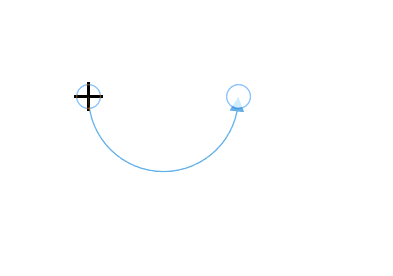

# Arc Segment of the connectors

Arc segments are used to create curved lines and the curvature is configurable with end control points.

## how to create arc segments

To create a arc segment, you should specify the segment as [ArcSegment](https://help.syncfusion.com/cr/wpf/Syncfusion.UI.Xaml.Diagram.ArcSegment.html).



<!--Initialize the Sfdiagram-->
<syncfusion:SfDiagram x:Name="diagram">
    <syncfusion:SfDiagram.Connectors>
        <!--Initialize the Connector Collection-->
        <syncfusion:ConnectorCollection>
            <!--create the connector with arc segments-->
            <syncfusion:ConnectorViewModel SourcePoint="100,100" TargetPoint="200,100">
                <syncfusion:ConnectorViewModel.Segments>
                    <syncfusion:ConnectorSegments>
                        <!--Specify the segment as arc segment-->
                        <syncfusion:ArcSegment/>
                    </syncfusion:ConnectorSegments>
                </syncfusion:ConnectorViewModel.Segments>
            </syncfusion:ConnectorViewModel>
        </syncfusion:ConnectorCollection>
    </syncfusion:SfDiagram.Connectors>
</syncfusion:SfDiagram>



//Initialize the SfDiagram
SfDiagram diagram = new SfDiagram();
//create the connector with arc segments
ConnectorViewModel arcSegment = new ConnectorViewModel()
{
    SourcePoint = new Point(100, 100),
    TargetPoint = new Point(200, 100),
    Segments = new ObservableCollection<IConnectorSegment>()
    {
        //Specify the segment as arc segment
        new ArcSegment()
    }
};

//Adding connector into Collection
(diagram.Connectors as ConnectorCollection).Add(arcSegment);




## How to edit the arc segments

Arc segments are annotated with thumbs to represent the control points. Control points of the curve can be configured by clicking and dragging the control point thumbs which are placed on source point and target point.

## How to customize the arc segemnts

Arc segments can be customized by using below properties of `ArcSegment` class,

* [RotationAngle](https://help.syncfusion.com/cr/wpf/Syncfusion.UI.Xaml.Diagram.ArcSegment.html#Syncfusion_UI_Xaml_Diagram_ArcSegment_RotationAngle): To Specify the ratio of the arc length to the radius of curve. Default value is 0 degree.

* [Size](https://help.syncfusion.com/cr/wpf/Syncfusion.UI.Xaml.Diagram.ArcSegment.html#Syncfusion_UI_Xaml_Diagram_ArcSegment_Size): To Specify the size of the arc segments. 

* [SweepDirection](https://help.syncfusion.com/cr/wpf/Syncfusion.UI.Xaml.Diagram.ArcSegment.html#Syncfusion_UI_Xaml_Diagram_ArcSegment_SweepDirection): To Specify whether the arc segment should be in clock wise direction or counter clock wise direction. Default direction is `Counterclockwise`.

* [IsLargeArc](https://help.syncfusion.com/cr/wpf/Syncfusion.UI.Xaml.Diagram.ArcSegment.html#Syncfusion_UI_Xaml_Diagram_ArcSegment_IsLargeArc): To specify whether the arc segment should be consider if the angle is greater then 180 degrees.



<!--Initialize the Sfdiagram-->
<syncfusion:SfDiagram x:Name="diagram">
    <syncfusion:SfDiagram.Connectors>
        <!--Initialize the Connector Collection-->
        <syncfusion:ConnectorCollection>
            <!--create the connector with arc segments-->
            <syncfusion:ConnectorViewModel SourcePoint="100,100" TargetPoint="200,100">
                <syncfusion:ConnectorViewModel.Segments>
                    <syncfusion:ConnectorSegments>
                        <!--Specify the segment as arc segment-->
                        <syncfusion:ArcSegment RotationAngle="45" Size="20,20" SweepDirection="Clockwise" />
                    </syncfusion:ConnectorSegments>
                </syncfusion:ConnectorViewModel.Segments>
            </syncfusion:ConnectorViewModel>
        </syncfusion:ConnectorCollection>
    </syncfusion:SfDiagram.Connectors>
</syncfusion:SfDiagram>



//Initialize the SfDiagram
SfDiagram diagram = new SfDiagram();
//create the connector with arc segments
ConnectorViewModel arcSegment = new ConnectorViewModel()
{
    SourcePoint = new Point(100, 100),
    TargetPoint = new Point(200, 100),
    Segments = new ObservableCollection<IConnectorSegment>()
    {
        //Specify the segment as arc segment
        new ArcSegment()
        {
            //Rotation angle of the arc segment
            RotationAngle = 45,
            //Size of the arc segment
            Size = new Size(20,20),
            //Rotation direction of the arc segment
            SweepDirection = SweepDirection.Clockwise,
        }
    }
};

//Adding connector into Collection
(diagram.Connectors as ConnectorCollection).Add(arcSegment);




