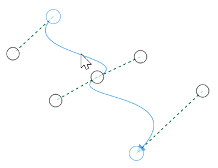
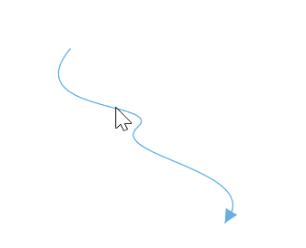

# How to interact with cubic bezier segments efficiently

While interacting with multiple cubic bezier segments, you can maintain their control points in same distance and angle by using [BezierSmoothness](https://help.syncfusion.com/cr/wpf/Syncfusion.UI.Xaml.Diagram.CubicCurveSegment.html#Syncfusion_UI_Xaml_Diagram_CubicCurveSegment_BezierSmoothness) property of `CubicCurveSegment` class.

| BezierSmoothness value| Description  | Output |
|---|---|---|
| SymmetricDistance| Both segments intersecting control points will be in same distance when any one them is editing |  |
| SymmetricAngle |Both segments intersecting control points will be in same angle when any one them is editing|  | 
| Symmetric | Both segments intersecting control points will be in same angle and same distance when any one them is editing| |
| None | Segemnts control points are independent to each other |  |




<!--create the connector with cubic curve segments-->
<syncfusion:ConnectorViewModel SourcePoint="100,100" TargetPoint="300,300">
    <syncfusion:ConnectorViewModel.Segments>
        <syncfusion:ConnectorSegments>
            <syncfusion:CubicCurveSegment BezierSmoothness="SymmetricDistance" 
                                          Constraints="None" Point1="50,150" 
                                          Point2="260,150" Point3="200,200"/>
            <syncfusion:CubicCurveSegment BezierSmoothness="SymmetricDistance" 
                                          Constraints="None" Point1="100,250" 
                                          Point2="350,260" />
        </syncfusion:ConnectorSegments>
    </syncfusion:ConnectorViewModel.Segments>
</syncfusion:ConnectorViewModel>




//create the connector with cubic bezier segments
ConnectorViewModel cubicBezierConnector = new ConnectorViewModel()
{
    SourcePoint = new Point(100, 100),
    TargetPoint = new Point(300, 300),
    Segments = new ObservableCollection<IConnectorSegment>()
    {
        //Specify the segment as cubic curve segment
        new CubicCurveSegment()
        {
            //Specify the bezier smoothness value
            BezierSmoothness = BezierSmoothness.SymmetricDistance,
            Constraints = SegmentConstraints.None,
            Point1 = new Point(50,150),
            Point2 = new Point(260,150),
            Point3 = new Point(200,200),
        },
        new CubicCurveSegment()
        {
            //Specify the bezier smoothness value
            BezierSmoothness = BezierSmoothness.SymmetricDistance,
            Constraints = SegmentConstraints.None,
            Point1 = new Point(100,250),
            Point2 = new Point(350,260),
        }
    }
};


