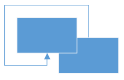

# Orthogonal segment creation and routing

Orthogonal segments are used to create line segments that are perpendicular at their point of intersection.

## How to create orthogonal segments

To create a orthogonal segment, specify the segment as [OrthogonalSegment](https://help.syncfusion.com/cr/wpf/Syncfusion.UI.Xaml.Diagram.OrthogonalSegment.html) and add it to the connector's segments collection.



<!--Initialize the Sfdiagram-->
<syncfusion:SfDiagram x:Name="diagram">
    <syncfusion:SfDiagram.Connectors>
        <!--Initialize the Connector Collection-->
        <syncfusion:ConnectorCollection>
            <syncfusion:ConnectorViewModel SourcePoint="700,100" TargetPoint="800,200">
                <syncfusion:ConnectorViewModel.Segments>
                    <!--Initialize the connector segment collection-->
                    <syncfusion:ConnectorSegments>
                        <!--Specify the segment as orthogonal segment-->
                        <syncfusion:OrthogonalSegment/>
                    </syncfusion:ConnectorSegments>
                </syncfusion:ConnectorViewModel.Segments>
            </syncfusion:ConnectorViewModel>
        </syncfusion:ConnectorCollection>
    </syncfusion:SfDiagram.Connectors>
</syncfusion:SfDiagram>


//Initialize the SfDiagram
SfDiagram diagram = new SfDiagram();
//create the connector with orthogonal segments
ConnectorViewModel orthogonalConnector = new ConnectorViewModel()
{
    SourcePoint = new Point(700, 100),
    TargetPoint = new Point(800, 200),
    //Initialize the connector segment collection
    Segments = new ObservableCollection<IConnectorSegment>()
    {
        //Specify the segment as orthogonal segment
        new OrthogonalSegment()
    }
};

//Adding connector into Collection
(diagram.Connectors as ConnectorCollection).Add(orthogonalConnector);




## How to edit orthogonal segments

Vertical and horizontal thumbs on the orthogonal segments are allowed to adjust the length of adjacent segments by clicking and dragging on them.

When necessary, some segments are added or removed automatically, when dragging the segment for maintaining proper routing of orthogonality between segments.

 

## How to customize the orthogonal segments

'n' number of orthogonal segments can be added within the source point and target point with required length and desired direction using [Length](https://help.syncfusion.com/cr/wpf/Syncfusion.UI.Xaml.Diagram.OrthogonalSegment.html#Syncfusion_UI_Xaml_Diagram_OrthogonalSegment_Length) and [Direction](https://help.syncfusion.com/cr/wpf/Syncfusion.UI.Xaml.Diagram.OrthogonalSegment.html#Syncfusion_UI_Xaml_Diagram_OrthogonalSegment_Direction) properties of `OrthogonalSegment` class.



<!--create the connector with orthogonal segments-->
<syncfusion:ConnectorViewModel SourcePoint="100,100" TargetPoint="400,300">
    <syncfusion:ConnectorViewModel.Segments>
        <syncfusion:ConnectorSegments>
            <syncfusion:OrthogonalSegment Direction="Right">
                <syncfusion:OrthogonalSegment.Length>
                    <syncfusion:DoubleExt Value ="100">
                    </syncfusion:DoubleExt>
                </syncfusion:OrthogonalSegment.Length>
            </syncfusion:OrthogonalSegment>
            <syncfusion:OrthogonalSegment Direction="Bottom">
                <syncfusion:OrthogonalSegment.Length>
                    <syncfusion:DoubleExt Value ="100">
                    </syncfusion:DoubleExt>
                </syncfusion:OrthogonalSegment.Length>
            </syncfusion:OrthogonalSegment>
            <syncfusion:OrthogonalSegment Direction="Right">
                <syncfusion:OrthogonalSegment.Length>
                    <syncfusion:DoubleExt Value ="100">
                    </syncfusion:DoubleExt>
                </syncfusion:OrthogonalSegment.Length>
            </syncfusion:OrthogonalSegment>
            <syncfusion:OrthogonalSegment Direction="Bottom">
                <syncfusion:OrthogonalSegment.Length>
                    <syncfusion:DoubleExt Value ="100">
                    </syncfusion:DoubleExt>
                </syncfusion:OrthogonalSegment.Length>
            </syncfusion:OrthogonalSegment>
            <syncfusion:OrthogonalSegment Direction="Right">
                <syncfusion:OrthogonalSegment.Length>
                    <syncfusion:DoubleExt Value ="100">
                    </syncfusion:DoubleExt>
                </syncfusion:OrthogonalSegment.Length>
            </syncfusion:OrthogonalSegment>
        </syncfusion:ConnectorSegments>
    </syncfusion:ConnectorViewModel.Segments>
</syncfusion:ConnectorViewModel>



//create the connector with orthogonal segments.
ConnectorViewModel simpleConnector = new ConnectorViewModel()
{
    SourcePoint = new Point(100, 100),
    TargetPoint = new Point(400, 300),
    Segments = new ObservableCollection<IConnectorSegment>()
    {
        new OrthogonalSegment()
        {
            //Specify the direction of the segment
            Direction = OrthogonalDirection.Right,
            //Specify the length of the segment
            Length = 100,
        },
        new OrthogonalSegment()
        {
            Direction = OrthogonalDirection.Bottom,
            Length = 100,
        },
        new OrthogonalSegment()
        {
            Direction = OrthogonalDirection.Right,
            Length = 100,
        },
        new OrthogonalSegment()
        {
            Direction = OrthogonalDirection.Bottom,
            Length = 100,
        },
        new OrthogonalSegment()
        {
            Direction = OrthogonalDirection.Right,
            Length = 100,
        }
    },
};




## Avoid overlapping

Orthogonal segments are automatically re-routed, in order to avoid overlapping with the source and target Nodes.

N> Overlapping with Source and Target nodes are only avoided. Other nodes are not considered as obstacles.

