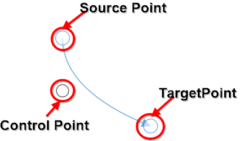
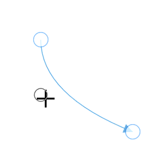

# Quadratic Curve Segments

Quadratic curve segments are used to create curve segments as quadratic shape and the curves are configurable with middle control point. 

## How to create the Quadratic Curve Segments

To create a quadratic curve line, you should specify the segment as [QuadraticCurveSegment](https://help.syncfusion.com/cr/wpf/Syncfusion.UI.Xaml.Diagram.QuadraticCurveSegment.html).



<!--Initialize the Sfdiagram-->
<syncfusion:SfDiagram x:Name="diagram">
    <syncfusion:SfDiagram.Connectors>
        <!--Initialize the Connector Collection-->
        <syncfusion:ConnectorCollection>
            <!--create the connector with qudratic curve segments-->
            <syncfusion:ConnectorViewModel SourcePoint="1000,100" TargetPoint="1100,200">
                <syncfusion:ConnectorViewModel.Segments>
                    <syncfusion:ConnectorSegments>
                        <!--Specify the segment as cubic curve segment-->
                        <syncfusion:QuadraticCurveSegment/>
                    </syncfusion:ConnectorSegments>
                </syncfusion:ConnectorViewModel.Segments>
            </syncfusion:ConnectorViewModel>
        </syncfusion:ConnectorCollection>
    </syncfusion:SfDiagram.Connectors>
</syncfusion:SfDiagram>



//Initialize the SfDiagram
SfDiagram diagram = new SfDiagram();
//create the connector with qudratic bezier segments
ConnectorViewModel qudraticBezierConnector = new ConnectorViewModel()
{
    SourcePoint = new Point(1000, 100),
    TargetPoint = new Point(1100, 200),
    Segments = new ObservableCollection<IConnectorSegment>()
    {
        //Specify the segment as cubic curve segment
        new QuadraticCurveSegment()
    }
};

//Adding connector into Collection
(diagram.Connectors as ConnectorCollection).Add(qudraticBezierConnector);




## How to edit the quadratic curve segments

Quadratic bezier segments are annotated with single thumb to represent the control point. Control point of the curve can be configured by clicking and dragging the control point thumb.

N> Quadratic bezier segments also supports to have multiple quadratic bezier segments and `BezierSmoothness` as Cubic bezier segments.

