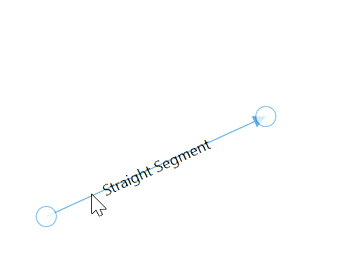

# Straight Segments creation and customization

The path of the Connector is defined with a collection of `Segments` and each segment represents a line between two points. By default, connector type will be identified using the value of `DefaultConnectorType` property of Diagram. It changes the entire connectors type in the diagram but when you define the segment then the particular connector will be displayed based on the segment created. There are four types of segments,

* Straight
* Orthogonal
* Cubic curve
* Quadratic curve

## Straight segments

Straight segment allows to create a straight-line connector between two end points or two nodes. To create a straight line, specify the segment as `StraightSegment` and add it to the connector's segments collection.




<!--Initialize the Sfdiagram-->
<syncfusion:SfDiagram x:Name="diagram">
    <syncfusion:SfDiagram.Connectors>
        <!--Initialize the Connector Collection-->
        <syncfusion:ConnectorCollection>
            <!--Initialize the Connector-->
            <syncfusion:ConnectorViewModel SourcePoint="100,100" TargetPoint="200,200" >
                <syncfusion:ConnectorViewModel.Segments>
                    <!--Initialize the connector segment collection-->
                    <syncfusion:ConnectorSegments>
                        <!--Specify the segment as straight segment-->
                        <syncfusion:StraightSegment/>
                    </syncfusion:ConnectorSegments>
                </syncfusion:ConnectorViewModel.Segments>
            </syncfusion:ConnectorViewModel>
        </syncfusion:ConnectorCollection>
    </syncfusion:SfDiagram.Connectors>
</syncfusion:SfDiagram>


//Initialize the SfDiagram
SfDiagram diagram = new SfDiagram();
//Define the Connector
ConnectorViewModel connector = new ConnectorViewModel()
{
    SourcePoint = new Point(100, 100),
    TargetPoint = new Point(200, 200),
    //Initialize the connector segment collection
    Segments = new ObservableCollection<IConnectorSegment>()
    {
        //Specify the segment as straight segment
        new StraightSegment()      
    }
};
//Adding Connector to Collection
(diagram.Connectors as ConnectorCollection).Add(connector);



## Editing straight segments

A straight-line connector can be edited by adding a new StraightSegment into the Segments collections of a Connector.

Straight segments can be split into multiple straight lines using `Point` property of  `StraightSegment` class.




<syncfusion:ConnectorViewModel SourcePoint="100,100" TargetPoint="200,200">
    <syncfusion:ConnectorViewModel.Segments>
        <syncfusion:ConnectorSegments>
            <!--Specify the point to split the segment-->
            <syncfusion:StraightSegment Point="170,140"/>
        </syncfusion:ConnectorSegments>
    </syncfusion:ConnectorViewModel.Segments>
</syncfusion:ConnectorViewModel>




//create the connector with straight segments
ConnectorViewModel connector = new ConnectorViewModel()
{
    SourcePoint = new Point(100,100),
    TargetPoint = new Point(200,200),
    Segments = new ObservableCollection<IConnectorSegment>()
    {
        new StraightSegment()
        {
            //Specify the point to split the segment
            Point = new Point(170,140),
        },
    }
};




## How to add or remove the straight segments at run time

Straight segments can be split into multiple straight segments interactively by clicking on the segemnts. This can be achieved by using `AddRemoveStraightSegmentArgs` class and its properties.

`AddRemoveStraightSegmentArgs` class is having below properties,

* Point: To specify the splitting point on the segment
* SegmentEditing: To specify that segments are going to be added or removed
* HitPadding: To specify the vicinity area around the connector

Following code example illustrates how to add or remove straight segements when click on any point of the segment,




//Initialize the SfDiagram
SfDiagram diagram = new SfDiagram();
//Register the item tap event of diagram
(diagram.Info as IGraphInfo).ItemTappedEvent += Diagram_ItemTappedEvent;

private void Diagram_ItemTappedEvent(object sender, DiagramEventArgs args)
{
    if (args.Item is IConnector)
    {
        //Getting the mouse point while tap on the connector
        Point pp = ((args as ItemTappedEventArgs).MouseEventArgs as MouseEventArgs).GetPosition(diagram.Page);
        //Specify the editing point, editing type and hit padding value
        AddRemoveStraightSegmentArgs addremoveargs = new AddRemoveStraightSegmentArgs()
        {
            Point = pp,
            SegmentEditing = SegmentEditing.Add,
            HitPadding = 5
        };

        //Method to add or remove the segment
        ((args.Item as IConnector).Info as IConnectorInfo).EditSegment(addremoveargs);
    }
}




| SegmentEditing value | Description | Output |
|---|---|---|
| SegmentEditing.Add | New segment will be added at the tapped point | |
| SegmentEditing.Remove | Exisiting segment will be deleted at the tapped point |  |
| SegmentEditing.Toggle | New segment will be added at the tapped point if there is no segment at that point or exisiting segment will be deleted |  |

N> Segment splitting will be supported only for straight segments.

Find the [Straight segment sample](https://github.com/SyncfusionExamples/WPF-Diagram-Examples/tree/master/Samples/Connector/Straight%20Segment) to depict the Straight segment.
