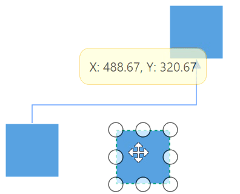
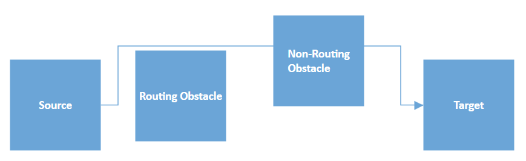

# Interactions in WPF Diagram (SfDiagram)

Connectors can be selected, dragged and routed over the diagram page. 

## How to select and edit the connector

The connector can be selected by tapping it. When the connector is selected, circles will be added on the starting and ending of the connector, which is represented by `Thumbs`. Clicking and dragging those handles helps you to adjust the source and target points.

## How to drag the connector

Also, the entire connector can be dragged over the page by using the [`Constraints`](https://help.syncfusion.com/cr/wpf/Syncfusion.UI.Xaml.Diagram.ConnectorViewModel.html#Syncfusion_UI_Xaml_Diagram_ConnectorViewModel_Constraints) property and setting its value as Draggable.




<!--Initialize the Sfdiagram-->
<syncfusion:SfDiagram x:Name="diagram" DefaultConnectorType="Line">
    <syncfusion:SfDiagram.Connectors>
        <!--Initialize the Connector Collection-->
        <syncfusion:ConnectorCollection>
            <!--create the connector with draggable constraint-->
            <syncfusion:ConnectorViewModel x:Name="simpleConnector" 
                                           SourcePoint="100,100" TargetPoint="200,200" 
                                           Constraints="Default,Draggable" />
        </syncfusion:ConnectorCollection>
    </syncfusion:SfDiagram.Connectors>
</syncfusion:SfDiagram>




//Initialize the SfDiagram
SfDiagram diagram = new SfDiagram();

//Define the Connector Type
diagram.DefaultConnectorType = ConnectorType.Line;

//creating simple connector through collection using source and target points.
ConnectorViewModel simpleConnector = new ConnectorViewModel()
{
    SourcePoint = new Point(100,100),
    TargetPoint = new Point(200,200),
    //Define the constraint as draggable
    Constraints = ConnectorConstraints.Default | ConnectorConstraints.Draggable,
};

//Adding the connector into Collection
(diagram.Connectors as ConnectorCollection).Add(simpleConnector);




## How to route the connectors

The connectors in the diagram can be overlapped with any neighboring nodes when the node is placed in contact with the connector. This will make less clarity about the connector path flow. This can be avoided using Routing process.

The routing is the process of updating the connector's geometry to avoid the overlapping with any neighboring nodes in their path. This behavior can be enabled by adding `GraphConstraints.Routing` enum value to the [`Constraints`](https://help.syncfusion.com/cr/wpf/Syncfusion.UI.Xaml.Diagram.SfDiagram.html#Syncfusion_UI_Xaml_Diagram_SfDiagram_Constraints) property of diagram.




<!--Initialize the SfDiagram with routig constraint-->
<syncfusion:SfDiagram x:Name="diagram" Constraints="Default,Routing"/>
                                



//Initialize the SfDiagram
SfDiagram diagram = new SfDiagram();
//Enable the routing constraint
diagram.Constraints.Add(GraphConstraints.Routing);




N> Routing is applicable only for orthogonal connectors.

### How to enable or disable routing for nodes

By default, all nodes are treated as an obstacle for a connector that is connections will go around the node boundary.  You can disable the node's routing obstacles by removing the `NodeConstraints.RoutingObstacle` from the [`Constraints`](https://help.syncfusion.com/cr/wpf/Syncfusion.UI.Xaml.Diagram.NodeViewModel.html#Syncfusion_UI_Xaml_Diagram_NodeViewModel_Constraints) property of node.




NodeViewModel node = new NodeViewModel()
{
  UnitHeight = 50,
  UnitWidth = 50, 
  OffsetX = 200,
  OffsetY = 300,
  Shape = new RectangleGeometry() { Rect = new Rect(0, 0, 10, 10) },
};
//Disable the routing obstacle property
node.Constraints.Remove(NodeConstraints.RoutingObstacle);



### How to enable or disable routing for connectors

By default, each connector's routing process is inherited based on the value of the `Constraints` property of the diagram. To control the individual connector's routing regardless of the diagram, you should remove the `ConnectorConstraints.InheritRouting` enum value from the [`Constraints`](https://help.syncfusion.com/cr/wpf/Syncfusion.UI.Xaml.Diagram.ConnectorViewModel.html#Syncfusion_UI_Xaml_Diagram_ConnectorViewModel_Constraints) property of the connector and add `ConnectorConstraints.Routing` enum value to the Constraints property or remove `ConnectorConstraints.Routing` enum value from the Constraints property to enable or disable the routing respectively.




ConnectorViewModel connector = new ConnectorViewModel()
{
    SourcePoint = new Point(200, 200),
    TargetPoint = new Point(400, 400),
};

//Disable the routing from diagram constraint
connector.Constraints.Remove(ConnectorConstraints.InheritRouting);
//Enable the routing constraint of a connector
connector.Constraints.Add(ConnectorConstraints.Routing);




### Routing types

Diagram supports two types of routing algorithm:

* Classic: Additional segments will be added based on the position and dimension of the obstacles in their path. This type of routing gives less priority to geometry length and number of bends.

* Advanced: This routing type evaluates all possible geometrical paths for a connector aiming to find one that has a minimal bends and length.

The routing algorithm can be specified by using [`RoutingType`](https://help.syncfusion.com/cr/wpf/Syncfusion.UI.Xaml.Diagram.LineRoutingSettings.html#Syncfusion_UI_Xaml_Diagram_LineRoutingSettings_RoutingType) property of [`LineRoutingSettings`](https://help.syncfusion.com/cr/wpf/Syncfusion.UI.Xaml.Diagram.LineRoutingSettings.html) class.




<!--Initialize the SfDiagram-->
<syncfusion:SfDiagram x:Name="diagram" Constraints="Default,Routing">
  <!--Initialize the routing type-->
  <syncfusion:SfDiagram.LineRoutingSettings>
    <syncfusion:LineRoutingSettings RoutingType="Classic"/>
  </syncfusion:SfDiagram.LineRoutingSettings>
</syncfusion:SfDiagram>
                                



//Initialize the SfDiagram
SfDiagram diagram = new SfDiagram();
//Initialize the routing type
diagram.LineRoutingSettings.RoutingType = RoutingTypes.Classic;




Find the [Connector interactions sample](https://github.com/SyncfusionExamples/WPF-Diagram-Examples/tree/master/Samples/Connector/Connector%20Interactions) to depict the connector interactions.

## See Also
 
[How to restrict Connector's source/target changing from native Nodes to other Nodes?](https://www.syncfusion.com/kb/13210/how-to-restrict-connectors-source-target-changing-from-native-nodes-to-other-nodes-in-wpf)

[How to restrict annotation editing by double-clicking the node or connector?](https://support.syncfusion.com/kb/article/8539/how-to-restrict-annotation-editing-by-double-clicking-the-node-or-connector-in-wpf-diagram)

[How to bring the specific diagram object to the center or viewport of the Diagram?](https://support.syncfusion.com/kb/article/8390/how-to-bring-the-specific-object-to-the-center-or-viewport-of-the-diagram-in-wpf)

[How to restrict diagram objects dragging in the positive side?](https://support.syncfusion.com/kb/article/9917/how-to-restrict-diagram-objects-dragging-in-the-positive-side-in-wpf-diagram)

[How to use the property grid for diagram elements?](https://support.syncfusion.com/kb/article/9861/how-to-use-the-property-grid-in-the-wpf-diagram-sfdiagram)

[How to decide whether to drag or draw a connection on port at runtime?](https://support.syncfusion.com/kb/article/8538/how-to-decide-whether-to-drag-or-draw-a-connection-on-port-at-runtime-in-the-wpf-diagram)