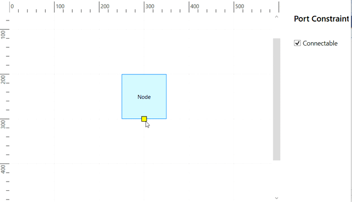

# Constraints in WPF Diagram (SfDiagram)

`Constraints` are used to enable/disable certain behaviors of the [diagram](https://help.syncfusion.com/cr/wpf/Syncfusion.UI.Xaml.Diagram.SfDiagram.html), [node](https://help.syncfusion.com/cr/wpf/Syncfusion.UI.Xaml.Diagram.NodeViewModel.html), [connector](https://help.syncfusion.com/cr/wpf/Syncfusion.UI.Xaml.Diagram.ConnectorViewModel.html), [port](https://help.syncfusion.com/cr/wpf/Syncfusion.UI.Xaml.Diagram.NodePortViewModel.html) and [annotation](https://help.syncfusion.com/cr/wpf/Syncfusion.UI.Xaml.Diagram.AnnotationEditorViewModel.html). Constraints are provided as flagged enumerations, so that multiple behaviors can be enabled/disabled with bitwise operators (&, |, ~, <<, etc.). 
To know more about bitwise operators, refer to [Bitwise Operations](#bitwise-operations).

## Graph Constraints

[GraphConstraints](https://help.syncfusion.com/cr/wpf/Syncfusion.UI.Xaml.Diagram.GraphConstraints.html) allows to enable or disable the following behaviors.By default , `Zoomable` , `Pannable` , `PanRails` , `Relationship` , `Events` , `AutoScroll` , `PageEditing` constraints are enabled for diagram.

|Constraints|Description|
|--|--|
|`AllowPan` |Enables or disables diagram panning|
|`AutomaticPortCreation` |Enables or disables the automatic port creation while start or end the connection on or over the node or connector|
|`AutoScroll` |Enables or disables the autoscrolling behavior of diagram|
|`Bridging`	|Enables or disables the line bridging while two connectors intersecting with each other.|
|`Commands`	|Enables or disables the default diagram commands such as.|
|`Connectable`	|Enables or disables the connector creation in the diagram.|
|`ContextMenu`	|Enables or disables the opening of context menu during right-clicking on diagram or node or connector.|
|`Default`	|Enables or disables all the default behaviors of the diagram.|
|`Draggable`	|Enables or disables the drag of element from one diagram to the other.|
|`DrawingTool`	|Enables or disables to draw any kind of node/connector during runtime by clicking and dragging on the Diagram page.|
|`Drop`	|Enables or Disables the dropping of element from one diagram to the other.|
|`Events`	|Enables or disables all events of the control.|
|`FloatElements`	|Enables or disables the dragging of objects between multiple Diagrams.|
|`None` |Disable all SfDiagram constraints|
|`Outline` |Enable or disables the outline of diagram elements while loading.|
|`PageEditing`|Enables or disables the page editing options such as Selectable, Draggable, Connectable, Drop, Resizable, Rotatable, ContextMenu, DrawingTool, Commands.|
|`Pannable`	|Enables or disables the panning of diagram over both X and Y axis.|
|`PannableX` |Enables or disables the panning of diagram over X-axis.|
|`PannableY`	|Enables or disables the panning of diagram over Y -axis.|
|`PanRails`	|Enables or disables the panning actions on the x-axis (horizontal panning) and y-axis (vertical panning) in SfDiagram.|
|`PanRailsX`	|Enables or disables the pan rails of diagram in X-axis|
|`PanRailsY	`|Enables or disables the pan rails of diagram in Y -axis|
|`Relationship`	|Enables or disables the properties based on Node and Connector relationships on dragging at run time.|
|`Resizable`	|Enables or disables the resize action on diagram or node.|
|`Rotatable`	|Enables or disables the rotation action on diagram or node.|
|`Routing`	|Enables or disables the line routing when node intersects with the connector.|
|`Selectable`	|Enables or disable the selection action of diagram and its child elements.|
|`Undoable`	|Enables or disables the undo or redo action on diagram.|
|`Virtualize`	|Enables or disables the virtualizing behavior of diagram.|
|`Zoomable`	|Enables or disables the zooming of diagram.|

The following code example illustrates how to disable page editing.




diagram.Constraints = GraphConstraints.Default & ~GraphConstraints.PageEditing;




## Node Constraints

[NodeConstraints](https://help.syncfusion.com/cr/wpf/Syncfusion.UI.Xaml.Diagram.NodeConstraints.html) allows to enable or disable the following behaviors of Node.By default Selectable, Connectable, Inherit, RoutingObstacle, PivotDraggable, Delete and ThemeStyle constraints are enabled for Node.

|Constraints	|Description|
|--|--|
|`AllowDrop`	|Enables or disables interaction events(DragEnter,DragOver,ItemDrop and DragLeave) for diagram nodes.|
|`AllowPan`	|Enables or disables the panning action for node.|
|`AspectRatio`	|Enables or disables the node to be resized proportionally.|
|`AutomaticPortCreation`	|Enables or disables the automatic port creation while start or end the connection on or over the node|
|`Connectable`	|Enables or disables the node to be connected with connector.|
|`Default`	|Enables Selectable, Draggable, Resizable, Rotatable, Connectable, Inherit, RoutingObstacle, PivotDraggable, Delete, ThemeStyle constraints.|
|`Delete`	|Enables or disables the delete operation on node.|
|`DragAnnotation`	|Enables or disables the node's annotation to be draggable.|
|`Draggable`	|Enables or disables the node to be dragged from one point to other.|
|`DynamicPortConnection`	|Enable or disables to create connector with port point when mouse hover on Node's bounds.|
|`ExcludeFromLayout`	|Enables or disables to exclude the node from layout.|
|`InConnect`	|Enables or disables the connection creation from or to the incoming Connector.|
|`Inherit`	|Enables or disables to inherit all the Dragging, Resizing, Rotating, Snapping, SnapToObject, and PortVisibility from diagram.|
|`InheritAllowPan`	|Enables or disables a node to pan from graph level|
|`InheritAutomaticPortCreation`	|Enables or disables to inherit the value for automatic port creation from diagram.|
|`InheritDraggable`	|Enables or disables to inherit the value for draggable from diagram.|
|`InheritHitPadding`	|Enables or disables to inherit the value for hit-padding from diagram.|
|`InheritMenu`	|Enables or disables to inherit the context menu from diagram.|
|`InheritPortVisibility`	|Enables or disables to inherit the value of SfDiagram.PortVisibility.|
|`InheritResizable`	|Enables or disables to inherit the value for resizable from diagram.|
|`InheritRotatable`	|Enables or disables to inherit the value for rotatable from diagram.|
|`InheritSnapping`	|Enables or disables to inherit the value of snap-to-lines and snap angle from diagram by using SnapSettings.SnapConstraints property value.|
|`InheritSnapToObject`	|Enables or disables to inherit the value to SnapToObject from diagram by using SnapSettings.SnapConstraints property value.|
|`Menu`	|Enables or disables to create new context menu on the node.|
|`None`	|Disable all Node Constraints.|
|`OutConnect`	|Enables or disables the connection creation to or from outgoing connector.|
|`PivotDraggable`	|Enables or disables a pivot thumb dragging for node.|
|`Resizable`	|Enables or disables the node to be resizable.|
|`ResizeEast`	|Enables or disables the node to be resized in east direction.|
|`ResizeNorth`	|Enables or disables the node to be resized in North direction.|
|`ResizeNorthEast`	|Enables or disables the node to be resized in NorthEast direction.|
|`ResizeNorthWest`	|Enables or disables the node to be resized in NorthWest direction.|
|`ResizeSouth`	|Enables or disables the node to be resized in South direction.|
|`ResizeSouthEast`	|Enables or disables the node to be resized in SouthEast direction.|
|`ResizeSouthWest`	|Enables or disables the node to be resized in SouthWest direction.|
|`ResizeWest`	|Enables or disables the node to be resized in West direction.|
|`Rotatable`	|Enables or disables the node to be rotated.|
|`RoutingObstacle`	|Enables or disables the node to be treated as obstacle while in routing.|
|`Selectable`	|Enables or disables the node to be selected.|
|`SnapAngle`	|Enables or disables the node to be snapped while rotating.|
|`SnapToHorizontalLines`	|Enables or disables the node to be snapped to horizontal gridlines.|
|`SnapToLines`	|Enables or disables the nodes to be snapped to gridlines.|
|`SnapToVerticalLines`	|Enables or disables the node to be snapped to vertical gridlines.|
|`ThemeStyle`	|Enables or disables the theme style for node.|

The following code example illustrates how to disable rotation.




//Create NodeViewModel collection
diagram.nodes = new ObservableCollection<NodeViewModel>();

//Create NodeViewModel 
NodeViewModel node = new NodeViewModel()
{
  Constraints = NodeConstraints.Default & ~(NodeConstraints.Rotatable|NodeConstraints.InheritRotatable),
  UnitWidth = 50,
  UnitHeight = 50,
  OffsetX = 100,
  OffsetY = 100,  
};
//Add NodeViewModel to Nodes Collection
(diagram.Nodes as ObservableCollection<NodeViewModel>).Add(node);




## Connector Constraints

[ConnectorConstraints](https://help.syncfusion.com/cr/wpf/Syncfusion.UI.Xaml.Diagram.ConnectorConstraints.html) allows to enable or disable the following behaviors of Connectors. By default Selectable, EndDraggable, Inherit, Thumbs, Connectable, Delete, BridgeObstacle and ThemeStyle constraints are enabled for connector.

|Constraints	|Description|
|--|--|
|`AllowDrop`	|Enables or disables interaction events(DragEnter,DragOver,ItemDrop and DragLeave) for diagram connectors.|
|`AllowPan`	|Enables or disables the panning action for connector.|
|`AutomaticPortCreation`	|Enables or disables the automatic port creation while start or end the connection on or over the connector|
|`BridgeObstacle`	|Enables or disables bridge can be created over a connector.|
|`Bridging`	|Enables or disables the line bridging while two connectors intersecting with each other.|
|`Connectable`	|Enables or disables the node or port to be connected to the connector.|
|`Default`	|Enables Selectable, EndDraggable, Inherit, Thumbs, Connectable, Delete, BridgeObstacle, ThemeStyle behaviors for connector.|
|`Delete`	|Enable or disables the connector to be deleted.|
|`DragAnnotation`	|Enables or disable the connector's annotation to be dragged.|
|`Draggable`	|Enables or disables the connector to be dragged from one point to another in diagram.|
|`EndDraggable`	|Enables or disables the connector source or target end to be dragged.|
|`EndThumbs`	|Enables or disables the connector's end thumbs to be dragged.|
|`InConnect`	|Enables or disables the connection creation from the incoming connector.|
|`Inherit`	|Enables or disables to inherit the Snapping, SnapToObject,Bridging, Smoothness, Menu, PortVisibility, Pan, HitPadding and Routing from SfDiagram.|
|`InheritAllowPan`	|Enable or disables the panning of connector over graph.|
|`InheritAutomaticPortCreation`	|Enables or disables to inherit the value of automatic port creation from diagram.|
|`InheritBridging`	|Enables or disables to inherit the value of bridging from diagram.|
|`InheritHitPadding`	|Enables or disables to inherit the value of SfDiagram.HitPadding.|
|`InheritMenu`	|Enables or disables to inherit the context menu from diagram.|
|`InheritPortVisibility`	|Enables or disables to inherit the value from SfDiagram.PortVisibility.|
|`InheritRouting`	|Enables or disables to inherit the value of routing from diagram.|
|`InheritSmoothness`	|Enables or disables to inherit the value of Smoothness from diagram.|
|`InheritSnapping`	|Enables or disables to inherit the value of SnapToLines from diagram by using SnapSettings.SnapConstraints.|
|`InheritSnapToObject`	|Enables or disables to inherit the value of SnapToObject from diagram by using SnapSettings.SnapConstraints.|
|`Menu`	|Enables or disables to create new context menu for connector.|
|`None`	|Disable all behaviors for connector.|
|`OutConnect`	|Enables or disables the connection from the outgoing connector.|
|`Routing`	|Enables or disables the connector to be routed|
|`SegmentThumbs`	|Enables or disables the control point and end point of every segment in a connector for editing.|
|`Selectable`	|Enables or disables the connector to be selected.|
|`SnapToHorizontalLines`	|Enables or disables the connector to be snapped to horizontal gridlines.|
|`SnapToLines`	|Enables or disables the connector to be snapped to gridlines.|
|`SnapToVerticalLines`	|Enables or disables the connector to be snapped to vertical gridlines.|
|`SourceDraggable`	|Enables or disables the connector's source end to be dragged|
|`TargetDraggable`	|Enables or disables the connector's target end to be dragged.|
|`ThemeStyle`	|Enables or disables the theme style for connector.|
|`Thumbs`	|Enables or disables the connector's thumbs to be dragged.|

The following code example illustrates how to disable selection.




diagram.connectors = new ObservableCollection<ConnectorViewModel>();

//Create ConnectorViewModel 
ConnectorViewModel connector1 = new ConnectorViewModel()
{
	Constraints = ConnectorConstraints.Default & ~ConnectorConstraints.Selectable
};

(diagram.Connectors as ObservableCollection<ConnectorViewModel>).Add(connector1);


 

[View Sample in GitHub](https://github.com/SyncfusionExamples/WPF-Diagram-Examples/tree/master/Samples/Constraints/Constraints-Node-Connector-Graph)

## Port Constraints

[PortConstraints](https://help.syncfusion.com/cr/wpf/Syncfusion.UI.Xaml.Diagram.PortConstraints.html) allows to enable or disable the following behaviors of port.By default Inherit constraints are enabled for port.

|Constraints	|Description|
|--|--|
|`Connectable`	|Enables or disables the connector creation from port.|
|`ConnectionDirection`	|Decides the connection direction of port based on PortBase.ConnectionDirection|
|`Default`	|Enables or disables the Inheritable constraints.|
|`Draggable`	|Enables or disables whether port to be dragged at boundaries of node|
|`Dynamic`	|Defines whether port to be connected at boundaries of node and pointed to the port.|
|`InConnect`	|Enables or disables the connection creation to the incoming Connector.|
|`Inherit`	|Enables or disables to inherit the value of Node.PortVisibility, Node.HitPadding and NodeConstraints.Connectable from Node.|
|`InheritConnectable`	|Enables or disables to inherit the value of Connectable from Node.|
|`InheritHitPadding`	|Enables or disables to inherit the value of SfDiagram.HitPadding.|
|`InheritPortVisibility`	|Enables or disables to inherit the value of PortVisibility from diagram or Node.|
|`None`	|Disable all port Constraints.|
|`OutConnect`	|Enables or disables the connection creation from the outgoing Connector.|
|`Snapping`	|Enables or disables snapping behavior of port on node|

The following code example illustrates how to disable creating connections with a port.




NodePortViewModel port=	new NodePortViewModel()
{
  UnitWidth= 10,
	UnitHeight= 10,
	Constraints = PortConstraints.Default & 
    ~PortConstraints.Connectable
};




[View Sample in GitHub](https://github.com/SyncfusionExamples/WPF-Diagram-Examples/tree/master/Samples/Constraints/Port-Constraints-sample)

## Annotation Constraints

[AnnotationConstraints](https://help.syncfusion.com/cr/wpf/Syncfusion.UI.Xaml.Diagram.AnnotationConstraints.html) allows to enable or disable the following behaviors of Annotation.By default Inherit and Editable constraints are enabled for annotation.

|Constraints	|Description|
|--|--|
|`Default`	|Enables all Annotation constraints.|
|`Draggable`	|Enables or disables whether the annotation to be dragged.|
|`DragLimit`	|Specifies whether the annotation to be dragged with in the specified limit|
|`Editable`	|Enables or disables the annotation to be edited.|
|`Inherit`	|Enables or disables to inherit the Dragging, Rotation,Selection,Resize and Editable constraints from Node or Connector|
|`InheritDraggable`	|Enables or disables to inherit the value of Draggable from Node or Connector.|
|`InheritEditable`	|Enables or disables to inherit the value of Editable from Node or Connector.|
|`InheritResizable`	|Enables or disables to inherit the value of Resizable from Node or Connector.|
|`InheritRotatable`	|Enables or disables to inherit the value of Rotatable from Node or Connector.|
|`InheritSelectable`	|Enables or disables to inherit the value of Selectable from Node or Connector.|
|`None`	|Disables all behaviors of annotation.|
|`Resizable`	|Enables or disables the annotation to be resized.|
|`ResizeEast`	|Enables or disables the annotation to be resized in east direction.|
|`ResizeNorth`	|Enables or disables annotation to be resized in north direction.|
|`ResizeNorthEast`	|Enables or disables the annotation to be resized in northeast direction.|
|`ResizeNorthWest`	|Enables or disables the annotation to be resized in northwest direction.|
|`ResizeSouth`	|Enables or disables the annotation to be resized in south direction.|
|`ResizeSouthEast`	|Enables or disables the annotation to be resized in southeast direction.|
|`ResizeSouthWest`	|Enables or disables the annotation to be resized in southwest direction.|
|`ResizeWest`	|Enables or disables the annotation to be resized in west direction.|
|`Rotatable`	|Enables or disables whether the annotation to be rotated.|
|`Selectable`	|Enables or disables whether the annotation to be selectable.|

The following code example illustrates how to enable annotation dragging.




AnnotationEditorViewModel anno = new AnnotationEditorViewModel()
{
    Content="Annotation",
    //Assign Constraint to Drag
    Constraints=AnnotationConstraints.Draggable,
};


 

[View Sample in GitHub](https://github.com/SyncfusionExamples/WPF-Diagram-Examples/tree/master/Samples/Constraints/Annotation-constraints-sample)

## Selector Constraints

Selector visually represents the selected elements with certain editable thumbs. The visual representation of the thumbs can be controlled with [SelectorConstraints](https://help.syncfusion.com/cr/wpf/Syncfusion.UI.Xaml.Diagram.SelectorConstraints.html). The part of selector is categorized as follows.

|Constraints	|Description|
|--|--|
|`Default`	|Enables all behaviors for selector.|
|`HideDisabledResizer`	|Enables or disables the visibility of disabled resizer thumbs.|
|`None`	|Disables all the behaviors for Selector.|
|`Pivot`	|Enables or disables the visibility of the pivot.|
|`QuickCommands`	|Enables or disables the visibility of the QuickCommands.|
|`Resizer`	|Enables or disables the Resizer of the selected node.|
|`Rotator`	|Enables or disables the Rotator of the selected node.|
|`Tooltip`	|Enables or disables the Tooltip of the selected node.|
|`TooltipAngle`	|Enables or disables the Tooltip when rotate the node at runtime.|
|`TooltipPosition`	|Enables or disables Tooltip when drag the node at runtime.|
|`TooltipSize`	|Enables or disables the Tooltip when resize the node at runtime.|

The following code example illustrates how to hide rotator.




(diagram.SelectedItems as SelectorViewModel).SelectorConstraints = (diagram.SelectedItems as  SelectorViewModel).SelectorConstraints & ~SelectorConstraints.Rotator;




[View Sample in GitHub](https://github.com/SyncfusionExamples/WPF-Diagram-Examples/tree/master/Samples/Constraints/Selector-constraints-sample)

## Snap Constraints

[SnapConstraints](https://help.syncfusion.com/cr/wpf/Syncfusion.UI.Xaml.Diagram.SnapConstraints.html) control the visibility of gridlines and enable or disable snapping. Snap constraints allow to set the following behaviors.

|Constraints	|Description|
|--|--|
|`All` |Enables or disables all Snap Constraints.|
|`HorizontalLines`	|Enables or disables the node to be snapped to horizontal lines.|
|`None`	|Disables all the behaviors for Snapping.|
|`Rotation`	|Enables or disables the node to be snapped to rotation.|
|`ShowLines`	|Enables or disables the node to be snapped to horizontal or vertical lines.|
|`SnapToHorizontalLines`	|Enables or disables the node to be snapped to vertical gridlines.|
|`SnapToLines`	|Enables or disables the node to be snapped to gridlines|
|`SnapToVerticalLines`	|Enables or disables the node to be snapped to horizontal gridlines.|
|`VerticalLines`	|Enables or disables the node to be snapped to vertical lines.|

The following code example illustrates how to show only Horizontal Gridlines




diagram.SnapSettings.SnapConstraints = SnapConstraints.SnapToHorizontalLines;




Refer [Snapping](https://help.syncfusion.com/wpf/diagram/snapping/definesnapping) for details.

### Inherit behaviors

Some of the behaviors can be defined through both the specific object (Node/Connector) and Diagram. When the behaviors are contradictorily defined through both, the actual behavior is set through inherit options.

The following code example illustrates how to inherit the line bridging behavior from the Diagram.




diagram.Constraints = GraphConstraints.Default | GraphConstraints.Bridging;

ObservableCollection<ConnectorViewModel> connectors = new ObservableCollection<ConnectorViewModel>();

ConnectorViewModel connector1 = new ConnectorViewModel()
{
	SourcePoint=new Point(100,100),
	TargetPoint=new Point(200,200),
	Constraints = ConnectorConstraints.Default | ConnectorConstraints.InheritBridging
};

connectors.Add(connector1);
diagram.Connectors = connectors;




## Bitwise Operations

Bitwise Operations are used to manipulate the flagged enumerations [enum]. In the section, Bitwise Operations are illustrated by using Node Constraints. The same is applicable while working with Node Constraints, Connector Constraints, or Port Constraints.

### Add Operation

You can add or enable multiple values at a time	by using Bitwise `|` (OR) operator or Add() method of constraints.




//Using OR operator
node.Constraints = NodeConstraints.Selectable | NodeConstraints.Rotatable;

//Using Add method to add constraints
node.Constraints = node.Constraints.Add(NodeConstraints.Rotatable);




In the above example, you can do both the selection and rotation.

### Remove Operation

You can remove or disable values by using Bitwise ‘&~’ (XOR) operator or Remove() method of constraints.




//Using XOR operator
node.Constraints = node.Constraints & ~(NodeConstraints.Rotatable);
 
//Using Remove method to remove constraints
node.Constraints = node.Constraints.Remove(NodeConstraints.Rotatable);




In the above example, Rotation is disabled but other constraints are enabled.

### Check Operation

You can check any value by using Bitwise ‘&’ (AND) operator.




if ((node.Constraints & (NodeConstraints.Rotatable)) == (NodeConstraints.Rotatable))




In the above example, you can check whether the rotate constraints are enabled in a Node. When `NodeConstraints` have rotate constraints, the expression returns a rotate constraint.
