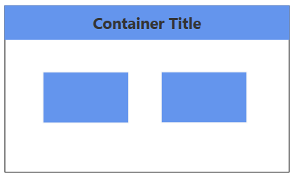
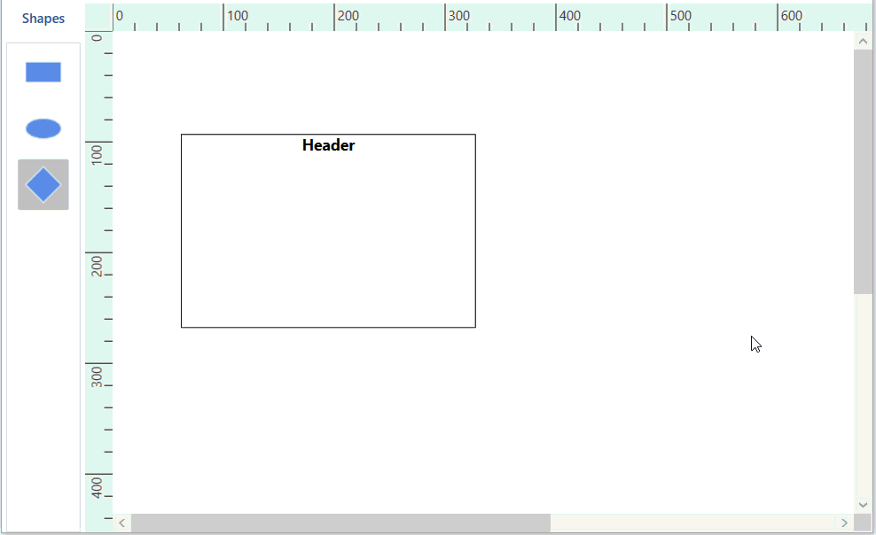
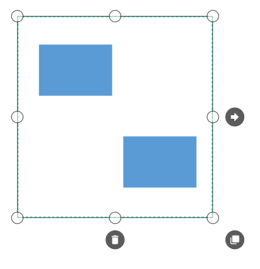
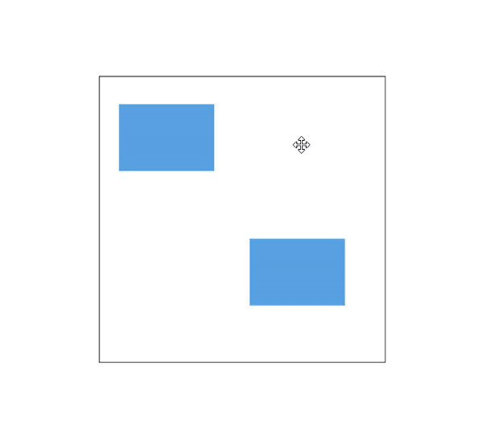
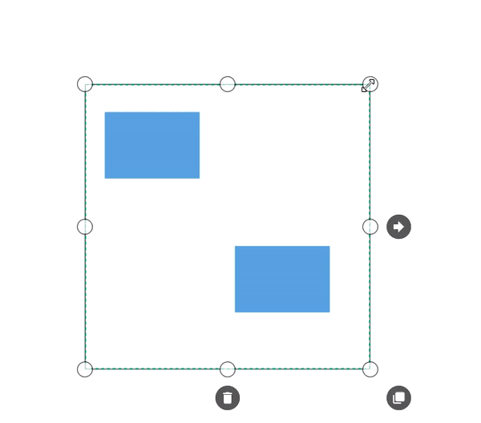

# Container in WPF Diagram (SfDiagram)

Containers are collections of logically grouped shapes surrounded by a visible border, which the shapes can be dragged in and out of during runtime. Every change made to the Container has no effect on its children. Child elements can be edited individually.

## Create a Container

### Add a Container

The following code illustrates how to create a Container Node.




<syncfusion:SfDiagram x:Name="diagram">
    <syncfusion:SfDiagram.Nodes>
        <!--Initialize the NodeCollection-->
        <syncfusion:NodeCollection>
        </syncfusion:NodeCollection>
    </syncfusion:SfDiagram.Nodes>
    <syncfusion:SfDiagram.Groups>
        <syncfusion:GroupCollection>
            <syncfusion:ContainerViewModel>
                <syncfusion:ContainerViewModel.Nodes>
                    <syncfusion:NodeCollection>
                        <syncfusion:NodeViewModel OffsetX="100" OffsetY="100" 
                                                  Shape="{StaticResource Rectangle}" 
                                                  ShapeStyle="{StaticResource shapestyle}" 
                                                  UnitHeight="100" UnitWidth="100"/>
                        <syncfusion:NodeViewModel OffsetX="200" OffsetY="200" 
                                                  Shape="{StaticResource Rectangle}" 
                                                  ShapeStyle="{StaticResource shapestyle}" 
                                                  UnitHeight="100" UnitWidth="100"/>
                    </syncfusion:NodeCollection>
                </syncfusion:ContainerViewModel.Nodes>
            </syncfusion:ContainerViewModel>
        </syncfusion:GroupCollection>
    </syncfusion:SfDiagram.Groups>
</syncfusion:SfDiagram>




ObservableCollection<NodeViewModel> nodes = new ObservableCollection<NodeViewModel>();
NodeViewModel node = new NodeViewModel()
{
	UnitWidth = 100,
	UnitHeight = 100,
	OffsetX = 100,
	OffsetY = 100,
	Shape = new RectangleGeometry() { Rect = new Rect(0, 0, 10, 10) },
	ShapeStyle = App.Current.Resources["shapestyle"] as Style
};
NodeViewModel node1 = new NodeViewModel()
{
	UnitWidth = 100,
	UnitHeight = 100,
	OffsetX = 200,
	OffsetY = 200,
	Shape = new RectangleGeometry() { Rect = new Rect(0, 0, 10, 10) },
	ShapeStyle = App.Current.Resources["shapestyle"] as Style
};

ObservableCollection<GroupViewModel> groups = new ObservableCollection<GroupViewModel>();
ContainerViewModel container = new ContainerViewModel()
{
	Nodes = new ObservableCollection<NodeViewModel>()
	{
		node,
		node1
	},
};

groups.Add(container);
diagram.Groups = groups;




[View sample in GitHub](https://github.com/SyncfusionExamples/WPF-Diagram-Examples/tree/master/Samples/Container)

### Setting a Header

You can textually describe a container by using its [Header](https://help.syncfusion.com/cr/wpf/Syncfusion.UI.Xaml.Diagram.ContainerViewModel.html#Syncfusion_UI_Xaml_Diagram_ContainerViewModel_Header) property. Also, users can customize the header's appearance using the header's [ShapeStyle](https://help.syncfusion.com/cr/wpf/Syncfusion.UI.Xaml.Diagram.ContainerHeaderViewModel.html#Syncfusion_UI_Xaml_Diagram_ContainerHeaderViewModel_ShapeStyle) property.

The following code example explains how to define a container header and its customization:




        </Setter.Value>
    </Setter>
</Style>

<syncfusion:SfDiagram x:Name="diagram">
    <syncfusion:SfDiagram.Nodes>
        <!--Initialize the NodeCollection-->
        <syncfusion:NodeCollection>
        </syncfusion:NodeCollection>
    </syncfusion:SfDiagram.Nodes>
    <syncfusion:SfDiagram.Groups>
        <syncfusion:GroupCollection>
            <syncfusion:ContainerViewModel>
                <syncfusion:ContainerViewModel.Nodes>
                    <syncfusion:NodeCollection>
                        <syncfusion:NodeViewModel OffsetX="100" OffsetY="100" 
                                                  Shape="{StaticResource Rectangle}" 
                                                  ShapeStyle="{StaticResource shapestyle}" 
                                                  UnitHeight="100" UnitWidth="100"/>
                        <syncfusion:NodeViewModel OffsetX="200" OffsetY="200" 
                                                  Shape="{StaticResource Rectangle}" 
                                                  ShapeStyle="{StaticResource shapestyle}" 
                                                  UnitHeight="100" UnitWidth="100"/>
                    </syncfusion:NodeCollection>
                </syncfusion:ContainerViewModel.Nodes>
                <syncfusion:ContainerViewModel.Header>
                    <syncfusion:ContainerHeaderViewModel UnitHeight="40">
                        <syncfusion:ContainerHeaderViewModel.Annotation>
                            <syncfusion:AnnotationEditorViewModel Content="Title" UnitHeight="30" Shape="{StaticResource Rectangle}"/>
                        </syncfusion:ContainerHeaderViewModel.Annotation>
                    </syncfusion:ContainerHeaderViewModel>
                </syncfusion:ContainerViewModel.Header>
            </syncfusion:ContainerViewModel>
        </syncfusion:GroupCollection>
    </syncfusion:SfDiagram.Groups>
</syncfusion:SfDiagram>




ObservableCollection<NodeViewModel> nodes = new ObservableCollection<NodeViewModel>();
NodeViewModel node = new NodeViewModel()
{
	UnitWidth = 100,
	UnitHeight = 100,
	OffsetX = 100,
	OffsetY = 100,
	Shape = new RectangleGeometry() { Rect = new Rect(0, 0, 10, 10) },
	ShapeStyle = App.Current.Resources["shapestyle"] as Style
};
NodeViewModel node1 = new NodeViewModel()
{
	UnitWidth = 100,
	UnitHeight = 100,
	OffsetX = 200,
	OffsetY = 200,
	Shape = new RectangleGeometry() { Rect = new Rect(0, 0, 10, 10) },
	ShapeStyle = App.Current.Resources["shapestyle"] as Style
};

ObservableCollection<GroupViewModel> groups = new ObservableCollection<GroupViewModel>();
ContainerViewModel container = new ContainerViewModel()
{
	Nodes = new ObservableCollection<NodeViewModel>()
	{
		node,
		node1
	},
};

container.Header = new ContainerHeaderViewModel()
{
    UnitHeight = 40,
    Annotation = new AnnotationEditorViewModel()
    {
        Content = "Container Title",
        FontSize = 18,
        FontWeight = FontWeights.Bold,
        Foreground = new SolidColorBrush((Color)ColorConverter.ConvertFromString("#343434"))
    },
};

groups.Add(container);
diagram.Groups = groups;




N> You can edit the header by double-clicking the region of the container's header, or by pressing F2.

### Container from Stencil

Container Nodes can be predefined and added to the stencil. You can drop those Containers into Diagram when required.

To explore how to add Containers from stencil, refer to [Stencil](https://help.syncfusion.com/wpf/diagram/stencil/stencil).

## Interactively add or remove diagram elements into Container

You can interactively add or remove diagram elements from the Container in the runtime. Container will adjust its size when you drop diagram element into its edges.

## Interaction

Diagram provides support to drag or resize the container interactively. 

### Select

Container can be selected by clicking (tap) it.

* The `IsSelected` Property is used to select or unselect the node at runtime.

* `ItemSelectingEvent` and `ItemSelectedEvent` for selecting an element, will notify you the item and its original source. To explore about arguments, refer to the [DiagramPreviewEventArgs](https://help.syncfusion.com/cr/wpf/Syncfusion.UI.Xaml.Diagram.DiagramPreviewEventArgs.html) and [ItemSelectedEventArgs](https://help.syncfusion.com/cr/wpf/Syncfusion.UI.Xaml.Diagram.ItemSelectedEventArgs.html).

* `ItemUnselectingEvent` and `ItemUnselectedEvent` for unselecting an element, will notify you the item and its original source. To explore about arguments, refer to the [DiagramPreviewEventArgs](https://help.syncfusion.com/cr/wpf/Syncfusion.UI.Xaml.Diagram.DiagramPreviewEventArgs.html) and [DiagramEventArgs](https://help.syncfusion.com/cr/wpf/Syncfusion.UI.Xaml.Diagram.DiagramEventArgs.html).

To explore about selection and selection related events, refer to the [Selection](https://help.syncfusion.com/wpf/diagram/interaction/selection).

### Drag  

* Selected object can be dragged by clicking and dragging it. When multiple elements are selected, dragging any one of the selected elements will move all of the selected elements.

* Instead of dragging original object, preview of the container alone can be dragged. For preview dragging, refer to the [PreviewSettings](https://help.syncfusion.com/wpf/diagram/interaction/dragging/previewsettings/preview-settings). 

* While dragging, the objects are snapped towards the nearest objects to make better alignments. For better alignments, refer to the [Snapping](https://help.syncfusion.com/wpf/diagram/snapping "Snapping").

* The `NodeChangedEvent` will notify the `OffsetX` and `OffsetY` changes with their old and new values. Along with that, this event will give information about interaction state. To explore about arguments, refer to the [NodeChangedEventArgs](https://help.syncfusion.com/cr/wpf/Syncfusion.UI.Xaml.Diagram.NodeChangedEventArgs.html).

### Resize

* The selector is surrounded by eight thumbs. By dragging these thumbs, selected items can be resized smaller or larger.
* When one corner of the selector is dragged, opposite corner is in a static position.
* Enable [AspectRatio](https://help.syncfusion.com/cr/wpf/Syncfusion.UI.Xaml.Diagram.NodeConstraints.html) NodeConstraints to maintain the aspect ratio of the container when its being resized. 
* While resizing, the objects are snapped towards the nearest objects to make better alignments. For better alignments, refer to the [Snapping](https://help.syncfusion.com/wpf/diagram/snapping/definesnapping "Snapping").

* The `NodeChangedEvent` will notify the `UnitHeight` and `UnitWidth` changes with their old and new values. Along with that, this event will give information about  interaction state. To explore about arguments, refer to the [NodeChangedEventArgs](https://help.syncfusion.com/cr/wpf/Syncfusion.UI.Xaml.Diagram.NodeChangedEventArgs.html).

## Events

* The `ItemTappedEvent` is invoked on clicking the container. To explore about arguments, refer to the [ItemTappedEventArgs](https://help.syncfusion.com/cr/wpf/Syncfusion.UI.Xaml.Diagram.ItemTappedEventArgs.html).
* The `ItemDoubleTappedEvent` is invoked on double-clicking the container. To explore about arguments, refer to the [ItemDoubleTappedEventArgs](https://help.syncfusion.com/cr/wpf/Syncfusion.UI.Xaml.Diagram.ItemDoubleTappedEventArgs.html).
* The `MouseDown` and `MouseUp` are invoked as similar to framework element that is raised together with either MouseLeftButtonUp or MouseRightButtonUp. To explore about arguments, refer to the [MouseDownEventArgs](https://help.syncfusion.com/cr/wpf/Syncfusion.UI.Xaml.Diagram.MouseDownEventArgs.html) and
[MouseUpEventArgs](https://help.syncfusion.com/cr/wpf/Syncfusion.UI.Xaml.Diagram.MouseUpEventArgs.html).