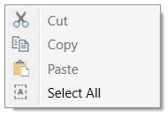
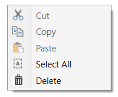
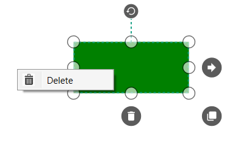

# Context Menu in WPF Diagram (SfDiagram)

In graphical user interface (GUI), a ContextMenu is a type of Menu that appears when you perform right-click operation. Nested level of Context Menu items can be created. Diagram provided some in-built ContextMenu items and allows to define custom menu items.

## Default Context Menu

The `ContextMenu` Constraint helps you to enable/disable the context menu. The following code illustrates how to enable/disable the default context menu items.




//Disable context menu
diagram.Constraints = GraphConstraints.Default & ~GraphConstraints.ContextMenu;

//Enable context menu
diagram.Constraints = GraphConstraints.Default | GraphConstraints.ContextMenu;




Diagram provides some default context menu items to ease the execution of some frequently used commands. 

## Customize Context Menu

* Apart from the default ContextMenu items, you can define some additional menu items by using `Menu` property of SfDiagram, Node and Connector. Those additional items have to be defined and added to `MenuItems` Property. 

* The Content property allows you to set Content for the context menu item.

* The Icon property allows you to set icon for the context menu item.

* The Command property of the Context menu item allows you to define command for it.

* The `IsSeparator` property defines the horizontal lines that are used to separate the menu items. You cannot select the separators. You can enable separators to group the menu items using the `IsSeparator` property.

The following code example illustrates how to add custom context menu items to Menu property of SfDiagram.




DiagramMenuItem menu = new DiagramMenuItem() 
{
	Content = "Delete", 
	Command = (diagram.Info as IGraphInfo).Commands.Delete,
	Icon = @"pack://application:,,,/delete.ico"
};
diagram.Menu.MenuItems.Add(menu);




### Menu for Node and Connector

The default value of Menu property for Node and Connector is null.The following code example illustrates how to set ContextMenu and ContextMenuItems to Node.




node.Constraints = node.Constraints | NodeConstraints.Menu;
node.Constraints = node.Constraints & ~NodeConstraints.InheritMenu;
node.Menu = new DiagramMenu();
node.Menu.MenuItems=new ObservableCollection<DiagramMenuItem>();
DiagramMenuItem mi = new DiagramMenuItem()
{
	Content = "Delete",
	Command = (diagram.Info as IGraphInfo).Commands.Delete,
	Icon = @"pack://application:,,,/delete.ico"
};
(node.Menu.MenuItems as ICollection<DiagramMenuItem>).Add(mi);




[View Sample in GitHub](https://github.com/SyncfusionExamples/WPF-Diagram-Examples/tree/master/Samples/ContextMenu) 

## Events

* `MenuItemClickedEvent`will invoke when you click the menu items. To explore about arguments, refer to [MenuItemClickedEventArgs](https://help.syncfusion.com/cr/wpf/Syncfusion.UI.Xaml.Diagram.MenuItemClickedEventArgs.html)

The following code example illustrates how to define those events.




(diagram.Info as IGraphInfo).MenuItemClickedEvent += 
	MainPage_MenuItemClickedEvent;

void MainPage_MenuItemClickedEvent(object sender, 
	MenuItemClickedEventArgs args)
{
	//Source – in which object Event get fired
    //Item - MenuItem
}




* `MenuOpening` event will notify when you perform right click on Diagram/Node/Connector.To explore about arguments, refer to [MenuOpeningEventArgs](https://help.syncfusion.com/cr/wpf/Syncfusion.UI.Xaml.Diagram.MenuOpeningEventArgs.html).

## See Also

* [How to customize the context menu?](https://www.syncfusion.com/kb/10467/how-to-customize-the-contextmenu-in-wpf-sfdiagram)
