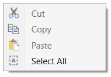
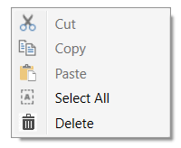
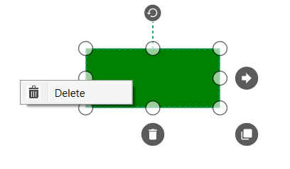

# Context Menu in WPF SfDiagram

In graphical user interface (GUI), a ContextMenu is a type of Menu that appears on right-click. Nested-level Context Menu items can be created. [WPF SfDiagram](https://www.syncfusion.com/diagram-sdk/wpf-diagram) provides built-in ContextMenu items and lets you define custom menu items.

## Default Context Menu

The [`ContextMenu`](https://help.syncfusion.com/cr/wpf/Syncfusion.UI.Xaml.Diagram.GraphConstraints.html) constraint enables or disables the default context menu. The default value of [`GraphConstraints`](https://help.syncfusion.com/cr/wpf/Syncfusion.UI.Xaml.Diagram.GraphConstraints.html) includes `ContextMenu`, so the context menu is enabled by default. The following code illustrates how to toggle the default context menu.




// Disable the context menu.
diagram.Constraints = GraphConstraints.Default & ~GraphConstraints.ContextMenu;

// Enable the context menu.
diagram.Constraints = GraphConstraints.Default | GraphConstraints.ContextMenu;




Diagram provides the following default context menu items to ease the execution of frequently used commands:

* Cut 
* Copy
* Paste
* Select All

## Customize Context Menu

Apart from the default context menu items, you can add additional items by using the `Menu` property of `SfDiagram`, `Node`, and `Connector`. Add each new item to the `MenuItems` collection.

The [`DiagramMenuItem`](https://help.syncfusion.com/cr/wpf/Syncfusion.UI.Xaml.Diagram.Controls.DiagramMenuItem.html) class exposes the following properties:

| Property | Description | Type | Default |
|---|---|---|---|
| `Content` | Sets the label for the context menu item. | `object` | `null` |
| `Icon` | Sets the icon shown next to the menu item. Accepts an `ImageSource` or a `pack://` URI string for a project resource. | `object` | `null` |
| `Command` | Sets the `ICommand` invoked when the item is clicked. Bind to `IGraphInfo.Commands.*` for built-in commands. | `ICommand` | `null` |
| `IsSeparator` | When `true`, renders the item as a non-selectable horizontal line used to group menu items. | `bool` | `false` |
| `Items` | Nested child `DiagramMenuItem`s for sub-menus. | `IList<DiagramMenuItem>` | `null` |

The following code example illustrates how to add custom context menu items to the `Menu` property of `SfDiagram`:




DiagramMenuItem menu = new DiagramMenuItem()
{
    Content = "Delete",
    Command = (diagram.Info as IGraphInfo).Commands.Delete,
    Icon = @"pack://application:,,,/delete.ico"
};
diagram.Menu.MenuItems.Add(menu);




### Menu for Node and Connector

The default value of the `Menu` property for `Node` and `Connector` is `null`. The following code example illustrates how to set the `Menu` and `MenuItems` on a node. Add the `.ico` file to your project as a `Resource`, then reference it with the `pack://` URI.




node.Constraints = node.Constraints | NodeConstraints.Menu;
node.Constraints = node.Constraints & ~NodeConstraints.InheritMenu;
node.Menu = new DiagramMenu();
node.Menu.MenuItems=new ObservableCollection<DiagramMenuItem>();
DiagramMenuItem mi = new DiagramMenuItem()
{
	Content = "Delete",
	Command = (diagram.Info as IGraphInfo).Commands.Delete,
	Icon = @"pack://application:,,,/delete.ico"
};
(node.Menu.MenuItems as ICollection<DiagramMenuItem>).Add(mi);




[View Sample in GitHub](https://github.com/SyncfusionExamples/WPF-Diagram-Examples/tree/master/Samples/ContextMenu)

## Events

The `MenuItemClickedEvent` fires when you click a menu item. The event arguments expose two properties: `Source` (the diagram object that raised the event) and `Item` (the clicked `DiagramMenuItem`). To explore about arguments, refer to [MenuItemClickedEventArgs](https://help.syncfusion.com/cr/wpf/Syncfusion.UI.Xaml.Diagram.MenuItemClickedEventArgs.html).

The following code example illustrates how to subscribe to that event:




(diagram.Info as IGraphInfo).MenuItemClickedEvent +=
    MainWindow_MenuItemClickedEvent;

private void MainWindow_MenuItemClickedEvent(object sender, MenuItemClickedEventArgs args)
{
    // Source - The diagram object that raised the event.
    // Item - The clicked DiagramMenuItem.
}




The `MenuOpening` event fires when you right-click on the diagram, a node, or a connector. To explore about arguments, refer to [MenuOpeningEventArgs](https://help.syncfusion.com/cr/wpf/Syncfusion.UI.Xaml.Diagram.MenuOpeningEventArgs.html). To subscribe to it:




(diagram.Info as IGraphInfo).MenuOpening += MainWindow_MenuOpening;

private void MainWindow_MenuOpening(object sender, MenuOpeningEventArgs args)
{
    // Inspect args.Source / args.Args here, or set args.Cancel = true to suppress the menu.
}




## See Also

- [How to customize the context menu in WPF SfDiagram](https://support.syncfusion.com/kb/article/10467/how-to-customize-the-contextmenu-in-wpf-sfdiagram)

- [How to display images, image URI, and shapes for menu item icons in WPF SfDiagram](https://support.syncfusion.com/kb/article/13009/how-to-display-images-image-uri-and-shapes-for-menu-items-icon-in-wpf-diagram)

- [How to add an icon to a context menu item in WPF SfDiagram](https://support.syncfusion.com/kb/article/10986/how-to-add-icon-to-context-menu-item-in-wpf-diagram-sfdiagram)

- [How to add a TextBox as a sub-menu item in WPF SfDiagram](https://support.syncfusion.com/kb/article/18494/how-to-add-textbox-as-a-submenuitem-in-wpf-sfdiagram)

- [How to display different context menus for various types of diagram elements in WPF SfDiagram](https://support.syncfusion.com/kb/article/18236/how-can-i-display-different-context-menus-for-various-types-of-diagram-elements-and-the-diagram-area-in-the-wpf-diagram-sfdiagram)

- [How to add a node as a child of a container using the context menu in WPF SfDiagram](https://support.syncfusion.com/kb/article/18053/how-to-add-a-node-as-a-child-of-a-container-using-the-context-menu-in-wpf-diagram-sfdiagram)

- [How to display the paste context menu only after cutting or copying in WPF SfDiagram](https://support.syncfusion.com/kb/article/17759/how-to-display-the-paste-context-menu-only-after-cutting-or-copying-nodes-in-a-diagram-in-wpf-diagram-sfdiagram)

- [How to enable or disable custom context menu items based on a node's selection in WPF SfDiagram](https://support.syncfusion.com/kb/article/17784/how-to-enable-or-disable-custom-context-menu-items-based-on-a-nodes-selection-in-wpf-diagram-sfdiagram)

- [How to add a container as parent of the selected node using the context menu in WPF SfDiagram](https://support.syncfusion.com/kb/article/17747/how-to-add-a-container-as-parent-of-the-selected-node-using-the-context-menu-in-wpf-diagram-sfdiagram)

- [How to set a shortcut key for menu items in the context menu in WPF SfDiagram](https://support.syncfusion.com/kb/article/14975/how-to-set-a-shortcut-key-for-menu-items-in-the-context-menu-in-wpf-diagram-sfdiagram)

- [How to change the annotation content of a node using the context menu in WPF SfDiagram](https://support.syncfusion.com/kb/article/14962/how-to-change-the-annotation-content-of-a-node-using-context-menu-in-wpf-diagram-sfdiagram)

- [How to implement color palette functionality using the context menu in WPF SfDiagram](https://support.syncfusion.com/kb/article/14963/how-to-implement-color-palette-functionality-using-context-menu-in-wpf-diagram-sfdiagram)