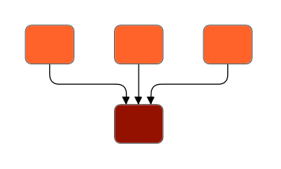

# Data Binding in WPF Diagram (SfDiagram)

Diagram can be populated with the nodes and connectors based on the information provided from an external data source.

* The DataSourceSettings `DataSource` property is used to define the data source as a collection of objects, which needs to be populated as diagram.

* The DataSourceSettings `Id` property is used to define the unique field of each data.

* The DataSourceSettings `ParentId` property is used to define the parent field, which builds the relationship between ID and parent field.

* The DataSourceSettings `Root` property is used to define the root node for the diagram populated from the data source.

To explore those properties, refer to [DataSourceSettings](https://help.syncfusion.com/cr/wpf/Syncfusion.UI.Xaml.Diagram.DataSourceSettings.html)

## Defining DataSource

[DataSource](https://help.syncfusion.com/cr/wpf/Syncfusion.UI.Xaml.Diagram.DataSourceSettings.html#Syncfusion_UI_Xaml_Diagram_DataSourceSettings_DataSource) can be a collection of any business objects or collection of nodes. If you use collection of business objects as datasource, then nodes has been created automatically to populate a layout. As a collection of objects, datasource has the functionalities of add, remove, reset, and move. The following code example explains the defining of `DataSource` using business objects.




<!-- Initializes the employee collection-->
<local:Employees x:Key="employees">
    <local:Employee Name="Steve" EmpId="1" ParentId="" Designation="CEO"/>
    <local:Employee Name="Kevin" EmpId="2" ParentId="1" Designation="Manager"/>
    <local:Employee Name="John" EmpId="3" ParentId="1" Designation="Manager"/>
    <local:Employee Name="Raj" EmpId="4" ParentId="2" Designation="Team Lead"/>
    <local:Employee Name="Will" EmpId="5" ParentId="2" Designation="S/w Developer"/>
    <local:Employee Name="Sarah" EmpId="6" ParentId="3" Designation="TeamLead"/>
    <local:Employee Name="Mike" EmpId="7" ParentId="3" Designation="Testing Engineer"/>
</local:Employees>

<!--Initializes the DataSourceSettings-->
<syncfusion:DataSourceSettings x:Key="DataSourceSettings" 
                               Id="EmpId" ParentId="ParentId" 
                               DataSource="{StaticResource employees}" />
<!--Initializes the SfDiagram-->
<syncfusion:SfDiagram x:Name="Diagram" 
                      DataSourceSettings="{StaticResource DataSourceSettings}"/>




/// 

/// Business object class for creating datasource
/// 

public class Employee
{
    public string Name { get; set; }
    public string EmpId { get; set; }
    public string ParentId { get; set; }
    public string Designation { get; set; }
}

public class Employees : ObservableCollection<Employee>
{
}

// Initialize DataSourceSettings for SfDiagram
Diagram.DataSourceSettings = new DataSourceSettings()
{
    Id = "EmpId",
    ParentId = "ParentId",
    Root = "1",
    DataSource = GetData(),
};

// Method to initialize the value for DataSource
private Employees GetData()
{
    Employees employees = new Employees();

    employees.Add(new Employee()
    { 
        Name = "Steve", EmpId = "1", ParentId = "", Designation = "CEO" 
    });
    employees.Add(new Employee() 
    { 
        Name = "Kevin", EmpId = "2", ParentId = "1", Designation = "Manager"
    });
    employees.Add(new Employee() 
    {
         Name = "John", EmpId = "3", ParentId = "1", Designation = "Manager" 
    });
    employees.Add(new Employee() 
    { 
        Name = "Raj", EmpId = "4", ParentId = "2", Designation = "Team Lead" 
    });
    employees.Add(new Employee() 
    { 
        Name = "Will", EmpId = "5", ParentId = "2", Designation = "S/w Developer" 
    });
    employees.Add(new Employee() 
    { 
        Name = "Sarah", EmpId = "6", ParentId = "3", Designation = "TeamLead" 
    });
    employees.Add(new Employee() 
    {
        Name = "Mike", EmpId = "7", ParentId = "3", Designation = "Testing Engineer" 
    });

    return employees;
}




N> ParentId and Id must be in same type to populate a layout.

## Defining layout

By default, populated nodes are positioned at (0,0). You can use built-in automatic layout algorithm to define the position of the each populated nodes. The following code explains how to define the tree layout.




<!--Initializes the Layout-->
<syncfusion:DirectedTreeLayout x:Key="treeLayout" 
                               Type="Hierarchical" 
                               Orientation="TopToBottom" 
                               HorizontalSpacing="80" 
                               VerticalSpacing="50" />
        
<!--Initialize the layout manager-->
<syncfusion:LayoutManager x:Key="layoutManager" Layout="{StaticResource treeLayout}"/>             

<!--Initializes the SfDiagram-->
<syncfusion:SfDiagram x:Name="Diagram" 
                      DataSourceSettings="{StaticResource DataSourceSettings}" 
                      LayoutManager="{StaticResource layoutManager}"/>         




//Initialize LayoutManager and Layout for SfDiagram
Diagram.LayoutManager = new LayoutManager()
{
    Layout = new DirectedTreeLayout()
    {
        Type = LayoutType.Hierarchical,
        Orientation = TreeOrientation.TopToBottom,
        HorizontalSpacing = 80,
        VerticalSpacing = 50,
    },
};




To learn more about the supported built-in layout, refer to the [Automatic Layouts](https://help.syncfusion.com/wpf/diagram/automatic-layouts) page.

### How to done Add, Remove, Reset and Move in DataSource

As `DataSource` is a collection of any business objects or nodes, it has the functionalities of add, remove, reset, and move.




//Add new data in datasource
(Diagram.DataSourceSettings.DataSource as Employees).Add(new Employee() {Name = "Steven", EmpId = "8", ParentId = "2", Designation = "S/w Developer" });
(Diagram.DataSourceSettings.DataSource as Employees).Insert(3, new Employee() { Name = "William", EmpId = "8", ParentId = "2", Designation = "S/w Developer" });

//Remove data from datasource
Employee emp = (Diagram.DataSourceSettings.DataSource as Employees).ElementAt(5);
(Diagram.DataSourceSettings.DataSource as Employees).Remove(emp);
(Diagram.DataSourceSettings.DataSource as Employees).RemoveAt(5);

//Reset all data in datasource
Diagram.DataSourceSettings.DataSource = null;
Diagram.DataSourceSettings.DataSource = new Employees();

//Move data from one position to another in datasource
(Diagram.DataSourceSettings.DataSource as Employees).Move(2, 1);




## Root

By default, the node without parent is treated as root of the layout. Now, `DataSourceSettings` have option to specify the root node of the layout.



 
<!--Initializes the DataSourceSettings and set object with id "1" and name "CEO"as root-->
<syncfusion:DataSourceSettings x:Key="DataSourceSettings" Id="EmpId" 
                               ParentId="ParentId" 
                               DataSource="{StaticResource employees}" 
                               Root="1" />




//object with id “1” and name "CEO", is considered as root of tree layout.
diagram.DataSourceSettings.Root = "1";




## Layout with multiple parents

Tree layout and data sources will now support nodes having multiple parents by defining more than one parent ID to the `ParentID` property. The child node is arranged in center of the parent positions. The following code explains the defining of multiple parent ID's to single node.



 
<local:DataItems x:Key="DataItems">
    <local:ItemInfo Name="n11" RatingColor="#ff6329"/>
    <local:ItemInfo Name="n12" RatingColor="#ff6329"/>
    <local:ItemInfo Name="n13" RatingColor="#ff6329"/>
    <local:ItemInfo Name="n21" RatingColor="#941100">
        <local:ItemInfo.ReportingPerson>
            <local:StringList>
                <system:String>n11</system:String>
                <system:String>n12</system:String>
                <system:String>n13</system:String>
            </local:StringList>
        </local:ItemInfo.ReportingPerson>
    </local:ItemInfo>
</local:DataItems>

<syncfusion:SfDiagram>
    <syncfusion:SfDiagram.DataSourceSettings>
        <syncfusion:DataSourceSettings Id="Name" ParentId="ReportingPerson" 
                                       DataSource="{StaticResource DataItems}"/>
    </syncfusion:SfDiagram.DataSourceSettings>
</syncfusion:SfDiagram>
 



public class ItemInfo
{
    public ItemInfo(string name, string color)
    {
        this.Name = name;
        this.RatingColor = color;
    }

    public string RatingColor { get; set; }
    public string Name { get; set; }
    public List<string> ReportingPerson { get; set; }
}

DataItems data = new DataItems();
data.Add(new ItemInfo("n11", "#ff6329"));
data.Add(new ItemInfo("n12", "#ff6329"));
data.Add(new ItemInfo("n13", "#ff6329"));
data.Add(new ItemInfo("n21", "#941100") 
{
    ReportingPerson = new List<string> { "n11", "n12", "n13" } 
});




[View sample in GitHub](https://github.com/SyncfusionExamples/WPF-Diagram-Examples/tree/master/Samples/DataSource/Multi%20Parent)

## FlowchartDataSourceSettings

[FlowchartDataSourceSettings](https://help.syncfusion.com/cr/wpf/Syncfusion.UI.Xaml.Diagram.FlowchartDataSourceSettings.html) is the derived class of `DataSourceSettings`, which contains the mapping properties.These properties are used to map the data member in the underlying data object to the datasource item.

`ContentMapping`: Maps the content in the underlying data object to data source item.

`ConnectorTextMapping`: Maps the ConnectorText in the underlying data object to data source item.

`ShapeMapping`: Maps the shape in the underlying data object to data source item.
 
`WidthMapping`: Maps the width in the underlying data object to data source item.
 
`HeightMapping`: Maps the height in the underlying data object to data source item.




<ResourceDictionary.MergedDictionaries>
    <ResourceDictionary Source="/Syncfusion.SfDiagram.Wpf;component/Resources/BasicShapes.xaml"/>
</ResourceDictionary.MergedDictionaries>

<!-- Initializes the DataSource collection-->
<local:DataItems x:Key="Datas">
<local:ItemInfo Id="1" NodeShape="{StaticResource Terminator}" 
                Width="80" Height="40" 
                Name="Start"/>
<local:ItemInfo Id="2" NodeShape="{StaticResource Decision}" 
                Width="100" Height="80" 
                Name="Decision?">
    <local:ItemInfo.ParentId>
        <local:LabelList>
            <sys:String>1</sys:String> 
        </local:LabelList>
    </local:ItemInfo.ParentId>
</local:ItemInfo>
<local:ItemInfo Id="3" NodeShape="{StaticResource Process}" 
                Width="80" Height="50" 
                Name="Process1">
    <local:ItemInfo.ParentId>
        <local:LabelList>
            <sys:String>2</sys:String>
        </local:LabelList>
    </local:ItemInfo.ParentId>
    <local:ItemInfo.Label>
        <local:LabelList>
            <sys:String>No</sys:String>
        </local:LabelList>
    </local:ItemInfo.Label>
</local:ItemInfo>
<local:ItemInfo Id="4" NodeShape="{StaticResource Process}" 
                Width="80" Height="50" 
                Name="Process2">
    <local:ItemInfo.ParentId>
        <local:LabelList>
            <sys:String>2</sys:String>
        </local:LabelList>
    </local:ItemInfo.ParentId>
    <local:ItemInfo.Label>
        <local:LabelList>
            <sys:String>Yes</sys:String>
        </local:LabelList>
    </local:ItemInfo.Label>
</local:ItemInfo>
<local:ItemInfo Id="5" NodeShape="{StaticResource Terminator}" 
                Width="80" Height="40" 
                Name="End">
    <local:ItemInfo.ParentId>
        <local:LabelList>
            <sys:String>4</sys:String>
        </local:LabelList>
    </local:ItemInfo.ParentId>
</local:ItemInfo>
</local:DataItems>

<!--Initializes the Layout-->
<syncfusion:FlowchartLayout x:Key="Layout" Orientation="TopToBottom" 
                            YesBranchDirection="LeftInFlow" 
                            HorizontalSpacing="50" 
                            VerticalSpacing="30"/>

<!--Initializes the DataSourceSettings -->
<syncfusion:FlowchartDataSourceSettings x:Key="DataSourceSettings" 
                                        DataSource="{StaticResource Datas}" 
                                        ParentId="ParentId" Id="Id" 
                                        ShapeMapping="NodeShape" 
                                        WidthMapping="Width" 
                                        HeightMapping="Height" 
                                        ConnectorTextMapping="Label" 
                                        ContentMapping="Name" />
            
<!--Initializes the LayoutManager-->
<syncfusion:LayoutManager x:Key="layoutmanager" Layout="{StaticResource Layout}"/>

<!--Initializes the SfDiagram-->          
<syncfusion:SfDiagram x:Name="diagram" LayoutManager="{StaticResource layoutManager}" 
                      DataSourceSettings="{StaticResource DataSourceSettings">
    <!--Initializes the NodeCollection-->                  
    <syncfusion:SfDiagram.Nodes>
        <syncfusion:NodeCollection/>
    </syncfusion:SfDiagram.Nodes>
    <!--Initializes the ConnectorCollection-->
    <syncfusion:SfDiagram.Connectors>
        <syncfusion:ConnectorCollection/>
    </syncfusion:SfDiagram.Connectors>
    <syncfusion:SfDiagram.Theme>
        <syncfusion:OfficeTheme/>
    </syncfusion:SfDiagram.Theme>
</syncfusion:SfDiagram>




//Initialize Diagram
SfDiagram diagram = new SfDiagram();

//Initialize Node Collection
diagram.Nodes = new ObservableCollection<NodeViewModel>();           

//Initialize Connector Collection
diagram.Connectors = new ObservableCollection<ConnectorViewModel>();

//Initialize DataSourceSettings for SfDiagram
diagram.DataSourceSettings = new FlowchartDataSourceSettings()
{
    ParentId = "ParentId",
    Id = "Id",
    DataSource = GetData(),
    ConnectorTextMapping = "Label",
    ContentMapping = "Name",
    ShapeMapping = "NodeShape",
    WidthMapping = "Width",
    HeightMapping = "Height"
};

//Initialize LayoutManager
LayoutManager layoutManager = new LayoutManager();

//Initialize Layout for SfDiagram
layoutManager.Layout = new FlowchartLayout()
{
    Orientation = FlowchartOrientation.TopToBottom,
    YesBranchDirection = BranchDirection.LeftInFlow,
    NoBranchDirection = BranchDirection.RightInFlow,
    HorizontalSpacing = 50,
    VerticalSpacing = 30
};

//initialize theming style for SfDiagram
diagram.Theme = new OfficeTheme();

//Initialize LayoutManager
diagram.LayoutManager = layoutManager;
    
//Adding Sfdiagram as children to mainwindow grid.
WindowGrid.Children.Add(Diagram);

//Initializes the DataSource collection
private DataItems GetData()
{
    DataItems collection = new DataItems();
    collection.Add(new ItemInfo()
    {
        Id ="1",
        NodeShape =App.Current.Resources["Terminator"] as string,
        Name = "Start",
        Height =40,
        Width =100
    });
    collection.Add(new ItemInfo()
    {
        Id = "2",
        ParentId =new List<string> { "1" },
        NodeShape = App.Current.Resources["Decision"] as string,
        Name = "Decision?",
        Height = 100,
        Width =100
    });
    collection.Add(new ItemInfo()
    {
        Id = "3", ParentId =new List<string> { "2" },
        Label = new List<string> { "No" },
        NodeShape = App.Current.Resources["Process"] as string,
        Name = "Process1",
        Height =40,
        Width = 100
    });
    collection.Add(new ItemInfo()
    {
        Id = "4",
        ParentId = new List<string> { "2" },
        Label =new List<string> {"Yes" },
        NodeShape = App.Current.Resources["Process"] as string,
        Name = "Process2",
        Height = 40,
        Width = 100
    });
    collection.Add(new ItemInfo()
    {
        Id = "5",
        ParentId = new List<string> { "4" },
        NodeShape = App.Current.Resources["Terminator"] as string,
        Name = "End",
        Height = 40,
        Width = 100
    });
    return collection;
}

//Data Object Class
public class ItemInfo
{
    public string Name { get; set; }
    public string Id { get; set; }
    public List<string> ParentId { get; set; }
    public string NodeShape { get; set; }
    public List<string> Label { get; set; }
    public double Width { get; set; }
    public double Height { get; set; }
}

//Collection to hold the Data Object class
public class DataItems : ObservableCollection<ItemInfo>
{
}        


 

[View sample in GitHub](https://github.com/SyncfusionExamples/WPF-Diagram-Examples/tree/master/Samples/DataSource/Flowchart%20Layout)