# Diagram View

The Diagram View is responsible for bringing the objects and data which are added into the view through the model. In other words, it deals with the visual representation of data. Zooming and panning are done with respect to the view. 

_Property Table_

<table>
<tr>
<td>
Property</td><td>
Description </td><td>
Type of the property</td><td>
Value it accepts</td><td>
Any other dependencies/ sub properties associated</td></tr>
<tr>
<td>
IsZoomEnabled</td><td>
Gets or sets a value indicating whether zoom is enabled or not.Default valueis True.</td><td>
Dependency property</td><td>
Boolean(True/False)</td><td>
No</td></tr>
<tr>
<td>
IsPanEnabled</td><td>
Gets or sets a value indicating whether pan is enabled or not.Default valueis False.</td><td>
Dependency property</td><td>
Boolean(True/False)</td><td>
No</td></tr>
<tr>
<td>
ZoomFactor</td><td>
Gets or sets a factor for the zoom.Default value is 0.2.</td><td>
Dependency property</td><td>
Double</td><td>
No</td></tr>
<tr>
<td>
Bounds</td><td>
Gets or sets the bounds value which specifies the position of the root node in case of tree layout.</td><td>
CLR property</td><td>
Thickness</td><td>
No</td></tr>
<tr>
<td>
IsPageEditable</td><td>
Gets or sets a value indicating whether page is enabled or not.Default value is True.</td><td>
Dependency property</td><td>
Boolean(True/False)</td><td>
No</td></tr>
<tr>
<td>
ShowVerticalRulers</td><td>
Gets or sets a value indicating whether vertical rulers are displayed or not.Default value is True.</td><td>
Dependency property</td><td>
Boolean(True/False)</td><td>
No</td></tr>
<tr>
<td>
ShowHorizontalRulers</td><td>
Gets or sets a value indicating whether horizontal rulers are displayed or not.Default value is True.</td><td>
Dependency property</td><td>
Boolean(True/False)</td><td>
No</td></tr>
<tr>
<td>
ShowVerticalGridLine</td><td>
Gets or sets a value indicating whether vertical grid lines are displayed or not.Default value is True.</td><td>
Dependency property</td><td>
Boolean(True/False)</td><td>
No</td></tr>
<tr>
<td>
ShowHorizontalGridLine</td><td>
Gets or sets a value indicating whether horizontal grid lines are displayed or not.Default value is True.</td><td>
Dependency property</td><td>
Boolean(True/False)</td><td>
No</td></tr>
<tr>
<td>
PortVisibility</td><td>
Gets or sets a value indicating whether all ports of all the nodes on the page are visible or not.If  individual node’s PortVisibility is set, then the node’s PortVisibility property will take precedence.Default value isVisibility.Visible</td><td>
Dependency property</td><td>
Visibility.VisibleVisibility.CollapsedVisibility.Hidden</td><td>
No</td></tr>
<tr>
<td>
Page</td><td>
Gets or sets the DiagramPage.</td><td>
Dependency property</td><td>
Panel</td><td>
No</td></tr>
<tr>
<td>
NodeContextMenu</td><td>
Gets or sets context menu for the node.</td><td>
Dependency property</td><td>
ContextMenu</td><td>
No</td></tr>
<tr>
<td>
LineConnectorContextMenu</td><td>
Gets or sets context menu for line connector.</td><td>
Dependency property</td><td>
ContextMenu</td><td>
No</td></tr>
<tr>
<td>
UndoRedoEnabled</td><td>
Gets or sets a value indicating whether undo redo is enabled or not.</td><td>
Dependency property</td><td>
Boolean(True/False)</td><td>
No</td></tr>
<tr>
<td>
IsCutEnabled</td><td>
Gets or sets a value indicating whether cut command is enabled. Default value is True.</td><td>
Dependency property</td><td>
Boolean(True/False)</td><td>
No</td></tr>
<tr>
<td>
IsCopyEnabled</td><td>
Gets or sets a value copy command is enabled.Default value is True.</td><td>
Dependency property</td><td>
Boolean(True/False)</td><td>
No</td></tr>
<tr>
<td>
IsPasteEnabled</td><td>
Gets or sets a value indicating whether paste command is enabled. Default value is True.</td><td>
Dependency property</td><td>
Boolean(True/False)</td><td>
No</td></tr>
<tr>
<td>
IsPageSaved</td><td>
Gets or sets a value indicating whether a page is saved.</td><td>
Dependency property</td><td>
Boolean (true/false)</td><td>
No</td></tr>
<tr>
<td>
IsConnectorDragCancel</td><td>
Gets or sets whether the value indicating that connector drag can be canceled.</td><td>
CLR property</td><td>
Boolean (true/false)</td><td>
No</td></tr>
<tr>
<td>
IsNodeDragCancel</td><td>
Gets or sets a value indicating that node drag can be canceled.</td><td>
CLR property</td><td>
Boolean (true/false)</td><td>
No</td></tr>
<tr>
<td>
HorizontalScrollbarVisibility</td><td>
Specifies the visibility for the vertical scroll bar. The default value is Auto.</td><td>
Dependency property</td><td>
ScrollBarVisibility.AutoScrollBarVisibility.DisabledScrollBarVisibility.HiddenScrollBarVisibility.Visible</td><td>
No</td></tr>
<tr>
<td>
VerticalScrollbarVisibility</td><td>
Specifies the visibility for vertical scroll bar. The default value is Auto.</td><td>
Dependency property</td><td>
ScrollBarVisibility.AutoScrollBarVisibility.DisabledScrollBarVisibility.HiddenScrollBarVisibility.Visible</td><td>
No</td></tr>
<tr>
<td>
SelectionList</td><td>
Gets the Selection List for the items.</td><td>
CLR property</td><td>
NodeCollection</td><td>
No</td></tr>
</table>

[XAML]

<Window x:Class="WpfApplication1.Window1" xmlns="http://schemas.microsoft.com/winfx/2006/xaml/presentation"

xmlns:x="http://schemas.microsoft.com/winfx/2006/xaml" Title="EssentialDiagramWPF" Height="400" Width="600"

xmlns:sfdiagram="clr-namespace:Syncfusion.Windows.Diagram;assembly=Syncfusion.Diagram.WPF" xmlns:local="clr-namespace:WpfApplication1">

    <Grid Name="diagramgrid">

        <sfdiagram:DiagramControl IsSymbolPaletteEnabled="True">

            <sfdiagram:DiagramControl.View>

                <sfdiagram:DiagramView ></sfdiagram:DiagramView>

            </sfdiagram:DiagramControl.View>

        </sfdiagram:DiagramControl>

    </Grid>

</Window>

[C#]

DiagramControl dc = new DiagramControl();

dc.IsSymbolPaletteEnabled = true;

DiagramView view = new DiagramView();

view.Bounds = new Thickness(0, 0, 1000, 1000);

dc.View = view;

diagramgrid.Children.Add(dc);

[VB]

Dim dc As New DiagramControl()

dc.IsSymbolPaletteEnabled = True

Dim view As New DiagramView()

view.Bounds = New Thickness(0, 0, 1000, 1000)

dc.View = view

diagramgrid.Children.Add(dc)

The drawing area has many properties that can be used to customize a view.

See Also

* Create Rulers Refer Concepts and Features -> Diagram View -> Create Rulers
* Specify Bounds Refer Concepts and Features -> Diagram View -> Specify Bounds
* Panning Refer Concepts and Features -> Diagram View -> Panning
* Zoom Commands Refer Concepts and Features -> Diagram View -> Zoom Commands
* Create Page Refer Concepts and Features -> Diagram View -> Create Page
* Page Editing option Refer Concepts and Features -> Diagram View -> Page Editing option
* Grid Lines Refer Concepts and Features -> Diagram View -> Grid Lines
* Customize the ContextMenu of Nodes and LineConnectors Refer Concepts and Features -> General -> Customize the ContextMenu of Nodes and LineConnectors
* Undo and Redo Command. Refer Concepts and Features -> Diagram View -> Undo and Redo Command.
## Create Rulers

Rulers display the coordinates of elements on the diagram page. Negative label values get displayed on the ruler in case the page is panned to the right side. On Zooming, the ruler values get adjusted accordingly, to match with the current Zoom level. At any point, the ruler value always indicates the exact coordinates of the page and its elements. So when the page is zoomed, the interval values get halved or doubled depending upon the zoom level. By default, labels of the major lines in rulers will represent the pixel values using a label when there is a change in DigaramPage’s MeasurementUnit. The ruler and the Label will be updated so that the label indicates the respective unit values.

Panning, Zooming, MeasurementUnits are explained in later part of this documentation.

Horizontal and Vertical ruler can be initialized for DiagramView in two ways:

* Through XAML
* Through Code Behind

[XAML]

    <!--Diagram Control-->

    <syncfusion:DiagramControl  Name="diagramControl">

        <!-- Model to add nodes and connections-->

        <syncfusion:DiagramControl.Model>

            <syncfusion:DiagramModel x:Name="diagramModel">

            </syncfusion:DiagramModel>

        </syncfusion:DiagramControl.Model>

        <!--View to display nodes and connections added through model.-->

<syncfusion:DiagramView IsPageEditable="True" Bounds="0,0,12,12" Name="diagramView">

    <syncfusion:DiagramView.HorizontalRuler>

        <syncfusion:HorizontalRuler Name="horizontalRuler" />

    </syncfusion:DiagramView.HorizontalRuler>

    <syncfusion:DiagramView.VerticalRuler>

        <syncfusion:VerticalRuler Name="verticalRuler"  />

    </syncfusion:DiagramView.VerticalRuler >

</syncfusion:DiagramView>        

    </syncfusion:DiagramControl>

[C#]

DiagramView diagramView = new DiagramView();

diagramView.HorizontalRuler =  new HorizontalRuler();

diagramView.VerticalRuler as VerticalRuler();

[VB]

Dim diagramView As New DiagramView()

diagramView.HorizontalRuler = New HorizontalRuler()

TryCast(diagramView.VerticalRuler, VerticalRuler())

{{ '' | markdownify }}
{:.image }

_Rulers_

{{ '' | markdownify }}
{:.image }

_Ruler after Panning, zooming and Measurement unit as Inch_

Several customizable options have been provided for the horizontal and vertical rulers. These are common for both the rulers.
Property Table

<table>
<tr>
<td>
Property</td><td>
Description</td><td>
Type of the property</td><td>
Value it accepts</td><td>
Any other dependencies/ sub properties associated</td></tr>
<tr>
<td>
Background</td><td>
Get or sets the ruler's background color.</td><td>
Dependency property</td><td>
Brush</td><td>
No</td></tr>
<tr>
<td>
MarkerBrush</td><td>
Gets or sets the MarkerBrush.</td><td>
Dependency property</td><td>
Brush</td><td>
No</td></tr>
<tr>
<td>
LabelFontColor</td><td>
Gets or sets the LabelFontColor.</td><td>
Dependency property</td><td>
Brush</td><td>
No</td></tr>
<tr>
<td>
MinorLinesStroke</td><td>
Gets or sets the MinorLinesStroke.</td><td>
Dependency property</td><td>
Brush</td><td>
No</td></tr>
<tr>
<td>
MajorLinesStroke</td><td>
Gets or sets the MajorLinesStroke.</td><td>
Dependency property</td><td>
Brush</td><td>
No</td></tr>
<tr>
<td>
MajorLinesThickness</td><td>
Gets or sets the MajorLinesThickness.</td><td>
Dependency property</td><td>
Double</td><td>
No</td></tr>
<tr>
<td>
MinorLinesThickness</td><td>
Gets or sets the MinorLinesThickness.</td><td>
Dependency property</td><td>
Double</td><td>
No</td></tr>
<tr>
<td>
MarkerThickness</td><td>
Gets or sets the MarkerThickness.</td><td>
Dependency property</td><td>
Double</td><td>
No</td></tr>
</table>

{{ '' | markdownify }}
{:.image }

_Ruler Terminology_

The following code shows how the properties can be set.

[XAML]

<syncfusion:DiagramView IsPageEditable="True" Bounds="0,0,12,12" Name="diagramView">

<syncfusion:DiagramView.HorizontalRuler>

    <syncfusion:HorizontalRuler Name="horizontalRuler" Background="#FFC6C6C6" LabelFontColor="Green"/>

</syncfusion:DiagramView.HorizontalRuler>

<syncfusion:DiagramView.VerticalRuler>

    <syncfusion:VerticalRuler Name="verticalRuler" Background="#FFC6C6C6" LabelFontColor="Green"/>

</syncfusion:DiagramView.VerticalRuler >

</syncfusion:DiagramView>

[C#]

DiagramView diagramView = new DiagramView();

(diagramView.HorizontalRuler as HorizontalRuler).LabelFontColor = Brushes.Green;

(diagramView.VerticalRuler as VerticalRuler).LabelFontColor = Brushes.Green;

[VB]

Dim diagramView As New DiagramView()

TryCast(diagramView.HorizontalRuler, HorizontalRuler).LabelFontColor = Brushes.Green

TryCast(diagramView.VerticalRuler, VerticalRuler).LabelFontColor = Brushes.Green

{{ '' | markdownify }}
{:.image }

_Custom Ruler_

## Specify Bounds

The Bounds property of the Diagram View class enables a user to specify the rectangular area where the tree layout is to be displayed. The root of the tree layout is placed at the center of the bounds value. 

_Property Table_

<table>
<tr>
<td>
Property</td><td>
Description </td><td>
Type of the property</td><td>
Value it accepts</td><td>
Any other dependencies/ sub properties associated</td></tr>
<tr>
<td>
Bounds</td><td>
Gets or sets the bounds value which specifies the position of the root node in case of tree layout.</td><td>
CLR property</td><td>
Thickness</td><td>
No</td></tr>
</table>

The following code can be used to set the Bounds property.

Bounds can be specified in two ways,

* Through XAML
* Through Code Behind

[XAML]

<Window x:Class="WpfApplication1.Window1" xmlns="http://schemas.microsoft.com/winfx/2006/xaml/presentation"

xmlns:x="http://schemas.microsoft.com/winfx/2006/xaml" Title="EssentialDiagramWPF" Height="400" Width="600"

xmlns:sfdiagram="clr-namespace:Syncfusion.Windows.Diagram;assembly=Syncfusion.Diagram.WPF" xmlns:local="clr-namespace:WpfApplication1">

<Grid Name="diagramgrid">

    <sfdiagram:DiagramControl IsSymbolPaletteEnabled="True" >

        <sfdiagram:DiagramControl.View >

            <sfdiagram:DiagramView Bounds="0,0,500,500">

            </sfdiagram:DiagramView>

        </sfdiagram:DiagramControl.View>

    </sfdiagram:DiagramControl>

</Grid>

</Window>

[C#]

DiagramControl dc = new DiagramControl();

dc.IsSymbolPaletteEnabled = true;

DiagramView view = new DiagramView();

view.Bounds = new System.Drawing.Thickness(0, 0, 500, 500);

dc.View = view;

diagramgrid.Children.Add(dc);

[VB]

Dim dc As New DiagramControl()

dc.IsSymbolPaletteEnabled = True

Dim view As New DiagramView()

view.Bounds = New System.Drawing.Thickness(0, 0, 500, 500)

dc.View = view

diagramgrid.Children.Add(dc)

## Panning

Essential Diagram WPF provides the ability to pan a page. Panning is used to move the contents of page both horizontally and vertically by holding down a mouse button and then moving the mouse.

_Property Table_

<table>
<tr>
<td>
Property</td><td>
Description </td><td>
Type Of  the property</td><td>
Value it accepts</td><td>
Any other dependencies/ sub properties associated</td></tr>
<tr>
<td>
IsPanEnabled</td><td>
Gets or sets a value indicating whether pan is enabled or not.Default value is False.</td><td>
Dependency property</td><td>
Boolean(True/False)</td><td>
No</td></tr>
</table>

Steps for panning a page

1. A page can be panned by setting the IsPanEnabled property to _True_.

[C#]

DiagramView diagramView = new DiagramView();

diagramView.IsPanEnabled = true;

[VB]

Dim diagramView As New DiagramView()

diagramView.IsPanEnabled = True

2. Click and drag the diagram page to the desired position. Note that the negative rulers get displayed while panning to the right.
> 
_Note: No other operations can be performed on page elements while IsPanEnabled is set to True._

{{ '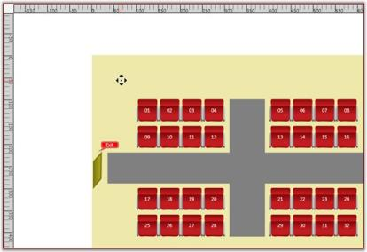' | markdownify }}
{:.image }

_Pan_

## Creating Page

The Diagram View has a Page property which refers to the DiagramPage class. The DiagramPage displays the nodes and connections which are added through the model.

_Property Table_

<table>
<tr>
<td>
Property</td><td>
Description </td><td>
Type of the property</td><td>
Value it accepts</td><td>
Any other dependencies/ sub properties associated</td></tr>
<tr>
<td>
Page</td><td>
Gets or sets the DiagramPage.</td><td>
Dependency property</td><td>
DiagramPage</td><td>
No</td></tr>
</table>

The DiagramPage can be created for DiagramView in following two ways,

* Through XAML
* Through Code Behind

[XAML]

<Window x:Class="WpfApplication1.Window1" xmlns="http://schemas.microsoft.com/winfx/2006/xaml/presentation"

xmlns:x="http://schemas.microsoft.com/winfx/2006/xaml" Title="EssentialDiagramWPF" Height="400" Width="600"

xmlns:sfdiagram="clr-namespace:Syncfusion.Windows.Diagram;assembly=Syncfusion.Diagram.WPF" xmlns:local="clr-namespace:WpfApplication1" >

<Grid Name="diagramgrid">

<sfdiagram:DiagramControl IsSymbolPaletteEnabled="True" >

<sfdiagram:DiagramControl.Model>

<sfdiagram:DiagramModel x:Name="diagramModel" >

</sfdiagram:DiagramModel>

</sfdiagram:DiagramControl.Model>

<sfdiagram:DiagramControl.View >

<sfdiagram:DiagramView ShowHorizontalGridLine="True" ShowVerticalGridLine="True">

<syncfusion:DiagramView.Page>

  <syncfusion:DiagramPage x:Name="diagramPage" GridHorizontalOffset="50" GridVerticalOffset="50"/>

</syncfusion:DiagramView.Page>

</sfdiagram:DiagramView>

</sfdiagram:DiagramControl.View>

</sfdiagram:DiagramControl>

</Grid>

</Window>

[C#]

DiagramControl dc = new DiagramControl();

dc.IsSymbolPaletteEnabled = true;

DiagramView view = new DiagramView();

dc.View = view;

(diagramView.Page as DiagramPage).GridHorizontalOffset = 50;

(diagramView.Page as DiagramPage).GridVerticalOffset = 50;

[VB]

Dim dc As New DiagramControl()

dc.IsSymbolPaletteEnabled = True

Dim view As New DiagramView()

dc.View = view

TryCast(diagramView.Page, DiagramPage).GridHorizontalOffset = 50

TryCast(diagramView.Page, DiagramPage).GridVerticalOffset = 50

## Page editing option

You can disable editing the page by setting the IsPageEditable property to False. No operation can then be performed on the page or its contents. Default value is True.

_Property Table_

<table>
<tr>
<td>
Property</td><td>
Description </td><td>
Type of the property</td><td>
Value it accepts</td><td>
Any other dependencies/ sub properties associated</td></tr>
<tr>
<td>
IsPageEditable</td><td>
Gets or sets a value indicating whether page is enabled or not.Default value is True.</td><td>
Dependency property</td><td>
Boolean(True/False)</td><td>
No</td></tr>
</table>

This property is in DiagramView and can be set in the following ways.

* Through XAML
* Through Code Behind

[XAML]

    <!--Diagram Control-->

    <syncfusion:DiagramControl  Name="diagramControl">

        <!-- Model to add nodes and connections-->

        <syncfusion:DiagramControl.Model>

            <syncfusion:DiagramModel x:Name="diagramModel">

            </syncfusion:DiagramModel>

        </syncfusion:DiagramControl.Model>

        <!--View to display nodes and connections added through model.-->

<syncfusion:DiagramControl.View>

   <syncfusion:DiagramView IsPageEditable="True" Name="diagramView">

   </syncfusion:DiagramView>

</syncfusion:DiagramControl.View>

    </syncfusion:DiagramControl>

[C#]

DiagramView diagramView = new DiagramView();

diagramView.IsPageEditable = true;

[VB]

Dim diagramView As New DiagramView()

diagramView.IsPageEditable = True

## Clear the Selection List on Right-Click

By default, the selection list can be cleared by right-clicking on the diagram page. This clearing can be enabled or disabled using the ClearSelectionOnRightClick property.

Properties

_Clear the Selection List_

<table>
<tr>
<td>
Property</td><td>
Description</td><td>
Type</td><td>
Data Type</td></tr>
<tr>
<td>
ClearSelectionOnRightClick</td><td>
This property is used to enable/disable the selection list clearing on right-click.</td><td>
Dependency</td><td>
Boolean</td></tr>
</table>
### Adding ClearSelectionOnRightclick Property to an Application 

Clearing the selection list on right-click can be enabled using the ClearingSelectionOnRightClick property of the DiagramView. By default this property is set to true. Clearing selection can be controlled if the ClearingSelectionOnRightClick property of the DiagramView is set to false.

[C#]

          DiagramView diagramView = new DiagramView();

            //Disable Clearing Selection list on RightClick.

            diagramView.ClearSelectionOnRightClick = false;

[VB]   

               Dim diagramView As New DiagramView()

  	        'Disable Clearing Selection list on RightClick.

diagramView.ClearSelectionOnRightClick = False

## Fit-to-Page Support

Fit-to-page will bring the whole diagram into the viewport using the zooming options. This helps you view the whole diagram page in the viewport without having to scroll.

Use Case Scenarios

In a large network diagram each object will be far from another. You need to scroll the diagram page to explore the objects that are outside the viewport. Using this feature you can bring the whole diagram into the viewport area. 

Properties

_Fit-to-Page Support_

<table>
<tr>
<td>
Property</td><td>
Description</td><td>
Type</td><td>
Data Type</td></tr>
<tr>
<td>
EnableFitToPage </td><td>
Gets or sets the FitToPage property of the diagram page. </td><td>
Dependency </td><td>
Boolean </td></tr>
<tr>
<td>
FitToPageCommand</td><td>
This ICommand is used to execute the fit-to-page on demand.</td><td>
Dependency</td><td>
ICommand</td></tr>
</table>

Sample Link

To view a sample of this feature:

1. Open Dashboard.
2. Click User Interface > WPF. 
3. Click Run Samples. 
4. Navigate to Diagram> Overview Demo.

> _Note: A demo of this feature is included in the Overview sample._

Enabling Fit-to-Page 

You can enable the feature in two methods. They are:

* Using Property
* Using Command 

Using Property

You can enable fit-to-page to bring the whole diagram within the viewport, either by zooming in or by zooming out.

To enable this feature, set the EnableFitToPage property of the diagram view to True. The following code illustrates this: 

[XAML]

<Syncfusion:DiagramControl Grid.Row="1" Name="diagramControl"  >

                <Syncfusion:DiagramControl.Model>

                    <Syncfusion:DiagramModel x:Name="diagramModel">

                    </Syncfusion:DiagramModel>

                </Syncfusion:DiagramControl.Model>

                <Syncfusion:DiagramControl.View>

                    <Syncfusion:DiagramView EnableFitToPage="True" Name="diagramView">

                    </Syncfusion:DiagramView>

                </Syncfusion:DiagramControl.View>

            </Syncfusion:DiagramControl>

[C#]

// Enable FitToPage of the DiagramView

diagramView.EnableFitToPage = true;

{{ '' | markdownify }}
{:.image }

_Fit-to-Page Disabled_

{{ '' | markdownify }}
{:.image }

_Fit-to-Page Enabled_

Using Command

You can execute a fit-to-page command to bring the whole diagram within the viewport either by zooming in or zooming out.

> _Note: Using this command you can fit the content within the viewport even if the EnableFitToPage property of the diagram view is set to False._ 

The following code illustrates how to bring the whole diagram into the viewport using a command: 

[XAML]

 <Button Command="FitToPage" CommandTarget="{Binding ElementName=diagramView}"CommandParameter="{Binding ElementName=diagramPage}">

    FitToPage

</Button>

[C#] 

DiagramCommandManager.FitToPage.Execute.(diagramView.Page, diagramView);

## Table Layout for Selected Nodes

From version 10.1.0.44, Essential Diagram for WPF enables you to apply the table layout on selected nodes instead of applying it to the entire diagram. This arranges selected nodes or a given node collection in a tabular structure based on specified intervals between them. The number of nodes in each row and column can be specified and the layout will be applied accordingly. 

Use Case Scenarios

* Users can easily make the layout with a specific collection of nodes called ordered nodes.
* Users can easily position the layout.
* Users can easily align the layout by using the layout alignment properties.
* Users can set a rectangle boundary around nodes by using the Layout Bounds property.

Properties

_Table Layout_

<table>
<tr>
<td>
Property</td><td>
Description</td><td>
Type</td><td>
Data Type</td></tr>
<tr>
<td>
OrderedNodes</td><td>
This property is used to get or set the Collection of Nodes for table layout.</td><td>
Dependency property</td><td>
List<IShape></td></tr>
</table>

Sample Link

To view a sample of this feature:

1. Open Dashboard.
2. Click User Interface > WPF. 
3. Click Run Samples. 
4. Navigate to Diagram > Automatic Layout > Table Layout.

Adding Table Layout for selected Nodes 

To apply a table layout to the selected nodes, assign the selected nodes to the OrderNodes property of the DiagramModel. You can also assign your own collection of IShape to the OrderNodes property. Then create an instance of the TableLayout and call the RefreshLayout method for this instance.

The following code illustrates this: 

[C#]

       // Assigning selected node to the OrderedNodes property.

          diagramModel.OrderedNodes= diagramView.SelectionList.OfType<IShape>().ToList(); 

       // Create an instance of TableLayout and refresh it.

          TableLayout table = new TableLayout(diagramModel, diagramView);

          table.RefreshLayout();

[VB]

'Assigning selected node to the OrderedNodes property.

diagramModel.OrderedNodes= diagramView.SelectionList.OfType(Of IShape)().ToList()

'Create an instance of TableLayout and refresh it.

Dim table As New TableLayout(diagramModel, diagramView)

table.RefreshLayout()

When the code runs, the table layout will be applied to the specified node collection.  

> _Note: If the OrderNodes property is set to null, then the table layout will be applied to the entire diagram._

{{ '' | markdownify }}
{:.image }

_Table Layout Applied for Specified Nodes_

Aligning the Layout on a Specified Location

To align the ordered nodes in a particular position, call the _TableLayout’s__RefreshLayout_ (Point PivotPoint) method and specify the particular point as a parameter. The layout will be positioned in the specified pivot point. 

The following code illustrates this:

[C#]

       // Assigning selected node to the OrderedNodes.

          diagramModel.OrderedNodes= diagramView.SelectionList.OfType<IShape>().ToList(); 

          TableLayout table = new TableLayout(diagramModel, diagramView);

          table.RefreshLayout(300,400);

[VB]

‘Assigning selected node to the OrderedNodes.

diagramModel.OrderedNodes= diagramView.SelectionList.OfType(Of IShape)().ToList()

Dim table As New TableLayout(diagramModel, diagramView)

table.RefreshLayout(300,400)

Removing Table Layout from the Specific Nodes

You can remove the table layout applied to specific nodes. To achieve this set the OrderedNodes property of the DiagramMode to null, and call the RefreshLayout method of the TableLayout. The layout will be applied to the entire diagram. By default the OrderedNodes property is set to null.

The following code illustrates how to remove the layout from the specific nodes:

[C#]

       // Set null value to the OrderedNodes property.

          diagramModel.OrderedNodes = null;

          TableLayout table = new TableLayout(diagramModel, diagramView);

          table.RefreshLayout(300,400);

[VB]

 ’Set null value to the OrderedNodes property.

diagramModel.OrderedNodes = Nothing

Dim table As New TableLayout(diagramModel, diagramView)

table.RefreshLayout(300,400)

## PageMargin 

The PageMargin property is used to maintain the distance between DiagramPage and DiagramView element.

Properties

_Property Table_

<table>
<tr>
<td>
Property </td><td>
Description </td><td>
Type </td><td>
Data Type </td></tr>
<tr>
<td>
PageMargin </td><td>
Gets or the diagram Page Margin.</td><td>
Dependency Property  </td><td>
Thickness </td></tr>
</table>

Adding PageMargin to an Application 

PageMargin can be set to diagram page by using DiagramView’s PageMargin property. The default value is set to 0. The property is in DiagramView and the value can be set in following ways:

* Through XAML
* Through Code behind

[XAML]

<syncfusion:DiagramControl Name="diagramControl" IsSymbolPaletteEnabled="True">

             <syncfusion:DiagramControl.Model>

                    <syncfusion:DiagramModel x:Name="diagramModel"/>

             </syncfusion:DiagramControl.Model>

            <syncfusion:DiagramControl.View>

                  <syncfusion:DiagramView Name="diagramView" Margin="10,20,10,20"/> 

             </syncfusion:DiagramControl.View>

            </syncfusion:DiagramControl>

[C#]

DiagramView diagramView = new DiagramView();

diagramView.PageMargin = new Thickness(10, 20, 10, 20);

[VB]

Dim diagramView As New DiagramView()

diagramView.PageMargin = New Thickness(10, 20, 10, 20)

{{ '' | markdownify }}
{:.image }

_Features Demo_ 

## Virtualization for DiagramControl

Virtualization

Virtualization is the process of loading the diagram page elements that are available in the visible area of the diagram control, i.e page elements that lie within the viewport of the ScrollViewer will be in loaded state and the rest will not be loaded until they come into view.

This feature gives optimizable performance while loading and dragging items to diagram control when many Nodes and LineConnectors are added in the diagram page. 

Use Case Scenarios

The loading time and the UI response will be proportional to the number of elements used in a page. When you want to display a page with large number of Nodes and LineConnectors, such as floor plan application, the processing speed will be slow in user interaction. If virtualization is enabled, application will load only elements that lie in the visible area. This leads to fast loading and fast user interactivity. 

Tables for Properties, Methods, and Events

Properties

_Property Table_

<table>
<tr>
<td>
Property </td><td>
Description </td><td>
Type </td><td>
Data Type </td><td>
Reference links </td></tr>
<tr>
<td>
EnableVirtualization</td><td>
Gets or sets a value indicating whether the diagram page can be virtualized. The default value is set to false.</td><td>
Dependency Property </td><td>
Boolean</td><td>
No</td></tr>
<tr>
<td>
Enable Caching</td><td>
Gets or sets a value indicating whether the loaded object in diagram page can be virtualized. The default value is true.</td><td>
Dependency Property </td><td>
Boolean</td><td>
</td></tr>
</table>

Adding Virtualization feature to an Application 

EnableVirtualization Property:

To enable virtualization set the EnableVirtualization property to true. Page elements within the viewport alone will be loaded. The default value is false.

The property is in DiagramView and can be set in the following methods.

* Through XAML
* Through Code behind

The following code illustrates how to set EnableVirtualization property through XAML.

[XAML]

<!---DiagramControl--->         

             <syncfusion:DiagramControl  Name="diagramControl" >

                <syncfusion:DiagramControl.Model>

                    <syncfusion:DiagramModel   x:Name="diagramModel" >

                    </syncfusion:DiagramModel>

                </syncfusion:DiagramControl.Model>

                <syncfusion:DiagramControl.View>

                   <syncfusion:DiagramView EnableVirtualization="True" Name="diagramView" 

                    </syncfusion:DiagramView>

                </syncfusion:DiagramControl.View>

            </syncfusion:DiagramControl>

The following code illustrates how to set EnableVirtualization property through Code behind.

[C#]

DiagramView diagramView = new DiagramView();

diagramView.EnableVirtualization = true; 

[VB]

Dim diagramView As New DiagramView()

diagramView.EnableVirtualization = True 

EnableCaching Property:

EnableCaching decides whether the element should be in loaded state or unloaded state, when the element is outside the viewport area. To set the element in unloaded state set the EnableCaching to false. To set it in loaded state set the EnableCaching to true. 

[C#]

DiagramView diagramView = new DiagramView();

diagramView.EnableCaching = true; 

[VB]

Dim diagramView As New DiagramView()

diagramView.EnableCaching = True

Node/LineConnector AllowVirtualization Property:

AllowVirtualization property is used to enable/disable the Node/LineConnector virtualization. When AllowVirtualization is set to false for an element that lies outside the viewport It will be in loaded state when Virtualization is enabled. The default value is true.

The AllowVirtualization property can be set as given in the following code.

[C#]

//Node Virtualization

Node NodeObject = new Node();

NodeObject.AllowVirtualization = true;

//LineConnector Virtualization  

LineConnector LineConnectorObject = new LineConnector();

LineConnectorObject.AllowVirtualization = true;

[VB]

'Node Virtualization

Dim NodeObject As New Node()

NodeObject.AllowVirtualization = True

'LineConnector Virtualization

Dim LineConnectorObject As New LineConnector()

LineConnectorObject.AllowVirtualization = True

Limitations:

Due to virtualization behavior there are some limitations  in the diagram control. They are:

1. As Gridlines and Rulers are not visualized, when node or line connector is placed at a distance for example 2,000,000 pixels away, rendering will take place from zero to end. This leads to performance issues in rendering Gridlines or Rulers.
2. Save and load is not supported for Nodes and LineConnectors that are in unloaded state.
3. When diagram is virtualized, many nodes will be in unloaded state and their Width and Height will not be set. As the automatic layout depends on the size of the node, predefined width and height for the node is required for updating the layout.
## Measurement Units

As different fields require different units of measure, several measurement units are provided such that you can choose the unit that is most comfortable and suitable to use. All basic properties can be defined in the specified measurement unit. It is also possible to dynamically change the units at run-time. The rulers are updated accordingly to represent the coordinates in the currently selected unit.

_Property Table_ 

<table>
<tr>
<td>
Property</td><td>
Description</td><td>
Type of the Property</td><td>
Value it Accepts</td><td>
Any other Dependencies/ Sub-Properties Associated</td></tr>
<tr>
<td>
MeasurementUnits</td><td>
Gets or sets the Measurement unit property.</td><td>
DependencyProperty</td><td>
MeasureUnits.PixelMeasureUnits.PointMeasureUnits.DocumentMeasureUnits.DisplayMeasureUnits.SixteenthInchMeasureUnits.EighthInchMeasureUnits.QuarterInchMeasureUnits.HalfInchMeasureUnits.InchMeasureUnits.FootMeasureUnits.YardMeasureUnits.MileMeasureUnits.MillimeterMeasureUnits.CentimeterMeasureUnits.MeterMeasureUnits.Kilometer</td><td>
No</td></tr>
</table>

The measurement units property can be specified in the following way.

[XAML]

<sfdiagram:DiagramControl IsSymbolPaletteEnabled="True" >

    <sfdiagram:DiagramControl.Model>

        <sfdiagram:DiagramModel x:Name="diagramModel" >

        </sfdiagram:DiagramModel>

    </sfdiagram:DiagramControl.Model>

    <sfdiagram:DiagramControl.View >

        <sfdiagram:DiagramView ShowHorizontalGridLine="True" ShowVerticalGridLine="True">

            <syncfusion:DiagramView.Page>

                <syncfusion:DiagramPage x:Name="diagramPage" MeasurementUnits="Inch"/>

            </syncfusion:DiagramView.Page>

        </sfdiagram:DiagramView>

    </sfdiagram:DiagramControl.View>

</sfdiagram:DiagramControl>

[C#]

DiagramControl dc = new DiagramControl();

dc.IsSymbolPaletteEnabled = true;

DiagramView view = new DiagramView();

(view.Page as DiagramPage).MeasurementUnits = MeasureUnits.Inch;

[VB]

Dim dc As New DiagramControl()

dc.IsSymbolPaletteEnabled = True

Dim view As New DiagramView()

TryCast(view.Page, DiagramPage).MeasurementUnits = MeasureUnits.Inch

Once the Measurement unit is specified, all the values must be specified with respect to that unit. For instance, If the unit is set to Inch then the node's properties can be set as follows.

[C#]

Node n1 = new Node(Guid.NewGuid(), "Node1");

n1.IsLabelEditable = true;

n1.Label = "Alarm Rings";

n1.OffsetX = 1.5;

n1.OffsetY = 1.25;

n1.Width = 1.5;

n1.Height = 0.75;

n1.LabelVerticalAlignment = VerticalAlignment.Center;

diagramModel.Nodes.Add(n1);

[VB]

Dim n1 As New Node(Guid.NewGuid(), "Node1")

n1.IsLabelEditable = True

n1.Label = "Alarm Rings"

n1.OffsetX = 1.5

n1.OffsetY = 1.25

n1.Width = 1.5

n1.Height = 0.75

n1.LabelVerticalAlignment = VerticalAlignment.Center

diagramModel.Nodes.Add(n1)

You can also dynamically change the units at runtime. The ruler values get changed according to the measurement unit selected. The rulers then indicate the position of the graphical objects with respect to the selected measurement unit.

{{ '' | markdownify }}
{:.image }

_Units changed to Inches_

### DateTime Unit

This feature enables the ruler to display the position of diagram contents (nodes, line connectors) in a date-time format. This feature also allows users to access nodes, line connectors, and double values as DateTime types.

Properties

_Date Time Unit_

<table>
<tr>
<td>
Property</td><td>
Description</td><td>
Type</td><td>
Data Type</td></tr>
<tr>
<td>
DateTimeSettings</td><td>
Used to get or set the value for DateTime unit values for the ruler.</td><td>
Dependency</td><td>
DateTimeSettings</td></tr>
</table>

#### Adding DateTime Unit Support for Ruler to an Application 

DateTimeSettings

DateTime unit support enables the ruler to display the position of diagram contents (nodes, line connectors) in the DateTime format.

 The DateTime settings have two important properties to display the date-time in the ruler.

1. TimeSpan—Gets or sets the TimeSpan for a unit. The default value is a new TimeSpan (1, 0, 0, 0).
2. PixelUnit—Gets or sets the number of pixels to be considered for TimeSpan specified. The default value is 100d.

[C#]

DiagramView diagramView = new DiagramView();

//Setting DateTimeSettings property value.

diagramView.DateTimeSettings = new DateTimeSettings(new TimeSpan(1, 0, 0, 0, 0), 50);

[VB]

Dim diagramView As New DiagramView()

'Setting DateTimeSettings property value.

diagramView.DateTimeSettings=New DateTimeSettings(New TimeSpan(1,0,0,0,0),50)

{{ '' | markdownify }}
{:.image }

_Ruler Representing 50 Pixels as One Day_

#### Ruler Interval

RulerInterval represents the interval (distance) between two major stroke lines of the ruler.

[C#]

DiagramView diagramView = new DiagramView();

diagramView.DateTimeSettings.RulerInterval = new TimeSpan(2, 0, 0, 0, 0); 

{{ '' | markdownify }}
{:.image }

_RulerInterval Set as Two Days_

#### Enable DateTimeSettings

By default, the DateTimeSettings property is set to false. A node’s DateTime-related property will work only after enabling this property. Also, DateTime values will be displayed only after enabling this feature.

[C#]

DiagramView diagramView = new DiagramView();

diagramView.DateTimeSettings.IsEnabled = true;

#### DateTime Format

The CustomFormatString property is used to specify the format of the date-time to be displayed in the ruler. The default value is "{0:d}".

The available standard date and time format strings are explained in the following link:

[http://msdn.microsoft.com/en-us/library/az4se3k1.aspx](http://msdn.microsoft.com/en-us/library/az4se3k1.aspx)

[C#]

DiagramView diagramView = new DiagramView();

diagramView.DateTimeSettings.CustomFormatString = "{0:HH:mm}";

#### OriginofRuler

The origin (0,0) of the diagram page can be represented as a DateTime value by using the OriginDateX and OriginDateY properties in the ruler.

* OriginDateX represents the origin of the ruler on the x-axis. The default value is a new DateTime (2000, 1, 1).
* OriginDateY represents the origin of the ruler in the y-axis. The default value is a new DateTime (2000, 1, 1).

[C#]

   DiagramView diagramView = new DiagramView();

   diagramView.DateTimeSettings.CustomFormatString = "{0:HH:mm}";

   diagramView.DateTimeSettings.OriginDateX = DateTime.Now;         

   diagramView.DateTimeSettings.OriginDateY = DateTime.Now;

#### ShowDateTime

The ShowDateTime property of the ruler is used to display the DateTime values (based on PixelUnit, TimeSpan, RulerInterval, etc.) in the ruler. The default value is false. Refer to the following code snippet:

[C#] 

DiagramView diagramView = new DiagramView();   

diagramView.HorizontalRuler.ShowDateTime = true;

diagramView.VerticalRuler.ShowDateTime = true;

#### Node

The following properties are used to specify the position and size of the node when the DateTime support in the ruler is enabled.

1. Position
* StartDateX is similar to the OffsetX property of the node.
* StartDateY is similar to the OffsetY property of the node.
2. Size 
* DurationX represents the width of the node.
* DurationY represents the height of the node.

##### Position

Positioning of the node in the diagram page can be accessed using DateTime values instead of double values (OffsetX, OffsetY) though the StartDateX and StartDateY properties. It accepts the DateTime value.

[C#] 

                 Node node = new Node();

                 node.StartDateX = DateTime.Now;

                 node.StartDateY = DateTime.Now + new TimeSpan(3, 0, 0, 0);

##### Size

The size of the node can be accessed using DateTime values instead of double values (Width, Height) though the DurationX and DurationY properties. It accepts the DateTime value.

[C#] 

                 Node node = new Node();

                 node.DurationX = new TimeSpan(4, 5, 45, 24, 4799);

                 node.DurationY = new TimeSpan(3, 6, 43, 12, 0);

> _Note: Use these node properties after the nodes are loaded. Also, the unit conversion methods can be used (we have provided methods for conversion as explained below) for converting the double values into DateTime and vice versa._

#### Methods for Converting

We have provided some methods to convert the DateTime and Timespan as double and vice versa. Please refer to the table and code snippet.

_Convertion_

<table>
<tr>
<td>
Method</td><td>
Description</td><td>
Return type</td><td>
Arguments</td></tr>
<tr>
<td>
ToPixel</td><td>
Convert DateTime to double value.</td><td>
double</td><td>
DateTime</td></tr>
<tr>
<td>
ToPixel</td><td>
Convert TimeSpan to double value.</td><td>
double</td><td>
TimeSpan</td></tr>
<tr>
<td>
ToDateTime</td><td>
Convert double to DateTime value.</td><td>
DateTime</td><td>
double</td></tr>
<tr>
<td>
ToTimeSpan</td><td>
Convert double to TimeSpan value.</td><td>
TimeSpan</td><td>
double</td></tr>
</table>

Node
This code example demonstrates how to create the position and size of the node using the methods listed above.

[C#] 

Node n = new Node()  {Shape = Shapes.Star };

n.OffsetX = diagramView.DateTimeSettings.ToPixel(new DateTime(2012, 2, 10));

n.OffsetY = diagramView.DateTimeSettings.ToPixel(new DateTime(2012, 2, 10));

n.Width = diagramView.DateTimeSettings.ToPixel(new DateTime(2012, 2, 11));

n.Height = diagramView.DateTimeSettings.ToPixel(new DateTime(2012, 2,11));

diagramModel.Nodes.Add(n);

LineConnector

This code example demonstrates how to create the start point position and end point position of the line connector using the methods listed above.

[C#] 

LineConnector line = new LineConnector();

//Converting the DateTime into double

double x=diagramView.DateTimeSettings.ToPixel(new DateTime(2012, 2, 10));

double y=diagramView.DateTimeSettings.ToPixel(new DateTime(2012, 2, 10));

line.StartPointPosition = new Point(x,y);

//Converting the DateTime into double

double x1 = diagramView.DateTimeSettings.ToPixel(new DateTime(2012, 2, 10));

double y1=diagramView.DateTimeSettings.ToPixel(new DateTime(2012, 2, 15));

line.EndPointPosition = new Point(x1,y1);

line.ConnectorType = ConnectorType.Straight;

diagramModel.Connections.Add(line);

## Grid Lines

The drawing area of a DiagramControl can be rendered with horizontal and vertical grid lines to allow for proper positioning of the nodes.

_Property Table_

<table>
<tr>
<td>
Property</td><td>
Description</td><td>
Type of the property</td><td>
Value it accepts</td><td>
Any other dependencies/ sub properties associated</td></tr>
<tr>
<td>
ShowVerticalGridLine</td><td>
Gets or sets a value indicating whether vertical grid lines are displayed or not.Default valueisTrue.</td><td>
Dependency property</td><td>
Boolean(True/False)</td><td>
No</td></tr>
<tr>
<td>
ShowHorizontalGridLine</td><td>
Gets or sets a value indicating whether horizontal grid lines are displayed or not.Default value is True.</td><td>
Dependency property</td><td>
Boolean(True/False)</td><td>
No</td></tr>
</table>

Show or Hide Grid Lines

The horizontal and vertical grid lines can be enabled or disabled using the ShowHorizontalGridLine and ShowVerticalGridLine properties.

The following code can be used to set these properties.

[XAML]

<Window x:Class="WpfApplication1.Window1" xmlns="http://schemas.microsoft.com/winfx/2006/xaml/presentation"

xmlns:x="http://schemas.microsoft.com/winfx/2006/xaml" Title="EssentialDiagramWPF" Height="400" Width="600"

xmlns:sfdiagram="clr-namespace:Syncfusion.Windows.Diagram;assembly=Syncfusion.Diagram.WPF" xmlns:local="clr-namespace:WpfApplication1">

    <Grid Name="diagramgrid">

        <sfdiagram:DiagramControl IsSymbolPaletteEnabled="True" >

            <sfdiagram:DiagramControl.Model>

                <sfdiagram:DiagramModel x:Name="diagramModel" >

                </sfdiagram:DiagramModel>

            </sfdiagram:DiagramControl.Model>

            <sfdiagram:DiagramControl.View >

                <sfdiagram:DiagramView ShowHorizontalGridLine="True" ShowVerticalGridLine="True">

                </sfdiagram:DiagramView>

            </sfdiagram:DiagramControl.View>

        </sfdiagram:DiagramControl>

    </Grid>

</Window>

[C#]

DiagramControl dc = new DiagramControl();

dc.IsSymbolPaletteEnabled = true;

DiagramView view = new DiagramView();

view.ShowHorizontalGridLine = true;

view.ShowVerticalGridLine = true;

view.Bounds = new System.Drawing.Thickness(0, 0, 1000, 1000);

dc.View = view;

diagramgrid.Children.Add(dc);

[VB]

Dim dc As New DiagramControl()

dc.IsSymbolPaletteEnabled = True

Dim view As New DiagramView()

view.ShowHorizontalGridLine = True

view.ShowVerticalGridLine = True

view.Bounds = New System.Drawing.Thickness(0, 0, 1000, 1000)

dc.View = view

diagramgrid.Children.Add(dc)

{{ '' | markdownify }}
{:.image }

_GridLines_

GridLine Offset

The vertical and horizontal spacing between grid lines can be specified using the GridVerticalOffset and GridHorizontalOffset properties respectively.

The default value is 25d for both properties. 

_Property Table_

<table>
<tr>
<td>
Property</td><td>
Description</td><td>
Type of the property</td><td>
Value it accepts</td><td>
Any other dependencies/ sub properties associated</td></tr>
<tr>
<td>
GridHorizontalOffset</td><td>
Gets or sets the HorizontalOffset value of the grid.</td><td>
CLR Property</td><td>
double</td><td>
No</td></tr>
<tr>
<td>
GridVerticalOffset</td><td>
Gets or sets the VerticalOffset value of the grid.</td><td>
CLR Property</td><td>
double</td><td>
No</td></tr>
</table>

The following code can be used to set these properties.

[XAML]

<Window x:Class="WpfApplication1.Window1" xmlns="http://schemas.microsoft.com/winfx/2006/xaml/presentation"

xmlns:x="http://schemas.microsoft.com/winfx/2006/xaml" Title="EssentialDiagramWPF" Height="400" Width="600"

xmlns:sfdiagram="clr-namespace:Syncfusion.Windows.Diagram;assembly=Syncfusion.Diagram.WPF" xmlns:local="clr-namespace:WpfApplication1">

    <Grid Name="diagramgrid">

        <sfdiagram:DiagramControl IsSymbolPaletteEnabled="True" >

            <sfdiagram:DiagramControl.Model>

                <sfdiagram:DiagramModel x:Name="diagramModel" >

                </sfdiagram:DiagramModel>

            </sfdiagram:DiagramControl.Model>

            <sfdiagram:DiagramControl.View >

                <sfdiagram:DiagramView ShowHorizontalGridLine="True" ShowVerticalGridLine="True">

                    <syncfusion:DiagramView.Page>

                        <syncfusion:DiagramPage  x:Name="diagramPage" MeasurementUnits="Pixels" GridHorizontalOffset="100"                                        GridVerticalOffset="100"/>

                    </syncfusion:DiagramView.Page>

                </sfdiagram:DiagramView>

            </sfdiagram:DiagramControl.View>

        </sfdiagram:DiagramControl>

    </Grid>

</Window>

[C#]

DiagramControl dc = new DiagramControl();

dc.IsSymbolPaletteEnabled = true;

DiagramView view = new DiagramView();

view.ShowHorizontalGridLine = true;

view.ShowVerticalGridLine = true;

(view.Page as DiagramPage).GridHorizontalOffset = 100;

(view.Page as DiagramPage).GridVerticalOffset = 100;

dc.View = view;

diagramgrid.Children.Add(dc);

[VB]

Dim dc As New DiagramControl()

dc.IsSymbolPaletteEnabled = True

Dim view As New DiagramView()

view.ShowHorizontalGridLine = True

view.ShowVerticalGridLine = True

TryCast(view.Page, DiagramPage).GridHorizontalOffset = 100

TryCast(view.Page, DiagramPage).GridVerticalOffset = 100

dc.View = view

diagramgrid.Children.Add(dc)

{{ '' | markdownify }}
{:.image }

_GridOffset_

Customizing the GridLineStyle

The following code illustrates how to customize GridLineStyle:

[C#]

          Pen pen = new Pen(Brushes.Gray, 1)

            {

                DashCap = PenLineCap.Triangle,

                Thickness=3, 

                DashStyle = new DashStyle(new double[] { 2, 8 }, 1),

                Brush=new SolidColorBrush(Colors.MidnightBlue)

            };

            Pen pen1 = new Pen(Brushes.Gray, 1)

            {

                DashCap = PenLineCap.Round,

                Thickness=2, 

                DashStyle = new DashStyle(new double[] { 2, 8 },1),

                Brush=new SolidColorBrush(Colors.Green)

            };

            diagramView.HorizontalGridLineStyle = pen1;

            diagramView.VerticalGridLineStyle = pen;

[VB]

Dim pen As New Pen(Brushes.Gray, 1) With {.DashCap = PenLineCap.Triangle, .DashStyle = New DashStyle(New Double() { 2, 8 }, 1), .Brush = New SolidColorBrush(Colors.MidnightBlue)}

Dim pen1 As New Pen(Brushes.Gray, 1) With {.DashCap = PenLineCap.Round, .DashStyle = New DashStyle(New Double() { 2, 8 },1), .Brush = New SolidColorBrush(Colors.Green)}

diagramView.HorizontalGridLineStyle = pen1

diagramView.VerticalGridLineStyle = pen

## Snapping

### Snap to Grid

The Snap to Grid feature enables dragging nodes and connectors in multiples of offset values, which is specified by using DiagramView’s SnapOffsetX and SnapOffsetY properties. For example, if a node is dragged when SnapOffsetX is set to 25, then the nodes OffsetX value will change in multiples of 25.

Use Case Scenarios

Users can snap objects with respect to grid lines in the Design environment by using Snap to Grid instead of smooth dragging.

{{ '' | markdownify }}
{:.image }

_Node Before Snapping_

{{ '' | markdownify }}
{:.image }

_Node After Snapping_

Enabling Snap to Grid

The Snap to Grid feature for nodes and connectors can be enabled by setting DiagramView’s SnapToHorizontalGrid and SnapToVerticalGrid properties to ”True”, as shown in the following code snippets.

In the following code example, diagramView is an instance of DiagramView.

[XAML]

<syncfusion:DiagramView  x:Name="diagramView" SnapToHorizontalGrid="True" SnapToVerticalGrid="True" >

</syncfusion:DiagramView>

[C#]

// Enable snap to vertical grid.

diagramView.SnapToVerticalGrid = True;

// Enable snap to horizontal grid.

diagramView.SnapToHorizontalGrid = True;

[VB]

'Enable snap to vertical grid.

diagramView.SnapToVerticalGrid = True

'Enable snap to horizontal grid.

diagramView.SnapToHorizontalGrid = True

{{ '' | markdownify }}
{:.image }

_Snap to Grid Enabled_

Customizing Snap to Grid Offset Values

By default, the SnapOffsetX and SnapOffsetY values are set to 25 pixels. However, these values can be changed so that objects will snap to the horizontal grid by using SnapOffsetX and snap to the vertical grid by using SnapOffsetY, as shown in the following code example.

In the following code example, diagramView is an instance of DiagramView.

[XAML]

<syncfusion:DiagramView  x:Name="diagramView" SnapOffsetX ="50" SnapOffsetY ="50">

</syncfusion:DiagramView>

[C#]

diagramView.SnapOffsetX = 50;

diagramView.SnapOffsetY = 50;

[VB]

diagramView.SnapOffsetX = 50

diagramView.SnapOffsetY = 50

> _Note: SnapToGrid will snap objects based on the offset values specified in DiagramView’s SnapOffsetX and SnapOffsetY values and it works independently from grid lines. However, to snap objects along with the grid lines, specify the same offset values for grid lines and snap offset._

Also, snapping of objects will occur only when the objects are dragged during runtime. Even after snapping is enabled, users can specify their own offset values in code behind.

The properties of the Snap to Grid feature are described in the following tabulation:

_Properties Table_

<table>
<tr>
<th>
Property </th><th>
Description </th><th>
Type </th><th>
Data Type </th><th>
Reference links </th></tr>
<tr>
<th>
SnapOffsetX</th><th>
Snaps to the horizontal offset value.</th><th>
Dependency property</th><th>
double</th><th>
Not applicable </th></tr>
<tr>
<th>
SnapOffsetY</th><th>
Snaps to the vertical offset value.</th><th>
Dependency property</th><th>
double</th><th>
Not applicable</th></tr>
<tr>
<th>
SnapToHorizontalGrid</th><th>
Enables or disables snap to horizontal grid.</th><th>
Dependency property</th><th>
bool, true/false</th><th>
 Not applicable</th></tr>
<tr>
<th>
SnapToVerticalGrid</th><th>
Enables or disables snap to vertical grid.</th><th>
Dependency property</th><th>
bool, true/false</th><th>
 Not applicable</th></tr>
</table>

Sample Link

To view a sample:

Open the Diagram Sample Browser from the dashboard. (Refer to the Samples and Location chapter.)

Navigate to Editable Diagram > SnapToGrid Demo.

### Snap-To-Node

This feature enables you to properly align a node with neighboring nodes. This is useful when multiples nodes need to be aligned horizontally or vertically to each other. While dragging the nodes, drawing guidelines will be shown to indicate how the nodes are aligned.

Properties

_Propertis of SnapSettings Class_

<table>
<tr>
<td>
Property</td><td>
Description</td><td>
Type</td><td>
Data Type</td></tr>
<tr>
<td>
Left </td><td>
This property is used to enable/disable the left alignment support.</td><td>
Dependency</td><td>
bool</td></tr>
<tr>
<td>
Top </td><td>
This property is used to enable/disable the top alignment support.</td><td>
Dependency</td><td>
bool</td></tr>
<tr>
<td>
Right </td><td>
This property is used to enable/disable the right (width oriented) alignment support.</td><td>
Dependency</td><td>
bool</td></tr>
<tr>
<td>
Bottom</td><td>
This property is used to enable/disable the bottom (height oriented) alignment support.</td><td>
Dependency</td><td>
bool</td></tr>
<tr>
<td>
CenterX</td><td>
This property is used to enable/disable the center alignment support based on X-coordinate alignment.</td><td>
Dependency</td><td>
bool</td></tr>
<tr>
<td>
CenterY</td><td>
This property is used to enable/disable the center alignment support based on Y-coordinate alignment.</td><td>
Dependency</td><td>
bool</td></tr>
<tr>
<td>
SnapLinePen</td><td>
This property is used to customize drawing guideline properties such as brush, thickness, etc.</td><td>
Dependency</td><td>
Pen</td></tr>
<tr>
<td>
SnapAdjustmentDistance</td><td>
This property is used to adjust the snapping distance.</td><td>
Dependency</td><td>
double</td></tr>
</table>

> _Note: By default, all the properties of the SnapSettings class are set to true._

Enabling Snap-To-Node Feature

To enable the snap-to-node feature, create an instance for the SnapSettings class of DiagramView and set the EnableSnapNode property of the SnapSettings class to true. By default, the value of the EnableSnapNode property is set to NULL.

[C#]

DiagramView diagramView = new DiagramView();

diagramView.SnapSettings = new SnapSettings();

diagramView.SnapSettings.EnableSnapNode = true;

SnapSettings

By default, two nodes can be snapped in six positions. To disable snapping on a particular direction, you need to set the corresponding property to false.

Customizing the Snapping Lines

Snapping to object can be done in six ways. They are:

1. Left
2. Top
3. Right
4. Bottom
5. CenterX
6. CenterY

Customizing the Drawing Guidelines

The appearance of the drawing guidelines can be customized using the SnapLinePen property of the SnapSettings class.

[C#]

DiagramView diagramView = new DiagramView();

//Creating Instance for SnapSettings class.

SnapSettings snapSettings = new SnapSettings();

//Customize the SnapAutoAdjustment distance between the elements.

 snapSettings.SnapAdjustmentDistance = 25;

//Customize the SnapLine Pen Color, Thickness.etc….

snapSettings.SnapLinePen = new Pen() { Brush = Brushes.Blue, Thickness = 0.7 };

//Assinging the SnapSettings instance to SnapSettings property of the DiagramView.

diagramView.SnapSettings = snapSettings;

Enabling/Disabling Drawing Guidelines

By default, all the properties of the SnapSettings class are set to true. To disable the drawing guidelines, set these properties to false as explained in the following code example.

[C#]

DiagramView diagramView = new DiagramView();

//Creating Instance for SnapSettings class.

SnapSettings snapSettings=new SnapSettings();

//Customize the SnapAutoAdjustment distance between the elements.

snapSettings.SnapAdjustmentDistance = 25;

//Disable Left Alignment Support line.

snapSettings.Left = false;

//Disable Right Alignment Support line.

snapSettings.Right = false;

//Disable CenterX Alignment Support line.

snapSettings.CenterX = false;

//Assinging the SanpSettings instance to SnapSettings property of the DiagramView.

diagramView.SnapSettings = snapSettings;

### Snapping Port Support

This support is used to align a connection port with other ports horizontally or vertically.

Enabling the Snapping Port Support

To enable this feature, create an instance for the SnapSettings class of DiagramView and set the EnableSnapPort property of the SnapSettings class to true.

[C#]

DiagramView diagramView = new DiagramView(); 

diagramView.SnapSettings = new SnapSettings();

diagramView.SnapSettings.EnableSnapPort = true;

Disabling the Snaping Port Feature

To disable this feature, set the EnableSnapPort property of the SnapSettings class to false. The following code example illustrates this.

[C#]

DiagramView diagramView = new DiagramView();

diagramView.SnapSettings.EnableSnapPort = false;

## Zoom Commands

The diagram page can be zoomed in and out. Zooming can be achieved in the following two ways.

* Using the zoom commands.
* Using the mouse wheel.

_Property Table_

<table>
<tr>
<td>
Property</td><td>
Description </td><td>
Type of the property</td><td>
Value it accepts</td><td>
Any other dependencies/ sub properties associated</td></tr>
<tr>
<td>
IsZoomEnabled</td><td>
Gets or sets a value indicating whether zoom is enabled or not.Default value is True.</td><td>
Dependency property</td><td>
Boolean(True/False)</td><td>
No</td></tr>
<tr>
<td>
ZoomFactor</td><td>
Gets or sets a factor for the zoom.Default value is 0.2.</td><td>
Dependency property</td><td>
Double</td><td>
No</td></tr>
</table>

Steps to zooming using the zoom commands

Zooming in

The following code can be added to a Button's click event to facilitate zooming in.

[C#]

DiagramView diagramView = new DiagramView();

ZoomCommands.ZoomIn.Execute(diagramView.Page, diagramView);

[VB]

Dim diagramView As New DiagramView()

ZoomCommands.ZoomIn.Execute(diagramView.Page, diagramView)

The diagram page elements will be zoomed in each time the button is clicked.

Zoom out

The following code can be added to a button's click event to facilitate zooming out.

[C#]

DiagramView diagramView = new DiagramView();

ZoomCommands.ZoomOut.Execute(diagramView.Page, diagramView);

[VB]

Dim diagramView As New DiagramView()

ZoomCommands.ZoomOut.Execute(diagramView.Page, diagramView)

The diagram page elements will be zoomed out each time the button is clicked.

Steps to zooming using the mouse wheel

1. Ensure the IsZoomEnabled property is set to True. By default it is set to true.

[C#]

DiagramView diagramView = new DiagramView();

diagramView.IsZoomEnabled = true;

[VB]

Dim diagramView As New DiagramView()

diagramView.IsZoomEnabled = True

2. Now while the CTRL key is pressed, roll the mouse wheel up to zoom in or down to zoom out.

_Note: All other operations can be performed on page elements while IsZoomEnabled is set to True._

{{ '' | markdownify }}
{:.image }

_Zooming the Diagram Control_

Zoom Factor

Essential Diagram WPF allows you to set the factor by which you can zoom in or out. This factor can be specified using the ZoomFactor property. The default value is 0.2.

The following code can be used to set the ZoomFactor property.

[XAML]

<Window x:Class="WpfApplication1.Window1" xmlns="http://schemas.microsoft.com/winfx/2006/xaml/presentation"

xmlns:x="http://schemas.microsoft.com/winfx/2006/xaml" Title="EssentialDiagramWPF" Height="400" Width="600"

xmlns:sfdiagram="clr-namespace:Syncfusion.Windows.Diagram;assembly=Syncfusion.Diagram.WPF" xmlns:local="clr-namespace:WpfApplication1">

    <Grid Name="diagramgrid">

        <sfdiagram:DiagramControl IsSymbolPaletteEnabled="True">

            <sfdiagram:DiagramControl.View>

                <sfdiagram:DiagramView Name="diagramView" ZoomFactor="0.5">

                </sfdiagram:DiagramView>

            </sfdiagram:DiagramControl.View>

        </sfdiagram:DiagramControl>

    </Grid>

</Window>

[C#]

DiagramView diagramView = new DiagramView();

diagramView.ZoomFactor = 0.5;

[VB]

Dim diagramView As New DiagramView()

diagramView.ZoomFactor = 0.5

         1.1.1.1 Nudge Commands

Nudge commands allows you to move the selected objects on the page by 1 pixel. This can be done in two ways:

Using Nudge Commands

NudgeUp

Moves the selected object to the top by 1 pixel.

[C#]

DiagramCommandManager.NudgeUp.Execute(diagramView.Page, diagramView);

[VB]

DiagramCommandManager.NudgeUp.Execute(diagramView.Page, diagramView)

NudgeDown

Moves the selected object to the bottom by 1 pixel.

<table>
<tr>
<td>
[C#]DiagramCommandManager.NudgeDown.Execute(diagramView.Page, diagramView);</td></tr>
<tr>
<td>
[VB]DiagramCommandManager.NudgeDown.Execute(diagramView.Page, diagramView)</td></tr>
</table>

NudgeLeft

Moves the selected object to the left by 1 pixel.

<table>
<tr>
<td>
[C#]DiagramCommandManager.NudgeLeft.Execute(diagramView.Page, diagramView);</td></tr>
<tr>
<td>
[VB]DiagramCommandManager.NudgeLeft.Execute(diagramView.Page, diagramView)</td></tr>
</table>

NudgeRight

Moves the selected object to the right by 1 pixel.

<table>
<tr>
<td>
[C#]DiagramCommandManager.NudgeRight.Execute(diagramView.Page, diagramView);</td></tr>
<tr>
<td>
[VB]DiagramCommandManager.NudgeRight.Execute(diagramView.Page, diagramView)</td></tr>
</table>

Nudge by using Arrow Keys

The corresponding arrow keys can be used to move the selected objects to top, bottom, left or right. 

{{ '' | markdownify }}
{:.image }

_Nudge by using Arrow Keys_

Nudge commands are particularly useful for accurate placement of objects on the page as it allows you to move by 1 pixel each time.

         1.1.1.2 Clipboard Commands

Clipboard commands are used to perform cut copy and paste operations.

_Property Table_

<table>
<tr>
<td>
Property</td><td>
Description</td><td>
Type of the property</td><td>
Value it accepts</td><td>
Any other dependencies/ sub properties associated</td></tr>
<tr>
<td>
IsCutEnabled</td><td>
Gets or sets a value indicating whether cut command is enabled. Default valueisTrue.</td><td>
Dependency property</td><td>
Boolean(True/False)</td><td>
No</td></tr>
<tr>
<td>
IsCopyEnabled</td><td>
Gets or sets a value copy command is enable Default value is True.</td><td>
Dependency property</td><td>
Boolean(True/False)</td><td>
No</td></tr>
<tr>
<td>
IsPasteEnabled</td><td>
Gets or sets a value indicating whether paste command is enable Default value is True.</td><td>
Dependency property</td><td>
Boolean(True/False)</td><td>
No</td></tr>
</table>

Clipboard commands allows you to cut or copy the selected objects in the page to the clipboard and paste the valid clipboard content into the page. This can be done in two ways:

Using Clipboard Commands 

Cut Command

Cut the selected objects from the page into the Clipboard.

[XAML]

<Button Command="Cut" CommandTarget="{Binding ElementName=diagramView}" CommandParameter="{Binding ElementName=diagramPage}">

    Cut

</Button>

<table>
<tr>
<td>
[C#]ApplicationCommands.Cut.Execute(diagramView.Page, diagramView);</td></tr>
<tr>
<td>
[VB]ApplicationCommands.Cut.Execute(diagramView.Page, diagramView)</td></tr>
</table>

Copy Command

Copies the selected objects from the page into the Clipboard.

[XAML]

<Button Command="Copy" CommandTarget="{Binding ElementName=diagramView}" CommandParameter="{Binding ElementName=diagramPage}">

    Copy</Button>

<table>
<tr>
<td>
[C#]ApplicationCommands.Copy.Execute(diagramView.Page, diagramView);</td></tr>
<tr>
<td>
[VB]ApplicationCommands.Copy.Execute(diagramView.Page, diagramView)</td></tr>
</table>

Paste Command

Paste the contents of the valid clipboard into the page.

[XAML]

<Button Command="Paste" CommandTarget="{Binding ElementName=diagramView}" CommandParameter="{Binding ElementName=diagramPage}">

    Paste

</Button>

<table>
<tr>
<td>
[C#]ApplicationCommands.Paste.Execute(diagramView.Page, diagramView);</td></tr>
<tr>
<td>
[VB]ApplicationCommands.Paste.Execute(diagramView.Page, diagramView)</td></tr>
</table>

Using Shotcut Keys

* Cut – Ctrl + X
* Copy – Ctrl + C
* Paste – Ctrl + V

Disable Clipboard Commands

Each clipboard command can be disabled as shown in the following code example.

[XAML]

<Window x:Class="RadialTreeLayout_2008.Window1"

    xmlns="http://schemas.microsoft.com/winfx/2006/xaml/presentation"

    xmlns:x="http://schemas.microsoft.com/winfx/2006/xaml"

    Title="Disable Cut Copy Paste Demo" WindowState="Maximized"

    WindowStartupLocation="CenterScreen" Name="mainwindow"

    xmlns:syncfusion="http://schemas.syncfusion.com/wpf" Icon="App.ico"

    xmlns:local="clr-namespace:DisableCutCopyPaste_2008

    >

    <!--Diagram Control-->

    <syncfusion:DiagramControl  Name="diagramControl">

        <syncfusion:DiagramControl.Model>

            <syncfusion:DiagramModel x:Name="diagramModel">

            </syncfusion:DiagramModel>

        </syncfusion:DiagramControl.Model>

        <!-- Disable Cut, Copy and Past -->

        <syncfusion:DiagramControl.View>

            <syncfusion:DiagramView IsCutEnabled="False" IsCopyEnabled="False" IsPasteEnabled="False" Name="diagramView">

            </syncfusion:DiagramView>

        </syncfusion:DiagramControl.View>

    </syncfusion:DiagramControl>

</Window>

[C#]

diagramView.IsCutEnabled = false;

diagramView.IsCopyEnabled = false;

diagramView.IsPasteEnabled = false;

[VB]

diagramView.IsCutEnabled = False

diagramView.IsCopyEnabled = False

diagramView.IsPasteEnabled = False

         1.1.1.3 ZOrder Commands

The ordering commands allows you to change the z-index value of the selected objects (nodes and connectors) on the page. The objects can be made to go back or front so that they get displayed over other objects in case two or more objects overlap.

The commands are listed as follows.

BringToFront

Moves the selected object over other objects by increasing the z-index to maximum value.

<table>
<tr>
<td>
[C#]DiagramCommandManager.BringToFront.Execute(diagramView.Page, diagramView);</td></tr>
<tr>
<td>
[VB]DiagramCommandManager.BringToFront.Execute(diagramView.Page, diagramView)</td></tr>
</table>

{{ '' | markdownify }}
{:.image }

_Bring To Front_

SendToBack

Moves the selected object behind all other objects by setting the z-index to 0.

<table>
<tr>
<td>
[C#]DiagramCommandManager.SendToBack.Execute(diagramView.Page, diagramView);</td></tr>
<tr>
<td>
[VB]DiagramCommandManager.SendToBack.Execute(diagramView.Page, diagramView)</td></tr>
</table>

{{ '' | markdownify }}
{:.image }

_Send To Back_

MoveForward

Increases the z-index value of the selected object by 1.

<table>
<tr>
<td>
[C#]DiagramCommandManager.MoveForward.Execute(diagramView.Page, diagramView);</td></tr>
<tr>
<td>
[VB]DiagramCommandManager.MoveForward.Execute(diagramView.Page, diagramView)</td></tr>
</table>

{{ '' | markdownify }}
{:.image }

_Figure_ _165__: Move Forward_

SendBackward

Decreases the z-index value of the selected object by 1.

<table>
<tr>
<td>
[C#]DiagramCommandManager.SendBackward.Execute(diagramView.Page, diagramView);</td></tr>
<tr>
<td>
[VB]DiagramCommandManager.SendBackward.Execute(diagramView.Page, diagramView)</td></tr>
</table>

{{ '' | markdownify }}
{:.image }

_Send Backward_

            1.1.1.3.1 ZOrder Mode

Essential Diagram for WPF provides support for the ZOrder mode for diagram view elements. This allows the user to decide whether the ZOrdering of diagram view elements should be done by index or be visually based.

Properties

_Property Table_

<table>
<tr>
<td>
Property</td><td>
Description</td><td>
Type of property</td><td>
Value it Accepts</td><td>
Any other dependencies/ sub properties associated</td></tr>
<tr>
<td>
ZOrderMode</td><td>
Specifies the ZOrder mode for diagram view elements. The default value is Index.</td><td>
Dependency property</td><td>
ZOrderModes.VisualZOrderModes.Index</td><td>
No</td></tr>
</table>

This property is in DiagramView and can be set in the following ways.

* Through XAML
* Through Code Behind

The following code illustrates how to set the ZorderMode as Index:

[XAML]

    <!--Diagram Control-->

    <syncfusion:DiagramControl  Name="diagramControl">

        <!-- Model to add nodes and connections.-->

        <syncfusion:DiagramControl.Model>

            <syncfusion:DiagramModel x:Name="diagramModel">

            </syncfusion:DiagramModel>

        </syncfusion:DiagramControl.Model>

        <!--View to display nodes and connections added through the model.-->

<syncfusion:DiagramControl.View>

   <syncfusion:DiagramView Name="diagramView" ZOrderMode="Index">

   </syncfusion:DiagramView>

</syncfusion:DiagramControl.View>

    </syncfusion:DiagramControl>

[C#]

DiagramView diagramView = new DiagramView();

diagramview.ZOrderMode = ZOrderModes.Index; 

[VB]

Dim diagramView As New DiagramView()

diagramview.ZOrderMode = ZOrderModes.Index; 

The following code illustrates how to set the ZOrderMode as Visual:

[XAML]

    <!--Diagram Control-->

    <syncfusion:DiagramControl  Name="diagramControl">

        <!-- Model to add nodes and connections.-->

        <syncfusion:DiagramControl.Model>

            <syncfusion:DiagramModel x:Name="diagramModel">

            </syncfusion:DiagramModel>

        </syncfusion:DiagramControl.Model>

        <!--View to display nodes and connections added through the model.-->

<syncfusion:DiagramControl.View>

   <syncfusion:DiagramView Name="diagramView" ZOrderMode="Index">

   </syncfusion:DiagramView>

</syncfusion:DiagramControl.View>

    </syncfusion:DiagramControl>

[C#]

DiagramView diagramView = new DiagramView();

diagramview.ZOrderMode = ZOrderModes.Visual; 

[VB]

Dim diagramView As New DiagramView()

diagramview.ZOrderMode = ZOrderModes.Visual; 

         1.1.1.4 Alignment Commands

Alignment commands enable you to align selected objects (nodes and connectors) on a page with respect to a reference object. The first object in the selection is considered the reference object. 

The following alignment commands are used to align objects.

Left Alignment

The AlignLeft command aligns all selected objects along the left corner of the reference object.

<table>
<tr>
<td>
[C#]DiagramCommandManager.AlignLeft.Execute(diagramView.Page, diagramView);</td></tr>
<tr>
<td>
[VB]DiagramCommandManager.AlignLeft.Execute(diagramView.Page, diagramView)</td></tr>
</table>

The following screenshot illustrates how the last two nodes are aligned to the left with respect to the first node.

{{ '' | markdownify }}
{:.image }

_AlignLeft command applied to Diagram Objects_

Center Alignment (Horizontal Axis)

The AlignCenter command aligns all selected objects to the center. This command center-aligns selected objects with respect to the horizontal axis, i.e., by changing the x-coordinate of the object.

<table>
<tr>
<td>
[C#]DiagramCommandManager.AlignCenter.Execute(diagramView.Page, diagramView);</td></tr>
<tr>
<td>
[VB]DiagramCommandManager.AlignCenter.Execute(diagramView.Page, diagramView)</td></tr>
</table>

The following screenshot illustrates how the last two nodes are aligned to the center with respect to the horizontal axis of the first node.

{{ '' | markdownify }}
{:.image }

_AlignCenter command applied to Diagram Objects_

Right Alignment

The AlignRight command aligns all selected objects along the right corner of the reference object.

<table>
<tr>
<td>
[C#]DiagramCommandManager.AlignRight.Execute(diagramView.Page, diagramView);</td></tr>
<tr>
<td>
[VB]DiagramCommandManager.AlignRight.Execute(diagramView.Page, diagramView)</td></tr>
</table>

The following screenshot illustrates how the last two nodes are aligned to the right with respect to the first node.

{{ '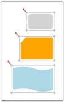' | markdownify }}
{:.image }

_AlignRight command applied to Diagram Objects_

Top Alignment

The AlignTop command aligns all selected objects along the top surface of the reference object.

<table>
<tr>
<td>
[C#]DiagramCommandManager.AlignTop.Execute(diagramView.Page, diagramView);</td></tr>
<tr>
<td>
[VB]DiagramCommandManager.AlignTop.Execute(diagramView.Page, diagramView)</td></tr>
</table>

The following screenshot illustrates how the last two nodes are aligned to the top with respect to the first node.

{{ '' | markdownify }}
{:.image }

_AlignTop command applied to Diagram Objects_

Center Alignment (Vertical Axis)

The AlignMiddle command aligns all selected objects at the center. This command center-aligns selected objects with respect to the vertical axis, i.e., by changing the y-coordinate of the object. 

<table>
<tr>
<td>
[C#]DiagramCommandManager.AlignMiddle.Execute(diagramView.Page, diagramView);</td></tr>
<tr>
<td>
[VB]DiagramCommandManager.AlignMiddle.Execute(diagramView.Page, diagramView)</td></tr>
</table>

The following screenshot illustrates how the last two nodes are aligned to the center with respect to the vertical axis of the first node.

{{ '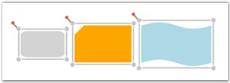' | markdownify }}
{:.image }

_AlignMiddle command applied to Diagram Objects_

Bottom Alignment

The AlignBottom command aligns all selected objects along the bottom surface of the reference object.

<table>
<tr>
<td>
[C#]DiagramCommandManager.AlignBottom.Execute(diagramView.Page, diagramView);</td></tr>
<tr>
<td>
[VB]DiagramCommandManager.AlignBottom.Execute(diagramView.Page, diagramView)</td></tr>
</table>

The following screenshot illustrates how the last two nodes are aligned to the bottom with respect to the first node.

{{ '' | markdownify }}
{:.image }

_AlignBottom command applied to Diagram Objects_

_Note: The connector gets aligned only when the head node and the tail node of the connector is Null._

Alignment commands are useful for ordering the layout of the objects on a page and provide a professional appearance to the diagram.

         1.1.1.5 Spacing Commands

Spacing commands enables you to place selected objects (nodes and connectors) on the page at equal intervals from each other. The objects are spaced within the bounds of the first and last objects in the selection object.

The following spacing commands are used to space objects.

Horizontal Spacing

The SpaceAcross command spaces selected objects with equal horizontal distance between them.

<table>
<tr>
<td>
[C#]DiagramCommandManager.SpaceAcross.Execute(diagramView.Page, diagramView);</td></tr>
<tr>
<td>
[VB]DiagramCommandManager.SpaceAcross.Execute(diagramView.Page, diagramView)</td></tr>
</table>

The following screenshot illustrates horizontally spaced objects.

{{ '' | markdownify }}
{:.image }

_SpaceAcross command applied to Diagram Objects_

Vertical Spacing

The SpaceDown command spaces selected objects with equal vertical distance between them.

<table>
<tr>
<td>
[C#]DiagramCommandManager.SpaceDown.Execute(diagramView.Page, diagramView);</td></tr>
<tr>
<td>
[VB]DiagramCommandManager.SpaceDown.Execute(diagramView.Page, diagramView)</td></tr>
</table>

The following screenshot illustrates vertically spaced objects.

{{ '' | markdownify }}
{:.image }

_SpaceDown command applied to Diagram Objects_

_Note: The connector gets spaced only when the head node and the tail node of the connector is Null._

         1.1.1.6 Delete Command

Diagram WPF provides support to delete nodes and connectors by using the Delete command.

The following steps illustrate how to delete a node or connector.

1. Select the node or the connector to be deleted.
2. Press the DELETE key. The selected node or connector will be deleted.

_Note: When a node is deleted, all the connectors connected to that node are also deleted. Deleting a connector leads to the deletion of that particular connector only._

The following code example illustrates how to invoke the Delete command.

[C#]

DiagramCommandManager.Delete.Execute(diagramView.Page, diagramView);

[VB]

DiagramCommandManager.Delete.Execute(diagramView.Page, diagramView)

         1.1.1.7 Sizing Commands

Sizing commands enable you to resize selected objects (nodes and connectors) on the page. The selected objects get resized with respect to the first object in the selection list.  

The following sizing commands are used to resize objects.

Height Customization

The SameHeight command resizes selected objects to the height of the first object in the selection list.

<table>
<tr>
<td>
[C#]DiagramCommandManager.SameHeight.Execute(diagramView.Page, diagramView);</td></tr>
<tr>
<td>
[VB]DiagramCommandManager.SameHeight.Execute(diagramView.Page, diagramView)</td></tr>
</table>

{{ '' | markdownify }}
{:.image }

_SameHeight command applied to Diagram Objects_ 

_Note: The width of the selected object remains the same._

Width Customization

The SameWidth command resizes selected objects to the width of the first object in the selection list.

<table>
<tr>
<td>
[C#]DiagramCommandManager.SameWidth.Execute(diagramView.Page, diagramView);</td></tr>
<tr>
<td>
[VB]DiagramCommandManager.SameWidth.Execute(diagramView.Page, diagramView)</td></tr>
</table>

{{ '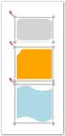' | markdownify }}
{:.image }

_SameWidth command applied to Diagram Objects_

_Note: The height of the selected object remains the same._

Height and Width Customization

The SameSize command resizes selected objects to the height and width of the first object in the selection list.

<table>
<tr>
<td>
[C#]DiagramCommandManager.SameSize.Execute(diagramView.Page, diagramView);</td></tr>
<tr>
<td>
[VB]DiagramCommandManager.SameSize.Execute(diagramView.Page, diagramView)</td></tr>
</table>

{{ '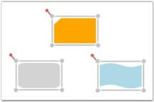' | markdownify }}
{:.image }

_SameSize command applied to Diagram Objects_

_Note: The connector gets spaced only when the head node and the tail node of the connector is Null._

         1.1.1.8 Undo and Redo Command

Undo command reverses the last action performed. For example: Some of the basic operations like translation, rotation, resizing, grouping, ungrouping, changing z-order, addition, deletion etc., which are performed on diagram objects (Nodes and Line Connectors) can be reversed. Redo command undoes the last Undo action. Alternatively these commands can be executed using the keyboard shortcuts; Ctrl +Z for Undo command and Ctrl+Y for Redo command.

Undo Command can be specified in the following way.

<table>
<tr>
<td>
[C#]DiagramCommandManager.Undo.Execute(diagramView.Page, diagramView);</td></tr>
<tr>
<td>
[VB]DiagramCommandManager.Undo.Execute(diagramView.Page, diagramView)</td></tr>
</table>

Redo Command can be specified in the following way.

<table>
<tr>
<td>
[C#]DiagramCommandManager.Redo.Execute(diagramView.Page, diagramView);</td></tr>
<tr>
<td>
[VB]DiagramCommandManager.Redo.Execute(diagramView.Page, diagramView)</td></tr>
</table>

Disable Undo and Redo

Disabling Undo and Redo is helpful when the Diagram control has large number of nodes and line connectors where insertion and deletion are very frequently used. This property can be disabled so that all the references are removed for the stack. This implies that deleted nodes will lose their references and Garbage collected.

_Property Table_

<table>
<tr>
<td>
Property</td><td>
Description </td><td>
Type of the property</td><td>
Value it accepts</td><td>
Any other dependencies/ sub properties associated</td></tr>
<tr>
<td>
UndoRedoEnabled</td><td>
Gets or sets a value indicating whether undo redo is enabled or not.</td><td>
Dependency property</td><td>
Boolean(True/False)</td><td>
No</td></tr>
</table>

The following code example shows how to disable Undo Redo operation.

[XAML]

        <sfdiagram:DiagramControl IsSymbolPaletteEnabled="True" >

            <sfdiagram:DiagramControl.Model>

                <sfdiagram:DiagramModel x:Name="diagramModel" >

                </sfdiagram:DiagramModel>

            </sfdiagram:DiagramControl.Model>

            <sfdiagram:DiagramControl.View >

                <sfdiagram:DiagramView UndoRedoEnabled="False" 

 ShowHorizontalGridLine="True" ShowVerticalGridLine="True">

                </sfdiagram:DiagramView>

            </sfdiagram:DiagramControl.View>

        </sfdiagram:DiagramControl>

[C#]

DiagramView diagramView = new DiagramView();

diagramView.UndoRedoEnabled = false;

[VB]

Dim diagramView As New DiagramView()

diagramView.UndoRedoEnabled = False

Clearing Undo Redo Stack

The following code example illustrates how to clear Undo Redo stack.

[C#]

DiagramView diagramView = new DiagramView();

diagramView.ClearUndoRedoStack();

[VB]

Dim diagramView As New DiagramView()

diagramView.ClearUndoRedoStack()

         1.1.1.9 Printing Enhancements for Diagram Page

This feature enables you to print a copy of the diagram page, with or without using Print Dialog Box. This feature comes with two functionalities:

1. Printing a diagram using Print Dialog and Print Preview, and
2. Printing a diagram without using Print Dialog.

Use Case Scenarios

To print the diagram page, you can use this feature as it enables printing with different functionalities.

Tables for Properties, Methods and Events

Properties

_Properties Table for PrintParameters_

<table>
<tr>
<td>
Property</td><td>
Description</td><td>
Type</td><td>
Value It Accepts</td><td>
Default Values</td><td>
Any other dependencies/ sub properties associated</td></tr>
<tr>
<td>
ShowDialog </td><td>
Gets or sets the Print Dialog to show or not.</td><td>
CLR property </td><td>
Bool (true/false)</td><td>
True </td><td>
No</td></tr>
<tr>
<td>
PrintStretch</td><td>
Gets or sets the page stretch for printing the document.</td><td>
CLR property</td><td>
Stretch.Fill,Stretch.None,Stretch.Uniform,Stretch.UniformToFill</td><td>
-</td><td>
No</td></tr>
</table>

Methods

_Methods Table_

<table>
<tr>
<th>
Method </th><th>
Description </th><th>
Parameters </th><th>
Return Type </th><th>
Reference links </th></tr>
<tr>
<th>
Print</th><th>
Prints the diagram page using Print Dialog Box and Print Preview</th><th>
void</th><th>
void </th><th>
No</th></tr>
<tr>
<th>
Print</th><th>
Prints the diagram page without using Print Dialog Box and Print Preview</th><th>
PrintParameters</th><th>
void </th><th>
No</th></tr>
</table>

Sample Link

To view the sample for this feature:

1. Open the WPF Sample Browser from the Dashboard. 
2. Navigate to Diagram -> Static Diagram ->Export Demo.

Adding Printing Enhancements for Diagram Page to an Application 

This feature enables you to print a copy of diagram though: 

* PrintPeview, 
* Without PrintDialog (though code behind)

Print Preview

Diagram can be printed though PrintPreview using following code snippet:

* Through Code behind. 

[C#]

       DiagramView diagramView = new DiagramView();

diagramView.Print();

[VB]

       Dim diagramView As New DiagramView()

diagramView.Print()

The following custom options can be customized using PrintPreview.

* Print Preview—To view the page before printing
* Different modes—To select printing such as Color, and Black and White
* Stretch—To adjust the fit of the image on the page

{{ '' | markdownify }}
{:.image }

_Print and PrintPreview Dialog Box_

Printing a Diagram without PrintDialog Box

Diagram can be printed without using PrintDialog or PrintPreview, and by sending PrintPreview as an argument for printing as shown blow:

Print without dialog box

[C#]

       DiagramView diagramView = new DiagramView();

PrintParameters p = new PrintParameters();

p.ShowDialog = false;

p.PrintStretch = Stretch.Fill;

diagramView.Print(p);

[VB]

       Dim diagramView As New DiagramView()

      Dim p As New PrintParameters()

      p.ShowDialog = False

      p.PrintStretch = Stretch.Fill

      diagramView.Print(p)

            1.1.1.9.1 Support to Print the Diagram Shapes with Effects

Essential Diagram for WPF provides support to print the diagram shapeswiththeapplied effects. When effects are applied to the nodes, they cannot be printed properly, due to the framework limitation. This feature enables you to overcome this limitation. 

Use Case Scenarios

When you want to print a diagram page, in which you have applied effects for the nodes, you can use this feature to achieve this.

Properties

_Property Table_

<table>
<tr>
<td>
Property </td><td>
Description </td><td>
Type </td><td>
Data Type </td><td>
Reference links </td></tr>
<tr>
<td>
CustomEffect</td><td>
Gets or sets a value of the applied effect of the Node.</td><td>
Dependency property</td><td>
Effect</td><td>
NA</td></tr>
</table>

Printing the Diagram Shapes with Effects

You can print the diagram shapes with the applied effects using the _CustomEffect_ property. The following code illustrates this:

[C#]

DropShadowEffect effect = new DropShadowEffect();

          effect.BlurRadius = 10;

           Node node = new Node();

           node.Shape = Shapes.Ellipse;
           node.CustomEffect = effect;

           diagramModel.Nodes.Add(node);

[VB]

Dim effect As New DropShadowEffect()

effect.BlurRadius = 10

Dim node As New Node()

node.Shape = Shapes.Ellipse

node.CustomEffect = effect

diagramModel.Nodes.Add(node)

{{ '' | markdownify }}
{:.image }

_Printed Nodes with Effects_

         1.1.1.10 Drawing Tools 

This feature enables you to draw different shapes and lines. The drawn shapes and lines will be converted into Node and LineConnector respectively.

The following shapes and lines are available in DrawingTools:

1. Ellipse
2. Rectangle
3. Rounded Rectangle
4. Polygon
5. Straight Line
6. Bezier Line
7. Orthogonal Line
8. Polyline

Use Case Scenarios

DrawingTools such as Microsoft Paint and Expression Blend support drawing a particular shape continually on a page. This feature too, enables you to draw a shape repeatedly without selecting it manually each time.

Properties

_DrawingToolsProperty Table_

<table>
<tr>
<td>
Property </td><td>
Description </td><td>
Type of the Property</td><td>
Value It Accepts</td><td>
Any Other Dependencies/ Sub properties Associated</td></tr>
<tr>
<td>
EnableDrawingTools</td><td>
Gets or sets a value indicating whether   EnableDrawingTools is enabled or not.</td><td>
Dependency property</td><td>
Boolean(True/False)</td><td>
No</td></tr>
<tr>
<td>
DrawingTools</td><td>
Gets or sets the ShapeType to be used. Default value isDrawingTools.Ellipse</td><td>
Dependency property</td><td>
DrawingTools.EllipseDrawingTools.RectangleDrawingTool.RoundedRectangleDrawingTools.PolygonDrawingTools.StraightLineDrawingTools.BezierLineDrawingTools.OrthogonalLineDrawingTools.PolyLine</td><td>
No</td></tr>
</table>

Sample Link

To view a sample:

1. Open the WPF sample browser from the dashboard. 
2. Navigate to WPF Diagram > Product Showcase >Features demo
            1.1.1.10.1 Enable Drawing Tools 

To enable DrawingTools set EnableDrawingTools property to true. Shapes and line connectors are enabled, when the EnableDrawingTools property is enabled. By default, the value is set to false.

 DrawingTools can be enabled using two methods.

* Through XAML.

__The following code illustrates how to enable the DrawingTools.

[XAML]

<syncfusion:DiagramControl Name="diagramControl" 

     <syncfusion:DiagramControl.Model>

         <syncfusion:DiagramModel x:Name="diagramModel">

         </syncfusion:DiagramModel>  

     </syncfusion:DiagramControl.Model> 

    <syncfusion:DiagramControl.View>

       <syncfusion:DiagramView Name="diagramView" EnableDrawingTools="True">

        </syncfusion:DiagramView>

     </syncfusion:DiagramControl.View>

</syncfusion:DiagramControl>

* Through Code behind[C#]

The following code illustrates how to enable the DrawingTools.

[C#]

       DiagramView diagramView = new DiagramView();

       diagramView.EnableDrawingTools = true;

[VB]

       Dim diagramView As New DiagramView()

diagramView.EnableDrawingTools = True

_Note:_

_When the EnableDrawingToolsis set to True, it has to be disabled manually, i.e. it cannot be disabled automatically. This will facilitate drawing shapes or lines continually until EnableDrawingTools is set to false manually._

_ObjectDrawn Event_

The ObjectDrawn event will be raised when the node or line connector is drawn using the EnableConnection/Drawing Tools property of the diagram view. This event is used to identify the source of the drawing object. 

Events

_Events Table_

<table>
<tr>
<td>
Event</td><td>
Description</td><td>
Arguments</td></tr>
<tr>
<td>
ObjectDrawn </td><td>
Raised when the node or line connector will be drawn using the Drawing Tools property.Event cannot be cancelled. </td><td>
Drawing Object--Get the object that is drawn (node or line connector). Drawing Type--Get the type of object. For example, if the drawing object is a node, the drawing type is a Rectangle, RoundedRectangle, Ellipse, etc. If the drawing object is a line connector, the drawing type is an Arc, BezierLine, OrthogonalLine, etc.</td></tr>
</table>

The following code illustrates this feature.

In XAML

[XAML]

  <syncfusion:DiagramControl.View>

                <syncfusion:DiagramView Name="diagramView" ObjectDrawn="diagramView_ObjectDrawn">

                </syncfusion:DiagramView>

</syncfusion:DiagramControl.View>

In C#

[C#]

diagramView.ObjectDrawn += new Syncfusion.Windows.Diagram.DrawingToolEventHandler(diagramView_ObjectDrawn);

//Event handler. 

void diagramView_ObjectDrawn(object sender, Syncfusion.Windows.Diagram.DrawingToolEventArgs evtArgs)

{

   //User-specified code.

            1.1.1.10.2 Drawing Mode

Essential Diagram for WPF provides support for Drawing mode in the diagram view drawing tool. It can be used to draw elements in diagram view by continuously or only once.

Properties

_Property Table_

<table>
<tr>
<td>
Property</td><td>
Description</td><td>
Type of property</td><td>
Value it Accepts</td><td>
Any other dependencies/ sub properties associated</td></tr>
<tr>
<td>
DrawingMode</td><td>
Specifies the drawing mode for the drawing tool. The default value is Default.</td><td>
Dependency property</td><td>
DrawingMode.ContinousDrawingMode.Default</td><td>
No</td></tr>
</table>

This property is in DiagramView and can be set in the following ways:

* Through XAML
* Through code behind

The following code illustrates how to set the DrawingMode as Default:

[XAML]

    <!--Diagram Control-->

    <syncfusion:DiagramControl  Name="diagramControl">

        <!-- Model to add nodes and connections.-->

        <syncfusion:DiagramControl.Model>

            <syncfusion:DiagramModel x:Name="diagramModel">

            </syncfusion:DiagramModel>

        </syncfusion:DiagramControl.Model>

        <!--View to display nodes and connections added through the model.-->

<syncfusion:DiagramControl.View>

   <syncfusion:DiagramView Name="diagramView" DrawingMode="Default">

   </syncfusion:DiagramView>

</syncfusion:DiagramControl.View>

    </syncfusion:DiagramControl>

[C#]

DiagramView diagramView = new DiagramView();

diagramview.ZOrderMode = DrawingMode.Default; 

[VB]

Dim diagramView As New DiagramView()

diagramview.ZOrderMode = DrawingMode.Default;

{{ '' | markdownify }}
{:.image }

_DrawingMode is Default_

The following code illustrates how to set the DrawingMode as Default:

[XAML]

    <!--Diagram Control-->

    <syncfusion:DiagramControl  Name="diagramControl">

        <!-- Model to add nodes and connections.-->

        <syncfusion:DiagramControl.Model>

            <syncfusion:DiagramModel x:Name="diagramModel">

            </syncfusion:DiagramModel>

        </syncfusion:DiagramControl.Model>

        <!--View to display nodes and connections added through the model.-->

<syncfusion:DiagramControl.View>

   <syncfusion:DiagramView Name="diagramView" DrawingMode="Continous">

   </syncfusion:DiagramView>

</syncfusion:DiagramControl.View>

    </syncfusion:DiagramControl>

[C#]

DiagramView diagramView = new DiagramView();

diagramview.ZOrderMode = DrawingMode.Continous;

[VB]

Dim diagramView As New DiagramView()

diagramview.ZOrderMode = DrawingMode.Continous;

{{ '' | markdownify }}
{:.image }

_DrawingMode is Continous_

            1.1.1.10.3 Select a Drawing Tool 

DrawingTools consist of different shapes and line connectors. You can choose one of the DrawingTools at a time. By default, it is set to Ellipse.

The DrawingTool selection in Diagram View can be set in two methods:

* Through XAML.      

The following code illustrates how to select a DrawingTool.

[XAML]

<syncfusion:DiagramControl Name="diagramControl">

       <syncfusion:DiagramControl.Model>

            <syncfusion:DiagramModel x:Name="diagramModel">

            </syncfusion:DiagramModel>

        </syncfusion:DiagramControl.Model>

       <syncfusion:DiagramControl.View>

            <syncfusion:DiagramView Name="diagramView" DrawingTool="Polygon">

                <syncfusion:DiagramView.Page>

                </syncfusion:DiagramView>

            </syncfusion:DiagramControl.View>

        </syncfusion:DiagramControl>

* Through Code behind[C#]

The following code illustrates how to select a DrawingTool. 

[C#]

       DiagramView diagramView = new DiagramView();

       diagramView.DrawingTool = DrawingTools.Rectangle;       

[VB]

       Dim diagramView As New DiagramView()

diagramView.DrawingTool = DrawingTools.Rectangle

            1.1.1.10.4 Steps for Drawing 

 You can draw on a page by click and drag on the page.

 Follow are the below steps to draw a shape or a line: 

* Set the EnableDrawingTools property of DiagramView to true.
* Select the DrawingTool as required from DrawingTools option.
* Click and drag. Preview of the drawing will be displayed.
* Release the mouse. Shape or line will be drawn. 

_Note: These steps are common for all shapes and lines drawing, except Polygon and Polyline._

Shape Drawing

Preview Ellipse – while Drawing 

{{ '' | markdownify }}
{:.image }

_Ellipse Preview_

Ellipse – After Drawing.

{{ '' | markdownify }}
{:.image }

_Ellipse(Node)_

Line Drawing

Bezier Line Preview – While Drawing 

{{ '' | markdownify }}
{:.image }

_Bezier Line Preview_

Bezier Line – After Drawing

{{ '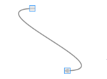' | markdownify }}
{:.image }

_Bezier Line(Line Connector)_

_Note:_

* _The drawn shape will be converted into a Node._
* _The drawn line will be converted into a LineConnector._
* _You can continually draw the selected shape._
* _Lines cannot be drawn continually._ 

Steps for drawing a Polygon and Polyline Drawing:

* Set the EnableDrawingTools property of DiagramView to be true.
* Select the DrawingTool as required from DrawingTools option.
* Click, where you want the first point for polygon (or) polyline.
* Drag the mouse pointer. Preview of the drawing will be displayed. 
* Click, where you want to place the Intermediate points of Polygon (or) Polyline
* Right-click to complete the drawing.

Preview Polygon – While Drawing 

{{ '' | markdownify }}
{:.image }

_Polygon Preview_

Polygon – After Drawing

{{ '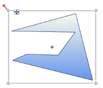' | markdownify }}
{:.image }

_Polygon (Node)_

Sample Link

To view a sample:

1. Open the WPF sample browser from the dashboard. 
2. Navigate to WPF Diagram > Product Showcase >Features demo.
            1.1.1.10.5 Preview Style for Line Connectors

This feature allows you to modify the preview of a line connector by using the CustomPathStyle property of the DiagramView.

Properties

_Preview Style Table_

<table>
<tr>
<td>
Property </td><td>
Description </td><td>
Type </td><td>
Data Type </td></tr>
<tr>
<td>
CustomPathStyle </td><td>
Defines the path or style that has to be applied in the preview of a line connector. </td><td>
Dependency Property</td><td>
Style </td></tr>
</table>
_Adding Options for Dashed Line Connector to an Application_

Defining the Preview Style

The preview style for line connectors can be defined either through XAML or code behind.

To define a preview style, see the following code. This code sample is for setting the preview of the line connector as dashed.

[XAML]

Applying the Preview Style

To apply the preview style to a line connector, it has to be assigned to the CustomPathStyle property of DiagramView.

[C#]

DiagramView View1 = new DiagramView();

View1.CustomPathStyle = this.Resources["MyStyle"] as Style;

[VB]

Dim view1 As New DiagramView()

View1.CustomPathStyle = this.Resources["MyStyle"] as Style

The CustomPathStyle property of DiagramView applies the style that is assigned to the preview of the drawing objects.

{{ '' | markdownify }}
{:.image }

_Preview of Dashed Orthogonal Line Connector_

         1.1.1.11 Export Diagram 

Essential Diagram for WPF can be exported to the following File formats:

* Exporting into Image File Format
* Bitmap(.bmp)
* JPEG
* PNG
* GIF
* TIFF
* WDP
* Exporting into XPS Format
* Export to Clipboard

The Diagram can be exported using following overloaded methods:

* Stream
* Stream
* Stream with BitmapEncoder
* Stream with Rect
* Stream with Rect and BitmapEncoder
* FileName
* FileName
* FileName with BitmapEncoder
* FileName with Rect
* FileName with Rect and BitmapEncoder
* XPS
* Stream 
* Stream with Rect
* FileName
* FileName with Rect

The following code illustrates how to export the Page as an image file.

            1.1.1.11.1 Stream

Page can be exported into any streams such as FileStream and MemoryStream.

[C#]

System.IO.FileStream filestream = new System.IO.FileStream("Diagram.jpeg",System.IO.FileMode.Create);

diagramview.Save(filestream);

Stream with Rect and Encoder

You can also save to a stream with type of encoder and rectangle portion to be clipped.

[C#

System.IO.FileStream filestream = new System.IO.FileStream("Diagram.jpeg",System.IO.FileMode.Create);

TiffBitmapEncoder encoder = new TiffBitmapEncoder();

Rect rect = new Rect(new Point(100, 100), new Point(300, 300));

diagramview.Save(filestream, rect, encoder);

            1.1.1.11.2 Filename

Filename with Path

You can also export Page as an image file with directory path and file name. 

[C#]

diagramview.Save(@"D:\ Diagram.jpeg");

Filename with Rect and Encoder

You can also specify the name of the file directly, specified portions of the DiagramPage, type of encoder such as TiffBitmapEncoder and GifBitmapEncoder.

[C#

TiffBitmapEncoder encoder = new TiffBitmapEncoder();

 Rect rect = new Rect(new Point(100, 100), new Point(300, 300));

 string filename = " Diagram.jpeg";

diagramview.Save(filename, rect, encoder);

            1.1.1.11.3  XPS

The DiagramPage can be exported in different ways:

* Stream
* Filename with Path
* Filename with Rect
* Stream with Rect

Stream

You can also save to a stream.

The following code illustrates how to save the Page.

[C#]

System.IO.FileStream filestream = new System.IO.FileStream("Diagram.xps", System.IO.FileMode.Create);

diagramview.SaveToXps(filestream);

Stream with Rect

You can also save to a stream with specified size of the save area.

[C#]

System.IO.FileStream filestream = new System.IO.FileStream("(@"D:\Diagram.xps",System.IO.FileMode.Create);

Rect rect = new Rect(new Point(200,200),new Point(500,500));

diagramview.SaveToXps(filestream,rect);

Filename with Path

You can also specify the name of the file directly in the save method.

[C#

diagramview.SaveToXps(@"D:\Diagram.xps", rect);

Filename with Rect

You can also specify the name of the file directly; Specified size of the save area.in the save method.

[C#

Rect rect = new Rect(new Point(100, 100), new Point(500, 500));

            diagramview.SaveToXps(@"D:\Diagram.xps", rect);

            1.1.1.11.4  Shrink and Expand Options

While exporting a diagram as an image, the exported image size can be shrunk or expanded to a specific size. An aspect ratio of 1:1 will always be maintained while exporting. If the diagram size and the proposed size are in different ratios, the size of the image will be decided internally based on the ImageStretch property.

Parameters

_Shrink and Expand Table_

<table>
<tr>
<td>
Parameter</td><td>
Description</td><td>
Type of Property</td><td>
Value It Accepts </td><td>
Other Dependencies/ Subproperties Associated</td></tr>
<tr>
<td>
filename</td><td>
Target file name where the image will be saved (e.g., @"E:\Fig3.jpg") </td><td>
CLR property</td><td>
String</td><td>
None</td></tr>
<tr>
<td>
imagesize</td><td>
Target image size. This property can be set to fit or expand the diagram to the specified size (e.g.: new Size(500, 500)).</td><td>
CLR property</td><td>
Size</td><td>
None</td></tr>
<tr>
<td>
ImageStretch</td><td>
Decides whether the target image will be the same size as the diagram, expanded to a specified size, or shrunk to a specified size.</td><td>
CLR property</td><td>
EnumImageStretch.NoneImageStretch.BestFitImageStretch.ExpandImageStretch.Shrink</td><td>
None</td></tr>
</table>
The following table lists the four options available for the ImageStretch property and their descriptions.

_Options in ImageStretch_

<table>
<tr>
<td>
Option</td><td>
Description</td></tr>
<tr>
<td>
None</td><td>
Target image will be the same size as the actual diagram.</td></tr>
<tr>
<td>
Expand</td><td>
Expands a small diagram to the specified size while exporting. </td></tr>
<tr>
<td>
Shrink</td><td>
Shrinks a huge diagram to the specified size while exporting. </td></tr>
<tr>
<td>
BestFit</td><td>
(Expand | Shrink). Decides whether the diagram should be expanded or shrunk and will export it as an image.</td></tr>
</table>

The following code sample demonstrates how to use the imagesize and ImageStretch options.

[C#]

DiagramView diagramView = new DiagramView(); 

diagramView.Save(@"E:\Fig3.jpg", new Size(500, 500), ImageStretch.Shrink);

_Note: By default, when exporting a diagram that is huge in size (for example, 30,000 × 2,000), an ‘Out of memory’ exception is raised. By shrinking the diagram to a smaller size, the memory occupied will be less, so the exception will not be raised._

         1.1.1.12 Export to Clipboard

Content of the Page can be copied onto the clipboard as an image, and can be pasted into applications such as Paint and Microsoft Word.

The following Code illustrates how to export the Page content into clipboard.

[C#]

diagramview.CopyToClipboard();

SizeToContent

SizeToContent support enables you to resize the diagram page depending upon the content size. This option can also be disabled. You can also define the size of diagram page and restrict the diagram element from moving out of a specified area. 

Properties 

_SizeToContent Table_

<table>
<tr>
<td>
Name</td><td>
Description</td><td>
Type</td><td>
Data Type</td><td>
Reference Links</td></tr>
<tr>
<td>
SizeToContent</td><td>
Specifies whether SizeToContent behavior is enabled or disabled. </td><td>
Dependency Property</td><td>
Bool</td><td>
NA</td></tr>
<tr>
<td>
BoundaryConstraintsArea</td><td>
Defines the diagram page area.</td><td>
Dependency Property</td><td>
Rect</td><td>
NA</td></tr>
<tr>
<td>
BoundaryConstarintsEnabled</td><td>
Restricts the diagram element moving out of a specified area. </td><td>
Dependency Property</td><td>
Bool</td><td>
NA</td></tr>
<tr>
<td>
PageBackgroundEffect</td><td>
Sets the page background effect. </td><td>
Dependency Property</td><td>
Effect</td><td>
NA</td></tr>
<tr>
<td>
OffPageBackground</td><td>
Sets the background brush for area outside Diagram Page.</td><td>
Dependency Property</td><td>
Brush</td><td>
NA</td></tr>
</table>
 Enabling SizeToContent

To enable SizeToContent support, set the SizeToContent property of DiagramView to true. To disable, set this to false. Default value is true. 

Following code illustrates how to enable SizeToContent support:

[XAML]

   <syncfusion:DiagramControl  Name="diagramControl" IsSymbolPaletteEnabled="True">

            <syncfusion:DiagramControl.Model>

                <syncfusion:DiagramModel x:Name="diagramModel"></syncfusion:DiagramModel>

            </syncfusion:DiagramControl.Model>

            <syncfusion:DiagramControl.View>

                <syncfusion:DiagramView SizeToContent="True"  Name="diagramView"/>

            </syncfusion:DiagramControl.View>

        </syncfusion:DiagramControl>

[C#]

    DiagramView diagramView = new DiagramView();

diagramView.SizeToContent = true;

[VB]

Dim diagramView As New DiagramView()

diagramView.SizeToContent = True

            1.1.1.12.1 Defining Diagram Page

You can define the Diagram Page area. Use the BoundaryConstraintsArea__property of DiagramView to define Diagram Page area. 

Following code illustrates how to define Diagram Page area:

[XAML]

   <syncfusion:DiagramControl  Name="diagramControl" IsSymbolPaletteEnabled="True">

            <syncfusion:DiagramControl.Model>

                <syncfusion:DiagramModel x:Name="diagramModel"></syncfusion:DiagramModel>

            </syncfusion:DiagramControl.Model>

            <syncfusion:DiagramControl.View>

                <syncfusion:DiagramView BoundaryConstraintsArea="100,100,850,1195" Name="diagramView"/>

            </syncfusion:DiagramControl.View>

        </syncfusion:DiagramControl>

[C#]

DiagramView diagramView = new DiagramView();

            diagramView.BoundaryConstraintsArea = new Rect(100, 100, 850, 1195);

[VB]

Dim diagramView As New DiagramView()

diagramView.BoundaryConstraintsArea = New Rect(100, 100, 850, 1195)

            1.1.1.12.2 Restricting the Diagram Element

You can restrict the diagram element moving out of a specified area. Use the BoundaryConstraintsEnabled property of DiagramView for this purpose.   

Following code illustrates how to restrict diagram element moving out of specific area:

[XAML]   

 <syncfusion:DiagramControl  Name="diagramControl" IsSymbolPaletteEnabled="True">

            <syncfusion:DiagramControl.Model>

                <syncfusion:DiagramModel x:Name="diagramModel"></syncfusion:DiagramModel>

            </syncfusion:DiagramControl.Model>

            <syncfusion:DiagramControl.View>

                <syncfusion:DiagramView BoundaryConstraintsEnabled="True" Name="diagramView"/>

            </syncfusion:DiagramControl.View>

        </syncfusion:DiagramControl>

[C#]

DiagramView diagramView = new DiagramView();

diagramView.BoundaryConstraintsEnabled = true;

[VB]

Dim diagramView As New DiagramView()

diagramView.BoundaryConstraintsEnabled = True

            1.1.1.12.3 Customizing options

Following properties enables to customize the appearance of the diagram page:

* PageBackground specifies the background of the diagram page.
* OffPageBackground specifies the off page background.
* PageEffect specifies the background effect of the diagram page.

_Customizing Background_ 

To customize the background, use the PageBackground__of DiagramView. Default value is White.

Following code illustrated how to customize the background:

[XAML]

    <syncfusion:DiagramControl  Name="diagramControl" IsSymbolPaletteEnabled="True">

            <syncfusion:DiagramControl.Model>

                <syncfusion:DiagramModel x:Name="diagramModel"></syncfusion:DiagramModel>

            </syncfusion:DiagramControl.Model>

            <syncfusion:DiagramControl.View>

                <syncfusion:DiagramView OffPageBackground="White" PageBackground="White" Name="diagramView"/>

            </syncfusion:DiagramControl.View>

        </syncfusion:DiagramControl>

[C#]

  DiagramView diagramView = new DiagramView();

            diagramView.PageBackground = new SolidColorBrush(Colors.Gray);

[VB]

Dim diagramView As New DiagramView()

diagramView.PageBackground = New SolidColorBrush(Colors.Gray)

_Customizing the Off Page’s Background_  

To customize the background of the Off Page, use the OffPageBackground__property of DiagramView. Default value is White. 

Following code illustrates how to customize the background of the Off Page:

[XAML]

   <syncfusion:DiagramControl  Name="diagramControl" IsSymbolPaletteEnabled="True">

            <syncfusion:DiagramControl.Model>

                <syncfusion:DiagramModel x:Name="diagramModel"></syncfusion:DiagramModel>

            </syncfusion:DiagramControl.Model>

            <syncfusion:DiagramControl.View>

                <syncfusion:DiagramView OffPageBackground="White" PageBackground="White" Name="diagramView"/>

            </syncfusion:DiagramControl.View>

        </syncfusion:DiagramControl>

[C#]

       DiagramView diagramView = new DiagramView();

            diagramView.OffPageBackground = new SolidColorBrush(Colors.White);

[VB]

Dim diagramView As New DiagramView()

diagramView.OffPageBackground = New SolidColorBrush(Colors.White)

_Customizing page effect_

To customize the page effect, use the PageEffect__property of DiagramView. 

Following code illustrates how to customize the page effect:

[XAML]

   <syncfusion:DiagramControl  Name="diagramControl" IsSymbolPaletteEnabled="True">

            <syncfusion:DiagramControl.Model>

                <syncfusion:DiagramModel x:Name="diagramModel"></syncfusion:DiagramModel>

            </syncfusion:DiagramControl.Model>

            <syncfusion:DiagramControl.View>

                <syncfusion:DiagramView OffPageBackground="White" PageBackground="White" Name="diagramView">

                    <syncfusion:DiagramView.BackgroundEffect>

                        <DropShadowEffect BlurRadius="12" Color="Black" Direction="-350" ShadowDepth="30"/>

                    </syncfusion:DiagramView.BackgroundEffect>

                </syncfusion:DiagramView>

            </syncfusion:DiagramControl.View>

        </syncfusion:DiagramControl>

[C#]

            DropShadowEffect drop = new DropShadowEffect();

            drop.BlurRadius = 25;

            drop.Color = new Color { B = 205, G = 148, R = 79 };

            drop.Direction = 450;

            drop.ShadowDepth = -2;

            diagramView.BackgroundEffect = drop;

[VB]

Dim drop As New DropShadowEffect()

drop.BlurRadius = 25

drop.Color = New Color With {.B = 205, .G = 148, .R = 79}

drop.Direction = 450

drop.ShadowDepth = -2

diagramView.BackgroundEffect = drop

{{ '' | markdownify }}
{:.image }

_Customized Diagram Page_

         1.1.1.13 Touch Support

Touch support for diagram view has the following features:

* Drag and Drop from the SymbolPalette
* Dragging the Node and LineConnector on DiagramView
* Panning
* Multiple selection

Steps for Dragging

Dragging operation can be performed by 

1. Touch a particular element in the touch screen monitor.
2. Start dragging the element to the desired location.
3. Take the finger off from the screen after it is reached to the desired location.

This dragging gesture is used to perform the following operation. 

Drag and Drop from the SymbolPalette

4. Touch the SymbolPaletteItem for Drag and Drop.
5. Drag the SymbolPaletteItem and Drop onto DiagramView by touching the finger in DiagramView.

Dragging the Node and LineConnector on DiagramView

6. Touch the Node or Lineconnector for Dragging.
7. The selected item can be moved around using your finger.

Panning

1. Please enable the IsPanEnabled property of the DiagramView.
2. Drag the finger over DiagramView, the DiagramView gets panned along the finger.

Multiple selections

1. Touch the empty space of the DiagramView.
2. Drag the finger in DiagramView, the Selection Adorner will be visible.
3. Objects which are getting intersected while dragging will get selected.

{{ '' | markdownify }}
{:.image }

_Drag_

MultiTouch Support

MultiTouch support has been provided to enable zoom the page and resizing a Node.

Steps for Spreading and Pinching

1. Use two fingers to touch the monitor.
2. Move the fingers away to perform spread operation.
3. Move the fingers close to each other to perform pinch operation.
4. Take the fingers off from the screen after the required size is achieved.

This spread and pinch gesture is used to perform, zooming and resizing operation.

* Zooming the DiagramView with two fingers can be done
* Resizing the Node with two fingers can be done

{{ '' | markdownify }}
{:.image }

_Spread_

{{ '' | markdownify }}
{:.image }

_Pinch_

Steps for Zooming

1. Touch the DiagramView with two fingers.
2. Pinch represents the ZoomOut.
3. Spread represents the ZoomIn.

Steps for Resizing

1. Touch the Node for resizing with two Fingers.
2. Pinch Represents - Increase the size of the Node.
3. Spread Represents - Decrease the size of the Node.
         1.1.1.14 Overview Control

The Overview control enables you to focus on a particular area of the entire diagram page. The Overview control displays a preview of the entire diagram page with a ZoomPan window. The ZoomPan window is a resizable red rectangle which allows you to focus on the desired area.

For more details about the Overview control refer to the user guide of Essential Tools for WPF>Tools WPF Controls>Overview 

Use Case Scenarios

This control helps you view huge content hosted within a scroll viewer.

Sample Link

WPF > Diagram > Performance Samples > Overview Demo

Using Overview Control in Diagram Control

Follow the steps below to use the Overview control for DiagramControl:

4. Create an instance of DiagramControl.

[XAML]

<!-- Diagram Control -->

        <syncfusion:DiagramControl Name="diagramControl" IsSymbolPaletteEnabled="True">

            <syncfusion:DiagramControl.Model>

                <syncfusion:DiagramModel x:Name="diagramModel"/>

            </syncfusion:DiagramControl.Model>

            <syncfusion:DiagramControl.View>

                <syncfusion:DiagramView Name="diagramView"/>

            </syncfusion:DiagramControl.View>

        </syncfusion:DiagramControl>

5. Create an instance of Overview and set the OverviewSourceAncestor property to DiagramControl.

[XAML]

<!-- Overview Control -->

        <shared:Overview Grid.Column="1" OverviewSourceAncestor="{Binding ElementName=diagramView}"/>

    </Grid>

{{ '' | markdownify }}
{:.image }

_Overview Control in a Diagram_

         1.1.1.15 BringIntoCenter

The bring-into-center feature provides the option to bring the element or Rect area into center of the viewport.

This is can be used to clearly view the particular element and its neighbor elements in the center of the viewport.

Methods

_BringIntoCentre Table_

<table>
<tr>
<th>
Method</th><th>
Description</th><th>
Parameters</th><th>
Type</th><th>
Return Type</th></tr>
<tr>
<th>
BringIntoCenter</th><th>
Used to bring the element into the center of the page. </th><th>
BringIntoCenter(Object pageElement)This method only accepts Node, LineConnector, or Rect type objects.</th><th>
WPF</th><th>
Void</th></tr>
</table>
            1.1.1.15.1 Adding BringIntoCenter to an Application 

[C#]

DiagramView diagramView=new DiagramView();

//Call the Bring IntoCenter method to bring the “node” object into center of the viewport.

diagramView.BringIntoCenter(node);

[VB]

Dim diagramView As New DiagramView()

'Call the Bring IntoCenter method to bring the “node” object into center of the viewport.

diagramView.BringIntoCenter(node)

The BringIntoCenter method of the DiagramView class is used to bring the object into center of the viewport. This method will accept only parameters of type Node, LineConnector, or Rect.

            1.1.1.15.2 Bring Into Viewport

The Bring Into ViewPort feature provides option to bring the element or Rect area into the Viewport.

This feature can be applied to the Nodes and Connectors.

_Methods Table_

<table>
<tr>
<th>
Method</th><th>
Description</th><th>
Parameters</th><th>
Return Type</th></tr>
<tr>
<th>
BringIntoViewPort</th><th>
brings the element into the Viewport of the page.</th><th>
Bring Into ViewPort(Object pageElement)This method accepts the Node and LineConnector type objects.</th><th>
Void</th></tr>
</table>
_Adding BringIntoViewPort to an Application_

The BringIntoViewPort method of the DiagramView class is used to bring the object into the Viewport. This method accepts only the parameters of type Node, LineConnector, or Rect.

[C#]

DiagramView diagramview = new DiagramView();

//Calls the BringIntoViewPort method to bring the “node” object to viewport of the diagrampage.

diagramview.BringIntoViewPort(node);

[VB]

Dim diagramview As New DiagramView()

//Calls the BringIntoViewPort method to bring the “node” object to viewport of the diagrampage.

diagramview.BringIntoViewPort(node)

         1.1.1.16 Item Selection Mode

Essential Diagram for WPF provides support for the Item selection mode for diagram view elements. This determines whether the user can select single or multiple elements at a time.

Properties

_Property Table_

<table>
<tr>
<td>
Property</td><td>
Description</td><td>
Type of property</td><td>
Value it Accepts</td><td>
Any other dependencies/ sub properties associated</td></tr>
<tr>
<td>
ItemSelectionMode</td><td>
Specifies the item selection mode for diagram view elements. The default value is Multiple.</td><td>
Dependency property</td><td>
ItemSelectionMode.SingleItemSelectionMode.Multiple</td><td>
No</td></tr>
</table>

This property is available in DiagramView and can be set in the following ways:

* Through XAML
* Through code behind

The following code illustrates how to set the ItemSelectionMode as Single:

[XAML]

    <!--Diagram Control-->

    <syncfusion:DiagramControl Name="diagramControl">

        <!-- Model to add nodes and connections.-->

        <syncfusion:DiagramControl.Model>

            <syncfusion:DiagramModel x:Name="diagramModel">

            </syncfusion:DiagramModel>

        </syncfusion:DiagramControl.Model>

        <!--View to display nodes and connections added through the model.-->

<syncfusion:DiagramControl.View>

   <syncfusion:DiagramView Name="diagramView" ItemSelectionMode="Single">

   </syncfusion:DiagramView>

</syncfusion:DiagramControl.View>

    </syncfusion:DiagramControl>

[C#]

DiagramView diagramView = new DiagramView();

diagramview.ItemSelectionMode = ItemSelectionMode.Single;

[VB]

Dim diagramView As New DiagramView()

diagramview.ItemSelectionMode = ItemSelectionMode.Single;

{{ '' | markdownify }}
{:.image }

_ItemSelectionMode is Single_

The following code illustrates how to set the ItemSelectionMode as Multiple:

[XAML]

    <!--Diagram Control-->

    <syncfusion:DiagramControl Name="diagramControl">

        <!-- Model to add nodes and connections.-->

        <syncfusion:DiagramControl.Model>

            <syncfusion:DiagramModel x:Name="diagramModel">

            </syncfusion:DiagramModel>

        </syncfusion:DiagramControl.Model>

        <!—View to display nodes and connections added through the model.-->

<syncfusion:DiagramControl.View>

   <syncfusion:DiagramView Name="diagramView" ItemSelectionMode="Multiple">

   </syncfusion:DiagramView>

</syncfusion:DiagramControl.View>

    </syncfusion:DiagramControl>

[C#]

DiagramView diagramView = new DiagramView();

diagramview.ItemSelectionMode = ItemSelectionMode.Multiple;

[VB]

Dim diagramView As New DiagramView()

diagramview.ItemSelectionMode = ItemSelectionMode.Multiple;

{{ '' | markdownify }}
{:.image }

_ItemSelectionMode is Multiple_

      1.1.2 Context View

A context view is a small view of an entire diagram with a new arrangement, where the small view and the arrangement are based on a particular view of the selected node. It provides three views:

* Successors view—shows all child nodes of the selected node.
* Predecessors view—displays all parent nodes of the selected node.
* Neighborhood view—displays the immediate child and parent nodes of the selected node.
         1.1.2.1 Tables for Properties and Methods

Properties

_Properties Table_

<table>
<tr>
<td>
Property </td><td>
Description </td><td>
Type </td><td>
Data Type </td></tr>
<tr>
<td>
ContextViewMode</td><td>
This property is used to get or set the context view mode of the context view manager.</td><td>
Dependency property</td><td>
ContextViewMode </td></tr>
<tr>
<td>
Layout </td><td>
This property is used to manage layout information of the context view manager.</td><td>
CLR property</td><td>
ILayout</td></tr>
<tr>
<td>
SourceControl</td><td>
This property is used to get a Diagram control to be a source of the context view manager.</td><td>
CLR property</td><td>
DiagramControl</td></tr>
<tr>
<td>
TargetControl</td><td>
This property is used to get a Diagram control to be a target of the context view manager.</td><td>
CLR property</td><td>
DiagramControl</td></tr>
</table>

Methods

_Methods Table_

<table>
<tr>
<th>
Method </th><th>
Description </th><th>
Parameters </th><th>
Type </th></tr>
<tr>
<th>
public ContextViewManager(DiagramControl source, DiagramControl target)</th><th>
Constructor of the context view manager.</th><th>
source—a Diagram control in which selection changes will be monitored.target—a Diagram control to which a new diagram will be created based on the selected node and the context view chosen.</th><th>
In WPF </th></tr>
<tr>
<th>
RefreshLayout</th><th>
This method is used to update the layout. It will be called automatically and can also be forced to be updated.</th><th>
NA</th><th>
In WPF</th></tr>
</table>
         1.1.2.2 Adding ContextViewManager to an Application

ContextViewManager is a class that helps to communicate between a source diagram and a target diagram.

* Source—it is a Diagram control in which selection changes will be monitored.
* Target—it is a Diagram control to which a new diagram will be created based on the selected node and the context view chosen.  

Steps to create ContextViewManager

1. Create a Diagram control to be used as a target to show the context view of another Diagram control.

[XAML]

<syncfusion:DiagramControl  Height="235" Width="250"  Name="targetDiagramControl">

<syncfusion:DiagramControl.Model>

<syncfusion:DiagramModel x:Name="targetDiagramModel"/>

</syncfusion:DiagramControl.Model>

<syncfusion:DiagramControl.View>

<syncfusion:DiagramView EnableFitToPage="True" Name="targetDiagramView"/>

</syncfusion:DiagramControl.View>

</syncfusion:DiagramControl>

2. Create another Diagram control to be used as a source.
3. Create a ContextViewManager instance to synchronize the source and target diagrams.

[C#]

// Create ContextViewManager to attach the source and target diagrams.

ContextViewManager ContextView = new ContextViewManager(source, target);

//Set ContextViewMode as Predecessors.

       ContextView.ContextViewMode =ContextViewMode.Predecessors;

// Create a layout for ContextView.

DirectedTreeLayout layout = new DirectedTreeLayout(diagramModel,diagramView);

diagramModel.HorizontalSpacing = 10;

diagramModel.VerticalSpacing = 80;

diagramModel.SpaceBetweenSubTrees = 10;

// Set the layout of the ContextView.

ContextView.Layout = layout;

[VB]

' Create ContextViewManager to attach source and target diagrams.

Dim ContextView As New ContextViewManager(source, target)

'Set ContextViewMode as Predecessors.

ContextView.ContextViewMode =ContextViewMode.Predecessors

' Create a layout for ContextView.

Dim layout As New DirectedTreeLayout(diagramModel,diagramView)

diagramModel.HorizontalSpacing = 10

diagramModel.VerticalSpacing = 80

diagramModel.SpaceBetweenSubTrees = 10

' Set the layout of the ContextView.

ContextView.Layout = layout

      1.1.3 Creating Different Views in the ContextViewManager

ContextViewManager can be used to choose any one of the three different views. The nodes and connection will be created based on the view chosen.

1. Predecessors View: The predecessors view is used to display all hierarchical parent nodes of the selected node in a layout manner. 
2. Successors View: The successor view displays all the hierarchical child nodes of the selected node.
3. Neighborhood View: This view will be used to show immediate child and parent nodes of the selected node.

The following code example explains how to choose the predecessors view

[VB]

‘Create ContextViewManager to attach source and target diagrams.

Dim ContextView As New ContextViewManager(source, target)

'Set ContextViewMode as Predecessors.

ContextView.ContextViewMode =ContextViewMode.Predecessors

{{ '' | markdownify }}
{:.image }

_Context View_

_Note: By default, the context view manager will show the neighborhood view._

      1.1.4 SymbolPalette

The SymbolPalette control displays node shapes and allows you to drag and drop symbols onto diagrams. It supports grouping and filtering symbols. It allows you to classify items as groups so they can be navigated easily. Also, custom shapes can be added to the SymbolPalette.

Methods for SymbolGroups in SymbolPalette

_Methods Table_

<table>
<tr>
<td>
Name</td><td>
Parameters</td><td>
Return Type</td><td>
Description</td><td>
Reference Links</td></tr>
<tr>
<td>
Add(SymbolPaletteGroup)</td><td>
SymbolPaletteGroup</td><td>
Void</td><td>
Adds the SymbolPaletteGroup to the SymbolPalette.</td><td>
Symbol Groups</td></tr>
<tr>
<td>
Remove(SymbolPaletteGroup)</td><td>
SymbolPaletteGroup</td><td>
Void</td><td>
Removes the SymbolPaletteGroup from SymbolPalette.</td><td>
Symbol Groups</td></tr>
<tr>
<td>
RemoveAt(int)</td><td>
Int</td><td>
Void</td><td>
Removes the SymbolPaletteGroup from SymbolPalette at the given index.</td><td>
Symbol Groups</td></tr>
<tr>
<td>
Clear()</td><td>
Null</td><td>
Void</td><td>
Clears all the SymbolPaletteGroups from the SymbolPalette.</td><td>
Symbol Groups</td></tr>
</table>

Methods for SymbolFilters in SymbolPalette

_Methods Table_

<table>
<tr>
<td>
Name</td><td>
Parameters</td><td>
Return Type</td><td>
Description</td><td>
Reference Links</td></tr>
<tr>
<td>
Add(SymbolPaletteFilter)</td><td>
SymbolPaletteFilter</td><td>
Void</td><td>
Adds the SymbolPaletteFilter to the SymbolPalette.</td><td>
Symbol Filters</td></tr>
<tr>
<td>
Remove(SymbolPaletteFilter)</td><td>
SymbolPaletteFilter </td><td>
Void</td><td>
Removes the SymbolPaletteFilter from SymbolPalette.</td><td>
Symbol Filters</td></tr>
<tr>
<td>
RemoveAt(int)</td><td>
Int</td><td>
Void</td><td>
Removes the SymbolPaletteFilter from SymbolPalette at the given index.</td><td>
Symbol Filters_Symbol_Groups</td></tr>
<tr>
<td>
Clear()</td><td>
Null</td><td>
Void</td><td>
Clears all the SymbolPaletteFilter from the SymbolPalette.</td><td>
Symbol Filters</td></tr>
</table>
         1.1.4.1 Enable/Disable SymbolPalette

The SymbolPalette can be displayed by setting the IsSymbolPaletteEnabled property to True. By default, this property is disabled.

The following code can be used to enable the SymbolPalette.

[XAML]

<Window x:Class="WpfApplication1.Window1" xmlns="http://schemas.microsoft.com/winfx/2006/xaml/presentation"

xmlns:x="http://schemas.microsoft.com/winfx/2006/xaml" Title="EssentialDiagramWPF" Height="400" Width="600"

xmlns:sfdiagram="clr-namespace:Syncfusion.Windows.Diagram;assembly=Syncfusion.Diagram.WPF" xmlns:local="clr-namespace:WpfApplication1">

    <Grid Name="diagramgrid">

        <sfdiagram:DiagramControl IsSymbolPaletteEnabled="True">

        </sfdiagram:DiagramControl>

    </Grid>

</Window>

[C#]

DiagramControl diagramcontrol = new DiagramControl();

diagramcontrol.IsSymbolPaletteEnabled = true;

[VB]

Dim diagramcontrol As New DiagramControl()

diagramcontrol.IsSymbolPaletteEnabled = True

{{ '' | markdownify }}
{:.image }

_SymbolPalette_

         1.1.4.2 Preview for Symbol Palette Item

Essential Diagram for WPF provides preview support for Symbol Palette. When you drag an item from Symbol Palette to Diagram View, Preview of the dragged item will be displayed. You can enable or disable the preview support. You can also customize the preview.  

Use Case Scenario

This feature displays a preview of the item you drag from Symbol Palette, thus enables you to identify the item you are dragging from the symbol palette to Diagram view.

Properties

_Property Table_

<table>
<tr>
<td>
Property </td><td>
Description </td><td>
Type </td><td>
Data Type </td><td>
Reference links </td></tr>
<tr>
<td>
ShowPreview</td><td>
Gets or sets a value indicating whether preview is enabled.The default value is true.</td><td>
Dependency property</td><td>
Boolean </td><td>
NA</td></tr>
<tr>
<td>
PreviewBrush</td><td>
Gets or sets a value for preview content.</td><td>
Dependency property</td><td>
Brush</td><td>
NA</td></tr>
</table>

Enabling Preview Support

To enable preview for the dragged item from Symbol Palette, set the ShowPreview property of SymbolPalette to true. To disable preview set this to false. By default this is set to true.  

Following code example illustrates how to enable preview support:  

[C#]

      DiagramControl diagramControl1 = new DiagramControl();

diagramControl1.SymbolPalette.ShowPreview = true;

[VB]

       Dim diagramControl1 As New DiagramControl()

      diagramControl1.SymbolPalette.ShowPreview = true

{{ '' | markdownify }}
{:.image }

_Preview of Dragged Item_

Change the preview content using PreviewBrush

You can customize the preview content using the PreviewBrush property of SymbolPaletteItem. Following code example illustrates how to customize preview content: 

[C#]

       DiagramControl diagramControl1 = new DiagramControl();

      (diagramControl1.SymbolPalette.SymbolGroups[0].Items[0] as    SymbolPaletteItem).PreviewBrush = Brushes.CornflowerBlue;

[VB]

       Dim diagramControl1 As New DiagramControl()

TryCast(diagramControl1.SymbolPalette.SymbolGroups(0).Items(0),  SymbolPaletteItem).PreviewBrush = Brushes.CornflowerBlue

{{ '' | markdownify }}
{:.image }

_Customized Preview Content_

         1.1.4.3 Symbol Filters

A SymbolPalette filter can be added to the SymbolPalette control, using the SymbolFilters property, so that only desired SymbolPalette groups get displayed. The SetFilterIndexes property is used to specify the index value of the filters for which the group is to be displayed. The filter names are specified integer values, with the first filter index starting from 0. Based on the filter indexes specified for that particular group, the visibility of the group is controlled. So the group gets displayed only when any of the specified filter names are selected.

The following lines of code can be used to specify the SymbolPalette filter of the SymbolPalette Group.

[C#]

SymbolPaletteFilter sfilter = new SymbolPaletteFilter();

sfilter.Label = "Custom";

dc.SymbolPalette.SymbolFilters.Add(sfilter);

SymbolPaletteGroup group = new SymbolPaletteGroup();

group.Label = "Custom";

SymbolPalette.SetFilterIndexes(group, new Int32Collection(new int[] { 0, 6 }));

dc.SymbolPalette.SymbolGroups.Add(s);

[VB]

Dim sfilter As New SymbolPaletteFilter()

sfilter.Label = "Custom"

dc.SymbolPalette.SymbolFilters.Add(sfilter)

Dim group As New SymbolPaletteGroup()

group.Label = "Custom"

SymbolPalette.SetFilterIndexes(group, New Int32Collection(New Integer() { 0, 6 }))

dc.SymbolPalette.SymbolGroups.Add(s)

This adds a new empty group named "Custom" and creates a filter for it.

{{ '' | markdownify }}
{:.image }

_SymbolPalette Filter_

The SetFilterIndexes property specifies the index value for the group as 0,4 which implies that this group should be displayed when the filter index is 0 ("All") or 4 ("Custom").

Remove SymbolPaletteFilters

Like SymbolPaletteGroups, the SymbolPaletteFilters are also indexed from 0. The index 0 refers to the filter All. The index 1 refers to the filter Shapes and so on. The following table lists the filters with their index numbers.

_File Extention_

<table>
<tr>
<td>
Filter name</td><td>
Index</td></tr>
<tr>
<td>
All</td><td>
0</td></tr>
<tr>
<td>
Shapes</td><td>
1</td></tr>
<tr>
<td>
Connectors</td><td>
2</td></tr>
<tr>
<td>
Flowchart</td><td>
3</td></tr>
<tr>
<td>
Custom Shapes</td><td>
4</td></tr>
<tr>
<td>
Electrical Shapes</td><td>
5</td></tr>
</table>

a) Removing filters and groups named Shapes, Custom Shapes and Electrical Shapes

Use the following code to remove the filters and groups named Shapes, Custom Shapes and Electrical Shapes:

[C#]

DiagramControl diagramControl = new DiagramControl();

diagramControl.SymbolPalette.SymbolGroups.Remove(diagramControl.SymbolPalette.SymbolGroups[4]);

diagramControl.SymbolPalette.SymbolGroups.Remove(diagramControl.SymbolPalette.SymbolGroups[3]);

diagramControl.SymbolPalette.SymbolGroups.Remove(diagramControl.SymbolPalette.SymbolGroups[0]);

diagramControl.SymbolPalette.SymbolFilters.Remove(diagramControl.SymbolPalette.SymbolFilters[5]);

diagramControl.SymbolPalette.SymbolFilters.Remove(diagramControl.SymbolPalette.SymbolFilters[4]);

diagramControl.SymbolPalette.SymbolFilters.Remove(diagramControl.SymbolPalette.SymbolFilters[1]);

[VB]

Dim diagramControl As New DiagramControl()

diagramControl.SymbolPalette.SymbolGroups.Remove(diagramControl.SymbolPalette.SymbolGroups(4))

diagramControl.SymbolPalette.SymbolGroups.Remove(diagramControl.SymbolPalette.SymbolGroups(3))

diagramControl.SymbolPalette.SymbolGroups.Remove(diagramControl.SymbolPalette.SymbolGroups(0))

diagramControl.SymbolPalette.SymbolFilters.Remove(diagramControl.SymbolPalette.SymbolFilters(5))

diagramControl.SymbolPalette.SymbolFilters.Remove(diagramControl.SymbolPalette.SymbolFilters(4))

diagramControl.SymbolPalette.SymbolFilters.Remove(diagramControl.SymbolPalette.SymbolFilters(1))

Run the application. The following output is displayed and the groups and filters are removed.

{{ '' | markdownify }}
{:.image }

_Palette with Groups and Filters removed_

         1.1.4.4 Symbol Groups

A SymbolPalettegroup is a collection of SymbolPalette items. It is used to group the items in the SymbolPalette control based on classifications provided. The SymbolPalette group can be added to the SymbolPalette using the SymbolGroups property.  The filter index for the new groups should always start from 6 as the first five indices are predefined for the existing groups.

Use the following code to add a group to SymbolPalette:

[C#]

SymbolPaletteGroup s = new SymbolPaletteGroup();

s.Label = "Custom";

SymbolPalette.SetFilterIndexes(s, new Int32Collection(new int[] { 0, 6 }));

diagramControl.SymbolPalette.SymbolGroups.Add(s);

[VB]

Dim s As New SymbolPaletteGroup()

s.Label = "Custom"

SymbolPalette.SetFilterIndexes(s, New Int32Collection(New Integer() { 0, 6 }))

diagramControl.SymbolPalette.SymbolGroups.Add(s)

Run the application. A new empty group named Custom is added to the SymbolPalette.

Remove SymbolPaletteGroups

The SymbolPaletteGroups are indexed from 0. Therefore, the group with name Shapes is indexed as 0, the group with name Connectors is indexed as 1 and so on. The groups can be removed using their corresponding index values. The following table lists the groups with their index numbers.

_Symbol Palette Groups index value_

<table>
<tr>
<td>
Group Name</td><td>
Index</td></tr>
<tr>
<td>
Shapes</td><td>
0</td></tr>
<tr>
<td>
Connectors</td><td>
1</td></tr>
<tr>
<td>
Flowchart</td><td>
2</td></tr>
<tr>
<td>
Custom Shapes</td><td>
3</td></tr>
<tr>
<td>
Electrical Shapes</td><td>
4</td></tr>
</table>

a) Removing filter and group named Electrical Shapes and refreshing the Filters

Use the following code to remove the filter and group named Electrical Shapes:

[C#]

DiagramControl diagramControl = new DiagramControl();

diagramControl.SymbolPalette.SymbolGroups.Remove(diagramControl.SymbolPalette.SymbolGroups[4]);

diagramControl.SymbolPalette.SymbolFilters.Remove(diagramControl.SymbolPalette.SymbolFilters[5]);

//Refreshing the filters

foreach (SymbolPaletteGroup group in diagramControl.SymbolPalette.SymbolGroups)

            {

                Int32Collection indices = SymbolPalette.GetFilterIndexes(group);

                if (indices.Contains(5))

                {

                    indices.Remove(5);

                    SymbolPalette.SetFilterIndexes(group, indices);

                }

                if (indices.Contains(6))

                {

                    indices.Remove(6);

                    indices.Add(5);

                    SymbolPalette.SetFilterIndexes(group, indices);

                }

            }

[VB]

Dim diagramControl As New DiagramControl()

diagramControl.SymbolPalette.SymbolGroups.Remove(diagramControl.SymbolPalette.SymbolGroups(4))

diagramControl.SymbolPalette.SymbolFilters.Remove(diagramControl.SymbolPalette.SymbolFilters(5))

'Refreshing the filters

For Each group As SymbolPaletteGroup In diagramControl.SymbolPalette.SymbolGroups

        Dim indices As Int32Collection = SymbolPalette.GetFilterIndexes(Group)

If indices.Contains(5) Then

indices.Remove(5)

SymbolPalette.SetFilterIndexes(group, indices)

End If

If indices.Contains(6) Then

indices.Remove(6)

indices.Add(5)

SymbolPalette.SetFilterIndexes(group, indices)

End If

Next group

Run the application. The following output is displayed and the groups and filters are removed.

{{ '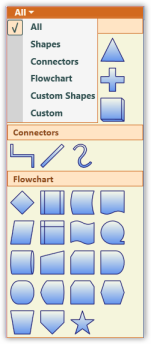' | markdownify }}
{:.image }

_Palette with Groups and Filters removed_

_Note: Whenever a filter is removed the group containing the next filter index must be decremented by one to get the proper output as mentioned in the above code snippet._

b) Removing all the groups from the palette

To remove all the groups from the palette, the Clear method can be used. The following code illustrates the usage of Clear method.

[C#]

DiagramControl diagramControl = new DiagramControl();

diagramControl.SymbolPalette.SymbolGroups.Clear();

[VB]

Dim diagramControl As New DiagramControl()

diagramControl.SymbolPalette.SymbolGroups.Clear()

Run the application. All the groups are removed from the SymbolPalette.

         1.1.4.5 Symbol Designer

Symbol Designer application allows you to create new palettes with symbols, and also modify the existing palettes. You can use these palettes in your applications, and also in the Diagram Builder. 

Software Path

..\..\Syncfusion\Essential Studio\<Version Number>\utilities\Diagram WPF\Symbol Designer

(or)

Start Menu > All Programs > Syncfusion > Utilities > Diagram > WPF > Symbol Designer

Creating SymbolPaletteItem

To create your own custom symbols in the symbol designer, follow the procedure given below:

1. Open the Symbol Designer tool which is available in the software path given above.
2. If you want to create a new symbol, select New option in the File menu. Type a name for the palette as shown in the below sample and click OK.

{{ '' | markdownify }}
{:.image }

_New Symbol PaletteItem Dialog Box_

3. A new symbol palette is created with the given name after which, you can design your own symbol.

{{ '' | markdownify }}
{:.image }

_Flow Diagram Symbol Palette_

4. Draw the desired shapes using drawing tool in the work area.

{{ '' | markdownify }}
{:.image }

_Symbol_

The Shape of the SymbolPaletteItem can be customized further using format tab in Symbol Designer: 

* Background
* Outline
* Dash array
* Shadow
* Softedges
* Glow visual effect

The node label can also be customized.

{{ '' | markdownify }}
{:.image }

_Format tab_

5. After creating required symbols, we have to save this symbol into the symbol palette. Go to the File menu and click Save. A Save SymbolPaletteGroup dialog will appear as in the following screen shot.

{{ '' | markdownify }}
{:.image }

_Save SymbolPalette Group Dialog_

6. Give a relevant file name for the palette and click Save. As the PaletteGroup is saved, preview of the symbol will be shown in Symbol Palette.

{{ '' | markdownify }}
{:.image }

_Symbol Palette With New Symbol_

7. Repeat the steps 3 to 7 for creating more symbols.

{{ '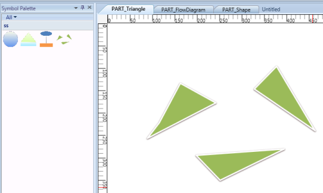' | markdownify }}
{:.image }

_Symbol pallet with PART_Triangle_

{{ '' | markdownify }}
{:.image }

{{ '' | markdownify }}
{:.image }

_Different Symbols_

8. If you create symbols using more than one shape, you need to group all the shapes into a single symbol using the Group option in Symbol Designer.
9. Finally, Save the NewSymbol Group. Now the above symbols will be available in the SymbolPaletteGroup. The saved SymbolPaletteGroup can be loaded back later.

SymbolPalette Item

SymbolPaletteitems are contained in the SymbolPalette group. A SymbolPalette item does not restrict users to the type of content that can be added to it. A SymbolPalette item can be a text box, combo box, image, button, and so on.

The Name property of the SymbolPaletteItem can be used to refer to the custom item being added in the NodeDrop event. The name of the SymbolPaletteItem becomes the name of the node.

The following code example can be used to add a SymbolPalette item that has an image as its content. 

[C#]

SymbolPaletteGroup group = new SymbolPaletteGroup();

group.Label = "Custom";

SymbolPalette.SetFilterIndexes(group, new Int32Collection(new int[] { 0, 6 }));

dc.SymbolPalette.SymbolGroups.Add(group);

SymbolPaletteItem item = new SymbolPaletteItem();

Image i = new Image();

BitmapImage bi3 = new BitmapImage();

bi3.BeginInit();

bi3.UriSource = new Uri("Custom.png", UriKind.RelativeOrAbsolute);

bi3.EndInit();

i.Stretch = Stretch.Fill;

i.Source = bi3;

item.Content = i;

group.Items.Add(item);

[VB]

Dim group As New SymbolPaletteGroup()

group.Label = "Custom"

SymbolPalette.SetFilterIndexes(group, New Int32Collection(New Integer() { 0, 6 }))

dc.SymbolPalette.SymbolGroups.Add(group)

Dim item As New SymbolPaletteItem()

Dim i As New Image()

Dim bi3 As New BitmapImage()

bi3.BeginInit()

bi3.UriSource = New Uri("Custom.png", UriKind.RelativeOrAbsolute)

bi3.EndInit()

i.Stretch = Stretch.Fill

i.Source = bi3

item.Content = i

group.Items.Add(item)

This adds the image content to the newly created SymbolPaletteitem that belongs to the SymbolPalettegroup named "Custom".

{{ '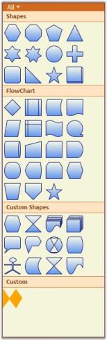' | markdownify }}
{:.image }

_Custom Group and Item_

            1.1.4.5.1 Create SymbolPaletteItem

You can create SymbolPaletteItem in two methods. They are:

* Using Symbol Designer
* Using Microsoft Expression Blend 4

Using Symbol Design 

To create SymbolPaletteItem using Symbol Designer, refer to the Symbol Designer section. 

Using Microsoft Expression Blend 4

Essential Diagram provides an add-on for creating SymbolPaletteItem’s content. You can also export the created content as SymbolPaletteItem using this add on.  The exported content can be imported into the diagram control for later.

To enable this you need to add the Syncfusion.Diagram.SymbolExporter.dll in the Extension folder.

When Micorsoft Expression Blend is installed before installing Essential Studio, the exporter assembly will automatically be placed in the Extensions folder. 

When Microsoft Expression Blend is installed after installing Essential Studio, then you need to run the SyncfusionExpressionBlendAddin exe, to place assembly in the correct location.

The SyncfusionExpressionBlendAddin exe is available in the following location:

[$Essential Studio]\[$Current Version]\Utilities\Diagram\WPF

Or you can also place the assembly manually in the following location:

_{$Microsoft Expression]\Blend 4\Extensions_

_Note: currently exporter support is available only for the Blend 4  stable release(4.0.20525.0) and Blend 4 service packs 1 (version 4.0.20901.0)._

To Create SymbolPaletteItem Content  

1. Create a symbol that has to be exported.
2. Select the element that has to be exported as a SymbolPaletteItem.
3. The Name property has to be provided for the element that has to be exported as the symbol content.
4. The selected SymbolPalette content will be exported as a XAML file using the add-on.
5. The exported XAML file can be imported in the DiagramControl as SymbolPaletteItem.

The following are the steps to create a SymbolPaletteItem and import symbols from Blend:

6. Create a WPF application.

{{ '' | markdownify }}
{:.image }

_New Project_

7. Design the content as required.

{{ '' | markdownify }}
{:.image }

_Design Content_

8. Select the part of the element, which you want to export as symbol content. You can also select this from the Object and Timeline. 

_Note: The selected part will act as the parent element, name the element as desired._

9. Specify the Name property for parent element.
<table>
<tr>
<td>
 {{{ ''_Note: This name property is required for serialization. So this property cannot be set to null._'' | markdownify }}}</td></tr>
<tr>
<td>
10. Click Window option in the blend menu.11. Select the Syncfusion Symbol Exporter add-on. 12. A popup window will be displayed. You can dock this within the blend as shown in following screenshot:</td></tr>
</table>

{{ '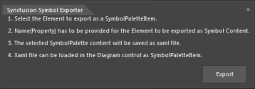' | markdownify }}
{:.image }

_Syncfusion____Symbol Exporter_

{{ '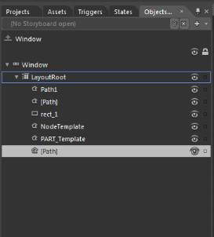' | markdownify }}
{:.image }

_Object and Timeline Window_

13. Click Export.
14. The Save SymbolPaletteItem dialog opens.
15. Name the file and save this as XAML file in the desired location.

{{ '' | markdownify }}
{:.image }

_Save Dialog Box_

16. The selected part will be exported as the SymbolPalleteItem content.

The exported file can be imported in SymbolPalette. To import symbols from XAML file, refer to the SymbolPaletteSerialization. 

            1.1.4.5.2 Define Node, Port, Group definitions in SymbolPalette

The following steps demonstrate how to specify a Node or Node with Ports in SymbolPaletteItem:

1. To add more than one port, a node is created.
2. Then several ports are added to it.
3. Create a SymbolPaletteItem and add the node as content for the SymbolPaletteItem.

At runtime, Nodes that are added in SymbolPalette can be dragged and dropped on the page. All the ports, and their properties will be cloned and a new copy of the node will be created.

{{ '' | markdownify }}
{:.image }

_Node with several Ports_

To create a new Node

Node node = new Node();

            node.Width = 100;

            node.Height = 100;

            node.OffsetX = 200;

            node.OffsetY = 200;

            node.Background = new SolidColorBrush(Colors.Aqua);

            AddMorePorts(node);

To add more Ports

private void AddMorePorts(Node node)

        {

            Left=10;

            Top=10;

            for (int i = 0; i < 4; i++)

            {

                ConnectionPort port = new ConnectionPort();

                port.Left = Left;

                port.Top = Top;

                port.Node = node;

                node.Ports.Add(port);

                Left += 10;

                Top += 10;

            }

        }

Creating Groups and SymbolPaletteItems

[C#]

SymbolPaletteGroup group = new SymbolPaletteGroup();

group.Label = "Custom";

SymbolPalette.SetFilterIndexes(group, new List<int>()[] { 0, 6 }));

dc.SymbolPalette.SymbolGroups.Add(group);

SymbolPaletteItem item = new SymbolPaletteItem(); 

// Node added as SymbolPaletteItem's Content

item.Content = node ;

group.Items.Add(item);

Define Group definition in SymbolPalette

The groups can be given as SymbolPaletteItem’s content. At runtime, they can be Dragged and Dropped to create a clone of the group and its children will be added on the page.

{{ '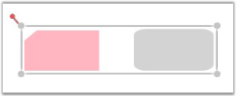' | markdownify }}
{:.image }

_To Drag and Drop Groups_

To create new Node and Groups

[C#]

public DiagramControl Control;

public DiagramModel Model;

public DiagramView View;

public Window1 ()

{

    Control = new DiagramControl ();

    Model = new DiagramModel ();

    View = new DiagramView ();

    Control.View = View;

    Control.Model = Model;

    View.Bounds = new Thickness(0, 0, 1000, 1000);

    Node n = new Node(Guid.NewGuid(), "Start");

    n.Shape = Shapes.FlowChart_Card;

    n.Level = 1;

    n.OffsetX = 150;

    n.OffsetY = 25;

    n.Width = 150;

    n.Height = 75;

    Node n1 = new Node(Guid.NewGuid(), "End");

    n1.Shape = Shapes.RoundedRectangle;

    n1.Level = 1;

    n1.OffsetX = 350;

    n1.OffsetY = 325;

    n1.Width = 100;

    n1.Height = 75;

    Model.Nodes.Add(n);

    Model.Nodes.Add(n1);

    Group g = new Group(Guid.NewGuid(), "group1");

    g.AddChild(n);

    g.AddChild(n1);

    Model.Nodes.Add(g);

}

To create new SymbolPalette Group and Item

[C#]

SymbolPaletteGroup group = new SymbolPaletteGroup();

group.Label = "Custom";

SymbolPalette.SetFilterIndexes(group, new List<int> ()[] { 0, 6 }));

dc.SymbolPalette.SymbolGroups.Add(group);

SymbolPaletteItem item = new SymbolPaletteItem(); 

// Group added as SymbolPaletteItem's Content

item.Content = g ;

group.Items.Add(item);

Refer to 4.1.1.1	Adding Through SymbolPalette

         1.1.4.6 Customize the SymbolPalette

The appearance of the SymbolPalette can be customized to suit any application. Several properties have been provided in the SymbolPalette class to enable its customization.

The following properties can be used to customize the SymbolPalette in your application.

_Property Table_

<table>
<tr>
<td>
Property</td><td>
Description</td><td>
Type of the property</td><td>
Value it accepts</td><td>
Any other dependencies/ sub properties associated</td></tr>
<tr>
<td>
Background</td><td>
Specifies the background color of the SymbolPalette.The default color is Beige.</td><td>
Dependency property</td><td>
Brush</td><td>
No</td></tr>
<tr>
<td>
BorderThickness</td><td>
Gets or sets the border thickness of the SymbolPalette.The default value is 1.</td><td>
Dependency property</td><td>
Thickness</td><td>
No</td></tr>
<tr>
<td>
BorderBrush</td><td>
Specifies the border color of the SymbolPalette.The default color is Brown.</td><td>
Dependency property</td><td>
Brush</td><td>
No</td></tr>
<tr>
<td>
SymbolPaletteGroupBackground</td><td>
Specifies the background color of the SymbolPalette Group.The default color is Bisque.</td><td>
Dependency property</td><td>
Brush</td><td>
No</td></tr>
<tr>
<td>
SymbolPaletteGroupForeground</td><td>
Specifies the foreground color of the SymbolPalette Group.The default color is SaddleBrown{{{ ''_._'' | markdownify }}}</td><td>
Dependency property</td><td>
Brush</td><td>
No</td></tr>
<tr>
<td>
SymbolPaletteGroupBorderBrush</td><td>
Specifies the border color of the SymbolPalette Group.The default color is Chocolate{{{ ''_._'' | markdownify }}}</td><td>
Dependency property</td><td>
Brush</td><td>
No</td></tr>
<tr>
<td>
ItemBorderThickness</td><td>
Gets or sets the border thickness of the SymbolPalette Item.The default value is 1.</td><td>
Dependency property</td><td>
Thickness</td><td>
No</td></tr>
<tr>
<td>
ItemCornerRadius</td><td>
Gets or sets the corner radius of the SymbolPalette Item.The default value is 2.</td><td>
Dependency property</td><td>
CornerRadius</td><td>
No</td></tr>
<tr>
<td>
ItemMouseOverBorderBrush</td><td>
Specifies the border color of the SymbolPalette Item over which the mouse pointer rests.The default value is Orange.</td><td>
Dependency property</td><td>
Brush</td><td>
No</td></tr>
<tr>
<td>
ItemCheckedBorderBrush</td><td>
Specifies the border color of the SymbolPalette Item that is selected.The default value is Red.</td><td>
Dependency property</td><td>
Brush</td><td>
No</td></tr>
<tr>
<td>
ItemCheckedMouseOverBorderBrush</td><td>
Specifies the border color of the selected SymbolPalette Item over which the mouse pointer rests.The default value is Green.</td><td>
Dependency property</td><td>
Brush</td><td>
No</td></tr>
<tr>
<td>
FilterSelectorBackground</td><td>
Specifies the background color of the SymbolPalette Filter.The default value is Chocolate.</td><td>
Dependency property</td><td>
Brush</td><td>
No</td></tr>
<tr>
<td>
FilterSelectorForeground</td><td>
Specifies the foreground color of the SymbolPalette Filter.The default value is DarkSlateGray.</td><td>
Dependency property</td><td>
Brush</td><td>
No</td></tr>
<tr>
<td>
FilterSelectorBorderThickness</td><td>
Gets or sets the border thickness of the SymbolPalette Filter.The default value is (0,0,0,1).</td><td>
Dependency property</td><td>
Thickness</td><td>
No</td></tr>
<tr>
<td>
FilterSelectorMouseOverForeground</td><td>
Specifies the foreground color of the SymbolPalette Filter over which the mouse pointer rests.The default value is OldLace.</td><td>
Dependency property</td><td>
Brush</td><td>
No</td></tr>
<tr>
<td>
FilterSelectorBorderBrush</td><td>
specifies the border color of the SymbolPalette FilterThe default value is Chocolate.</td><td>
Dependency property</td><td>
Brush</td><td>
No</td></tr>
<tr>
<td>
PopUpBackground</td><td>
Specifies the background color of the SymbolPalette Pop-up.The default value is WhiteSmoke.</td><td>
Dependency property</td><td>
Brush</td><td>
No</td></tr>
<tr>
<td>
PopUpForeground</td><td>
Specifies the foreground color of the SymbolPalette Pop-up.The default value is DarkSlateGray.</td><td>
Dependency property</td><td>
Brush</td><td>
No</td></tr>
<tr>
<td>
PopUpBorderThickness</td><td>
Gets or sets the border thickness of the SymbolPalette Pop-upThe default value is (0,1,1,1).</td><td>
Dependency property</td><td>
Thickness</td><td>
No</td></tr>
<tr>
<td>
PopUpMouseOverBrush</td><td>
Specifies the background color of the SymbolPalette pop-up Item over which the mouse pointer rests.The default value is LightSalmon.</td><td>
Dependency property</td><td>
Brush</td><td>
No</td></tr>
<tr>
<td>
PopUpBorderBrush</td><td>
Specifies the border color of the SymbolPalette pop-up.The default value is Chocolate.</td><td>
Dependency property</td><td>
Brush</td><td>
No</td></tr>
<tr>
<td>
PopUpLeftColumnBackground</td><td>
Specifies the background color of the Check Box Column in the SymbolPalette pop-up.The default value is LightGray.</td><td>
Dependency property</td><td>
Brush</td><td>
No</td></tr>
<tr>
<td>
CheckerBackground</td><td>
Specifies the the background color of the Check Boxes in the SymbolPalette pop-up.The default value is Bisque.</td><td>
Dependency property</td><td>
Brush</td><td>
No</td></tr>
<tr>
<td>
CheckerBorderBrush</td><td>
Specifies the the border color of the Check Boxes in the SymbolPalette pop-up.The default value is DarkSlateGray{{{ ''_._'' | markdownify }}}</td><td>
Dependency property</td><td>
Brush</td><td>
No</td></tr>
<tr>
<td>
CheckerTickBrush</td><td>
Specifies the Tick color of the selected Check Box in the SymbolPalette pop-up.The default value is DarkSlateGray{{{ ''_._'' | markdownify }}}</td><td>
Dependency property</td><td>
Brush</td><td>
No</td></tr>
</table>

The following code example illustrates how to set some of the SymbolPalette properties.

[C#]

DiagramControl diagramControl = new DiagramControl(); diagramControl.SymbolPalette.BorderThickness = new Thickness(2);

diagramControl.SymbolPalette.BorderBrush = Brushes.MidnightBlue;

diagramControl.SymbolPalette.Background = Brushes.Blue; diagramControl.SymbolPalette.SymbolPaletteGroupBackground = Brushes.DarkBlue; diagramControl.SymbolPalette.SymbolPaletteGroupForeground = Brushes.White;

diagramControl.SymbolPalette.SymbolPaletteGroupBorderBrush = Brushes.SlateBlue;

diagramControl.SymbolPalette.FilterSelectorBackground = Brushes.SkyBlue; diagramControl.SymbolPalette.FilterSelectorForeground = Brushes.White;

diagramControl.SymbolPalette.FilterSelectorBorderBrush = Brushes.Blue; diagramControl.SymbolPalette.FilterSelectorBorderThickness = new Thickness(0);

diagramControl.SymbolPalette.CheckerTickBrush = Brushes.White;

diagramControl.SymbolPalette.CheckerBorderBrush = Brushes.MidnightBlue;

diagramControl.SymbolPalette.CheckerBackground = Brushes.LightBlue; diagramControl.SymbolPalette.PopUpItemMouseOverBrush = Brushes.CornflowerBlue;

diagramControl.SymbolPalette.PopUpBorderBrush = Brushes.MidnightBlue;

diagramControl.SymbolPalette.ItemBorderThickness = new Thickness(2);

[VB]

Dim diagramControl As New DiagramControl()

diagramControl.SymbolPalette.BorderThickness = New Thickness(2)

diagramControl.SymbolPalette.BorderBrush = Brushes.MidnightBlue

diagramControl.SymbolPalette.Background = Brushes.Blue

diagramControl.SymbolPalette.SymbolPaletteGroupBackground = Brushes.DarkBlue

diagramControl.SymbolPalette.SymbolPaletteGroupForeground = Brushes.White

diagramControl.SymbolPalette.SymbolPaletteGroupBorderBrush = Brushes.SlateBlue

diagramControl.SymbolPalette.FilterSelectorBackground = Brushes.SkyBlue

diagramControl.SymbolPalette.FilterSelectorForeground = Brushes.White

diagramControl.SymbolPalette.FilterSelectorBorderBrush = Brushes.Blue

diagramControl.SymbolPalette.FilterSelectorBorderThickness = New Thickness(0)

diagramControl.SymbolPalette.CheckerTickBrush = Brushes.White

diagramControl.SymbolPalette.CheckerBorderBrush = Brushes.MidnightBlue

diagramControl.SymbolPalette.CheckerBackground = Brushes.LightBlue

diagramControl.SymbolPalette.PopUpItemMouseOverBrush = Brushes.CornflowerBlue

diagramControl.SymbolPalette.PopUpBorderBrush = Brushes.MidnightBlue

diagramControl.SymbolPalette.ItemBorderThickness = New Thickness(2)

The following screenshot illustrates the various customization options that are available for the SymbolPalette Item, Group and Filter Selector.

{{ '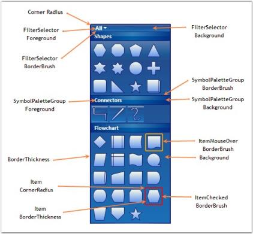' | markdownify }}
{:.image }

_SymbolPalette Item, Group and Filter Selector Customization Properties_

The following screenshot illustrates the various customization options available for the SymbolPalette PopUp.

{{ '' | markdownify }}
{:.image }

_SymbolPalette PopUp Customization Properties_

            1.1.4.6.1 Customize the SymbolPaletteItem

This feature improves the performance of SymbolPaletteItem dragging, by avoiding serialization and deserialization of the item.

Methods

_Methos Table_

<table>
<tr>
<th>
Method</th><th>
Description</th><th>
Parameters</th><th>
Return Type</th></tr>
<tr>
<th>
CloneContent</th><th>
This method assigns the customized and serialized content to the symbol palette item, while performing drag and drop.</th><th>
No parameters </th><th>
object </th></tr>
</table>
               1.1.4.6.1.1 _Adding this Feature to an Application_

Creating Custom SymbolPaletteItem

The content for the custom SymbolPaletteItem is assigned by overriding the CloneContent method.

[C#]

                 public class customItem : SymbolPaletteItem

        {

            public customItem()

            { }

            public override object CloneContent()

            {

                return new Button() { Height = 50, Width = 50, Content = "Custom" };

            }

        }

[VB]

Public Class customItem

Inherits SymbolPaletteItem

Public Sub New()

End Sub

Public Overrides Function CloneContent() As Object

            Dim button As New Button()

            button.Content = "asas"

            button.Width = 50

            button.Height = 50

            Return button

End Function

End Class

Adding CustomItem to SymbolPalette

To add CustomItem to SymbolPalette, use the code example given below:

[C#]

customItem custom = new customItem();

custom.Content = "asd";

(diagramControl.SymbolPalette.SymbolGroups[0] as SymbolPaletteGroup).Items.Add(custom);

[VB]

Dim custom As New customItem()

custom.Content = "asd"

TryCast(customs.SymbolGroups(0), SymbolPaletteGroup).Items.Add(custom)

When you drag and drop the custom SymbolPaletteItem, the content that is assigned in the CloneContent method is applied to the content of the dropped item.

Thereby, the performance of dragging the SymbolpaletteItem is improved by 40%. If the default base method is returned in the CloneContent method, the default content is dragged and dropped.

         1.1.4.7 SymbolPalette Serialization

Serialization is the process of saving and retrieving the SymbolPalette groups and items. Essential DiagramWPF supports saving the SymbolPalette as an XAML file. This load and save feature allows you to save the SymbolPalette for future use. You can continue working on their page by loading the appropriate XAML file.

SymbolPaletteSerialization feature provides an option to save and load the SymbolPalette, SymbolPalette groups, elements and items in diagram control. So any item can be customised and imported onto the SymbolPalette.

* User can easily Save/Load the SymbolPalette
*  User can Save/Load the SymbolPaletteGroup
*  User can Save/Load the SymbolPaletteItem

Methods 

_Methods Table_

<table>
<tr>
<td>
Method </td><td>
Description </td><td>
Parameters </td><td>
Return Type </td><td>
Reference links </td></tr>
<tr>
<td>
SaveSymbolPalette</td><td>
Displays the save dialog box to save the entire SymbolPallete(including all SymbolPalette groups) into XAML file.</td><td>
NA </td><td>
Void</td><td>
NA </td></tr>
<tr>
<td>
LoadSymbolPalette</td><td>
The existing SymbolPallete groups will be cleared and new groups will be added from selected Xaml file.</td><td>
NA </td><td>
Void</td><td>
NA </td></tr>
<tr>
<td>
SaveSymbolPaletteGroup</td><td>
Saves the Symbol Palette Group into Xaml file using the given  SymbolPaletteGroup parameter. </td><td>
SymbolPaletteGroup </td><td>
Void</td><td>
NA </td></tr>
<tr>
<td>
LoadSymbolPaletteGroup</td><td>
Displays the Load Dialogue Box to load the Symbol Palette Group from the selected Xaml file.</td><td>
NA </td><td>
Void</td><td>
NA </td></tr>
<tr>
<td>
SaveSymbolPaletteItem</td><td>
Saves the Symbol Palette Item into Xaml file using the given SymbolPaletteItem parameter.</td><td>
SymbolPaletteItem </td><td>
Void</td><td>
NA </td></tr>
<tr>
<td>
LoadSymbolPaletteItem</td><td>
Loads the SymbolPalette Item from the Xaml file. The Items are loaded in any given Symbol Palette Group using the SymbolPaletteGroup parameter. </td><td>
SymbolPaletteGroup </td><td>
Void</td><td>
NA </td></tr>
</table>
         1.1.4.8 Bind to ItemSource

The symbol palette supports binding with business objects. A symbol group will be created and added to the symbol palette depending upon the business objects and template provided. The symbol group itself supports binding with business objects. Symbol palette items will be created and added to it depending upon the business objects and template.

Properties

_Properties Table_

<table>
<tr>
<td>
Property</td><td>
Description</td><td>
Type</td><td>
Data Type</td><td>
Reference links</td></tr>
<tr>
<td>
ItemGenerateMode</td><td>
Specifies the ItemGenerateMode for symbol palette. Default is Manual. </td><td>
Dependency property</td><td>
ItemGenerateMode.ItemsSourceItemGenerateMode.Manual </td><td>
No</td></tr>
<tr>
<td>
ItemsSource</td><td>
Gets or sets the source for the list of the items, the containers about to represent.</td><td>
DependencyProperty</td><td>
IEnumerable</td><td>
No</td></tr>
</table>

ItemSource property gets the source for the list of Symbol groups to be added to symbol palette.

The following code samples illustrate this.

[XAML]

<Window.Resources>

        

</Window.Resources>

[C#]

symbol = diagramControl.SymbolPalette;

// Set the ItemGenerateMode property value to ItemsSource

symbol.ItemGenerateMode = ItemGenerateMode.ItemsSource;

//Clear the default filter item from the SymbolFilter collections.

symbol.SymbolFilters.Clear();

//Clear default items added in SymbolGroups

symbol.SymbolGroups.Clear();

//Then assign ItemsSource for the SymbolPalette

symbol.ItemsSource = CreatingBusinessObjForSymbolPalette();

//ItemsSource for SymbolPalette

private System.Collections.IEnumerable CreatingBusinessObjForSymbolPalette()

{

ObservableCollection<SymbGroup> grp = new ObservableCollection<SymbGroup>();

grp.Add(new SymbGroup() { Label = "Label1", Filter = new Int32Collection(new int[] { 0, 1 }) });

grp.Add(new SymbGroup() { Label = "Label2", Filter = new Int32Collection(new int[] { 0, 2 }) });

return grp;

}

//ItemsSource for SymbolPaletteGroup assigned when group collection changed.

void SymbolGroups_CollectionChanged(object sender, System.Collections.Specialized.NotifyCollectionChangedEventArgs e)

{

if (e.NewItems != null)

{

ObservableCollection<SymbolItem> symbolItemCollection = new

ObservableCollection<SymbolItem>();

symbolItemCollection.Add(new SymbolItem() { Content = "Item1" });

symbolItemCollection.Add(new SymbolItem() { Content = "Item2" });

(e.NewItems[0] as SymbolPaletteGroup).ItemsSource = symbolItemCollection;

}

}

//Business object for symbol group and symbol palette item.

public class SymbGroup

{

public String Label { get; set; }

public Int32Collection Filter { get; set; }

}

public class SymbolItem

{

public string Content { get; set; }

}

{{ '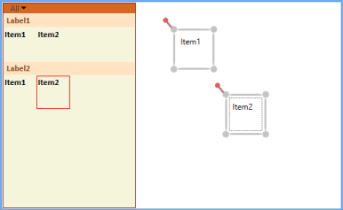' | markdownify }}
{:.image }

_Symbol palette ItemSource_

_Note: Symbol groups are not allowed to be added manually when ItemSource is used._

      1.1.5 Serialization

Serialization is the process of saving and retrieving the Essential Diagram file. Essential Diagram WPF supports saving the diagram page as an XAML file. The page and all its properties get saved. On loading, the page gets loaded in the current view with all its nodes and connections. This load and save feature allows you to save their diagram page for future use. You can continue working on their page by loading the appropriate XAML file.

_Methods Table_

<table>
<tr>
<td>
Name</td><td>
Parameters</td><td>
Return Type</td><td>
Description</td><td>
Reference Links</td></tr>
<tr>
<td>
Save()</td><td>
Null</td><td>
Void</td><td>
Displays the Save Dialogue Box to save the DiagramPage into XAML file.</td><td>
Save Diagram Page</td></tr>
<tr>
<td>
Save(string)</td><td>
String</td><td>
Void</td><td>
Saves the DiagramPage into  XAML file whose file name is specified.</td><td>
Save Diagram Page</td></tr>
<tr>
<td>
Save(Stream)</td><td>
System.IO.Stream </td><td>
Void</td><td>
Saves the DiagramPage into memory stream.</td><td>
Save Diagram Page</td></tr>
<tr>
<td>
Load()</td><td>
Null</td><td>
Void</td><td>
Displays the Load Dialogue Box to load the DiagramPage from selected XAML file.</td><td>
Load Diagram Page</td></tr>
<tr>
<td>
Load(string)</td><td>
String</td><td>
Void</td><td>
Loads the DiagramPage from the file name mentioned.</td><td>
Load Diagram Page</td></tr>
<tr>
<td>
Load(Stream)</td><td>
System.IO.Stream</td><td>
Void</td><td>
Loads the DiagramPage from the memory stream.</td><td>
Load Diagram Page</td></tr>
</table>

 This process is explained in the following topic:

         1.1.5.1 Save Diagram Page

Save operation can be done in three ways,

* Using the Save Dialog Box.
* File name with full path.
* Using Memory Stream

Using the Save Dialog Box

To save the page, the following code can be used.

[C#]

DiagramControl dc = new DiagramControl();

dc.Save();

[VB]

Dim dc As New DiagramControl()

dc.Save()

The Save Dialog box will appear. Select the 'Save as Type' as XAML and select the location at which the file is to be saved and click the save button in the dialog box after specifying a name for the file.

{{ '' | markdownify }}
{:.image }

_Save Dialog Box_

File name with path

You can also specify the name of the file directly in the Save method.

[C#]

DiagramControl dc = new DiagramControl();

dc.Save(@"C:\TestPage.xaml");

[VB]

Dim dc As New DiagramControl()

dc.Save("C:\TestPage.xaml")

_Note: Essential Diagram WPF does not support serializing bindings and bitmap Images._

Saving to a stream

You can also save to a stream. 

The following code example shows how it can be done.

[C#]

DiagramControl dc = new DiagramControl();

System.IO.MemoryStream stream = new System.IO.MemoryStream();

dc.Save(stream as System.IO.Stream);

[VB]

Dim dc As New DiagramControl()

Dim stream As New System.IO.MemoryStream()

dc.Save(TryCast(stream, System.IO.Stream))

         1.1.5.2 Loading the Diagram Page

Load operation can be done in three ways,

* Using the Load Dialog Box.
* File name with full path.
* Using Memory Stream

Load using the Load Dialog Box

To load the page, the following code can be used.

[C#]

DiagramControl dc = new DiagramControl();

dc.Load();

[VB]

Dim dc As New DiagramControl()

dc.Load()

The Load Dialog box will appear. Select the 'Files of Type' as XAML and specify the path of the file to be loaded and click the Open button in the dialog box. The selected page gets loaded in the current view and the page is ready to be edited.

{{ '' | markdownify }}
{:.image }

_Load Dialog Box_

File name with path

You can also specify the name of the file directly in the Load method.

[C#]

DiagramControl dc = new DiagramControl();

dc.Load(@"C:\TestPage.xaml");

[VB]

Dim dc As New DiagramControl()

dc.Load("C:\TestPage.xaml")

_Note: Essential Diagram WPF does not support serializing bindings and bitmap Images._

Loading from a stream

You can also load from a stream. 

To load from the stream use the following code snippet.

[C#]

stream.Position = 0;

dc.Load(stream as System.IO.Stream);

[VB]

stream.Position = 0

dc.Load(TryCast(stream, System.IO.Stream))

_Note: While loading from memory stream please make sure the stream’s Position property is set to 0._

      1.1.6 Localization

Localization is the process of providing controls in different cultures to help users to easily set their own culture.

Use Case Scenarios

Localization is the process of customizing the User Interface (UI) in a language and culture specific to a particular country or region to display regional data. Localization is the key feature that provides solutions to global customers with the help of localized resource files provided by controls.

{{ '' | markdownify }}
{:.image }

_Localization Sample in Japanese Language_

Localizing the Application

Adding Resource Files

To localize the Syncfusion Diagram WPF control, you need to create a resource file for each culture. The following steps should be performed when localizing strings for your culture:

1. Add the resource (.resx) files in the Resources folder for different cultures. The .resx files for the different cultures or invariant cultures should be placed in the Resources folder of your project.
2. Name the resource files according to the formats specified, namely AssemblyName.CultureName.resx and AssemblyName.resx for the invariant cultures. Here, AssemblyName is the Syncfusion WPF control assembly name and CultureName is the culture code of the resource file that you want to show in the UI. If your conversion is only for the invariant culture, then the .resx file does not require a culture suffix.

Examples

Syncfusion.Diagram.Wpf.ja.resx - A Japanese resource file for the Syncfusion.Diagram.Wpf assembly.

Syncfusion.Diagram.Wpf.resx - An invariant culture resource file for the Syncfusion.Diagram.Wpf assembly. 

Assigning the Current UI Culture to the Application

By default, the current culture is set to “en-US”. You can check the current culture from “System.Threading.Thread.CurrentThread.CurrentUICulture”. CurrentUICulture can be changed, as shown in the following code snippets. 

In the following example, CurrentUICulture is set before IntializeComponent in the StartUp page (MainPage.xaml.cs).

[C#]

public MainPage()

{

    System.Threading.Thread.CurrentThread.CurrentUICulture = new System.Globalization.CultureInfo("ja");

    InitializeComponent();

}

[VB]

'INSTANT VB WARNING: The following constructor is declared outside of its associated class:

'ORIGINAL LINE: public MainPage()

 Public Sub New()

   System.Threading.Thread.CurrentThread.CurrentUICulture = New                       System.Globalization.CultureInfo("ja")

   InitializeComponent()

End Sub

Else, CurrentUICulture is set in the Application_Startup event in the App.xaml.cs file, as shown in the following example.

[C#]

private void Application_Startup(object sender, StartupEventArgs e)

{

    System.Threading.Thread.CurrentThread.CurrentUICulture = new System.Globalization.CultureInfo("ja");

    this.RootVisual = new MainPage();

}

[VB]

Private Sub Application_Startup(ByVal sender As Object, ByVal e As StartupEventArgs)

System.Threading.Thread.CurrentThread.CurrentUICulture = New System.Globalization.CultureInfo("ja")

Me.RootVisual = New MainPage()

End Sub

{{ '' | markdownify }}
{:.image }

_Localization Sample in Japanese Language_

Specifying the Directory Location of the Resource File

By default, the resource file for a specific culture is obtained from the Resources directory. However, the location of the resource file can be changed by using DiagramControl’s LocalizationPath property, as shown in the following code snippet.

[C#]

// The location of the localized resource file is stored in the \Resources\Controls directory.

diagramControl.LocalizationPath = "Resources.Controls";

[VB]

'The location of the localized resource file is stored in the \Resources\Controls directory.

diagramControl.LocalizationPath = "Resources.Controls"

{{ '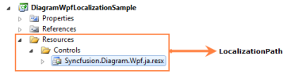' | markdownify }}
{:.image }

_Customized LocalizationPath_

Example

[C#]

// The location of the localized resource file is stored in the \Resources\X\Y\Z directory.

diagramControl.LocalizationPath = "Resources.X.Y.Z";

[VB]

'The location of the localized resource file is stored in the \Resources\X\Y\Z directory.

diagramControl.LocalizationPath = "Resources.X.Y.Z"

{{ '' | markdownify }}
{:.image }

_Customized LocalizationPath_

_Note: LocalizationPath for the resource file should be specified before DiagramControl’s Template is applied._ 

Properties

The property of the Localization feature is described in the following tabulation:

_Property Table_

<table>
<tr>
<td>
Property </td><td>
Description </td><td>
Type </td><td>
Data Type </td><td>
Reference links </td></tr>
<tr>
<td>
LocalizationPath</td><td>
Indicates the directory in which the resource files are located. </td><td>
CLR</td><td>
string </td><td>
Not applicable </td></tr>
</table>

Sample Link

To view a sample

1. Open the Diagram Sample Browser from the dashboard. (Refer to the Samples and Location chapter.)
2. Navigate to Editable Diagram -> Localization Demo.
      1.1.7 Event Mechanism

This section describes several events triggered and handled while using Essential Diagram WPF in the following topic:

Events for Nodes and Connections

Diagram control has several events which respond to several actions performed on nodes and connections.

The various events and their descriptions are explained in the following table.

_Events Table_

<table>
<tr>
<td>
Event</td><td>
Description</td><td>
Arguments</td></tr>
<tr>
<td>
NodeClick</td><td>
Raised when the node is clicked. Event cannot be cancelled.</td><td>
Node – Node on which event is raised.</td></tr>
<tr>
<td>
NodeDoubleClick</td><td>
Raised when the node is clicked twice in succession. Event cannot be cancelled.</td><td>
Node – Node on which event is raised.</td></tr>
<tr>
<td>
NodeStartLabelEdit</td><td>
Raised when the label editing on the node is started. Event cannot be cancelled.</td><td>
NewLabelValue – The new label value.OldLabelValue – the old label value.Node - Node on which event is raised.</td></tr>
<tr>
<td>
NodeLabelChanged</td><td>
Raised when the node's label value is changed. Event cannot be cancelled.</td><td>
NewLabelValue – The new label value.OldLabelValue – the old label value.Node - Node on which event is raised.</td></tr>
<tr>
<td>
NodeDragStart</td><td>
Raised when the node is dragged. Event cannot be cancelled.</td><td>
Node – Node on which event is raised.</td></tr>
<tr>
<td>
NodeDragEnd</td><td>
Raised when the drag operation on node is complete.Event cannot be cancelled.</td><td>
Node – Node on which event is raised.</td></tr>
<tr>
<td>
NodeResizing</td><td>
Raised when the resize operation is being performed. Event cannot be cancelled.</td><td>
Node – Node on which event is raised.</td></tr>
<tr>
<td>
NodeResized</td><td>
Raised after the node is resized. Event cannot be cancelled.</td><td>
Node – Node on which event is raised.</td></tr>
<tr>
<td>
NodeRotationChanging</td><td>
Raised when the node is being rotated. Event cannot be cancelled.</td><td>
Node – Node on which event is raised.</td></tr>
<tr>
<td>
NodeRotationChanged</td><td>
Raised after the node is rotated. Event cannot be cancelled.</td><td>
Node – Node on which event is raised.</td></tr>
<tr>
<td>
ConnectorDoubleClick</td><td>
Raised when the Connector is clicked twice in succession. Event cannot be cancelled.</td><td>
Connector – Connector on which the event is raised.Head Node – Head Node of the connector.Tail Node – Tail Node of the connector.</td></tr>
<tr>
<td>
ConnectorStartLabelEdit</td><td>
Raised when the label editing on the Connector is started. Event cannot be cancelled.</td><td>
Connector – Connector on which the event is raised.Head Node – Head Node of the connector.Tail Node – Tail Node of the connector.OldLabelValue – the old label value.</td></tr>
<tr>
<td>
ConnectorLabelChanged</td><td>
Raised when the connector's label value is changed. Event cannot be cancelled.</td><td>
Connector – Connector on which the event is raised.Head Node – Head Node of the connector.Tail Node – Tail Node of the connector.OldLabelValue – the old label value.NewLabelValue – The new label value.</td></tr>
<tr>
<td>
ConnectorDragStart</td><td>
Raised when either ends of the connector is dragged. Event cannot be cancelled.</td><td>
Connector – Connector on which the event is raised.FixedNodeEnd – Node on which the connection is fixed.MovableNodeEnd – The old Node on which the Connector was connected.</td></tr>
<tr>
<td>
ConnectorDragEnd</td><td>
Raised when the drag operation is complete. Event cannot be cancelled.</td><td>
Connector – Connector on which the event is raised.FixedNodeEnd – Node on which the connection is fixed.HitNodeEnd – The new node on which the Connector is getting connected.</td></tr>
<tr>
<td>
NodeDrop</td><td>
Raised when a shape from the SymbolPalette is dropped on the page. Event cannot be cancelled.</td><td>
DroppedNode – The new node just dropped from SymbolPalette.SymbolPaletteItemName – The name of the SymbolPalette item, which is dropped on the page.</td></tr>
<tr>
<td>
HeadNodeChanged</td><td>
Raised when the headnode of the connector is changed Event cannot be cancelled.</td><td>
Connector – The connector whose HeadNode is changed.PreviousNode – The old Node on which the HeadNode of the Connector was connector.CurrentNode - The new Node on which the HeadNode of the Connector is connector.</td></tr>
<tr>
<td>
TailNodeChanged</td><td>
Raised when the tailnode of the connector is changed. Event cannot be cancelled.</td><td>
Connector – The connector whose HeadNode is changed.PreviousNode – The old Node on which the TailNode of the Connector was connector.CurrentNode - The new Node on which the TailNode of the Connector is connector.</td></tr>
<tr>
<td>
ConnectorDrop</td><td>
Raised when the connector is dropped on the page. Event cannot be cancelled.</td><td>
DroppedConnector – Connector on which the event is raised.</td></tr>
<tr>
<td>
BeforeConnectionCreate</td><td>
Raised when a new connection is being made. Event cannot be cancelled.</td><td>
Connector – The connector whose HeadNode is changed.</td></tr>
<tr>
<td>
AfterConnectionCreate</td><td>
Raised after the connection has been made. Event cannot be cancelled.</td><td>
Connector – Connector on which the event is raised.FixedNodeEnd – Node on which the connection is fixed.HitNodeEnd – The new node on which the Connector is getting connected.</td></tr>
<tr>
<td>
NodeSelected</td><td>
Raised when a node is selected. Event cannot be cancelled.</td><td>
Node – Node on which event is raised.</td></tr>
<tr>
<td>
NodeUnSelected</td><td>
Raised when a node is not selected. Event cannot be cancelled.</td><td>
Node – Node on which event is raised.</td></tr>
<tr>
<td>
NodeDeleting</td><td>
Raised before a node is deleted from the model. Event cannot be cancelled.</td><td>
DeletedNode – Node which is going to get deleted.</td></tr>
<tr>
<td>
NodeDeleted</td><td>
Raised when a node is deleted from the model. Event cannot be cancelled.</td><td>
DeletedNode – Node which is deleted.</td></tr>
<tr>
<td>
ConnectorDeleting</td><td>
Raised before a line connector is deleted from the model. Event cannot be cancelled.</td><td>
DeletedLineConnector – LineConnector which is getting deleted.</td></tr>
<tr>
<td>
ConnectorDeleted</td><td>
Raised when a line connector is deleted from the model. Event cannot be cancelled.</td><td>
DeletedLineConnector – LineConnector which is deleted.</td></tr>
<tr>
<td>
PreviewNodeDrop</td><td>
Raised before a node is dropped on the page. Event cannot be cancelled.</td><td>
Node – Node on which event is raised.</td></tr>
<tr>
<td>
PreviewConnectorDrop</td><td>
Raised before a line connector is dropped on the page. Event cannot be cancelled.</td><td>
Connector – Connector on which the event is raised.</td></tr>
<tr>
<td>
NodeMoved(event is fired before nudge operation is completed)</td><td>
Raised when the nudge operation on node is completed. Event cannot be cancelled.</td><td>
Node – Node on which event is raised.oldOffset – The old offset value before nudge operation.newOffset – The new offset value after performing nudge operation.</td></tr>
</table>

The events can be specified using DiagramView object as follows.

* For instance, NodeClick event can be specified in the following way.

[XAML]

<sfdiagram:DiagramView Name="diagramView" NodeClick="diagramView_NodeClick">

</sfdiagram:DiagramView> 

[C#]

diagramView.NodeClick += new NodeEventHandler(diagramView_NodeClick);

[VB]

AddHandler diagramView.NodeClick, AddressOf diagramView_NodeClick

* And then the event handler can be specified in the code behind as follows.

[C#]

//Event Handler

void diagramView_NodeClick(object sender, NodeRoutedEventArgs evtArgs)

{

//user specified code

}

[VB]

'Event Handler

Private Sub diagramView_NodeClick(ByVal sender As Object, ByVal evtArgs As NodeRoutedEventArgs)

     'user specified code

End Sub

* As another example, the ConnectorDoubleClick event can be specified in the following way.

[XAML]

<sfdiagram:DiagramView Name="diagramView" ConnectorDoubleClick="diagramView_ConnectorDoubleClick">

</sfdiagram:DiagramView>

[C#]

diagramView.ConnectorDoubleClick += new ConnChangedEventHandler(diagramView_ConnectorDoubleClick);

[VB]

AddHandler diagramView.ConnectorDoubleClick, AddressOf diagramView_ConnectorDoubleClick

And then the event handler can be specified in the code behind as follows.

[C#]

// Event Handler

void diagramView_ConnectorDoubleClick(object sender, ConnRoutedEventArgs evtArgs)

{

// user specified code

}

[VB]

'Event Handler

Private Sub diagramView_ConnectorDoubleClick(ByVal sender As Object, ByVal evtArgs As ConnRoutedEventArgs)

     'user specified code

End Sub

* NodeMoved and NodeDrop events

[C#]

diagramView.NodeMoved += new NodeNudgeEventHandler(diagramView_NodeMoved);

void diagramView_NodeMoved(object sender, NodeNudgeEventArgs evtArgs)

{

}

diagramView.NodeDrop += new NodeNudgeEventHandler(diagramView_LineMoved);

void diagramView_NodeDrop(object sender, NodeNudgeEventArgs evtArgs)

{

}

[VB]

Private diagramView.NodeMoved += New NodeNudgeEventHandler(AddressOf diagramView_NodeMoved)

Private Sub diagramView_NodeMoved(ByVal sender As Object, ByVal evtArgs As NodeNudgeEventArgs)

End Sub

Private diagramView.NodeDrop += New NodeNudgeEventHandler(AddressOf diagramView_LineMoved)

Private Sub diagramView_NodeDrop(ByVal sender As Object, ByVal evtArgs As NodeNudgeEventArgs)

End Sub

      1.1.8 General

This section illustrates the general features pertaining to both Node and LineConnector.

         1.1.8.1 Select Nodes and Connectors

The corresponding node or connector is selected by moving the mouse pointer to the desired node or connector and by clicking the left mouse button. This is indicated by an adorner being displayed. It also displays a RotateThumb on the top left corner of the node.

* Items on the drawing area are selected automatically if they fall within the bounds of the drag adorner.
* The drag adorner is displayed when you click anywhere on the page and start dragging the mouse pointer.
* A rectangle formed with a drag start-point as one of its points, and the point where the mouse button is released as its second point, defines the drag adorner's bounds.

{{ '' | markdownify }}
{:.image }

_Node Selection_

         1.1.8.2 Move Nodes and Connectors

Click and drag the desired node for moving nodes from one position to another.. Connections can also be moved to other nodes and a new node will start acting as the head node or the tail node depending on where the connector was moved from.

To move the connector, follow these steps.

* Click on the connector to be moved.
* An adorner will be displayed on the head and the tail decorators which indicatesthe selection of the connector.
* Now click and drag the desired decorator shape and drop it on the node to which you want to connect.

{{ '' | markdownify }}
{:.image }

_Moving Connector_

As seen, the connector will then be removed from the old node and added to the node that is currently hit.

         1.1.8.3 Customize the Label of Nodes and Line Connectors

The labels of the nodes and connectors are equipped with Multiline support i.e. you can specify the labels to span multiple lines by setting the LabelTextWrapping property to wrap the text and by specifying the width of the label. Also, several other customization properties have been added for the labels. These are listed below: 

_Property Table_

<table>
<tr>
<td>
Property</td><td>
Description</td><td>
Type of the property</td><td>
Value it accepts</td><td>
Any other dependencies/ sub properties associated</td></tr>
<tr>
<td>
LabelTextTrimming</td><td>
Gets or sets the text trimming style. Default value is CharacterEllipsis.</td><td>
Dependency property</td><td>
TextTrimming.CharacterEllipsisTextTrimming.NoneTextTrimming.WordEllipsis</td><td>
No</td></tr>
<tr>
<td>
LabelForeground</td><td>
Gets or sets the foreground of the label. Default value is Black.</td><td>
Dependency property</td><td>
Brush</td><td>
No</td></tr>
<tr>
<td>
LabelBakground</td><td>
Gets or sets the background of the label. Default value is White.</td><td>
Dependency property</td><td>
Brush</td><td>
No</td></tr>
<tr>
<td>
LabelFontStyle</td><td>
Gets or sets the background of the label. Default value is White.</td><td>
Dependency property</td><td>
FontStyles.ObliqueFontStyles.ItalicFontStyles.Normal</td><td>
No</td></tr>
<tr>
<td>
LabelFontFamily</td><td>
Gets or sets the font family of the label. Default value is Arial.</td><td>
Dependency property</td><td>
FontFamily</td><td>
No</td></tr>
<tr>
<td>
LabelTextAlignment</td><td>
Gets or sets the text alignment of the label. Default value is Center.</td><td>
Dependency property</td><td>
TextAlignment.RightTextAlignment.LeftTextAlignment.CenterTextAlignment.Justify</td><td>
No</td></tr>
<tr>
<td>
LabelFontSize</td><td>
Gets or sets the font size of the label. Default value is 11.</td><td>
Dependency property</td><td>
Double</td><td>
No</td></tr>
<tr>
<td>
LabelFontWeight</td><td>
Gets or sets the font weight of the label. Default value is SemiBold.</td><td>
Dependency property</td><td>
FontWeights</td><td>
No</td></tr>
<tr>
<td>
LabelTextWrapping</td><td>
Gets or sets the text wrapping of the label. Default value is NoWrap.</td><td>
Dependency property</td><td>
TextWrapping.NoWrapTextWrapping.WrapTextWrapping.WrapWithOverflow</td><td>
No</td></tr>
<tr>
<td>
LabelWidth</td><td>
Gets or sets the width of the label. Default value is node’s width.</td><td>
Dependency property</td><td>
Double</td><td>
No</td></tr>
</table>

The following code exampleillustrates the implementation of the properties mentioned in the table above.

[C#]

Node node1 = new Node(Guid.NewGuid(), "Register");

            node1.Shape = Shapes.RoundedSquare;

            node1.Width = 150;

            node1.Height = 50;

            node1.OffsetX = 250;

            node1.OffsetY = 100;

            node1.Label = "This is a Multiline Label ";

            node1.LabelWidth = 70;

            node1.LabelTextWrapping = TextWrapping.Wrap;

            node1.LabelForeground = Brushes.IndianRed;

            node1.LabelFontSize = 14;

            node1.LabelFontStyle = FontStyles.Italic;

            node1.LabelBackground = Brushes.Beige;

Node node2 = new Node(Guid.NewGuid(), "ClientAccountInfo");

            node2.Shape = Shapes.FlowChart_Card;

            node2.Width = 150;

            node2.Height = 50;

            node2.OffsetX = 450;

            node2.OffsetY = 100;

            node2.LabelWidth = 75;

            node2.LabelTextWrapping = TextWrapping.Wrap;

            node2.LabelForeground = Brushes.White;

            node2.LabelFontSize = 16;

            node2.LabelBackground = Brushes.Gray;

            node2.LabelTextAlignment = TextAlignment.Left;

            node2.Label = "Here text is aligned to Left";

LineConnector line = new LineConnector();

            line.ConnectorType = ConnectorType.Straight;

            line.TailNode = node1;

            line.HeadNode = node2;

            line.HeadDecoratorShape = DecoratorShape.None;

            line.Label = "This is a Multiline Label for Connectors";

            line.LabelWidth = 84;

            line.LabelTextWrapping = TextWrapping.Wrap;

            line.LabelForeground = Brushes.Green;

            line.LabelFontSize = 12;

            line.LabelFontStyle = FontStyles.Normal;

            line.LabelBackground = Brushes.Yellow;

[VB]

Dim node1 As New Node(Guid.NewGuid(), "Register")

node1.Shape = Shapes.RoundedSquare

node1.Width = 150

node1.Height = 50

node1.OffsetX = 250

node1.OffsetY = 100

node1.Label = "This is a Multiline Label "

node1.LabelWidth = 70

node1.LabelTextWrapping = TextWrapping.Wrap

node1.LabelForeground = Brushes.IndianRed

node1.LabelFontSize = 14

node1.LabelFontStyle = FontStyles.Italic

node1.LabelBackground = Brushes.Beige

Dim node2 As New Node(Guid.NewGuid(), "ClientAccountInfo")

node2.Shape = Shapes.FlowChart_Card

node2.Width = 150

node2.Height = 50

node2.OffsetX = 450

node2.OffsetY = 100

node2.LabelWidth = 75

node2.LabelTextWrapping = TextWrapping.Wrap

node2.LabelForeground = Brushes.White

node2.LabelFontSize = 16

node2.LabelBackground = Brushes.Gray

node2.LabelTextAlignment = TextAlignment.Left

node2.Label = "Here text is aligned to Left"

Dim line As New LineConnector()

line.ConnectorType = ConnectorType.Straight

line.TailNode = node1

line.HeadNode = node2

line.HeadDecoratorShape = DecoratorShape.None

line.Label = "This is a Multiline Label for Connectors"

line.LabelWidth = 84

line.LabelTextWrapping = TextWrapping.Wrap

line.LabelForeground = Brushes.Green

line.LabelFontSize = 12

line.LabelFontStyle = FontStyles.Normal

line.LabelBackground = Brushes.Yellow

The following output is generated using the code snippets above:

{{ '' | markdownify }}
{:.image }

_Customized Multiline Label_

         1.1.8.4 Customize the Context Menu of Nodes and Line Connectors

Essential Diagram for WPF provides support for the display of context menus for nodes and connectors on right-clicking the node or connector. The context menu contains the default commands, Z-order BringToFront, SendToBack, MoveForward, SendBackward, Grouping (Group and Ungroup), and Delete. The context menu can be customized so that you can add some custom options to the context menu. This can be done using the ContextMenu property of the nodes and the line connectors.

The following code example illustrates addition of custom options to the context menu.

[C#]

Node node1 = new Node(Guid.NewGuid(), "Register");

            node1.Shape = Shapes.RoundedSquare;

            node1.Width = 150;

            node1.Height = 50;

            node1.OffsetX = 250;

            node1.OffsetY = 100;

ContextMenu menu = new ContextMenu();

            MenuItem item1 = new MenuItem();

            item1.Header = "Custom Option1";

            MenuItem item2 = new MenuItem();

            item2.Header = "Custom Option2";

            MenuItem item3 = new MenuItem();

            item3.Header = "Custom Option3";

            menu.Items.Add(item1);

            menu.Items.Add(item2);

            menu.Items.Add(item3);

            node1.ContextMenu = menu;

[VB]

Dim node1 As New Node(Guid.NewGuid(), "Register")

node1.Shape = Shapes.RoundedSquare

node1.Width = 150

node1.Height = 50

node1.OffsetX = 250

node1.OffsetY = 100

Dim menu As New ContextMenu()

Dim item1 As New MenuItem()

item1.Header = "Custom Option1"

Dim item2 As New MenuItem()

item2.Header = "Custom Option2"

Dim item3 As New MenuItem()

item3.Header = "Custom Option3"

menu.Items.Add(item1)

menu.Items.Add(item2)

menu.Items.Add(item3)

node1.ContextMenu = menu

Similarly we can set it for the connectors as follows:

[C#]

LineConnector line = new LineConnector();

line.ContextMenu = menu;

[VB]

Dim line As New LineConnector()

line.ContextMenu = menu

{{ '' | markdownify }}
{:.image }

_Custom Context Menu_

The context menu can also be specified for all the nodes on the page using the NodeContextMenu property. Similarly to specify custom context menu for all the lines on the page, the LineConnectorContextMenu property of DiagramView can be used as follows:

[C#]

ContextMenu menu1 = new ContextMenu();

            MenuItem item11 = new MenuItem();

            item11.Header = "Custom Option11";

            MenuItem item21 = new MenuItem();

            item21.Header = "Custom Option21";

            MenuItem item31 = new MenuItem();

            item31.Header = "Custom Option31";

            menu1.Items.Add(item11);

            menu1.Items.Add(item21);

            menu1.Items.Add(item31);

            diagramView.NodeContextMenu = menu1;

diagramView.LineConnectorContextMenu = menu1;

[VB]

Dim menu1 As New ContextMenu()

Dim item11 As New MenuItem()

item11.Header = "Custom Option11"

Dim item21 As New MenuItem()

item21.Header = "Custom Option21"

Dim item31 As New MenuItem()

item31.Header = "Custom Option31"

menu1.Items.Add(item11)

menu1.Items.Add(item21)

menu1.Items.Add(item31)

diagramView.NodeContextMenu = menu1

diagramView.LineConnectorContextMenu = menu1

_Note: If any node’s context menu is assigned using the ContextMenu property of that node, then it will take precedence over the DiagramView’s NodeContextMenu property. The same applies to Line Connectors._

      1.1.9 Behaviour Changes

The following are the changes made from version 10.1.0.44: 

* The Bounds property of DiagramView will not have any effect and instead a new LayoutBounds property has been implemented with Horizontal and Vertical alignment of Diagram within rectangular bounds.
* Hereafter RefreshLayout has to be used to update the layout instead of calling StartNodeArrangement and PrepareActivity methods.
   1.2 Frequently Asked Questions

This section comprises an assembled list of questions and answers to provide expert solutions on product and its usage. It contains the following:

Common—Answers common questions that arises in minds of fresh users of Essential Diagram WPF.

Advanced—Answers questions that are in an advanced level, meant for experts.

      1.2.1 Common

This section answers the following common question that arises in the minds of fresh users of Essential Diagram WPF. 

         1.2.1.1 Refresh the Tree Layout while Binding Dynamic Data to the Diagram

Essential Diagram for WPF provides support to bind dynamic data to the diagram.. But once the new data is assigned, the tree needs to be refreshed. This can be done using the RefreshLayout method. 

The following code can be used to refresh the layout:

[C#]

diagramModel.ItemsSource = dataobj;

DirectedTreeLayout tree = new DirectedTreeLayout(diagramModel, diagramView);

tree.RefreshLayout();

[VB]

diagramModel.ItemsSource = dataobj

Dim tree As New DirectedTreeLayout(DiagramModel, DiagramView)

tree.RefreshLayout()

In case the hierarchical layout is being used, then the following code can be used:

[C#]

diagramModel.ItemsSource = dataobj;

HierarchicalTreeLayout tree = new HierarchicalTreeLayout(diagramModel, diagramView);

tree.RefreshLayout();

[VB]

diagramModel.ItemsSource = dataobj

Dim tree As New HierarchicalTreeLayout(DiagramModel, DiagramView)

tree.RefreshLayout()

So once data has been assigned, call the RefreshLayout() method of the corresponding tree-layout.

         1.2.1.2 Host an UIElement as Node’s Content

You can host any content inside the node using the Content property.

[C#]

Node n = new Node();

n.Shape = Shapes.FlowChart_Card;

Button b = new Button();

b.Content = "Click ME!";

n.Content = b;

(n.Content as Button).IsHitTestVisible = true;

[VB]

Dim n As New Node()

n.Shape = Shapes.FlowChart_Card

Dim b As New Button()

b.Content = "Click ME!"

n.Content = b

TryCast(n.Content, Button).IsHitTestVisible = True

{{ '' | markdownify }}
{:.image }

_NodeContent_

Here, Button is a UIElement. Similarly any UIElement can be hosted as Node’s Content.

         1.2.1.3 Customize Node’s Shape

Users can specify their own custom shapes to be used for the node as follows. First create a style resource that contains your custom shape.

[XAML]

Now use it for the node; the following code can be used as an example.

[C#]

Style s = (Style)this.Resources["myNode"];

Node n = new Node();

n.Shape = Shapes.CustomPath;

n.CustomPathStyle = s;

diagramModel.Nodes.Add(n);

[VB]

Dim s As Style = CType(Me.Resources("myNode"), Style)

Dim n As New Node()

n.Shape = Shapes.CustomPath

n.CustomPathStyle = s

diagramModel.Nodes.Add(n)

{{ '' | markdownify }}
{:.image }

_CustomNode_

         1.2.1.4 Apply Style with Triggers for all the Nodes

You can specify style with triggers which is applied to all the Nodes as shown in the following code snippet.

[XAML]

            

                            </Setter.Value>

                        </Setter>

                    </Trigger>

                    <Trigger Property="Level"  Value="2">

                        <Setter Property="CustomPathStyle">

                            <Setter.Value>

                                

                            </Setter.Value>

                        </Setter>

                    </Trigger>

                </Style.Triggers>

            </Style>

         1.2.1.5 Restrict Port Connections

Using the events provided for LineConnectors we can restrict making connections to ports by checking the desired condition in the event handler. 

Let us consider a case where we want to restrict making connections to the port based on the color of the ports, say connections should only happen when the ports are of same color.

There are two scenarios that we need to take care of:

Scenario 1

In case a new connection is being created by dragging from one port to another, The 
AfterConnectionCreate event can be used. This event fires soon after a new connection is created.

The following is the code example for restricting connections between ports and allowing connecting ports of the same color:

[C#]

// Declare the event.

diagramView.AfterConnectionCreate += new ConnDragEndChangedEventHandler(diagramView_AfterConnectionCreate);

// Handle the event.

void diagramView_AfterConnectionCreate(object sender, ConnDragEndRoutedEventArgs evtArgs)

{

LineConnector line = evtArgs.Connector;

if (line.ConnectionTailPort != null && line.ConnectionHeadPort != null && line.ConnectionTailPort.PortStyle.Fill == line.ConnectionHeadPort.PortStyle.Fill)

{

// Do nothing.

}

else

{

// Remove the connection.

diagramModel.Connections.Remove(evtArgs.Connector);

}

}

[VB]

'Declare the event.

Private diagramView.AfterConnectionCreate += New ConnDragEndChangedEventHandler(AddressOf diagramView_AfterConnectionCreate)

'Handle the event.

Private Sub diagramView_AfterConnectionCreate(ByVal sender As Object, ByVal evtArgs As ConnDragEndRoutedEventArgs)

   Dim line As LineConnector = evtArgs.Connector

   If line.ConnectionTailPort IsNot Nothing AndAlso line.ConnectionHeadPort IsNot Nothing       AndAlso line.ConnectionTailPort.PortStyle.Fill = line.ConnectionHeadPort.PortStyle.Fill    Then

     'Do nothing.

   Else

     'Remove the connection.

      diagramModel.Connections.Remove(evtArgs.Connector)

   End If

End Sub

Scenario 2

In case an already existing connection is been dragged to connect to other ports, then the 
ConnectorDragStart and ConnectorDragEnd events can be used to restrict connections.
As the name implies, the ConnectorDragStart event fires when either ends of the connector is dragged.
The ConnectorDragEnd fires soon after the drag operation is complete.
The following is the code example for restricting connections between ports and allow only red ports to connect.

[C#]

// Declare the event.

diagramView.ConnectorDragStart += new ConnDragChangedEventHandler(diagramView_ConnectorDragStart);

// To store the previous port to which the line was connected to.

ConnectionPort oldport;

// Handle the event.

void diagramView_ConnectorDragStart(object sender, ConnDragRoutedEventArgs evtArgs)

{

LineConnector line = evtArgs.Connector;

if (evtArgs.FixedNodeEnd == line.TailNode)

oldport = line.ConnectionHeadPort;

else

oldport = line.ConnectionTailPort;

}

[VB]

'Declare the event.

Private diagramView.ConnectorDragStart += New ConnDragChangedEventHandler(AddressOf diagramView_ConnectorDragStart)

        'To store the previous port to which the line was connected to.

        Private oldport As ConnectionPort

        'Handle the event.

Private Sub diagramView_ConnectorDragStart(ByVal sender As Object, ByVal evtArgs As ConnDragRoutedEventArgs)

        Dim line As LineConnector = evtArgs.Connector

        If evtArgs.FixedNodeEnd = line.TailNode Then

            oldport = line.ConnectionHeadPort

        Else

            oldport = line.ConnectionTailPort

        End If

End Sub

Now once you have stored the oldport, you can check for the condition in ConnectorDragEnd event as follows.

[C#]

// Declare the event.

diagramView.ConnectorDragEnd += new ConnDragEndChangedEventHandler(diagramView_ConnectorDragEnd);

// Handle the event.

void diagramView_ConnectorDragEnd(object sender, ConnDragEndRoutedEventArgs evtArgs)

{

LineConnector line = evtArgs.Connector;

if (line.ConnectionTailPort != null && line.ConnectionHeadPort != null &&     line.ConnectionTailPort.PortStyle.Fill ==  line.ConnectionHeadPort.PortStyle.Fill)

{

// Do nothing.

}

else

{

// Check to which end the old port has to be restored.

if (evtArgs.HitNodeEnd == line.HeadNode && oldport != null)

{

evtArgs.Connector.ConnectionHeadPort = oldport;

evtArgs.Connector.HeadNode = oldport.Node;

}

else

{

evtArgs.Connector.ConnectionTailPort = oldport;

evtArgs.Connector.TailNode = oldport.Node;

}

}

}

[VB]

'Declare the event.

Private diagramView.ConnectorDragEnd += New ConnDragEndChangedEventHandler(AddressOf diagramView_ConnectorDragEnd)

        'Handle the event.

        Private Sub diagramView_ConnectorDragEnd(ByVal sender As Object, ByVal evtArgs As ConnDragEndRoutedEventArgs)

            Dim line As LineConnector = evtArgs.Connector

            If line.ConnectionTailPort IsNot Nothing AndAlso line.ConnectionHeadPort IsNot Nothing AndAlso line.ConnectionTailPort.PortStyle.Fill = line.ConnectionHeadPort.PortStyle.Fill Then

                'Do nothing.

            Else

                'Check to which end the old port has to be restored.

                If evtArgs.HitNodeEnd = line.HeadNode AndAlso oldport IsNot Nothing Then

                    evtArgs.Connector.ConnectionHeadPort = oldport

                    evtArgs.Connector.HeadNode = oldport.Node

                Else

                    evtArgs.Connector.ConnectionTailPort = oldport

                    evtArgs.Connector.TailNode = oldport.Node

                End If

            End If

        End Sub

         1.2.1.6 Hide Resizer or Rotator’s Visibility of a Node

Gripper or Rotator Visibility can be hidden using the following code example.

[C#]

node.Loaded += new RoutedEventHandler(node_Loaded);

//Hide the Node's Resizer and Rotator in the Node's loaded event.

        void node_Loaded(object sender, RoutedEventArgs e)

        {

            Node node = sender as Node;

            //node.Template will be null if it's template is not applied.

            if (node != null && node.Template != null)

            {

                //To hide the Resizer.

                (node.Template.FindName("PART_Resizer", node) as Control).Template = null;

                //To hide the Rotator.

                (node.Template.FindName("PART_Rotator", node) as Control).Template = null;

            }

        }

[VB]

  Private node.Loaded += New RoutedEventHandler(AddressOf node_Loaded)

  'Hide the Node's Resizer and Rotator in the Node's loaded event.

   Private Sub node_Loaded(ByVal sender As Object, ByVal e As RoutedEventArgs)

      Dim node As Node = TryCast(sender, Node)

      'node.Template will be null if it's template is not applied.

      If node IsNot Nothing AndAlso node.Template IsNot Nothing Then

        'To hide the Resizer.

        TryCast(node.Template.FindName("PART_Resizer", node), Control).Template = Nothing

        'To hide the Rotator.

        TryCast(node.Template.FindName("PART_Rotator", node), Control).Template = Nothing

      End If

    End Sub

_Note: Node’s Template will be available only after its template is applied, so if you try to do these operations before it will not give an expected result._

         1.2.1.7 Hide the Default Center Port of a Node

Each node will have a default center port visibility of this port can be hidden using the following statement.

[C#]

node.Loaded += new RoutedEventHandler(node_Loaded);

        //Hide the Node's center port in the Node's loaded event.

        void node_Loaded(object sender, RoutedEventArgs e)

        {

            Node node = sender as Node;

            if (node.Ports.Count > 0)

            {

                node.Ports[0].Visibility = Visibility.Hidden;

            }

        }

[VB]

       Private node.Loaded += New RoutedEventHandler(AddressOf node_Loaded)

        'Hide the Node's center port in the Node's loaded event.

        Private Sub node_Loaded(ByVal sender As Object, ByVal e As RoutedEventArgs)

            Dim node As Node = TryCast(sender, Node)

            If node.Ports.Count > 0 Then

                node.Ports(0).Visibility = Visibility.Hidden

            End If

        End Sub

_Note: node.Ports[0] refers to the center port. This default center port will be available only after the Node’s Template is applied. So you have to change the Visibility accordingly._

         1.2.1.8 Programmatically Rotate a Node and Keep the Label Horizontal after Rotating

Node can be programmatically rotated and the Label can be kept horizontal after rotation using the following code example.

[C#]

Node NewClient = new Node();

NewClient.Shape = Shapes.FlowChart_Card;

diagramModel.Nodes.Add(NewClient);

double angle = 90;

NewClient.RenderTransform = new RotateTransform(angle);

NewClient.Label = "90 deg rotation";

NewClient.RenderTransformOrigin = new System.Windows.Point(0.5, 0.5);

NewClient.LabelAngle = 360 - angle;

[VB]

Dim NewClient As New Node()

NewClient.Shape = Shapes.FlowChart_Card

diagramModel.Nodes.Add(NewClient)

Dim angle As Double = 90

NewClient.RenderTransform = New RotateTransform(angle)

NewClient.Label = "90 deg rotation"

NewClient.RenderTransformOrigin = New System.Windows.Point(0.5, 0.5)

NewClient.LabelAngle = 360 - angle

Here diagramModel is an instance of DiagramModel.

         1.2.1.9 Identify the Shapes Dropped on the Page from the Palette

The SymbolPaletteItemName property can be used to identify the item dropped on the page in the NodeDrop event. This is particularly useful when you have to identify the item which is dropped and performs an operation on the node before it is added to the View. The Name property of the SymbolPaletteItem can be set while adding the item to the palette and thenby using SymbolPaletteItemName property in the eventargs of NodeDrop.A reference to the corresponding SymbolPaletteItem can be obtained.

[C#]

SymbolPaletteItem ss = new SymbolPaletteItem();

Label l = new Label();

l.Content = "Label";

ss.Content = l;

ss.Name = "MyItem";

[VB]

Dim ss As New SymbolPaletteItem()

Dim l As New Label()

l.Content = "Label"

ss.Content = l

ss.Name = "MyItem"

The NodeDrop event can be declared:

[C#]

// Declare the event.

diagramView.NodeDrop += new NodeDroppedEventHandler(diagramView_NodeDrop);

// Handle the event.

void diagramView_NodeDrop(object sender, NodeDroppedRoutedEventArgs evtArgs)

{

if(evtArgs.SymbolPaletteItemName=="MyItem")

{

// User-specified code.

}}

[VB]

'Declare the event.

Private diagramView.NodeDrop += New NodeDroppedEventHandler(AddressOf diagramView_NodeDrop)

        'Handle the event.

        Private Sub diagramView_NodeDrop(ByVal sender As Object, ByVal evtArgs As NodeDroppedRoutedEventArgs)

            If evtArgs.SymbolPaletteItemName = "MyItem" Then

                'User-specified code.

            End If

        End Sub

         1.2.1.10 Hide ContextMenu for all Nodes and Connections

ContextMenu for all Nodes and LineConnectors can be hidden using the following code snippet.

[C#]

diagramView.NodeContextMenu = new ContextMenu { Visibility = Visibility.Collapsed };

diagramView.LineConnectorContextMenu = new ContextMenu { Visibility = Visibility.Collapsed };

[VB]

diagramView.NodeContextMenu = New ContextMenu With {.Visibility = Visibility.Collapsed}

diagramView.LineConnectorContextMenu = New ContextMenu With {.Visibility = Visibility.Collapsed}

Where, diagramView is an instance of DiagramView

         1.2.1.11 How can the nudge operation be stopped?

The nudge operation can be stopped by handling the DiagramControl’s PreviewKeyDown event, as shown in the code example displayed below.

[C#]

        //Register the PreviewKeyDown event.

        diagramControl.PreviewKeyDown += new KeyEventHandler(MainWindow_PreviewKeyDown);

        //Handle the PreviewKeyDown event for the arrow keys.

        void MainWindow_PreviewKeyDown(object sender, KeyEventArgs e)

        {

            if (e.Key == Key.Up || e.Key == Key.Down || e.Key == Key.Right || e.Key == Key.Left)

            {

                e.Handled = true;

            }

        }

[VB]

'Register the PreviewKeyDown event.

Private diagramControl.PreviewKeyDown += New KeyEventHandler(AddressOf MainWindow_PreviewKeyDown)

        'Handle the PreviewKeyDown event for the arrow keys.

        Private Sub MainWindow_PreviewKeyDown(ByVal sender As Object, ByVal e As KeyEventArgs)

            If e.Key = Key.Up OrElse e.Key = Key.Down OrElse e.Key = Key.Right OrElse e.Key = Key.Left Then

                e.Handled = True

            End If

        End Sub

         1.2.1.12 How can MultipleTrigger be applied for a Node?

MultiTrigger enables you to set the property values or start actions based on a collection of conditions. A condition is met when the element’s property value matches the specified value. This comparison is performed by a reference equality check. The following example shows how to use MultipleTrigger.

[XAML]

    <Style.Triggers>

        <MultiTrigger>

            <MultiTrigger.Conditions>

                <Condition Property="IsSelected" Value="True"/>

                <Condition Property="Tag" Value="True"/>

            </MultiTrigger.Conditions>

            <Setter Property="Effect">

                <Setter.Value>

                    <DropShadowEffect Color="Gray" BlurRadius="5" Direction="325" ShadowDepth="5"/>

                </Setter.Value>

            </Setter>

        </MultiTrigger>

    </Style.Triggers>

If a Node has the above Trigger set in its Style, then the Node will have a DropShadowEffect when both the IsSelected property and the Tag property are set to True.

      1.2.2 Advanced

This section answers the following questions that are in an advanced level, meant for experts.

         1.2.2.1 Animate the Dodes in the Diagram

You can perform many kinds of animations on nodes by using the double animation. Rotation and Translation are some of the basic operations performed on the nodes. You can use double animation to perform these operations on the node in a specific pattern.

To rotate a node, the following code can be used.

[C#]

DoubleAnimation nodeanimation = new DoubleAnimation();

nodeanimation.From = 0;

nodeanimation.To = 360;

nodeanimation.Duration = new Duration(new TimeSpan(0, 0, 0, 0, 500));

nodeanimation.RepeatBehavior = new RepeatBehavior(15);

RotateTransform rt = new RotateTransform();

nodeObj.RenderTransform = rt;

nodeObj.RenderTransformOrigin = new Point(.5, .5);

rt.BeginAnimation(RotateTransform.AngleProperty, nodeanimation);

[VB]

Dim nodeanimation As New DoubleAnimation()

nodeanimation.From = 0

nodeanimation.To = 360

nodeanimation.Duration = New Duration(New TimeSpan(0, 0, 0, 0, 500))

nodeanimation.RepeatBehavior = New RepeatBehavior(15)

Dim rt As New RotateTransform()

nodeObj.RenderTransform = rt

nodeObj.RenderTransformOrigin = New Point(.5,.5)

rt.BeginAnimation(RotateTransform.AngleProperty, nodeanimation)

To translate a node with respect to the x-axis, the TranslateTransform can be applied.

[C#]

DoubleAnimation nodeanimation = new DoubleAnimation();

nodeanimation.From = 500;

nodeanimation.To = 0;

nodeanimation.Duration = new Duration(new TimeSpan(0, 0, 0, 0, 500));

nodeanimation.RepeatBehavior = new RepeatBehavior(1);

[VB]

Dim nodeanimation As New DoubleAnimation()

nodeanimation.From = 500

nodeanimation.To = 0

nodeanimation.Duration = New Duration(New TimeSpan(0, 0, 0, 0, 500))

nodeanimation.RepeatBehavior = New RepeatBehavior(1)

Once you have created the double animation, you can then apply it to the node which we want to translate in the following way.

[C#]

DoubleAnimation nodeanimation = new DoubleAnimation();

nodeanimation.From = 500;

nodeanimation.To = 0;

nodeanimation.Duration = new Duration(new TimeSpan(0, 0, 0, 0, 500));

nodeanimation.RepeatBehavior = new RepeatBehavior(1);

TranslateTransform rt = new TranslateTransform();

nodeObj.RenderTransform = rt;

rt.BeginAnimation(TranslateTransform.XProperty, nodeanimation);

[VB]

Dim nodeanimation As New DoubleAnimation()

nodeanimation.From = 500

nodeanimation.To = 0

nodeanimation.Duration = New Duration(New TimeSpan(0, 0, 0, 0, 500))

nodeanimation.RepeatBehavior = New RepeatBehavior(1)

Dim rt As New TranslateTransform()

nodeObj.RenderTransform = rt

rt.BeginAnimation(TranslateTransform.XProperty, nodeanimation)

         1.2.2.2 Print DiagramPage in Uniform Print Mode Using Framework Print Dialog

DiagramPage can also be printed using Framework PrintDialog instead of using syncfusion DiagramControlPrintPreview Dialog, as shown in the following code example.

[C#]

     //Create Framwork Print Dialog.

            PrintDialog PrintDialog = new PrintDialog();

            //Open Print Dialog.

            Nullable<Boolean> printClicked = PrintDialog.ShowDialog();

            //If Print is clicked.

            if (printClicked == true)

            {

                //Print the Diagram Page.

                //Get Printer Capabilities.

                PrintCapabilities printCapabilities = PrintDialog.PrintQueue.GetPrintCapabilities(PrintDialog.PrintTicket);

                Size pageAreaSize = new Size(printCapabilities.PageImageableArea.ExtentWidth, printCapabilities.PageImageableArea.ExtentHeight);

                //Visual Brush for the DiagramPage to be printed.

                VisualBrush VisualBrush = new VisualBrush(diagramView.Page);

                VisualBrush.Stretch = Stretch.Uniform;

                VisualBrush.ViewboxUnits = BrushMappingMode.Absolute;

                VisualBrush.Viewbox = new Rect(0, 0, diagramView.Page.ActualWidth, diagramView.Page.ActualHeight);

                //Rectangle to contain the VisualBrush. 

                Rectangle rect = new Rectangle();

                rect.Fill = VisualBrush;

                rect.Arrange(new Rect(new Point(0, 0), pageAreaSize));

                SetViewport(VisualBrush, new Size(diagramView.Page.ActualWidth, diagramView.Page.ActualHeight));

                //Print the Page.

                XpsDocumentWriter writer = PrintQueue.CreateXpsDocumentWriter(PrintDialog.PrintQueue);

                writer.Write(rect, PrintDialog.PrintTicket);

            }

        //Paint the brush to fit uniformly.

        private void SetViewport(VisualBrush brush, Size size)

        {

            double coefficientHeight = size.Height / brush.Viewbox.Height;

            double coefficientWidth = size.Width / brush.Viewbox.Width;

            if (coefficientHeight < coefficientWidth)

            {

                double width = coefficientHeight * brush.Viewbox.Width / size.Width;

                double x = (1 - width) / 2;

                brush.Viewport = new Rect(new Point(x, 0), new Size(width, 1));

            }

            else if (coefficientHeight > coefficientWidth)

            {

                double height = coefficientWidth * brush.Viewbox.Height / size.Height;

                double y = (1 - height) / 2;

                brush.Viewport = new Rect(new Point(0, y), new Size(1, height));

            }

        }

[VB]

     'Create Framwork Print Dialog.

        Dim PrintDialog As New PrintDialog()

        'Open Print Dialog.

        Dim printClicked As Nullable(Of Boolean) = PrintDialog.ShowDialog()

        'If Print is clicked.

If printClicked.GetValueOrDefault() = True Then

        'Print the Diagram Page.

        'Get Printer Capabilities.

        Dim printCapabilities As PrintCapabilities = PrintDialog.PrintQueue.GetPrintCapabilities(PrintDialog.PrintTicket)

        Dim pageAreaSize As New Size(PrintCapabilities.PageImageableArea.ExtentWidth, PrintCapabilities.PageImageableArea.ExtentHeight)

        'Visual Brush for the DiagramPage to be printed.

        Dim VisualBrush As New VisualBrush(DiagramView.Page)

VisualBrush.Stretch = Stretch.Uniform

VisualBrush.ViewboxUnits = BrushMappingMode.Absolute

VisualBrush.Viewbox = New Rect(0, 0, diagramView.Page.ActualWidth, diagramView.Page.ActualHeight)

        'Rectangle to contain the VisualBrush. 

        Dim rect As New Rectangle()

rect.Fill = VisualBrush

rect.Arrange(New Rect(New Point(0, 0), pageAreaSize))

SetViewport(VisualBrush, New Size(diagramView.Page.ActualWidth, diagramView.Page.ActualHeight))

        'Print the Page.

        Dim writer As XpsDocumentWriter = PrintQueue.CreateXpsDocumentWriter(PrintDialog.PrintQueue)

writer.Write(rect, PrintDialog.PrintTicket)

End If

        'Paint the brush to fit uniformly.

private void SetViewport(VisualBrush brush, Size size)

        Dim coefficientHeight As Double = Size.Height / Brush.Viewbox.Height

        Dim coefficientWidth As Double = Size.Width / Brush.Viewbox.Width

If coefficientHeight < coefficientWidth Then

        Dim width As Double = coefficientHeight * Brush.Viewbox.Width / Size.Width

        Dim x As Double = (1 - Width) / 2

brush.Viewport = New Rect(New Point(x, 0), New Size(width, 1))

ElseIf coefficientHeight > coefficientWidth Then

        Dim height As Double = coefficientWidth * Brush.Viewbox.Height / Size.Height

        Dim y As Double = (1 - Height) / 2

brush.Viewport = New Rect(New Point(0, y), New Size(1, height))

End If

         1.2.2.3 Save the Current Zoom Settings and Load the Settings Back

Zoom settings can be saved into variables and this saved settings can be applied back again using the following code example.

[C#]

            //Save current zoom setting.

            double SavedZoomFactor = diagramView.ZoomFactor;

            double SavedCurrentZoom = (double) diagramView.GetValue(DiagramView.CurrentZoomProperty);

            //Load the saved zoom settings.

            //Reset the current zoom

            ZoomCommands.Reset.Execute(diagramView.Page, diagramView);

            //Set the zoom factor temporarily to the stored CurrentZoomProperty 

            diagramView.ZoomFactor = SavedCurrentZoom - 1;

            //Now if a zoom operation is performed, we will get the stored zoom setting.

            ZoomCommands.ZoomIn.Execute(diagramView.Page, diagramView);

            //Change the Zoom factor to the required value.

            diagramView.ZoomFactor = SavedZoomFactorr;

[VB]

'Save current zoom setting.

        Dim SavedZoomFactor As Double = DiagramView.ZoomFactor

        Dim SavedCurrentZoom As Double = CDbl(DiagramView.GetValue(DiagramView.CurrentZoomProperty))

        'Load the saved zoom settings.

        'Reset the current zoom

ZoomCommands.Reset.Execute(diagramView.Page, diagramView)

        'Set the zoom factor temporarily to the stored CurrentZoomProperty 

diagramView.ZoomFactor = SavedCurrentZoom - 1

        'Now if a zoom operation is performed, we will get the stored zoom setting.

ZoomCommands.ZoomIn.Execute(diagramView.Page, diagramView)

        'Change the Zoom factor to the required value.

diagramView.ZoomFactor = SavedZoomFactorr

         1.2.2.4 Label Alignment

You are provided with a lot more alignment options to customize Label of Node and Connector.

_Label Alignment_

<table>
<tr>
<td>
Property</td><td>
Description</td><td>
Property Type</td><td>
Accepted Value</td><td>
Any other dependencies/ sub-properties associated</td></tr>
<tr>
<td>
LabelHorizontalTextAllignment</td><td>
Specifies the Horizontal Text alignment of the Label. </td><td>
Dependency property</td><td>
HorizontalAlignment.CenterHorizontalAlignment.LeftHorizontalAlignment.RightHorizontalAlignment.Stretch;</td><td>
No</td></tr>
<tr>
<td>
LabelVerticalTextAllignment</td><td>
Specifies the Vertical Text alignment of the Label.</td><td>
Dependency property</td><td>
VerticalAlignment.Center;VerticalAlignment.Top;VerticalAlignment.Bottom;VerticalAlignment.Stretch;</td><td>
No</td></tr>
</table>

The following code snippet depicts the behavior of LabelHorizontalTextAllignment and LabelVerticalTextAllignment.

[C#]

Node node = new Node();

node.Label = "LabelText";

node.Shape = Shapes.FlowChart_Decision;

node.LabelHorizontalTextAlignment = HorizontalAlignment.Right;

node.LabelVerticalTextAlignment = VerticalAlignment.Top;

{{ '' | markdownify }}
{:.image }

_LabelAllignment_

            1.2.2.4.1 Label Resizer

You are provided with support for Label Selection and Resizing at runtime. This feature can be enabled by using IsEnableLabelSelection property in DiagramView. By enabling this property you are able to resize, drag and rotate the LabelEditor like Nodes. The default value is “False”.

_Label Resizer_

<table>
<tr>
<td>
Property</td><td>
Description</td><td>
Property Type</td><td>
Accepted Value</td><td>
Any other dependencies/ sub-properties associated</td></tr>
<tr>
<td>
IsEnableLabelSelection</td><td>
Gets or sets a value indicating whether to select the node or not. The default value is “False”.</td><td>
Dependency property</td><td>
Boolean (True/False)</td><td>
No</td></tr>
</table>

The following code example is used to enable LabelEditor for Nodes.

[C#]

DiagramView view = new DiagramView();

view.IsEnableLabelSelection = true;

Node node = new Node();

node.LabelWidth = 100;

node.LabelHeight = 100;

node.Label = "LabelEditor";

{{ '' | markdownify }}
{:.image }

_LableEditor for Node_

The following code example is used to enable LabelEditor for Connectors.

[C#]

DiagramView view = new DiagramView();

view.IsEnableLabelSelection = true;

LineConnector conn = new LineConnector();

conn.LabelWidth = 100;

conn.LabelHeight = 100;

conn.Label = "LabelEditor";

{{ '' | markdownify }}
{:.image }

_LabelEditor for Connector_

