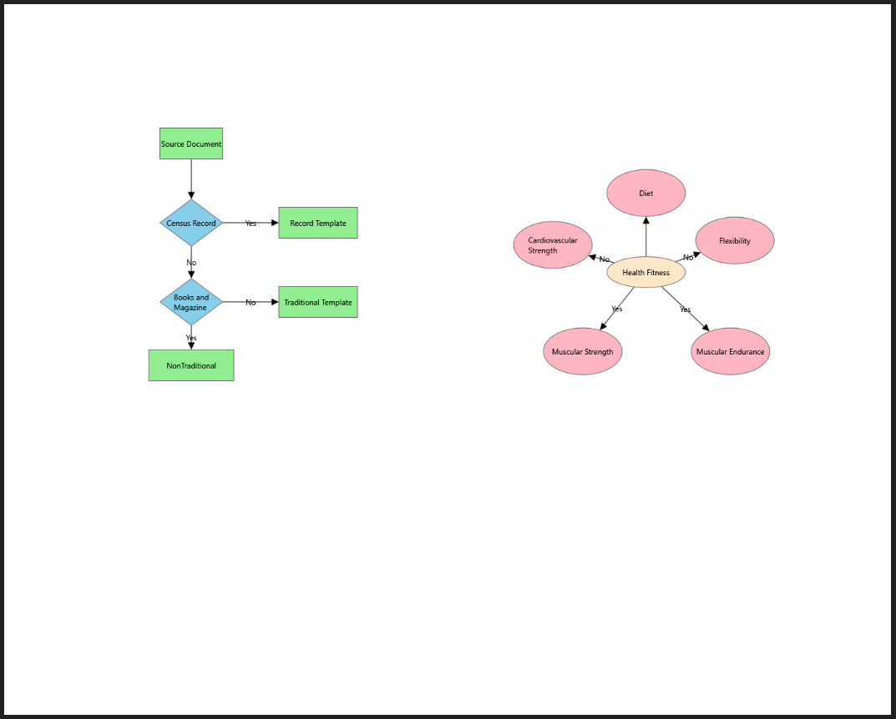

# Exporting

SfDiagram provides support to export the desired region of the Diagram to desired formats.Contents of the SfDiagram can be exported as raster image files by using Export method. 

The exporting can be customized by using [ExportSettings](https://help.syncfusion.com/cr/cref_files/wpf/Syncfusion.SfDiagram.WPF~Syncfusion.UI.Xaml.Diagram.ExportSettings_members.html) property of the SfDiagram.

## Exporting formats

SfDiagram allows to specify the type/format of the exported file. You can export diagram to the following formats:

* PNG
* JPEG
* TIFF
* GIF
* BMP
* WDP
* PDF
* XPS

`FileName` property of `ExportSettings` class is the name of the file to be exported. By default, the file name is set to Diagram.




//Initialize the export settings
ExportSettings settings = new ExportSettings()
{  
  FileName = "export.png",
}; 

diagram.ExportSettings = settings;         
//Method to Export the SfDiagram
diagram.Export();




To export the diagram into xps file format, enable the `IsSaveToXps` property of `ExportSettings` class.




//Initialize the export settings
ExportSettings settings = new ExportSettings()
{  
  IsSaveToXps = true,
  FileName = "export.xps",
}; 

diagram.ExportSettings = settings;         
//Method to Export the SfDiagram
diagram.Export();




## Exporting Mode

SfDiagram allows to export the page region of the diagram or to export the content of the diagram only using `ExportMode` property of `ExportSettings` class.



<!--Initialize the SfDiagram-->
<syncfusion:SfDiagram x:Name="diagram">
  <!--Initialize the export settings-->
  <syncfusion:SfDiagram.ExportSettings>
    <syncfusion:ExportSettings ExportMode="PageSettings"/>
  </syncfusion:SfDiagram.ExportSettings>
</syncfusion:SfDiagram>



//Initialize the export settings
ExportSettings settings = new ExportSettings()
  {  
    ExportMode = ExportMode.PageSettings,
  }; 
   
diagram.ExportSettings = settings;         
//Method to Export the SfDiagram
diagram.Export();




| ExportMode| Description | Output |
|---|---|---|
| PageSettings| Region that fits all pages (single or multiple pages based on page settings) | |
| Content| Region that fits all nodes and connectors that are added to model | |

## How to export specific area

Diagram supports to export any specific area of diagram page by using 'Clip' proerty of `ExportSettings` class.



<!--Initialize the SfDiagram-->
<syncfusion:SfDiagram x:Name="diagram">
  <!--Initialize the export settings with clipping area-->
  <syncfusion:SfDiagram.ExportSettings>
    <syncfusion:ExportSettings Clip="200, 200, 200, 300"/>
  </syncfusion:SfDiagram.ExportSettings>
</syncfusion:SfDiagram>



//Initialize the export settings with clipping area
ExportSettings settings = new ExportSettings()
  {  
    Clip = new Rect(200,0,200,500),
  }; 
   
diagram.ExportSettings = settings;         
//Method to Export the SfDiagram
diagram.Export();




## How to change the background of the exported files

Diagram supports to change the background color of the exported page using 'ExportBackground' property of `ExportSettings` class.



<!--Initialize the SfDiagram-->
<syncfusion:SfDiagram x:Name="diagram">
  <!--Initialize the export settings with clipping area-->
  <syncfusion:SfDiagram.ExportSettings>
    <syncfusion:ExportSettings ExportBackground="Blue"/>
  </syncfusion:SfDiagram.ExportSettings>
</syncfusion:SfDiagram>



//Initialize the export settings with clipping area
ExportSettings settings = new ExportSettings()
  {  
    ExportBackground = new SolidColorBrush(Colors.Blue),
  }; 
   
diagram.ExportSettings = settings;         
//Method to Export the SfDiagram
diagram.Export();




## Export To PDF

SfDiagram provides support to export the Diagram as XPS format by using the `IsSaveToXps` property of `ExportSettings`.

We can convert the XPS document into PDF file through `Syncfusion.XPS.XPSToPdfConverter`.Please refer to the KB link to [Export the SfDiagram as PDF](https://www.syncfusion.com/kb/8494/how-to-export-the-diagram-as-pdf).