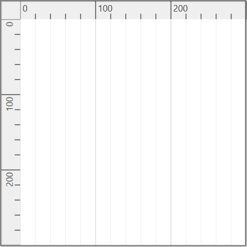
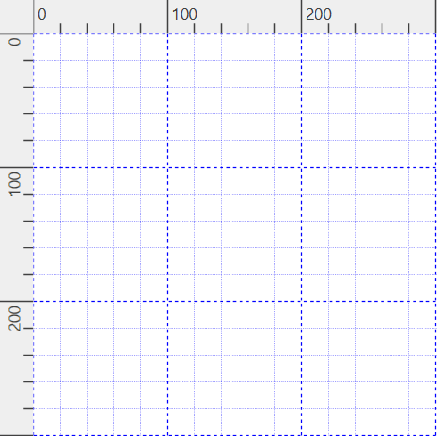
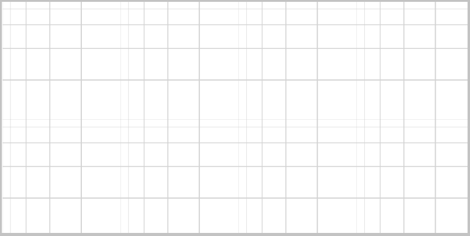

# Gridlines in WPF Diagram (SfDiagram)

**Gridlines** are crisscross lines drawn in diagram page like the lines on traditional graph paper. It helps to position the diagram elements on the diagram page.

The `SnapConstraints` property of SnapSettings class allows you to control the visibility of the gridlines.



<!--Initialize SfDiagram-->
<syncfusion:SfDiagram x:Name="diagram">
    <!--Initialize SnapSettings constraints to show Gridlines-->
    <syncfusion:SfDiagram.SnapSettings>
        <syncfusion:SnapSettings SnapConstraints="ShowLines"/>
    </syncfusion:SfDiagram.SnapSettings>
</syncfusion:SfDiagram>


//Initialize SfDiagram
SfDiagram diagram = new SfDiagram();
//Initialize SnapSettings constraints to show Gridlines
diagram.SnapSettings = new SnapSettings()
{
    SnapConstraints = SnapConstraints.ShowLines,
};



| Enum  | Value| Output |
|---|---|---|
| SnapConstraints| None |  |
|  |VerticalLines |  |
|  | HorizontalLines|  |
|  | ShowLines|  |

## Change grid lines appearance

The `HorizontalGridLines` and `VerticalGridLines` properties of SnapSettings class allows you to customize the appearance of the gridlines. 




<!--Style for Gridlines-->
<local:Gridlinestyle x:Key="gridlinestyle">
    
</local:Gridlinestyle>

<!--Initialize SfDiagram-->
<syncfusion:SfDiagram x:Name="diagram" >
    <!--Initialize Snap Settings-->
    <syncfusion:SfDiagram.SnapSettings>
        <syncfusion:SnapSettings SnapConstraints="ShowLines">
            <!--Initialize Horizontal Gridlines-->
            <syncfusion:SnapSettings.HorizontalGridlines>
                <syncfusion:Gridlines Strokes="{StaticResource gridlinestyle}"/>
            </syncfusion:SnapSettings.HorizontalGridlines>
            <!--Initialize Vertical Gridlines-->
            <syncfusion:SnapSettings.VerticalGridlines>
                <syncfusion:Gridlines Strokes="{StaticResource gridlinestyle}"/>
            </syncfusion:SnapSettings.VerticalGridlines>
        </syncfusion:SnapSettings>
    </syncfusion:SfDiagram.SnapSettings>
</syncfusion:SfDiagram>




//Initialize SfDiagram
SfDiagram diagram = new SfDiagram();
//Style for Gridlines
Style pathStyle = new Style(typeof(Path));
pathStyle.Setters.Add(new Setter(Shape.StrokeProperty, new SolidColorBrush(Colors.Blue)));
pathStyle.Setters.Add(new Setter(Shape.StrokeDashArrayProperty, new DoubleCollection() { 3, 3 }));

//Initialize SnapSettings constraints with HorizontalGridlines and VerticalGridlines values
diagram.SnapSettings = new SnapSettings()
{
    SnapConstraints = SnapConstraints.ShowLines,
    HorizontalGridlines = new Gridlines()
    {
        Strokes = new Gridlinestyle { pathStyle }
    },
    VerticalGridlines = new Gridlines()
    {
        Strokes = new Gridlinestyle { pathStyle }
    },
};

//Creates collection for the style.
public class Gridlinestyle : List<Style>
{
}



## Change grid spacing

The thickness and space between the gridlines can be customized by using `LinesInterval` property of Gridlines class. The `LinesInterval` is a type of List<double> collection, where the values at the odd indexes are referred as thickness of the lines and the values at the even indexes are referred as space between the gridlines.



<!--Initializes the double collection-->
<local:Intervals x:Key="Intervals">
    <!--Thickness of the grid line-->
    <sys:Double>0.25</sys:Double>
    <!--Space between each gridlines-->
    <sys:Double>10</sys:Double>
    <sys:Double>0.5</sys:Double>
    <sys:Double>20</sys:Double>
    <sys:Double>1</sys:Double>
    <sys:Double>30</sys:Double>
    <sys:Double>1.25</sys:Double>
    <sys:Double>40</sys:Double>
    <sys:Double>1.5</sys:Double>
    <sys:Double>50</sys:Double>
</local:Intervals>

<!--Initialize SfDiagram-->
<syncfusion:SfDiagram x:Name="diagram" >
    <syncfusion:SfDiagram.SnapSettings>
        <syncfusion:SnapSettings SnapConstraints="ShowLines">
            <!--Initialize Horizontal Gridlines-->
            <syncfusion:SnapSettings.HorizontalGridlines>
                <syncfusion:Gridlines LinesInterval="{StaticResource Intervals}" />
            </syncfusion:SnapSettings.HorizontalGridlines>
            <!--Initialize Vertical Gridlines-->
            <syncfusion:SnapSettings.VerticalGridlines>
                <syncfusion:Gridlines LinesInterval="{StaticResource Intervals}"/>
            </syncfusion:SnapSettings.VerticalGridlines>
        </syncfusion:SnapSettings>
    </syncfusion:SfDiagram.SnapSettings>
</syncfusion:SfDiagram>



//Initialize SfDiagram
SfDiagram diagram = new SfDiagram();

//Initialize the double collection
Intervals intervals = new Intervals { 0.25, 10, 0.5, 20, 1, 30, 1.25, 40, 1.5, 50 };
//Initialize Snap Setting constraints with HorizontalGridlines and VerticalGridlines values
diagram.SnapSettings = new SnapSettings()
{
    SnapConstraints = SnapConstraints.ShowLines,
    HorizontalGridlines = new Gridlines()
    {
        //Define lines interval value
        LinesInterval = intervals,
    },
    VerticalGridlines = new Gridlines()
    {
        //Define lines interval value
        LinesInterval = intervals,
    },
};

//Creates collection for the double values.
public class Intervals : List<double>
{
}



Find the [Gridlines sample](https://github.com/SyncfusionExamples/WPF-Diagram-Examples/tree/master/Samples/Gridlines) to depict the Gridlines.



[How to snap the objects on gridlines](/wpf/diagram/snapping/definesnapping)


