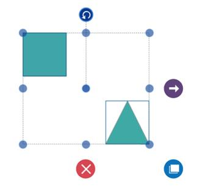
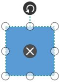
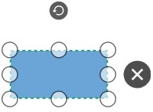

# Interaction

## Selection

Selector provides a visual representation of selected elements. It behaves like a container and enables you to update the size, position, and rotation angle of the selected elements through interaction and programmatically. Single or multiple elements can be selected at a time.

### Single Selection

An element can be selected by clicking that element. During single click, all previously selected items are cleared.

### Selecting a Group

When a child element of any Group is clicked, its contained Group is selected instead of the child element. With consecutive clicks on the selected element, selection is changed from top to bottom in the hierarchy of parent Group to its children.

### Multiple Selection

Multiple elements can be selected with the following ways.

1. Ctrl+Click

During single click, any existing item in the selection list be cleared, and only the item clicked recently is there in the selection list. To avoid cleaning the old selected item, Ctrl key must be on hold when clicking.

2. Selection rectangle / Rubber band selection

Clicking and dragging the Diagram area allows to create a rectangular region. The elements that are covered under the rectangular region are selected at the end.

Multiple selected elements are visually represented as shown.

* `SelectorChangedEvent` will notify you the OffsetX, OffsetY, Height, Width, Rotate Angle and interaction state with their old and new values.To explore about arguments, please refer to [SelectorChangedEventArgs](https://help.syncfusion.com/cr/cref_files/wpf/Syncfusion.SfDiagram.WPF~Syncfusion.UI.Xaml.Diagram.SelectorChangedEventArgs.html) .

### Selection Indicator Style

Multiple Selection will show the preview for the selected Items. We have provided customization option for the appearance of the Preview.

| Style | Behavior |
| --|--|
| NodeSelectionIndicatorStyle | Defines the customization option for Selection Preview for the Node. |
| ConnectorSelectionIndicatorStyle | Defines the customization option for Selection Preview for the Connector.|
| FirstSelectionIndicatorStyle | Defines the customization option for selection preview of first selected item.|

### Select/Unselect the elements programmatically

The `IsSelected` Property is used to select/unselect the elements at runtime.

The following code example illustrates how to select/unselect an item through programmatically.




// Selects an elements 
node.IsSelected = true;

// Unselect an element
node.IsSelected = false;




* `ItemSelectingEvent` and `ItemSelectedEvent` for selecting an element, will notify you the item and its original source. To explore about arguments ,please refer to [DiagramPreviewEventArgs](https://help.syncfusion.com/cr/cref_files/wpf/Syncfusion.SfDiagram.WPF~Syncfusion.UI.Xaml.Diagram.DiagramPreviewEventArgs.html) and [ItemSelectedEventArgs](https://help.syncfusion.com/cr/cref_files/wpf/Syncfusion.SfDiagram.WPF~Syncfusion.UI.Xaml.Diagram.ItemSelectedEventArgs.html) .

* `ItemUnselectingEvent` and `ItemUnselectedEvent` for unselecting an element, will notify you the item and its original source.To explore about arguments ,please refer to [DiagramPreviewEventArgs](https://help.syncfusion.com/cr/cref_files/wpf/Syncfusion.SfDiagram.WPF~Syncfusion.UI.Xaml.Diagram.DiagramPreviewEventArgs.html) and [DiagramEventArgs](https://help.syncfusion.com/cr/cref_files/wpf/Syncfusion.SfDiagram.WPF~Syncfusion.UI.Xaml.Diagram.DiagramEventArgs.html) .

## Deletion

Selected objects can be deleted by <kdb> Delete </kdb> and In-built Delete command. 

* `ItemDeletedEvent` will notify you with the deleted item in argument. To explore about arguments , please refer to [ItemDeletedEventArgs](https://help.syncfusion.com/cr/wpf/Syncfusion.SfDiagram.WPF~Syncfusion.UI.Xaml.Diagram.ItemDeletedEventArgs.html).

* `ItemDeletingEvent` will notify you with the item , option to cancel the deleting operation of item. To explore about arguments , please refer to [DiagramPreviewEventArgs](https://help.syncfusion.com/cr/cref_files/wpf/Syncfusion.SfDiagram.WPF~Syncfusion.UI.Xaml.Diagram.DiagramPreviewEventArgs.html)   

## Dragging based on DragLimit

Diagram provides support to drag the elements within the given limitations using `EditableArea`, `ScrollLimit.Limited` property and based on `SelectorChangedEvent` enabling/disabling of dragging within the limits occur.
In `SelectorChangedEvent` based on the arguments the process occurs,
* `Block`-If this boolean expression is set true, then the dragging occurs within the given rectangular area. If dragging exceeds than the limit, then it hit back to previous position.
Based on the `BlockPosition` the dragging of Block occurs.
* Block Position
  `SourcePosition`- the element moves to the previous position if it exceeds the limitation during dragging.
  `CurrentPosition`- the element present at the limited area position, it does not hit back to previous position during dragging.
* `Abort`- If this boolean is set to true, then dragging is occurs within the limit.
* `Cancel`- If this boolean is set to true, then the dragging of element does not occurs.   

## Drag and Drop Nodes over other elements

Diagram provides support to drop a node/connector over another node/connector. Drop event is raised to notify that an element is dropped over another one and it is disabled by default. It can enabled with the `AllowDrop` constraints property for both node and connector.




//Enable of AllowDrop Constraints for Node
Node.Constraints |= NodeConstraints.AllowDrop;




* `ItemDropEvent`, `DragEnter`, `DragOver` and `DragLeave` events will notify you the Source and elements that are interacted with the dropped element(target).To explore about arguments, please refer to [ItemDropEventArgs](https://help.syncfusion.com/cr/cref_files/wpf/Syncfusion.SfDiagram.WPF~Syncfusion.UI.Xaml.Diagram.ItemDropEventArgs.html) .

## Quick Command

### Define QuickCommand

Quick Commands are used to execute the commonly or frequently used commands around the Nodes, Connectors and Groups. There are 3 default Quick Commands for Nodes and Groups to execute Draw, Delete and Duplicate commands.




//Element to represent the frequently used commands
QuickCommandViewModel quick = new QuickCommandViewModel()
{
    //Outer part of quick command.
    Shape = App.Current.Resources["Ellipse"],
    //appearence of shape.
    ShapeStyle = App.Current.Resources["QuickCommandstyle"] as Style,
    //Inner part of quick command and it allows to host any UI elements
    Content = "M3.7399902,0L16,12.258972 28.26001,0 32,3.7399902 19.73999,16 32,28.258972 28.26001,32 16,19.73999 3.7399902,32 0,28.258972 12.26001,16 0,3.7399902z",
    Command = (Diagram.Info as IGraphInfo).Commands.Delete
};

//Adding new QuickCommand object in Commands collection
(Diagram.SelectedItems as SelectorViewModel).Commands = new QuickCommandCollection()
{
    quick
};


   

### Appearance

Appearance of the [QuickCommand](https://help.syncfusion.com/cr/cref_files/wpf/Syncfusion.SfDiagram.WPF~Syncfusion.UI.Xaml.Diagram.QuickCommandViewModel_members.html) can be customized by using `Shape`, `ShapeStyle`, `Content` and `ContentTemplate` properties.

By default QuickCommand will host on Node. [VisibilityMode](https://help.syncfusion.com/cr/cref_files/wpf/Syncfusion.SfDiagram.WPF~Syncfusion.UI.Xaml.Diagram.QuickCommandViewModel~VisibilityMode.html) property is to define the host of the QuickCommand either Node or Connector or both.    

### Alignment

QuickCommand can be aligned relative to boundaries of the Node or segments of the Connector. 

* `OffsetX` and `OffsetY` property of QuickCommand is used to align the QuickCommand based on fractions. 
* `HorizontalAlignment` and `VerticalAlignment`properties are used to align the quick commands for horizontal and vertical positions.
* `Margin` is an absolute value used to add some blank space in any one of its four sides.

The Alignment of QuickCommand is similar  to [Annotation Alignment](/wpf/sfdiagram/annotation#alignment "Alignment").   

Please refer to the sample to create a quick command.

Sample link :[QuickCommand](http://www.syncfusion.com/downloads/support/forum/144334/ze/User_Handle2114341399).

## Hit Padding

 Defines the connection with diagramming elements when the connector enters vicinity area of the diagramming elements.

For more information about HitPadding for Node, refer to [Hit Padding](/wpf/sfdiagram/node#hit-padding "Hit Padding").
For more information about HitPadding for Connector, refer to [Hit Padding](/wpf/sfdiagram/connector#hit-hadding "Hit Padding").

## Zoom pan 

* When a large Diagram is loaded, only certain portion of the Diagram is visible. The remaining portions are clipped. Clipped portions can be explored by scrolling the scrollbars or panning the Diagram.

* Diagram can be zoomed in or out by using Ctrl + mouse wheel.

## Keyboard

Diagram provides support to interact with the elements with key gestures. By default, some in-built commands are bound with a relevant set of key combinations.

The following table illustrates List of Commands with key Gesture.

| Shortcut Key | Command | Description |
|---|---|---|
| Ctrl + A | Select all | Select all the Nodes/Connectors in diagram. |
| Ctrl + C | Copy | Copy the selected elements in the diagram. |
| Ctrl + X | Cut | Cut the selected elements in the diagram. |
| Ctrl + V | Paste | Paste the cut or copy the elements in the diagram. |
| Ctrl + Z | Undo | Undo(Reverse the last editing action performed on diagram). |
| Ctrl + Y | Redo | Redo(Restores the last editing action when no other actions have occurred since the last undo on diagram). |
| Ctrl + D | Duplicate | Copies the selected element from the diagram and pastes the copied element into the diagram. |
| Delete | Delete | Delete the selected elements in the diagram. |
| LeftArrow | MoveLeft | MoveLeft (move the selected elements towards left by one pixel). |
| RightArrow | MoveRight | MoveRight (move the selected elements towards right by one pixel). |
| UpArrow | MoveUp | MoveUp (move the selected elements towards up by one pixel). |
| DownArrow | MoveDown | MoveDown (move the selected elements towards up by one pixel). |
| Ctrl + MouseScroll | Zoom | Zoom(Zoom in/Zoom out the diagram). |
| Ctrl + G | Group | Grouping the element in the diagram. |
| Ctrl + G | UnGroup | UnGrouping the element in the diagram. |
| Ctrl + Shift + [ | SendToBack | Moves the selected element behind all the other overlapped elements. |
| Ctrl + [ | SendBackward | Moves the selected element behind the underlying element. |
| Ctrl + Shift + ] | BringFront | Brings the selected element to front over all the other overlapped elements. |
| Ctrl + ] | BringForward | Moves the selected element over the nearest overlapping element. |

To add custom commands, configure or modify key/mouse gesture through [Command Manager](/wpf/sfdiagram/commands#command-manager "Command Manager");

## Deletion

Selected objects can be deleted by <kdb> Delete </kdb> and In-built Delete command. 

* `ItemDeletedEvent` will notify you with the deleted item in argument. To explore about arguments , please refer to [ItemDeletedEventArgs](https://help.syncfusion.com/cr/wpf/Syncfusion.SfDiagram.WPF~Syncfusion.UI.Xaml.Diagram.ItemDeletedEventArgs.html).

* `ItemDeletingEvent` will notify you with the item , option to cancel the deleting operation of item and option to decide on deleting dependent Connector when its Source/Target gets deleting. To explore about arguments , please refer to [ItemDeletingEventArgs](https://help.syncfusion.com/cr/wpf/Syncfusion.SfDiagram.WPF~Syncfusion.UI.Xaml.Diagram.ItemDeletingEventArgs.html).  




(diagram.Info as IGraphInfo).ItemDeletingEvent += MainWindow_ItemDeletingEvent;

/// 

/// DiagramPreviewEventArgs is the Base class for EventArgs.
/// Casting the args will help us to get ItemDeletingEventArgs.
/// 

/// <param name="sender"></param>
/// <param name="args"></param>
private void MainWindow_ItemDeletingEvent(object sender, DiagramPreviewEventArgs args)
{
    //For Deleting Node Without its Dependent Connector
    (args as ItemDeletingEventArgs).DeleteDependentConnector = false;
}
        



