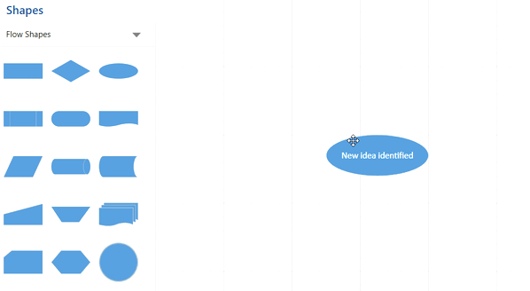

## Deletion in WPF Diagram (SfDiagram)

Selected objects can be deleted by using the Delete key or In-built Delete command through QuickCommand. 

* [ItemDeletedEvent](https://help.syncfusion.com/cr/wpf/Syncfusion.UI.Xaml.Diagram.IGraphInfo.html) will notify you with the deleted item in argument. To explore about arguments , please refer to [ItemDeletedEventArgs](https://help.syncfusion.com/cr/wpf/Syncfusion.UI.Xaml.Diagram.ItemDeletedEventArgs.html).

* [ItemDeletingEvent](https://help.syncfusion.com/cr/wpf/Syncfusion.UI.Xaml.Diagram.IGraphInfo.html) will notify you with the item , option to cancel the deleting operation of item and option to decide on deleting dependent Connector when its Source/Target gets deleting. To explore about arguments , please refer to [ItemDeletingEventArgs](https://help.syncfusion.com/cr/wpf/Syncfusion.UI.Xaml.Diagram.ItemDeletingEventArgs.html).  




(diagram.Info as IGraphInfo).ItemDeletingEvent += MainWindow_ItemDeletingEvent;

        /// 

        /// DiagramPreviewEventArgs is the Base class for EventArgs.
        /// Casting the args will help us to get ItemDeletingEventArgs.
        /// 

        /// <param name="sender"></param>
        /// <param name="args"></param>
        private void MainWindow_ItemDeletingEvent(object sender, DiagramPreviewEventArgs args)
        {
            //For Deleting Node Without its Dependent Connector

            (args as ItemDeletingEventArgs).DeleteDependentConnector = false;
        }
        



