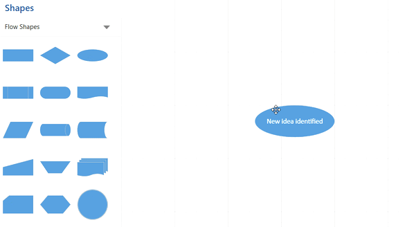

# Deletion in WPF SfDiagram

Selected objects can be deleted by using the Delete key or the built-in Delete command through QuickCommand. For more information about configuring and using QuickCommands, refer to the [QuickCommand](https://help.syncfusion.com/wpf/diagram/interaction/userhandle) documentation.

* [ItemDeletedEvent](https://help.syncfusion.com/cr/wpf/Syncfusion.UI.Xaml.Diagram.IGraphInfo.html#Syncfusion_UI_Xaml_Diagram_IGraphInfo_ItemDeleted) will notify you of the deleted item through the event arguments. To learn about arguments , please refer to [ItemDeletedEventArgs](https://help.syncfusion.com/cr/wpf/Syncfusion.UI.Xaml.Diagram.ItemDeletedEventArgs.html).

* [ItemDeletingEvent](https://help.syncfusion.com/cr/wpf/Syncfusion.UI.Xaml.Diagram.IGraphInfo.html#Syncfusion_UI_Xaml_Diagram_IGraphInfo_ItemDeletingEvent) will notify you with the item , an option to cancel the deleting operation of item and option to decide on deleting dependent Connector when its Source/Target is deleted. To learn about arguments, please refer to [ItemDeletingEventArgs](https://help.syncfusion.com/cr/wpf/Syncfusion.UI.Xaml.Diagram.ItemDeletingEventArgs.html).  




SfDiagram diagram = new SfDiagram();

(diagram.Info as IGraphInfo).ItemDeletingEvent += MainWindow_ItemDeletingEvent;

/// 

/// DiagramPreviewEventArgs is the Base class for EventArgs.
/// Casting the args will help us to get ItemDeletingEventArgs.
/// 

/// <param name="sender"></param>
/// <param name="args"></param>
private void MainWindow_ItemDeletingEvent(object sender, DiagramPreviewEventArgs args)
{
    //Prevent deletion of dependent connectors when deleting a node.

    (args as ItemDeletingEventArgs).DeleteDependentConnector = false;

    // For deleting the successor nodes and connectors
    // associated with the currently deleting node.
 
   (args as ItemDeletingEventArgs).DeleteSuccessors = true;
   
}
        



