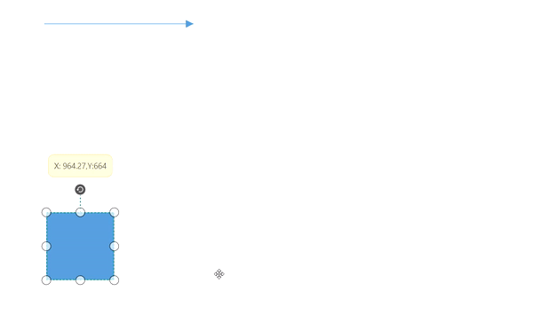

# Dragging based on DragLimit in WPF Diagram (SfDiagram)

Diagram provides support to drag the elements within the given limitations using [EditableArea](https://help.syncfusion.com/cr/wpf/Syncfusion.UI.Xaml.Diagram.ScrollSettings.html#Syncfusion_UI_Xaml_Diagram_ScrollSettings_EditableArea), [ScrollLimit.Limited](https://help.syncfusion.com/cr/wpf/Syncfusion.UI.Xaml.Diagram.ScrollLimit.html#Syncfusion_UI_Xaml_Diagram_ScrollLimit_Limited) property and based on [SelectorChangedEvent](https://help.syncfusion.com/cr/wpf/Syncfusion.UI.Xaml.Diagram.SelectorChangedEventArgs.html) enabling/disabling of dragging within the limits occur.

In `SelectorChangedEvent` based on the arguments the process occurs,
* [Block](https://help.syncfusion.com/cr/wpf/Syncfusion.UI.Xaml.Diagram.SelectorChangedEventArgs.html#Syncfusion_UI_Xaml_Diagram_SelectorChangedEventArgs_Block): If this boolean expression is set to true, then the dragging occurs within the given rectangular area. If dragging exceeds than the limit, then it hit back to previous position. Based on the `BlockPosition` the dragging of Block occurs.

* [BlockPosition](https://help.syncfusion.com/cr/wpf/Syncfusion.UI.Xaml.Diagram.SelectorChangedEventArgs.html#Syncfusion_UI_Xaml_Diagram_SelectorChangedEventArgs_BlockPosition):  It is an enum that encapsulates two properties:

  * [SourcePosition](https://help.syncfusion.com/cr/wpf/Syncfusion.UI.Xaml.Diagram.BlockPosition.html#Syncfusion_UI_Xaml_Diagram_BlockPosition_SourcePostion)- When the element exceeds the dragging limitation, it moves back to its previous position.

  * [CurrentPosition](https://help.syncfusion.com/cr/wpf/Syncfusion.UI.Xaml.Diagram.BlockPosition.html#Syncfusion_UI_Xaml_Diagram_BlockPosition_CurrentPosition)- The element remains within the limited area position and does not return to the previous position during dragging.

* [Abort](https://help.syncfusion.com/cr/wpf/Syncfusion.UI.Xaml.Diagram.SelectorChangedEventArgs.html#Syncfusion_UI_Xaml_Diagram_SelectorChangedEventArgs_Abort): If this boolean is set to true, dragging is restricted within the defined limits.
* [Cancel](https://help.syncfusion.com/cr/wpf/Syncfusion.UI.Xaml.Diagram.SelectorChangedEventArgs.html#Syncfusion_UI_Xaml_Diagram_SelectorChangedEventArgs_Cancel): If this boolean is set to true, dragging of the element does not occur at all.   

[Refer](https://help.syncfusion.com/wpf/diagram/scroll-settings/scrolllimit) for Scroll-Limit.

## Dragging Diagram elements in vertical and horizontal axis

Diagram provides support to drag its elements in either vertical or horizontal directions by holding down SHIFT key while dragging the diagram elements.

## Drag and Drop Nodes over other elements

Diagram provides support to drop a [node](https://help.syncfusion.com/cr/wpf/Syncfusion.UI.Xaml.Diagram.NodeViewModel.html) over another node or [connector](https://help.syncfusion.com/cr/wpf/Syncfusion.UI.Xaml.Diagram.ConnectorViewModel.html). Drop event is raised to notify that an element is dropped over another one and it is disabled by default. It can enabled with the [AllowDrop](https://help.syncfusion.com/cr/wpf/Syncfusion.UI.Xaml.Diagram.NodeConstraints.html) constraints property for both node and connector.




<syncfusion:SfDiagram.Nodes>
    <syncfusion:NodeCollection>
        <syncfusion:NodeViewModel Constraints="AllowDrop" 
                                  UnitHeight="100" UnitWidth="100"
                                  OffsetX="300" OffsetY="300"/>
    </syncfusion:NodeCollection>
</syncfusion:SfDiagram.Nodes>




//Enable AllowDrop Constraints for Node

Node.Constraints |= NodeConstraints.AllowDrop;




Similarly, you can enable [AllowDrop](https://help.syncfusion.com/cr/wpf/Syncfusion.UI.Xaml.Diagram.ConnectorConstraints.html) constraints for connector to drop a node over connector.

[View Sample in GitHub](https://github.com/SyncfusionExamples/WPF-Diagram-Examples/tree/master/Samples/Interaction/IndicatorStyle-sample)

## Customize the appearance of Drop Indicator

Drag and drop a node over another node or connector will show the preview for the target node or connector. We have provided customization option for the appearance of the Preview.

| Style | Behavior |
| --|--|
| [NodeDropIndicatorStyle](https://help.syncfusion.com/cr/wpf/Syncfusion.UI.Xaml.Diagram.SfDiagram.html#Syncfusion_UI_Xaml_Diagram_SfDiagram_NodeDropIndicatorStyle) | Defines the customization option for preview for the Node. |
| [ConnectorDropIndicatorStyle](https://help.syncfusion.com/cr/wpf/Syncfusion.UI.Xaml.Diagram.SfDiagram.html#Syncfusion_UI_Xaml_Diagram_SfDiagram_ConnectorDropIndicatorStyle) | Defines the customization option for preview for the Connector.|




<Syncfusion:SfDiagram x:Name="Diagram" 
                      NodeDropIndicatorStyle="{StaticResource Nodedropindicator}"
                      ConnectorDropIndicatorStyle="{StaticResource connectordropindicator}">




SfDiagram Diagram = new SfDiagram();

Diagram.NodeDropIndicatorStyle = this.Resources["Nodedropindicator"] as Style;

Diagram.ConnectorDropIndicatorStyle = this.Resources["connectordropindicator"] as Style;




[View Sample in GitHub](https://github.com/SyncfusionExamples/WPF-Diagram-Examples/tree/master/Samples/Interaction/IndicatorStyle-sample)

## Events 

* [ItemDropEvent](https://help.syncfusion.com/cr/wpf/Syncfusion.UI.Xaml.Diagram.IGraphInfo.html#Syncfusion_UI_Xaml_Diagram_IGraphInfo_ItemDropEvent), [DragEnter](https://help.syncfusion.com/cr/wpf/Syncfusion.UI.Xaml.Diagram.IGraphInfo.html#Syncfusion_UI_Xaml_Diagram_IGraphInfo_DragEnter), [DragOver](https://help.syncfusion.com/cr/wpf/Syncfusion.UI.Xaml.Diagram.IGraphInfo.html#Syncfusion_UI_Xaml_Diagram_IGraphInfo_DragOver) and [DragLeave](https://help.syncfusion.com/cr/wpf/Syncfusion.UI.Xaml.Diagram.IGraphInfo.html#Syncfusion_UI_Xaml_Diagram_IGraphInfo_DragLeave) events will notify you the Source and elements that are interacted with the dropped element(target).To explore about arguments, please refer to [ItemDropEventArgs](https://help.syncfusion.com/cr/wpf/Syncfusion.UI.Xaml.Diagram.ItemDropEventArgs.html).

## See Also

[How to drag and drop elements between diagrams?](https://support.syncfusion.com/kb/article/6270/how-to-enable-drag-the-node-from-one-diagram-to-another-wpf-diagram-sfdiagram)

[How to restrict the diagram objects dragging in the positive side?](https://support.syncfusion.com/kb/article/9917/how-to-restrict-the-diagram-objects-dragging-in-the-positive-side-in-the-wpf-diagram)

[How to drag and drop elements from treeview?](https://support.syncfusion.com/kb/article/9277/how-to-drag-and-drop-elements-from-treeview-in-wpf-diagram-sfdiagram)

[How to drag and drop different shapes from SfTreeView to WPF Diagram?](https://support.syncfusion.com/kb/article/10960/how-to-drag-and-drop-different-shapes-from-sftreeview-to-wpf-diagram-sfdiagram)

[How to create parent and child relationship by drag and drop nodes?](https://support.syncfusion.com/kb/article/10008/how-to-create-parent-and-child-relationship-by-drag-and-drop-nodes-in-wpf-diagram-sfdiagram)

[How to restrict the child node dragging whereas allow group dragging?](https://support.syncfusion.com/kb/article/9921/how-to-restrict-the-child-node-dragging-whereas-allow-group-dragging-in-wpf-diagram)

[How to show the copied diagram elements as preview image along with the mouse pointer?](https://support.syncfusion.com/kb/article/12037/how-to-show-the-copied-diagram-elements-as-preview-image-along-with-the-mouse-pointer-in)

[How to update the z-index of the dragged node?](https://support.syncfusion.com/kb/article/10388/how-to-update-the-zindex-of-the-dragged-node-in-wpf-diagram-sfdiagram)

[How to create filled PolyLine Node?](https://support.syncfusion.com/kb/article/10255/how-to-create-filled-polyline-node-in-wpf-diagram-sfdiagram)

[How to restrict diagram objects dragging in the positive side?](https://support.syncfusion.com/kb/article/9917/how-to-restrict-diagram-objects-dragging-in-the-positive-side-in-wpf-diagram)

[How to enable the behaviour of drag the node from one diagram to another diagram?](https://support.syncfusion.com/kb/article/6270/how-to-enable-drag-the-node-from-one-diagram-to-another-wpf-diagram-sfdiagram)

[How to Restrict Node is being removed from its Parent Container when Dragging in WPF Diagram (SfDiagram)](https://support.syncfusion.com/kb/article/15644/how-to-restrict-node-is-being-removed-from-its-parent-container-when-dragging-in-wpf-diagram-sfdiagram)

[How to prevent the connector segment from collapsing while dragging a node in WPF Diagram (SfDiagram) ?](https://support.syncfusion.com/kb/article/17746/how-to-prevent-the-connector-segment-from-collapsing-while-dragging-a-node-in-wpf-diagram-sfdiagram-)

[How to drag and drop different shapes from SfTreeView to WPF Diagram (SfDiagram)?](https://support.syncfusion.com/kb/article/10960/how-to-drag-and-drop-different-shapes-from-sftreeview-to-wpf-diagram-sfdiagram)

[How to update the Zindex of the dragged node in WPF Diagram (SfDiagram)?](https://support.syncfusion.com/kb/article/10388/how-to-update-the-zindex-of-the-dragged-node-in-wpf-diagram-sfdiagram)
