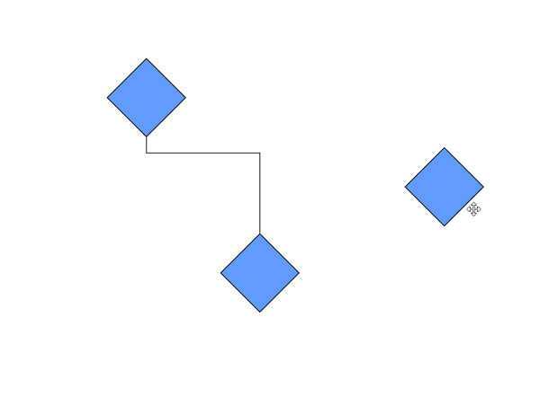

## Dragging based on DragLimit

Diagram provides support to drag the elements within the given limitations using [EditableArea](https://help.syncfusion.com/cr/wpf/Syncfusion.UI.Xaml.Diagram.ScrollSettings.html#Syncfusion_UI_Xaml_Diagram_ScrollSettings_EditableArea), [ScrollLimit.Limited](https://help.syncfusion.com/cr/wpf/Syncfusion.Windows.Diagram.ScrollLimit.html) property and based on [SelectorChangedEvent](https://help.syncfusion.com/cr/wpf/Syncfusion.UI.Xaml.Diagram.SelectorChangedEventArgs.html) enabling/disabling of dragging within the limits occur.

In `SelectorChangedEvent` based on the arguments the process occurs,
* [Block](https://help.syncfusion.com/cr/wpf/Syncfusion.UI.Xaml.Diagram.SelectorChangedEventArgs.html#Syncfusion_UI_Xaml_Diagram_SelectorChangedEventArgs_Block)-If this boolean expression is set true, then the dragging occurs within the given rectangular area. If dragging exceeds than the limit, then it hit back to previous position.
Based on the [BlockPosition](https://help.syncfusion.com/cr/wpf/Syncfusion.UI.Xaml.Diagram.SelectorChangedEventArgs.html#Syncfusion_UI_Xaml_Diagram_SelectorChangedEventArgs_BlockPosition) the dragging of Block occurs.
* Block Position
  `SourcePosition`- the element moves to the previous position if it exceeds the limitation during dragging.
  `CurrentPosition`- the element present at the limited area position, it does not hit back to previous position during dragging.
* [Abort](https://help.syncfusion.com/cr/wpf/Syncfusion.UI.Xaml.Diagram.SelectorChangedEventArgs.html#Syncfusion_UI_Xaml_Diagram_SelectorChangedEventArgs_Abort)- If this boolean is set to true, then dragging is occurs within the limit.
* [Cancel](https://help.syncfusion.com/cr/wpf/Syncfusion.UI.Xaml.Diagram.SelectorChangedEventArgs.html#Syncfusion_UI_Xaml_Diagram_SelectorChangedEventArgs_Cancel)- If this boolean is set to true, then the dragging of element does not occurs.   

[Refer](https://help.syncfusion.com/wpf/diagram/scroll-settings/scrolllimit) for Scroll-Limit.

## Drag and Drop Nodes over other elements

Diagram provides support to drop a [node](https://help.syncfusion.com/cr/wpf/Syncfusion.UI.Xaml.Diagram.NodeViewModel.html) over another node or [connector](https://help.syncfusion.com/cr/wpf/Syncfusion.UI.Xaml.Diagram.ConnectorViewModel.html). Drop event is raised to notify that an element is dropped over another one and it is disabled by default. It can enabled with the [AllowDrop](https://help.syncfusion.com/cr/wpf/Syncfusion.UI.Xaml.Diagram.NodeConstraints.html) constraints property for both node and connector.




//Enable AllowDrop Constraints for Node

Node.Constraints |= NodeConstraints.AllowDrop;




Similarly, you can enable [AllowDrop](https://help.syncfusion.com/cr/wpf/Syncfusion.UI.Xaml.Diagram.ConnectorViewModel.html#Syncfusion_UI_Xaml_Diagram_ConnectorViewModel_Constraints) constraints for connector to drop a node over connector.

[View Sample in GitHub](https://github.com/SyncfusionExamples/WPF-Diagram-Examples/tree/master/Samples/Interaction/IndicatorStyle-sample)

## Customize the appearance of Drop Indicator

Drag and drop a node over another node or connector will show the preview for the target node or connector. We have provided customization option for the appearance of the Preview.

| Style | Behavior |
| --|--|
| [NodeDropIndicatorStyle](https://help.syncfusion.com/cr/wpf/Syncfusion.UI.Xaml.Diagram.SfDiagram.html#Syncfusion_UI_Xaml_Diagram_SfDiagram_NodeDropIndicatorStyle) | Defines the customization option for preview for the Node. |
| [ConnectorDropIndicatorStyle](https://help.syncfusion.com/cr/wpf/Syncfusion.UI.Xaml.Diagram.SfDiagram.html#Syncfusion_UI_Xaml_Diagram_SfDiagram_ConnectorDropIndicatorStyle) | Defines the customization option for preview for the Connector.|




            <
            
            

<Syncfusion:SfDiagram x:Name="Diagram" 
                              NodeDropIndicatorStyle="{StaticResource Nodedropindicator}"
                              ConnectorDropIndicatorStyle="{StaticResource connectordropindicator}">




SfDiagram Diagram = new SfDiagram();

Diagram.NodeDropIndicatorStyle = this.Resources["Nodedropindicator"] as Style;

Diagram.ConnectorDropIndicatorStyle = this.Resources["connectordropindicator"] as Style;




[View Sample in GitHub](https://github.com/SyncfusionExamples/WPF-Diagram-Examples/tree/master/Samples/Interaction/IndicatorStyle-sample)

## Events 

* [ItemDropEvent](https://help.syncfusion.com/cr/wpf/Syncfusion.UI.Xaml.Diagram.IGraphInfo.html), [DragEnter](https://help.syncfusion.com/cr/wpf/Syncfusion.UI.Xaml.Diagram.IGraphInfo.html), [DragOver](https://help.syncfusion.com/cr/wpf/Syncfusion.UI.Xaml.Diagram.IGraphInfo.html) and [DragLeave](https://help.syncfusion.com/cr/wpf/Syncfusion.UI.Xaml.Diagram.IGraphInfo.html) events will notify you the Source and elements that are interacted with the dropped element(target).To explore about arguments, please refer to [ItemDropEventArgs](https://help.syncfusion.com/cr/wpf/Syncfusion.UI.Xaml.Diagram.ItemDropEventArgs.html).

## See Also

* [How to drag and drop elements between diagrams](https://www.syncfusion.com/kb/6981/how-to-enable-drag-the-node-from-one-diagram-to-another-diagram-in-wpf-sfdiagram)

* [How to restrict the diagram objects dragging in the positive side?](https://www.syncfusion.com/kb/11521/how-to-restrict-the-diagram-objects-dragging-in-the-positive-side-in-the)

* [How to drag and drop elements from treeview?](https://www.syncfusion.com/kb/10574/how-to-drag-and-drop-elements-from-treeview-in-wpf-diagramsfdiagram)

* [How to create parent and child relationship by drag and drop nodes?](https://www.syncfusion.com/kb/11401/how-to-create-parent-and-child-relationship-by-drag-and-drop-nodes-in-wpf-diagramsfdiagram)

* [How to restrict the child node dragging whereas allow group dragging?](https://www.syncfusion.com/kb/11462/how-to-restrict-the-child-node-dragging-whereas-allow-group-dragging-in-wpf)
