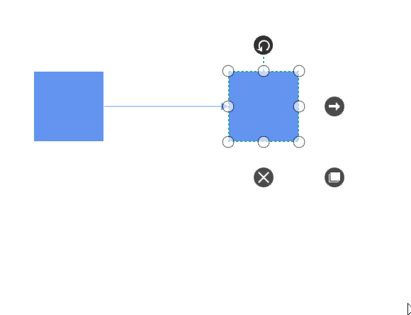
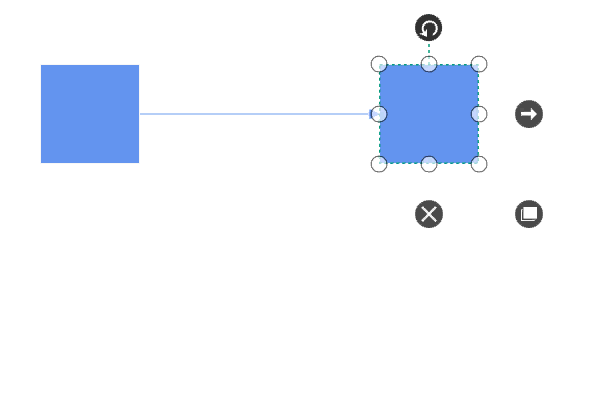
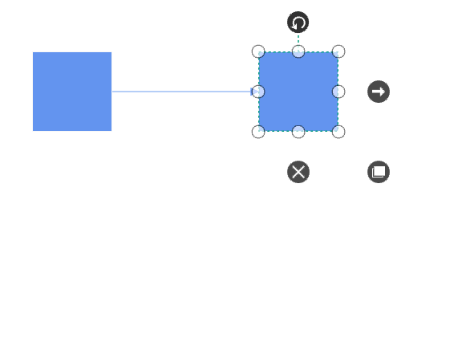

# Preview Settings in WPF SfDiagram

[WPF Diagram](https://www.syncfusion.com/diagram-sdk/wpf-diagram) provides support to drag objects as an outline without affecting the original object. When multiple elements are selected, the outline of every selected element is moved.

Preview Dragging can be enabled by assigning values other than [PreviewMode.Preview](https://help.syncfusion.com/cr/wpf/Syncfusion.UI.Xaml.Diagram.PreviewMode.html) to [SfDiagram.PreviewSettings.PreviewMode](https://help.syncfusion.com/cr/wpf/Syncfusion.UI.Xaml.Diagram.PreviewSettings.html#Syncfusion_UI_Xaml_Diagram_PreviewSettings_PreviewMode).

By default, Outline of the connectors connected to the dragging objects will be disabled state. But, you can view the outline of the connectors, by holding dragged objects for certain time span. [`ConnectorRefreshingSpan`](https://help.syncfusion.com/cr/wpf/Syncfusion.UI.Xaml.Diagram.PreviewSettings.html#Syncfusion_UI_Xaml_Diagram_PreviewSettings_ConnectorRefreshingSpan) property of [PreviewSettings](https://help.syncfusion.com/cr/wpf/Syncfusion.UI.Xaml.Diagram.PreviewSettings.html) allows you to specify the time span and the value should be greater than 300ms.





  <!--Create SfDiagram Instance-->
  <syncfusion:SfDiagram x:Name="Diagram">
      <syncfusion:SfDiagram.PreviewSettings>
          <syncfusion:PreviewSettings PreviewMode="Preview" ConnectorRefreshingSpan="300"></syncfusion:PreviewSettings>
      </syncfusion:SfDiagram.PreviewSettings>
  </syncfusion:SfDiagram>




SfDiagram diagram = new SfDiagram();

this.diagram.PreviewSettings = new PreviewSettings() { PreviewMode = PreviewMode.Preview, ConnectorRefreshingSpan = 300 };




## Appearance

Appearance of the preview can be customized using [`PreviewStyle`](https://help.syncfusion.com/cr/wpf/Syncfusion.UI.Xaml.Diagram.PreviewSettings.html#Syncfusion_UI_Xaml_Diagram_PreviewSettings_PreviewStyle) property of `PreviewSettings`.





  <!--Create SfDiagram Instance-->
  <syncfusion:SfDiagram x:Name="Diagram">
      <syncfusion:SfDiagram.PreviewSettings>
          <syncfusion:PreviewSettings PreviewMode="Preview" ConnectorRefreshingSpan="300" PreviewStyle="{StaticResource previewstyle}"></syncfusion:PreviewSettings>
      </syncfusion:SfDiagram.PreviewSettings>
  </syncfusion:SfDiagram>




SfDiagram diagram = new SfDiagram();

var previewStyle = new Style();
previewStyle.TargetType = typeof(Shape);
previewStyle.Setters.Add(new Setter() { Property = Shape.StrokeProperty, Value = new SolidColorBrush(Colors.CornflowerBlue) });
previewStyle.Setters.Add(new Setter() { Property = Shape.StrokeThicknessProperty, Value = 1.5 });
previewStyle.Setters.Add(new Setter() { Property = Shape.StrokeDashArrayProperty, Value = new DoubleCollection { 3, 3 } });
this.diagram.PreviewSettings = new PreviewSettings() { PreviewMode = PreviewMode.Preview, ConnectorRefreshingSpan = 300, PreviewStyle = previewStyle };




[View sample in GitHub](https://github.com/SyncfusionExamples/WPF-Diagram-Examples/tree/master/Samples/Interaction/PreviewSettings-sample).
