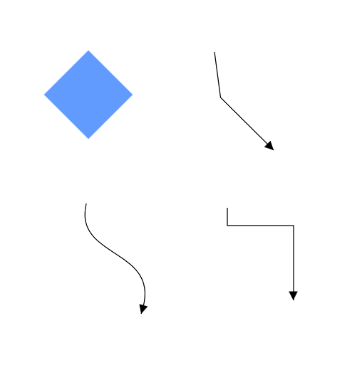
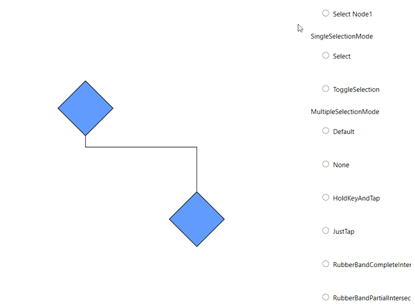
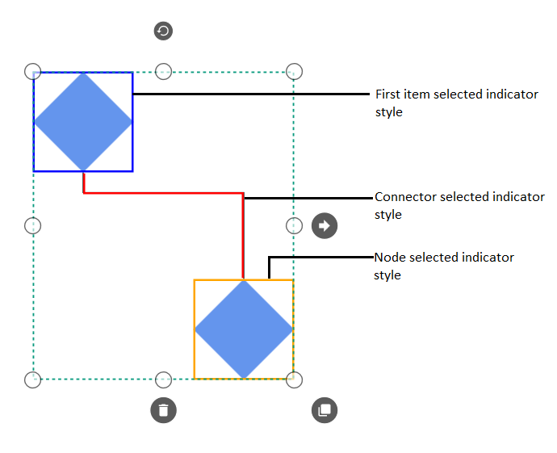
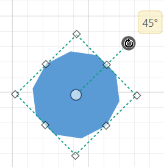

# Selection in WPF Diagram (SfDiagram)

[Selector](https://help.syncfusion.com/cr/wpf/Syncfusion.UI.Xaml.Diagram.Selector.html) provides a visual representation of selected elements. It behaves like a container and enables you to update the size, position, and rotation angle of the selected elements through interaction and programmatically. Single or multiple elements can be selected at a time.

### Single Selection

An element can be selected by clicking that element. During single click, all previously selected items are cleared.The following image shows how the selected elements are visually represented.

### Selecting a Group

When a child element of any [Group](https://help.syncfusion.com/cr/wpf/Syncfusion.UI.Xaml.Diagram.GroupViewModel.html) is clicked, its contained Group is selected instead of the child element. With consecutive clicks on the selected element, selection is changed from top to bottom in the hierarchy of parent Group to its children.

### Multiple Selection

Multiple elements can be selected with the following ways.

1. Shift+Click

You can select the group of elements that are contiguous (i.e. next to each other) by clicking one element, and then holding Shift and clicking the last element. All the element in the specified region are then selected.

2. Ctrl+Click

During single click, any existing item in the selection list be cleared, and only the item clicked recently is there in the selection list. To avoid cleaning the old selected item, Ctrl key must be on hold when clicking.

3. Selection rectangle / Rubber band selection

Clicking and dragging the Diagram area allows to create a rectangular region. The elements that are covered under the rectangular region are selected at the end.

Multiple selected elements are visually represented as shown.

* [SelectorChangedEvent](https://help.syncfusion.com/cr/wpf/Syncfusion.UI.Xaml.Diagram.IGraphInfo.html) will notify you the OffsetX, OffsetY, Height, Width, Rotate Angle and interaction state with their old and new values. To explore about arguments, please refer to [SelectorChangedEventArgs](https://help.syncfusion.com/cr/wpf/Syncfusion.UI.Xaml.Diagram.SelectorChangedEventArgs.html) .

#### Selection mode

[SingleSelectionMode](https://help.syncfusion.com/cr/wpf/Syncfusion.UI.Xaml.Diagram.SfDiagram.html#Syncfusion_UI_Xaml_Diagram_SfDiagram_SingleSelectionMode) and [MultipleSelectionMode](https://help.syncfusion.com/cr/wpf/Syncfusion.UI.Xaml.Diagram.SfDiagram.html#Syncfusion_UI_Xaml_Diagram_SfDiagram_MultipleSelectionMode) properties of SfDiagram allows us to decide which kind of selection need to be handle .To explore about modes, please refer to [SingleSelectionMode](https://help.syncfusion.com/cr/wpf/Syncfusion.UI.Xaml.Diagram.SingleSelectionMode.html) and [MultipleSelectionMode](https://help.syncfusion.com/cr/wpf/Syncfusion.UI.Xaml.Diagram.MultipleSelectionMode.html).

|SingleSelectionMode|Description|
|--|--|
|Select|Enables or disables single selection mode as Select. It is used to stop Unselection again click the same node which means the node remains always selected.|
|ToggleSelection|Enables or disables single selection mode as ToggleSelection.It is used to perform selection or unselection again click the same node.|




<Syncfusion:SfDiagram x:Name="Diagram" 
                               SingleSelectionMode="Select">




SfDiagram Diagram = new SfDiagram();

Diagram.SingleSelectionMode = SingleSelectionMode.Select;




|MultipleSelectionMode|Description|
|--|--|
|Default|Enables all behaviors of the control.|
|HoldKeyAndTap|Enables or disables elements can be selected by holding a key and tapping.|
|JustTap|Enables or disables elements can be selected by tapping.|
|None|Disables all behaviors.|
|RubberBandCompleteIntersect|Enables or disables elements that are completely positioned in the selection rectangle will be selected.|
|RubberBandPartialIntersect|Elements that intersect with the selection rectangle will be selected.|

[View sample in GitHub](https://github.com/SyncfusionExamples/WPF-Diagram-Examples/tree/master/Samples/Interaction/Selectionmode-sample)

### Select/Unselect the elements programmatically

The `IsSelected` Property is used to select/unselect the elements at runtime.

The following code example illustrates how to select/unselect an item  programmatically.




// Selects an elements 

node.IsSelected = true;

// Unselect an element

node.IsSelected = false;




[View sample in GitHub](https://github.com/SyncfusionExamples/WPF-Diagram-Examples/tree/master/Samples/Interaction/Selectionmode-sample)

### Selection Indicator Style

Multiple Selection will show the preview for the selected items. We have provided customization option for the appearance of the Preview.

| Style | Behavior |
| --|--|
| [NodeSelectionIndicatorStyle](https://help.syncfusion.com/cr/wpf/Syncfusion.UI.Xaml.Diagram.SfDiagram.html#Syncfusion_UI_Xaml_Diagram_SfDiagram_NodeSelectionIndicatorStyle) | Defines the customization option for Selection Preview for the Node. |
| [ConnectorSelectionIndicatorStyle](https://help.syncfusion.com/cr/wpf/Syncfusion.UI.Xaml.Diagram.SfDiagram.html#Syncfusion_UI_Xaml_Diagram_SfDiagram_ConnectorSelectionIndicatorStyle) | Defines the customization option for Selection Preview for the Connector.|
| [FirstSelectionIndicatorStyle](https://help.syncfusion.com/cr/wpf/Syncfusion.UI.Xaml.Diagram.SfDiagram.html#Syncfusion_UI_Xaml_Diagram_SfDiagram_FirstSelectionIndicatorStyle) | Defines the customization option for selection preview of first selected item.|




            
            
            

            

<Syncfusion:SfDiagram x:Name="Diagram" 
                              FirstSelectionIndicatorStyle="{StaticResource FirstSelectionindicatorstyle}"
                              NodeSelectionIndicatorStyle="{StaticResource NodeSelectionindicatorstyle}"
                              ConnectorSelectionIndicatorStyle="{StaticResource connectorselectionindicatorstyle}">




SfDiagram Diagram = new SfDiagram();

Diagram.NodeSelectionIndicatorStyle = this.Resources["NodeSelectionindicatorstyle"] as Style;

Diagram.FirstSelectionIndicatorStyle = this.Resources["FirstSelectionindicatorstyle"] as Style;

Diagram.ConnectorSelectionIndicatorStyle = this.Resources["connectorselectionindicatorstyle"] as Style;




[View Sample in GitHub](https://github.com/SyncfusionExamples/WPF-Diagram-Examples/tree/master/Samples/Interaction/IndicatorStyle-sample)

### Selector handle display mode

Diagram control provides support to change the selection handle dislay mode of the Node, Connector, and Group by using `SelectorHandleDisplayMode` property.

|SelectorHandleDisplayMode|Description| Output|
|--|--|--|
|Default| It is used to display selection handle display mode as larger size bubbles. ||
|CompactSelector|It is used to display selection handle display mode as compact size rectangle.||

## Events

* [ItemSelectingEvent](https://help.syncfusion.com/cr/wpf/Syncfusion.UI.Xaml.Diagram.IGraphInfo.html) and [ItemSelectedEvent](https://help.syncfusion.com/cr/wpf/Syncfusion.UI.Xaml.Diagram.IGraphInfo.html) for selecting an element, will notify you the item and its original source. To explore about arguments ,please refer to [DiagramPreviewEventArgs](https://help.syncfusion.com/cr/wpf/Syncfusion.UI.Xaml.Diagram.DiagramPreviewEventArgs.html) and [ItemSelectedEventArgs](https://help.syncfusion.com/cr/wpf/Syncfusion.UI.Xaml.Diagram.ItemSelectedEventArgs.html) .

* [ItemUnselectingEvent](https://help.syncfusion.com/cr/wpf/Syncfusion.UI.Xaml.Diagram.IGraphInfo.html) and [ItemUnselectedEvent](https://help.syncfusion.com/cr/wpf/Syncfusion.UI.Xaml.Diagram.IGraphInfo.html) for unselecting an element, will notify you the item and its original source.To explore about arguments ,please refer to [DiagramPreviewEventArgs](https://help.syncfusion.com/cr/wpf/Syncfusion.UI.Xaml.Diagram.DiagramPreviewEventArgs.html) and [DiagramEventArgs](https://help.syncfusion.com/cr/wpf/Syncfusion.UI.Xaml.Diagram.DiagramEventArgs.html) .

## See Also 

* [How to customize the selection behavior of nodes and connectors?](https://www.syncfusion.com/kb/7457/how-to-customize-the-selection-behavior-of-nodes-and-connectors)

* [How to disable the selection in Diagram?](https://www.syncfusion.com/kb/5881/how-to-disable-the-selection-in-diagram)

