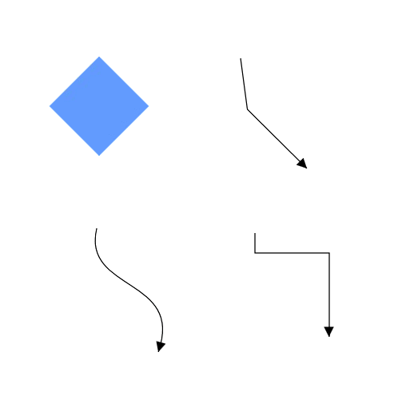
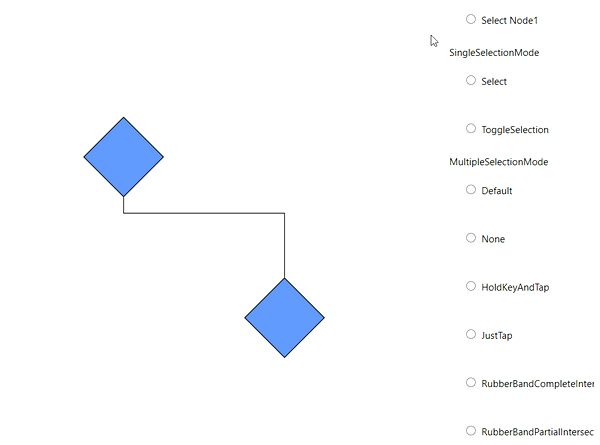
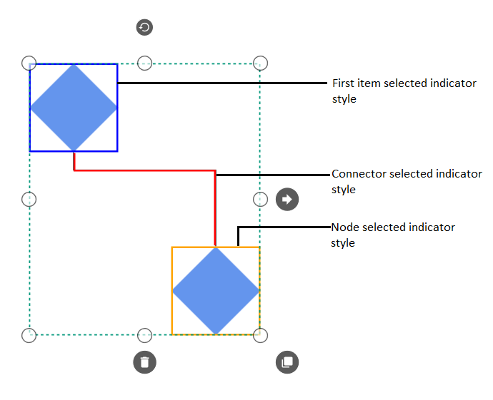
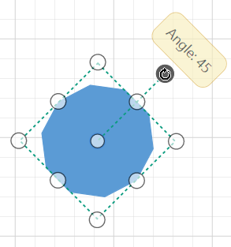
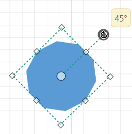

# Selection in WPF SfDiagram

[Selector](https://help.syncfusion.com/cr/wpf/Syncfusion.UI.Xaml.Diagram.Selector.html) provides a visual representation of selected elements. It behaves like a container and enables you to update the size, position, and rotation angle of the selected elements through interaction and programmatically. Single or multiple elements can be selected at a time.

## Single Selection

An element can be selected by clicking that element. During single click, all previously selected items are cleared. The following image shows how the selected elements are visually represented.

### Selecting a Group

When a child element of any [Group](https://help.syncfusion.com/cr/wpf/Syncfusion.UI.Xaml.Diagram.GroupViewModel.html) is clicked, its contained Group is selected instead of the child element. With consecutive clicks on the selected element, selection is changed from top to bottom in the hierarchy of parent Group to its children.

## Multiple Selection

Multiple elements can be selected in the following ways.

1. Shift+Click

    You can select the group of elements that are contiguous (i.e. next to each other) by clicking one element, and then holding Shift and clicking the last element. All the element in the specified region are then selected.

2. Ctrl+Click

    During single click, any existing item in the selection list will be cleared, and only the item clicked recently is there in the selection list. To avoid cleaning the old selected item, Ctrl key must be held down when clicking.

3. Selection rectangle / Rubber band selection

    Clicking and dragging the Diagram area allows you to create a rectangular region. The elements that are covered under the rectangular region are selected at the end.

Multiple selected elements are visually represented as shown.

* [SelectorChangedEvent](https://help.syncfusion.com/cr/wpf/Syncfusion.UI.Xaml.Diagram.IGraphInfo.html#Syncfusion_UI_Xaml_Diagram_IGraphInfo_SelectorChangedEvent) will notify you the OffsetX, OffsetY, Height, Width, Rotate Angle and interaction state with their old and new values. To learn about arguments, please refer to [SelectorChangedEventArgs](https://help.syncfusion.com/cr/wpf/Syncfusion.UI.Xaml.Diagram.SelectorChangedEventArgs.html) .

### Selection mode

[SingleSelectionMode](https://help.syncfusion.com/cr/wpf/Syncfusion.UI.Xaml.Diagram.SfDiagram.html#Syncfusion_UI_Xaml_Diagram_SfDiagram_SingleSelectionMode) and [MultipleSelectionMode](https://help.syncfusion.com/cr/wpf/Syncfusion.UI.Xaml.Diagram.SfDiagram.html#Syncfusion_UI_Xaml_Diagram_SfDiagram_MultipleSelectionMode) properties of `SfDiagram` allows you to decide which kind of selection need to be handle .To learn about modes, please refer to [SingleSelectionMode](https://help.syncfusion.com/cr/wpf/Syncfusion.UI.Xaml.Diagram.SingleSelectionMode.html) and [MultipleSelectionMode](https://help.syncfusion.com/cr/wpf/Syncfusion.UI.Xaml.Diagram.MultipleSelectionMode.html).

**Default Values**

* By default, **SingleSelectionMode** is set to **ToggleSelection**, which allows a selected node to be deselected by clicking it again.

* By default, **MultipleSelectionMode** is set to **Default**, which enables all standard multiple-selection behaviors supported by the control.

|SingleSelectionMode|Description|
|--|--|
|Select|Enables single selection mode as Select. Clicking an already selected node does not deselect it; the node remains selected.|
|ToggleSelection|Enables single selection mode as ToggleSelection. Clicking an already selected node toggles its selection state, allowing it to be selected or deselected.|




<Syncfusion:SfDiagram x:Name="Diagram" 
                      SingleSelectionMode="Select">




SfDiagram Diagram = new SfDiagram();

Diagram.SingleSelectionMode = SingleSelectionMode.Select;




|MultipleSelectionMode|Description|
|--|--|
|Default|Enables all behaviors of the control.|
|HoldKeyAndTap|Enables or disables elements that can be selected by holding a key and tapping.|
|JustTap|Enables or disables elements that can be selected by tapping.|
|RubberBandCompleteIntersect|Enables or disables the selection of elements that are completely positioned within the selection rectangle.|
|RubberBandPartialIntersect|Elements intersecting with the selection rectangle will be selected.|

[View sample in GitHub](https://github.com/SyncfusionExamples/WPF-Diagram-Examples/tree/master/Samples/Interaction/Selectionmode-sample)

### Select/Unselect the elements programmatically

The `IsSelected` Property is used to select/unselect the elements at runtime.

The following code example illustrates how to select/unselect an item  programmatically.




// Selects an element 
node.IsSelected = true;

// Unselects an element
node.IsSelected = false;




[View sample in GitHub](https://github.com/SyncfusionExamples/WPF-Diagram-Examples/tree/master/Samples/Interaction/Selectionmode-sample)

### Selection Indicator Style

Multiple selection shows a preview of the selected items. We have provided customization option for the appearance of the Preview.

| Style | Behavior |
| --|--|
| [NodeSelectionIndicatorStyle](https://help.syncfusion.com/cr/wpf/Syncfusion.UI.Xaml.Diagram.SfDiagram.html#Syncfusion_UI_Xaml_Diagram_SfDiagram_NodeSelectionIndicatorStyle) | Defines the customization option for Selection Preview for the Node. |
| [ConnectorSelectionIndicatorStyle](https://help.syncfusion.com/cr/wpf/Syncfusion.UI.Xaml.Diagram.SfDiagram.html#Syncfusion_UI_Xaml_Diagram_SfDiagram_ConnectorSelectionIndicatorStyle) | Defines the customization option for Selection Preview for the Connector.|
| [FirstSelectionIndicatorStyle](https://help.syncfusion.com/cr/wpf/Syncfusion.UI.Xaml.Diagram.SfDiagram.html#Syncfusion_UI_Xaml_Diagram_SfDiagram_FirstSelectionIndicatorStyle) | Defines the customization option for selection preview of first selected item.|




    

    

    

    <Syncfusion:SfDiagram x:Name="Diagram" 
                        FirstSelectionIndicatorStyle="{StaticResource FirstSelectionindicatorstyle}"
                        NodeSelectionIndicatorStyle="{StaticResource NodeSelectionindicatorstyle}"
                        ConnectorSelectionIndicatorStyle="{StaticResource connectorselectionindicatorstyle}">
    </Syncfusion:SfDiagram>





SfDiagram Diagram = new SfDiagram();

Diagram.NodeSelectionIndicatorStyle = this.Resources["NodeSelectionindicatorstyle"] as Style;

Diagram.FirstSelectionIndicatorStyle = this.Resources["FirstSelectionindicatorstyle"] as Style;

Diagram.ConnectorSelectionIndicatorStyle = this.Resources["connectorselectionindicatorstyle"] as Style;




[View Sample in GitHub](https://github.com/SyncfusionExamples/WPF-Diagram-Examples/tree/master/Samples/Interaction/IndicatorStyle-sample)

### Selector handle display mode

WPF SfDiagram control provides support to change the selection handle display mode of the Node, Connector, and Group by using the `SelectorHandleDisplayMode` property.

|SelectorHandleDisplayMode|Description| Output|
|--|--|--|
|Default| It is used to display selection handle display mode as larger size bubbles. ||
|CompactSelector|It is used to display selection handle display mode as compact size rectangle.||

## Events

* [ItemSelectingEvent](https://help.syncfusion.com/cr/wpf/Syncfusion.UI.Xaml.Diagram.IGraphInfo.html#Syncfusion_UI_Xaml_Diagram_IGraphInfo_ItemSelectingEvent) and [ItemSelectedEvent](https://help.syncfusion.com/cr/wpf/Syncfusion.UI.Xaml.Diagram.IGraphInfo.html#Syncfusion_UI_Xaml_Diagram_IGraphInfo_ItemSelectedEvent) for selecting an element, will notify you the item and its original source. To learn about arguments ,please refer to [DiagramPreviewEventArgs](https://help.syncfusion.com/cr/wpf/Syncfusion.UI.Xaml.Diagram.DiagramPreviewEventArgs.html) and [ItemSelectedEventArgs](https://help.syncfusion.com/cr/wpf/Syncfusion.UI.Xaml.Diagram.ItemSelectedEventArgs.html) .

* [ItemUnselectingEvent](https://help.syncfusion.com/cr/wpf/Syncfusion.UI.Xaml.Diagram.IGraphInfo.html#Syncfusion_UI_Xaml_Diagram_IGraphInfo_ItemUnSelectingEvent) and [ItemUnselectedEvent](https://help.syncfusion.com/cr/wpf/Syncfusion.UI.Xaml.Diagram.IGraphInfo.html#Syncfusion_UI_Xaml_Diagram_IGraphInfo_ItemUnSelectedEvent) for unselecting an element, will notify you the item and its original source.To learn about arguments ,please refer to [DiagramPreviewEventArgs](https://help.syncfusion.com/cr/wpf/Syncfusion.UI.Xaml.Diagram.DiagramPreviewEventArgs.html) and [DiagramEventArgs](https://help.syncfusion.com/cr/wpf/Syncfusion.UI.Xaml.Diagram.DiagramEventArgs.html) .

## See Also 

[How to customize the selection behavior of nodes and connectors?](https://support.syncfusion.com/kb/article/6761/how-to-customize-the-selection-behavior-in-wpf-diagram-sfdiagram)

[How to disable the selection in Diagram?](https://support.syncfusion.com/kb/article/5495/how-to-disable-the-selection-in-wpf-diagram)

[How to bind the SelectedItems property of SfDiagram to ViewModel property?](https://support.syncfusion.com/kb/article/11806/how-to-bind-the-selecteditems-property-of-sfdiagram-to-viewmodel-property)

[How to customize the appearance of the node selector?](https://support.syncfusion.com/kb/article/10605/how-to-customize-the-appearance-of-the-selector-in-wpf-diagram-sfdiagram)

[How to use the property grid for diagram elements?](https://support.syncfusion.com/kb/article/9861/how-to-use-the-property-grid-in-the-wpf-diagram-sfdiagram)

[How to remove the rotator thumb of the node?](https://support.syncfusion.com/kb/article/5943/how-to-remove-rotator-of-the-node-in-wpf-diagram-sfdiagram)

[How to disable the selection of diagram objects?](https://support.syncfusion.com/kb/article/5495/how-to-disable-the-selection-in-wpf-diagram)

[How to select the node that is outside of the selection region in the WPF SfDiagram ?](https://support.syncfusion.com/kb/article/18896/how-to-select-the-node-that-is-outside-of-the-selection-region-in-the-wpf-diagram-sfdiagram)