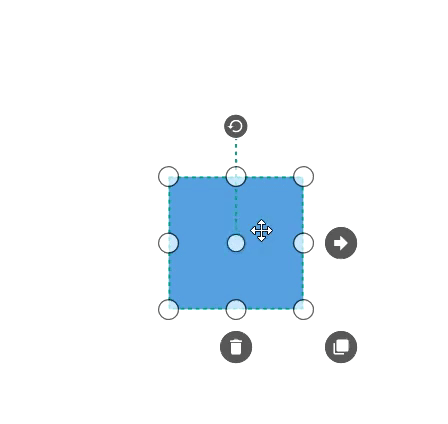

# Tooltip in WPF Diagram (SfDiagram)

In Graphical User Interface (GUI), the tooltip is a message that is displayed when mouse hovers over an element. In SfDiagram, Tooltip is used to provide information about the position, size, and rotation angle while dragging, resizing and rotating the diagram elements.

## Default Tooltip

By default, diagram displays a static tooltip to provide the size, position, and angle related information while dragging, resizing, and rotating. The following image illustrate how the diagram displays the node information during an interaction through tooltip.

## Dynamic Tooltip

Diagram control provides dynamic tooltip support in the Compact selector mode. In this mode, while resizing the tooltip automatically positions it to the nearer side of the resizer and while dragging the diagram elements to the edge of viewport the tooltip place it into the viewport. The following image illustrate how the dynamic tooltip works.

