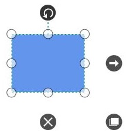
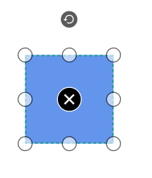

# Quick Command in WPF Diagram (SfDiagram)

### Define QuickCommand

Quick Commands are used to execute the commonly or frequently used commands around the [Nodes](https://help.syncfusion.com/cr/wpf/Syncfusion.UI.Xaml.Diagram.NodeViewModel.html), [Connectors](https://help.syncfusion.com/cr/wpf/Syncfusion.UI.Xaml.Diagram.ConnectorViewModel.html) and [Groups](https://help.syncfusion.com/cr/wpf/Syncfusion.UI.Xaml.Diagram.GroupViewModel.html). There are 3 default Quick Commands for Nodes and Groups to execute Draw, Delete and Duplicate commands.For example, if you select the node then the quick command of the node will get visible.

### Define Custom QuickCommand

SfDiagram provides support to define custom quick command around the Nodes, Connectors and Groups.





        





 // Element to represent the frequently used commands
            QuickCommandViewModel quick = new QuickCommandViewModel()
            {
                // Outer part of quick command.
                Shape = this.Resources["Ellipse"],
               // appearence of shape.
                ShapeStyle = this.Resources["QuickCommandstyle"] as Style,
                //Inner part of quick command and it allows to host any UI elements
                Content =
                    "M3.7399902,0L16,12.258972 28.26001,0 32,3.7399902 19.73999,16 32,28.258972 28.26001,32 16,19.73999 3.7399902,32 0,28.258972 12.26001,16 0,3.7399902z",
               
                Command = (Diagram.Info as IGraphInfo).Commands.Cut
            };

            // Adding new QuickCommand object in Commands collection
            (Diagram.SelectedItems as SelectorViewModel).Commands = new QuickCommandCollection()
            {
                quick
            };


   

### Customize quick command appearance

Appearance of the [QuickCommand](https://help.syncfusion.com/cr/wpf/Syncfusion.UI.Xaml.Diagram.QuickCommandViewModel.html) can be customized by using [Shape](https://help.syncfusion.com/cr/wpf/Syncfusion.UI.Xaml.Diagram.QuickCommandViewModel.html#Syncfusion_UI_Xaml_Diagram_QuickCommandViewModel_Shape), [ShapeStyle](https://help.syncfusion.com/cr/wpf/Syncfusion.UI.Xaml.Diagram.QuickCommandViewModel.html#Syncfusion_UI_Xaml_Diagram_QuickCommandViewModel_ShapeStyle), [Content](https://help.syncfusion.com/cr/wpf/Syncfusion.UI.Xaml.Diagram.QuickCommandViewModel.html#Syncfusion_UI_Xaml_Diagram_QuickCommandViewModel_Content) and [ContentTemplate](https://help.syncfusion.com/cr/wpf/Syncfusion.UI.Xaml.Diagram.QuickCommandViewModel.html#Syncfusion_UI_Xaml_Diagram_QuickCommandViewModel_ContentTemplate) properties.

N> By default QuickCommand will host on Node. [VisibilityMode](https://help.syncfusion.com/cr/wpf/Syncfusion.UI.Xaml.Diagram.QuickCommandViewModel.html#Syncfusion_UI_Xaml_Diagram_QuickCommandViewModel_VisibilityMode) property is to define the host of the QuickCommand on either Node or Connector or both.    

### Alignment

QuickCommand can be aligned relative to boundaries of the Node or segments of the Connector. 

* [OffsetX](https://help.syncfusion.com/cr/wpf/Syncfusion.UI.Xaml.Diagram.QuickCommandViewModel.html#Syncfusion_UI_Xaml_Diagram_QuickCommandViewModel_OffsetX) and [OffsetY](https://help.syncfusion.com/cr/wpf/Syncfusion.UI.Xaml.Diagram.QuickCommandViewModel.html#Syncfusion_UI_Xaml_Diagram_QuickCommandViewModel_OffsetY) property of QuickCommand is used to align the QuickCommand based on fractions. The default value is 0.5.
* [HorizontalAlignment](https://help.syncfusion.com/cr/wpf/Syncfusion.UI.Xaml.Diagram.QuickCommandViewModel.html#Syncfusion_UI_Xaml_Diagram_QuickCommandViewModel_HorizontalAlignment) and [VerticalAlignment](https://help.syncfusion.com/cr/wpf/Syncfusion.UI.Xaml.Diagram.QuickCommandViewModel.html#Syncfusion_UI_Xaml_Diagram_QuickCommandViewModel_VerticalAlignment) properties are used to align the quick commands for horizontal and vertical positions.
* [Margin](https://help.syncfusion.com/cr/wpf/Syncfusion.UI.Xaml.Diagram.QuickCommandViewModel.html#Syncfusion_UI_Xaml_Diagram_QuickCommandViewModel_Margin) is an absolute value used to add some blank space in any one of its four sides.

The Alignment of QuickCommand is similar  to [Annotation Alignment](https://help.syncfusion.com/wpf/sfdiagram/annotation/positioningandappearance).   

[View Sample in GitHub](https://github.com/SyncfusionExamples/WPF-Diagram-Examples/tree/master/Samples/Interaction/CustomQuickCommand)

## See Also

* [How to create a quick command in diagram?](https://www.syncfusion.com/kb/10403/how-to-create-a-quick-command-in-diagram)

* [How to enable or disable QuickCommands?](https://www.syncfusion.com/kb/6351/how-to-enable-or-disable-quickcommands)

