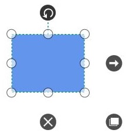
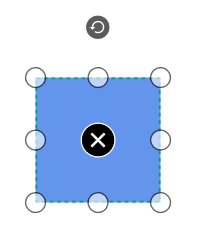

# Quick Command in WPF SfDiagram

## Define QuickCommand

Quick Commands are used to execute commonly used commands for the [Nodes](https://help.syncfusion.com/cr/wpf/Syncfusion.UI.Xaml.Diagram.NodeViewModel.html), [Connectors](https://help.syncfusion.com/cr/wpf/Syncfusion.UI.Xaml.Diagram.ConnectorViewModel.html) and [Groups](https://help.syncfusion.com/cr/wpf/Syncfusion.UI.Xaml.Diagram.GroupViewModel.html). There are three default Quick Commands for Nodes and Groups to execute Draw, Delete and Duplicate commands.For example, if you select the node then the node's QuickCommands become visible.

## Define Custom QuickCommand

[WPF Diagram](https://www.syncfusion.com/diagram-sdk/wpf-diagram) provides support to define custom QuickCommands for the Nodes, Connectors and Groups.





<ResourceDictionary.MergedDictionaries>
    <ResourceDictionary Source="/Syncfusion.SfDiagram.Wpf;component/Resources/BasicShapes.xaml"/>
</ResourceDictionary.MergedDictionaries>





SfDiagram Diagram = new SfDiagram();

 // Element to represent the frequently used commands
QuickCommandViewModel quickcommand = new QuickCommandViewModel()
{
    // Outer part of quick command.
    Shape = this.Resources["Ellipse"],
    // appearence of the shape.
    ShapeStyle = this.Resources["QuickCommandstyle"] as Style,
    //Inner part of quick command and it allows to host any UI elements
    Content =
        "M3.7399902,0L16,12.258972 28.26001,0 32,3.7399902 19.73999,16 32,28.258972 28.26001,32 16,19.73999 3.7399902,32 0,28.258972 12.26001,16 0,3.7399902z",
    
    Command = (Diagram.Info as IGraphInfo).Commands.Cut
};

// Adding new QuickCommand object in Commands collection
(Diagram.SelectedItems as SelectorViewModel).Commands = new QuickCommandCollection()
{
    quickcommand
};


   

### Customize quick command appearance

Appearance of the [QuickCommand](https://help.syncfusion.com/cr/wpf/Syncfusion.UI.Xaml.Diagram.QuickCommandViewModel.html) can be customized by using [Shape](https://help.syncfusion.com/cr/wpf/Syncfusion.UI.Xaml.Diagram.QuickCommandViewModel.html#Syncfusion_UI_Xaml_Diagram_QuickCommandViewModel_Shape), [ShapeStyle](https://help.syncfusion.com/cr/wpf/Syncfusion.UI.Xaml.Diagram.QuickCommandViewModel.html#Syncfusion_UI_Xaml_Diagram_QuickCommandViewModel_ShapeStyle), [Content](https://help.syncfusion.com/cr/wpf/Syncfusion.UI.Xaml.Diagram.QuickCommandViewModel.html#Syncfusion_UI_Xaml_Diagram_QuickCommandViewModel_Content) and [ContentTemplate](https://help.syncfusion.com/cr/wpf/Syncfusion.UI.Xaml.Diagram.QuickCommandViewModel.html#Syncfusion_UI_Xaml_Diagram_QuickCommandViewModel_ContentTemplate) properties.

N> By default, QuickCommands are hosted on nodes. [VisibilityMode](https://help.syncfusion.com/cr/wpf/Syncfusion.UI.Xaml.Diagram.QuickCommandViewModel.html#Syncfusion_UI_Xaml_Diagram_QuickCommandViewModel_VisibilityMode) property defines where the QuickCommand is hosted on either Node or Connector or both.    

### Alignment

QuickCommand can be aligned relative to boundaries of the Node or segments of the Connector. 

* [OffsetX](https://help.syncfusion.com/cr/wpf/Syncfusion.UI.Xaml.Diagram.QuickCommandViewModel.html#Syncfusion_UI_Xaml_Diagram_QuickCommandViewModel_OffsetX) and [OffsetY](https://help.syncfusion.com/cr/wpf/Syncfusion.UI.Xaml.Diagram.QuickCommandViewModel.html#Syncfusion_UI_Xaml_Diagram_QuickCommandViewModel_OffsetY) property of QuickCommand is used to align the QuickCommand based on fractions. The default value is 0.5.
* [HorizontalAlignment](https://help.syncfusion.com/cr/wpf/Syncfusion.UI.Xaml.Diagram.QuickCommandViewModel.html#Syncfusion_UI_Xaml_Diagram_QuickCommandViewModel_HorizontalAlignment) and [VerticalAlignment](https://help.syncfusion.com/cr/wpf/Syncfusion.UI.Xaml.Diagram.QuickCommandViewModel.html#Syncfusion_UI_Xaml_Diagram_QuickCommandViewModel_VerticalAlignment) properties are used to align QuickCommands horizontally and vertically.
* [Margin](https://help.syncfusion.com/cr/wpf/Syncfusion.UI.Xaml.Diagram.QuickCommandViewModel.html#Syncfusion_UI_Xaml_Diagram_QuickCommandViewModel_Margin) is an absolute value used to add some blank space in any one of its four sides.

The Alignment of QuickCommand is similar  to [Annotation Alignment](https://help.syncfusion.com/wpf/sfdiagram/annotation/positioningandappearance).   





<ResourceDictionary.MergedDictionaries>
    <ResourceDictionary Source="/Syncfusion.SfDiagram.Wpf;component/Resources/BasicShapes.xaml"/>
</ResourceDictionary.MergedDictionaries>





SfDiagram Diagram = new SfDiagram();

QuickCommandViewModel quickcommand = new QuickCommandViewModel()
{
    OffsetX = 1,

    OffsetY = 1,

    HorizontalAlignment = HorizontalAlignment.Center,

    VerticalAlignment = VerticalAlignment.Center,

    Shape = this.Resources["Ellipse"],

    ShapeStyle = this.Resources["QuickCommandstyle"] as Style,

    Content =
        "M3.7399902,0L16,12.258972 28.26001,0 32,3.7399902 19.73999,16 32,28.258972 28.26001,32 16,19.73999 3.7399902,32 0,28.258972 12.26001,16 0,3.7399902z",

    Command = (Diagram.Info as IGraphInfo).Commands.Cut,

    Margin = new Thickness(20,20,0,0),
};

(Diagram.SelectedItems as SelectorViewModel).Commands = new QuickCommandCollection()
{
    quickcommand
};


 

[View Sample in GitHub](https://github.com/SyncfusionExamples/WPF-Diagram-Examples/tree/master/Samples/Interaction/CustomQuickCommand)

## See Also

[How to create a quick command in diagram?](https://www.syncfusion.com/kb/10403/how-to-create-a-quick-command-in-diagram)

[How to enable or disable QuickCommands?](https://www.syncfusion.com/kb/6351/how-to-enable-or-disable-quickcommands)

[How to hide specific default QuickCommands of Node?](https://www.syncfusion.com/kb/13236/how-to-hide-specific-default-quickcommands-of-node-in-wpf-diagramsfdiagram)

[How to Notify when diagramming object is duplicated with source?](https://support.syncfusion.com/kb/article/6268/how-to-notify-when-diagramming-object-is-duplicated-with-source-in-wpf-diagram-sfdiagram)

[How to remove the rotator thumb of the node?](https://support.syncfusion.com/kb/article/5943/how-to-remove-rotator-of-the-node-in-wpf-diagram-sfdiagram)