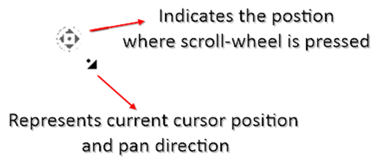

# Zoom Pan in WPF Diagram

* You can zoom in or zoom out the diagram view. [WPF Diagram](https://www.syncfusion.com/diagram-sdk/wpf-diagram) can be zoomed in or out by simply holding down the Ctrl key and scrolling with your mouse wheel.

* When a large Diagram is loaded, only a certain portion of the Diagram is visible. The remaining portions are clipped. Clipped portions can be explored by scrolling the scrollbars or panning the Diagram.

* **IntelliMouse Pan** : You can pan the diagram using scroll wheel. To pan, the user must hold down the scroll wheel anywhere in the diagram and move the cursor in any direction (for example: On moving cursor towards left direction, diagram will be panned towards left). Releasing Scroll Wheel will stop the panning. The speed of the Panning is proportional to the distance between the Scroll Wheel pressed position and current mouse position, i.e. panning will be faster if the distance is large and slower if the distance is small. 

## See Also

[How to get notified when zooming and panning the diagram?](https://www.syncfusion.com/kb/5877/how-to-get-notification-when-zooming-and-panning-the-diagram)

[How to do Panning the diagram in all the directions at a time?](https://support.syncfusion.com/kb/article/5874/how-to-do-panning-in-all-the-directions-at-a-time-in-wpf-diagram)

[How to bring the specific diagram object to the center or viewport of the Diagram?](https://support.syncfusion.com/kb/article/8390/how-to-bring-the-specific-object-to-the-center-or-viewport-of-the-diagram-in-wpf)

[How to achieve zoom in or zoom out functionality to ports?](https://support.syncfusion.com/kb/article/10002/how-to-achieve-zoom-in-or-zoom-out-functionality-to-ports-in-wpf-diagram-sfdiagram)

[How to get notification when zooming and panning the diagram page?](https://support.syncfusion.com/kb/article/5470/how-to-get-notification-when-zooming-and-panning-the-wpf-diagram-sfdiagram)

[How to Use the Mouse Middle Button for Pan and Middle Button Scroll for Zoom in WPF Diagram (SfDiagram)?](https://support.syncfusion.com/kb/article/15645/how-to-use-the-mouse-middle-button-for-pan-and-middle-button-scroll-for-zoom-in-wpf-diagram-sfdiagram)

[How to deactivate the rubberbandzoom in the WPF Diagram (SfDiagram)?](https://support.syncfusion.com/kb/article/15535/how-to-deactivate-the-rubberbandzoom-in-the-wpf-diagram-sfdiagram)

[How to use the Magnifier control in the WPF Diagram (SfDiagram)?](https://support.syncfusion.com/kb/article/17727/how-to-use-the-magnifier-control-in-the-wpf-diagram-sfdiagram)