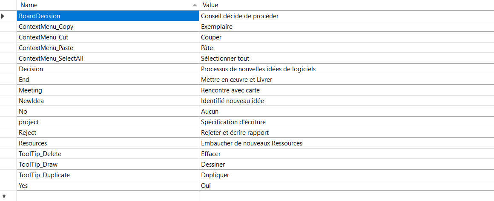
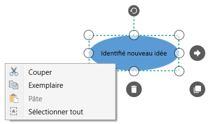

# Localization in WPF SfDiagram

Localization is the process of adapting an application to a specific language or culture. [WPF SfDiagram](https://www.syncfusion.com/diagram-sdk/wpf-diagram) lets you localize all static text used for annotations and context menu contents.

The following items can be localized:

* Annotation content (e.g., `AnnotationEditorViewModel.Content`).
* Context menu items on nodes, connectors, groups, and the diagram surface.
* Status bar messages and tooltips displayed by the diagram.

You can refer to the [WPF Localization](https://help.syncfusion.com/wpf/localization) overview to add a [resource file](https://learn.microsoft.com/en-us/previous-versions/visualstudio/visual-studio-2010/aa992030(v=vs.100)) to the application.

N> Set `CurrentUICulture` in `App.OnStartup` (or in `App.xaml.cs` before `Application.Run`) so the culture is applied before any UI is created. Setting it inside `MainWindow` only affects that window's flow after construction, too late for resources resolved during layout.

## Localize the Annotations Using ResourceManager

SfDiagram supports localizing the annotations of nodes and connectors. The following code illustrates how to provide localization support for an annotation.

The `NewIdea` resource key referenced below uses the following `.resx` entry (default `Resources.resx`) and culture-specific overrides:

| File | Key | Value |
|---|---|---|
| `Resources.resx` | `NewIdea` | `New Idea` |
| `Resources.fr.resx` | `NewIdea` | `Nouvelle idée` |
| `Resources.de.resx` | `NewIdea` | `Neue Idee` |

The fallback chain (`de-DE` → `de` → invariant) is resolved automatically by `ResourceManager`; provide region-specific `.resx` files (`Resources.de-DE.resx`) only when you need to override regional differences.



<!-- Style for the node. -->




public partial class MainWindow : Window
{
    // Set CurrentUICulture in App.OnStartup, before this constructor runs:
    //   System.Threading.Thread.CurrentThread.CurrentUICulture =
    //       new System.Globalization.CultureInfo("fr");

    private readonly System.Resources.ResourceManager manager;

    public MainWindow()
    {
        // Use the executing assembly so it matches the project that contains
        // the Localization.Resources.Syncfusion.SfDiagram.WPF resource file.
        Assembly assembly = System.Reflection.Assembly.GetExecutingAssembly();
        manager = new System.Resources.ResourceManager(
            "Localization.Resources.Syncfusion.SfDiagram.WPF", assembly);

        InitializeComponent();

        // Create the diagram.
        SfDiagram diagram = new SfDiagram();

        // Add the diagram to the main grid of the MainWindow.
        RootGrid.Children.Add(diagram);

        // Populate the diagram with a localized node.
        NodeViewModel node = new NodeViewModel
        {
            UnitWidth = 150,
            UnitHeight = 60,
            OffsetX = 345,
            OffsetY = 140,
            Shape = new EllipseGeometry { RadiusX = 100, RadiusY = 100 },
            ShapeStyle = this.Resources["NodeStyle"] as Style,
            Annotations = new ObservableCollection<IAnnotation>
            {
                new AnnotationEditorViewModel
                {
                    // Localize the annotation using ResourceManager.
                    Content = manager.GetString("NewIdea"),
                }
            }
        };

        diagram.Nodes = new ObservableCollection<NodeViewModel> { node };
    }
}



N> `manager.GetString("NewIdea")` returns `null` when the resource key is missing. Fall back to a default value with `manager.GetString("NewIdea") ?? "New Idea"` if you want to avoid empty annotation content.

N> For right-to-left (RTL) cultures such as `ar-SA`, set `FlowDirection="RightToLeft"` on the host `Window` or on the diagram's panel.

## Localize the Context Menu Items

SfDiagram exposes its context menu items through `SfDiagram.Menu` so the labels can be localized. The following example binds the menu text to a `ResourceManager`.




void MainWindow_Loaded(object sender, RoutedEventArgs e)
{
    foreach (var item in diagram.Menu.Items)
    {
        if (item is DiagramMenuItem menuItem &&
            menuItem.Content is string key &&
            !string.IsNullOrEmpty(key))
        {
            menuItem.Content = manager.GetString(key) ?? key;
        }
    }
}




N> Define the textual descriptions of the context menu items for each custom culture you support (for example, "Cut" → "Couper" in `Resources.fr.resx`).

[View Sample in GitHub](https://github.com/SyncfusionExamples/WPF-Diagram-Examples/tree/master/Samples/Localization)