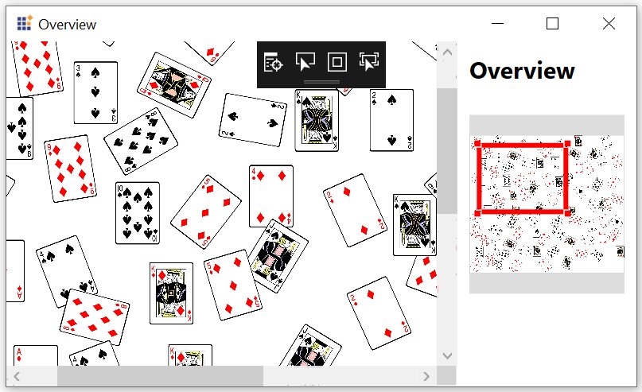
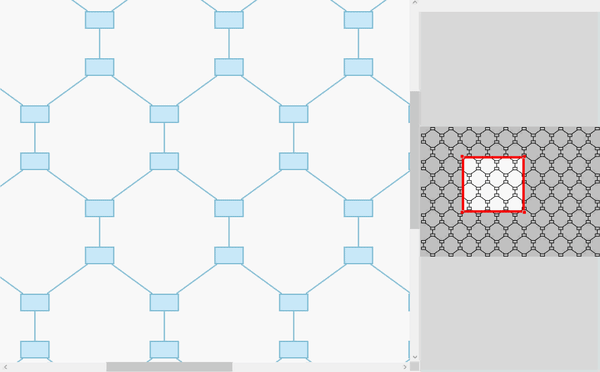

# Overview Control

Overview control is used to display a preview (overall view) of the entire content of a Diagram. This helps you to look overall picture of large Diagram and also to navigate (pan or zoom) to a particular position of the page.

N> Supported platform: WPF, WinRT 8.1, Universal, UWP

## Usage Scenario
When you work on a very large Diagram, You may not know the part where you are actually working or navigation from one part to another might be a difficult. To navigation, you can zoom out entire Diagram and find where you are. This solution is not suitable when you need some frequent navigation.

Overview control solved this problem by displaying a preview (overall view) of the entire Diagram. A rectangle indicated viewport of the Diagram. Navigation becomes easy by dragging this rectangle.

## Define Overview

Overview Control is available in the Namespace `Syncfusion.UI.Xaml.Diagram.Controls`.




xmlns:overview="clr-namespace:Syncfusion.UI.Xaml.Diagram.Controls;assembly=Syncfusion.SfDiagram.WPF"
 
<overview:Overview Source="{Binding ElementName=diagram}" Height="300" Margin="0,25,0,0"/>
	
	


Refer to the Overview Sample from the following link.

Sample Link: WPF Dashboard->SfDiagram->Getting Started->Overview.

## Interaction

Interaction of Overview can be controlled using `Constraint` property. Overview allows Zoom and Pan interaction on it.

Please refer to the [OverviewConstraints](https://help.syncfusion.com/cr/cref_files/wpf/Syncfusion.SfDiagram.WPF~Syncfusion.UI.Xaml.Diagram.OverviewConstraints.html) to know about interactions can be done in Overview.

* `OverviewChangedEvent` will notify the interactions in Overview with [OverviewChangedEventArgs](https://help.syncfusion.com/cr/cref_files/wpf/Syncfusion.SfDiagram.WPF~Syncfusion.UI.Xaml.Diagram.Controls.OverviewChangedEventArgs_members.html).

## Deferred Scrolling

To improve scrolling performance, the outline of a diagram element will be displayed until the UI element is loaded, regardless of the weight of the element.




diagram.Constraints |= GraphConstraints.Virtualize | GraphConstraints.Outline;




N> In SfDiagram, we named Deferred Scrolling support as `Outline`.Outline is only applicable when virtualization is enabled.

### Outline customization

Options are provided to override the appearance, style and interval time of outline by using the [OutlineSettings](https://help.syncfusion.com/cr/cref_files/wpf/Syncfusion.SfDiagram.WPF~Syncfusion.UI.Xaml.Diagram.OutlineSettings_members.html) property of Overview.