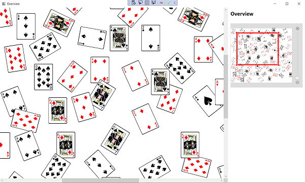
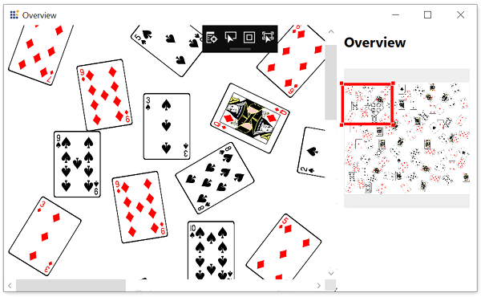
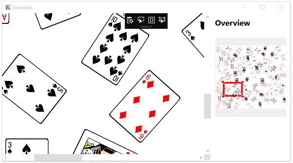
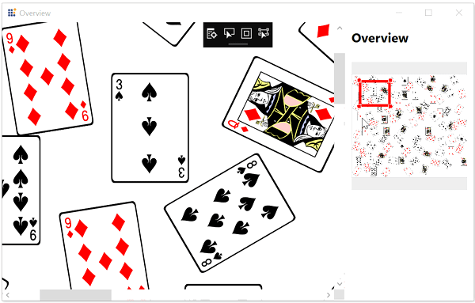

# Overview Control in WPF SfDiagram

Overview control is used to display a preview (overall view) of the entire content of a [WPF Diagram](https://www.syncfusion.com/diagram-sdk/wpf-diagram). This helps you to look overall picture of large diagram and easy to navigate (pan or zoom) to a particular position of the page.

## Usage Scenario

When you work on a huge and complex diagram, you may not know the part where you are actually working, and navigating from one part to another might be difficult. To navigate, zoom out the entire diagram and find where you are. This solution is not suitable when you need some frequent navigation.

The Overview Control solves this problem by displaying a preview (overall view) of the entire diagram with the option to pan and zoom.

## Define Overview

Overview control can be added to the application by dragging it from the toolbox and dropping it in Designer view. The required assembly references will be added automatically.

Steps to add the Overview control manually in XAML:

1. Add the following required assembly reference to the project, `Syncfusion.SfDiagram.WPF`.

2. Import the Syncfusion® WPF schema `http://schemas.syncfusion.com/wpf` or the SfDiagram control namespace `Syncfusion.UI.Xaml.Diagram.Controls` in the XAML page.

3. Place the Overview and SfDiagram inside a layout container (a two-row `Grid` is recommended) so they do not overlap.

4. Declare the Overview control in the XAML page.




<Window x:Class="UserInteraction_Overview.MainWindow"
        xmlns="http://schemas.microsoft.com/winfx/2006/xaml/presentation"
        xmlns:x="http://schemas.microsoft.com/winfx/2006/xaml"
        xmlns:syncfusion="http://schemas.syncfusion.com/wpf"
        WindowStartupLocation="CenterScreen"
        Title="Overview" Height="720" Width="1200">

    <!-- A Grid with two rows is required so the Overview does not overlap the diagram -->
    <Grid>
        <Grid.RowDefinitions>
            <RowDefinition Height="*"/>
            <RowDefinition Height="Auto"/>
        </Grid.RowDefinitions>

        <!--Initialize the SfDiagram-->
        <syncfusion:SfDiagram x:Name="diagram" Grid.Row="0"/>

        <!--Initialize the overview control and bind the diagram control elements to overview-->
        <syncfusion:Overview Source="{Binding ElementName=diagram}" Height="300" Margin="0,25,0,0" Grid.Row="1"/>
    </Grid>
</Window>




{{ codesnippet1 | OrderList_Indent_Level_1 }}

[View Sample in GitHub](https://github.com/SyncfusionExamples/WPF-Diagram-Examples/tree/master/Samples/Overview).

## Zoom Slider

The [`ShowZoomSlider`](https://help.syncfusion.com/cr/wpf/Syncfusion.UI.Xaml.Diagram.Controls.Overview.html#Syncfusion_UI_Xaml_Diagram_Controls_Overview_ShowZoomSliderProperty) property is used to show or hide the zoom slider in the Overview Control. By default, `ShowZoomSlider` is `true`.

You can zoom in or zoom out the overview as well as the diagram by moving the slider or clicking the zoom in / zoom out buttons.

The following code example explains how to hide the zoom slider.




<Window x:Class="UserInteraction_Overview.MainWindow"
        xmlns="http://schemas.microsoft.com/winfx/2006/xaml/presentation"
        xmlns:x="http://schemas.microsoft.com/winfx/2006/xaml"
        xmlns:syncfusion="http://schemas.syncfusion.com/wpf"
        WindowStartupLocation="CenterScreen"
        Title="Overview" Height="720" Width="1200">

    <Grid>
        <Grid.RowDefinitions>
            <RowDefinition Height="*"/>
            <RowDefinition Height="Auto"/>
        </Grid.RowDefinitions>

        <syncfusion:SfDiagram x:Name="diagram" Grid.Row="0"/>

        <syncfusion:Overview Source="{Binding ElementName=diagram}" Height="300" Margin="0,25,0,0" ShowZoomSlider="False" Grid.Row="1"/>
    </Grid>
</Window>




## Placement

The Overview Control is most often placed alongside the SfDiagram inside a `Grid` so that the preview does not overlap the diagram. Common placements include:

* **Bottom panel** — a row beneath the diagram (used in the Define Overview example).
* **Side panel** — a column to the right of the diagram for a wide overview.




<Grid>
    <Grid.ColumnDefinitions>
        <ColumnDefinition Width="*"/>
        <ColumnDefinition Width="Auto"/>
    </Grid.ColumnDefinitions>

    <syncfusion:SfDiagram x:Name="diagram" Grid.Column="0"/>

    <syncfusion:Overview Source="{Binding ElementName=diagram}"
                         Height="500" Width="300"
                         Grid.Column="1"/>
</Grid>




## Interaction

The Overview Control allows zoom and pan interactions. The red rectangle indicates the area currently displayed on the diagram page. The red box can be moved within the panel to pan around the diagram. You can click and drag the corners of the rectangle to change the level of zooming on the diagram page, or you can draw a new rectangle by clicking and dragging anywhere within the panel to zoom an area.




<Grid>
    <Grid.RowDefinitions>
        <RowDefinition Height="*"/>
        <RowDefinition Height="Auto"/>
    </Grid.RowDefinitions>

    <syncfusion:SfDiagram x:Name="diagram" Grid.Row="0"/>

    <!--Initialize the overview control with its constraint-->
    <syncfusion:Overview Source="{Binding ElementName=diagram}"
                         Constraint="Default"
                         Height="300" Margin="0,25,0,0" Grid.Row="1"/>
</Grid>




The [`Constraint`](https://help.syncfusion.com/cr/wpf/Syncfusion.UI.Xaml.Diagram.Controls.Overview.html#Syncfusion_UI_Xaml_Diagram_Controls_Overview_ConstraintProperty) property of the Overview class allows you to control the pan and zoom interactions based on the value assigned to that property. Values can be combined either as comma-separated strings in XAML or as bitwise flags in code. The following table explains the various values and their behaviors:




<!-- Combined constraints: enable both pan and zoom behaviors -->
<syncfusion:Overview Source="{Binding ElementName=diagram}"
                     Constraint="Pan, Zoom"
                     Height="300" Margin="0,25,0,0"/>







// Combined constraints using bitwise flags
overview.Constraint = OverviewConstraints.Pan | OverviewConstraints.Zoom;




| OverviewConstraints | Description | Output |
|---|---|---|
| Pan | Allows users to pan the diagram page by dragging the focused rectangle. | |
| Zoom | Allows users to perform zoom by resizing the corners of the focused rectangle. | |
| DrawFocus | Allows users to draw a new focused rectangle anywhere within the overview panel; the corresponding region in the diagram will be brought into view. | |
| TapFocus | Allows users to move the focused rectangle to any area within the panel by just tapping it. | |
| Default | Allows users to drag, resize, draw, and tap the overview control. | |
| None | No interaction can be performed on the focused rectangle. | |

## Deferred Scrolling

The SfDiagram supports deferred scrolling to improve zooming and panning performance by deferring updates to the Overview Control until the user finishes interacting with the page. Enable it by setting `EnableDeferredScrolling` on the `SfDiagram`.

To learn more about deferred scrolling, refer to [Deferred Scrolling](https://help.syncfusion.com/wpf/diagram/virtualization#deferred-scrolling).

## Events

The `OverviewChangedEvent` will notify the interactions in Overview control with [OverviewChangedEventArgs](https://help.syncfusion.com/cr/wpf/Syncfusion.UI.Xaml.Diagram.Controls.OverviewChangedEventArgs.html) as argument. This argument will provide the dragging and interaction state value of the overview.

| Property | Description | Type |
|---|---|---|
| `DragState` | Reports whether the focused rectangle is being dragged. | `bool` |
| `InteractionState` | Reports the current interaction (Pan, Zoom, DrawFocus, TapFocus, or None). | `OverviewInteractionState` |

Subscribe to the event in XAML:




<syncfusion:Overview Source="{Binding ElementName=diagram}"
                    OverviewChangedEvent="Overview_OverviewChangedEvent"
                     Height="300" Margin="0,25,0,0"/>




Or in code-behind:




public MainWindow()
{
    InitializeComponent();
    
    //overview is the instance of the OverView  Control
    overview.OverviewChangedEvent += Overview_OverviewChangedEvent
}

private void Overview_OverviewChangedEvent(object sender, ChangeEventArgs<object, Syncfusion.UI.Xaml.Diagram.Controls.OverviewChangedEventArgs> args)
{
    
}




## Create the Overview Programmatically

You can also create the Overview and SfDiagram in code-behind and bind them to a `Grid` in the visual tree:




public MainWindow()
{
    InitializeComponent();

    var diagram = new SfDiagram();

    var overview = new Syncfusion.UI.Xaml.Diagram.Controls.Overview { Source = diagram, Height = 300, Margin = new Thickness(0, 25, 0, 0) };

    var grid = new Grid();
    grid.RowDefinitions.Add(new RowDefinition { Height = new GridLength(1, GridUnitType.Star) });
    grid.RowDefinitions.Add(new RowDefinition { Height = GridLength.Auto });

    Grid.SetRow(diagram, 0);
    Grid.SetRow(overview, 1);

    grid.Children.Add(diagram);
    grid.Children.Add(overview);

    this.Content = grid;
}




## See Also

[How to virtualize the diagram control](https://help.syncfusion.com/wpf/diagram/virtualization)

[How to serialize the diagram control](https://help.syncfusion.com/wpf/diagram/serialization)

[How to localize the diagram control](https://help.syncfusion.com/wpf/diagram/localization)