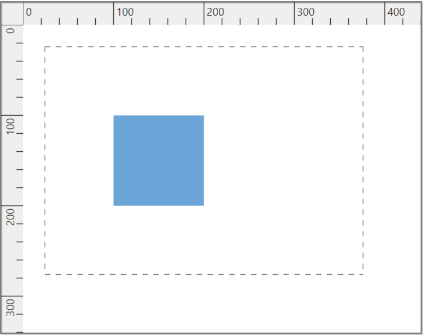
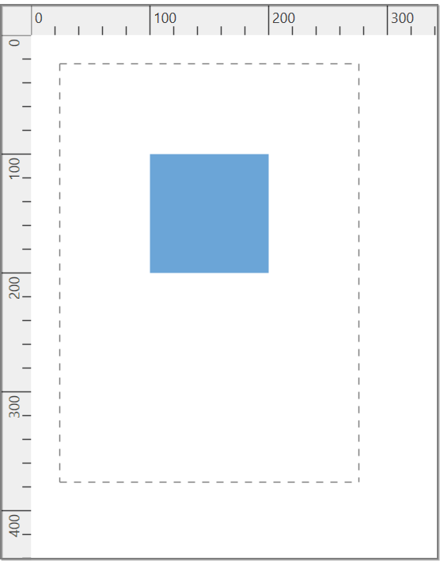
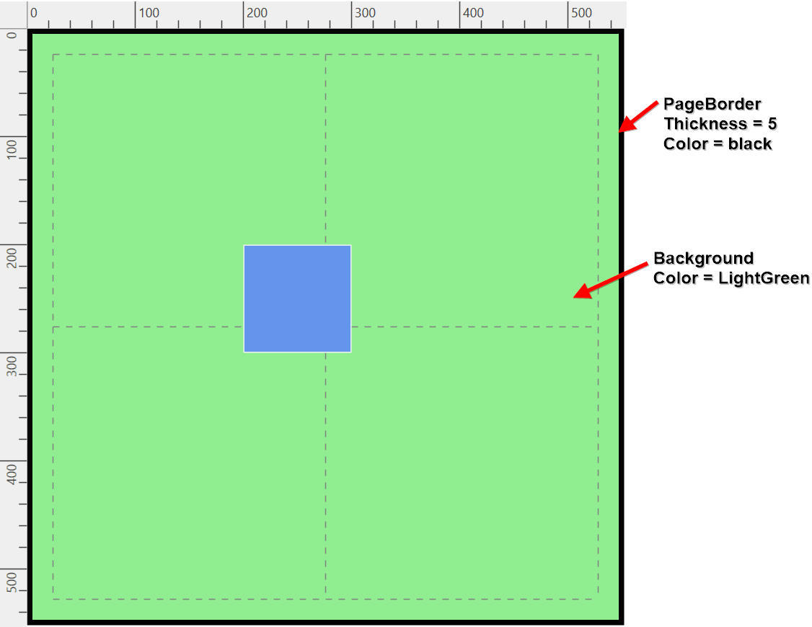
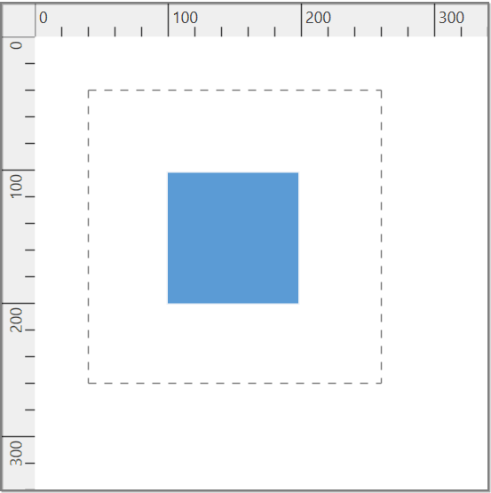
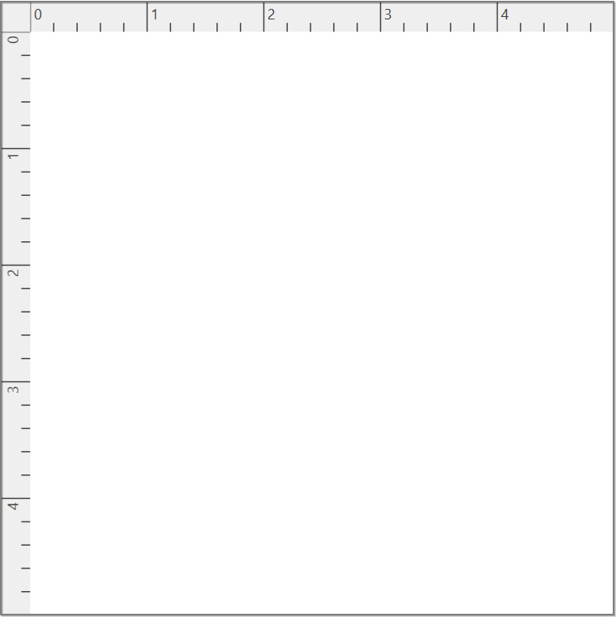
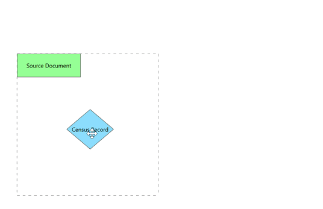
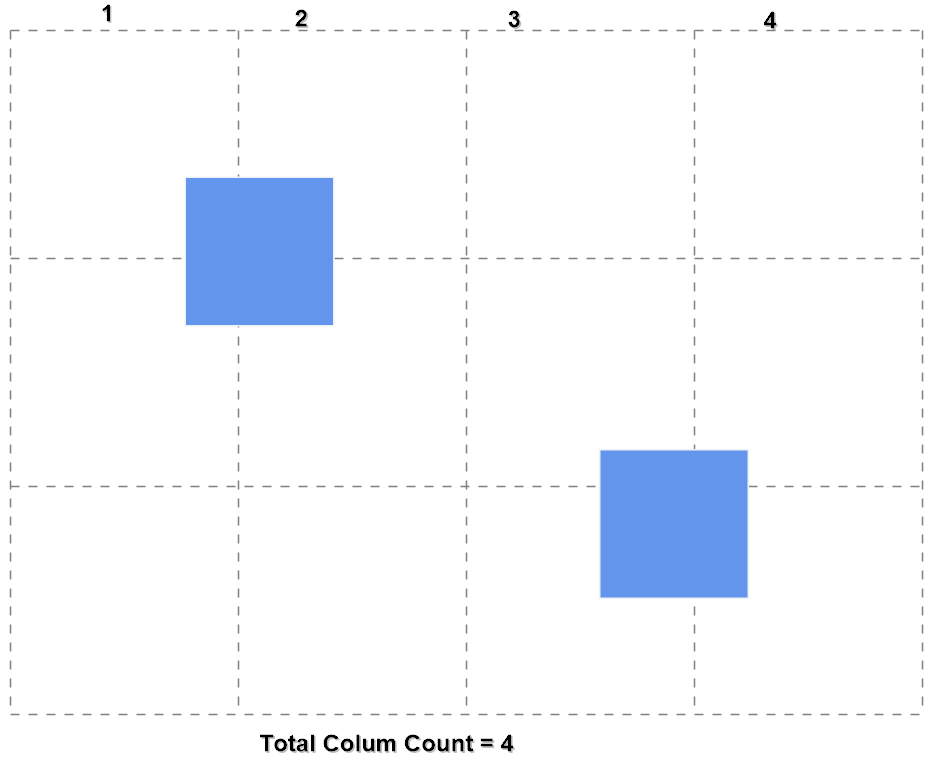
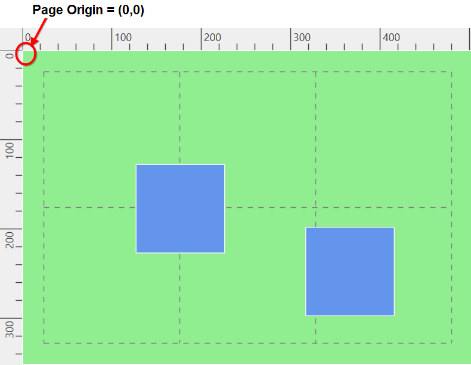

# Page Settings in WPF Diagram (SfDiagram)

By default, Diagram's page size is decided based on the position of diagramming elements. The size and appearance of the diagram pages can be customized using the [PageSettings](https://help.syncfusion.com/cr/wpf/Syncfusion.UI.Xaml.Diagram.PageSettings.html ) property of `SfDiagram`. 

* The [PageWidth](https://help.syncfusion.com/cr/wpf/Syncfusion.UI.Xaml.Diagram.PageSettings.html#Syncfusion_UI_Xaml_Diagram_PageSettings_PageWidth) and [PageHeight](https://help.syncfusion.com/cr/wpf/Syncfusion.UI.Xaml.Diagram.PageSettings.html#Syncfusion_UI_Xaml_Diagram_PageSettings_PageHeight) properties of `PageSettings` define the size of the page. 
* The [PageOrientation](https://help.syncfusion.com/cr/wpf/Syncfusion.UI.Xaml.Diagram.PageSettings.html#Syncfusion_UI_Xaml_Diagram_PageSettings_PageOrientation) property of `PageSettings` used to change the page orientation to portrait or landscape.
* Page breaks are used as a visual guide to see how the pages split into multiple pages. The [ShowPageBreaks](https://help.syncfusion.com/cr/wpf/Syncfusion.UI.Xaml.Diagram.PageSettings.html#Syncfusion_UI_Xaml_Diagram_PageSettings_ShowPageBreaks) property decides the Visibility of Page breaks.




<!--Initialize SfDiagram-->
<syncfusion:SfDiagram x:Name="diagram">
  <!--Initialize the page settings and page orientation property-->
  <syncfusion:SfDiagram.PageSettings>
    <syncfusion:PageSettings PageOrientation="Portrait" 
                             PageWidth="300" PageHeight="400" 
                             ShowPageBreaks="True" />
  </syncfusion:SfDiagram.PageSettings>
</syncfusion:SfDiagram>



//Initialize SfDiagram
SfDiagram diagram = new SfDiagram();

//Initialize the page settings and page orientation property
diagram.PageSettings = new PageSettings()
{
  PageOrientation = PageOrientation.Portrait,
  PageWidth = 300,
  PageHeight = 400,
  ShowPageBreaks = true,
};



| Page Orientation | Output |
|---|---|
| Landscape |  |
| Portrait |  |

## How to enable the multiple page

Based on the diagramming element position, the size of the page dynamically increases or decreases in multiples of page width and height using the [MultiplePage](https://help.syncfusion.com/cr/wpf/Syncfusion.UI.Xaml.Diagram.PageSettings.html#Syncfusion_UI_Xaml_Diagram_PageSettings_MultiplePage) property of PageSettings.




<!--Initialize SfDiagram-->
<syncfusion:SfDiagram x:Name="diagram">
  <!--Initialize the page settings and its properties-->
  <syncfusion:SfDiagram.PageSettings>
    <syncfusion:PageSettings PageWidth="500" 
                             PageHeight="500" 
                             MultiplePage="True" 
                             ShowPageBreaks="True" />
  </syncfusion:SfDiagram.PageSettings>
</syncfusion:SfDiagram>




//Initialize SfDiagram
SfDiagram diagram = new SfDiagram();
//Initialize the page settings and its properties
diagram.PageSettings = new PageSettings()
{
    PageHeight = 300,
    PageWidth = 300,
    MultiplePage = true,
    ShowPageBreaks = true,
};
            



## How to change the page appearance

The appearance of the pages can be customized by using the following properties of `PageSettings` class:

* `PageBorderThickness`: Defines the thickness of the  border around the entire page.
* `PageBackground`: Defines the background colors of the page.
* `PageBorderBrush`: Defines the color of the page border.



<!--Initialize SfDiagram-->
<syncfusion:SfDiagram x:Name="diagram">
  <!--Initialize the page settings and its properties-->
  <syncfusion:SfDiagram.PageSettings>
    <syncfusion:PageSettings PageBorderThickness="5" 
                             PageBackground="LightGreen" 
                             PageBorderBrush="Black" 
                             PageWidth="500" PageHeight="500" 
                             MultiplePage="True" 
                             ShowPageBreaks="True" />
  </syncfusion:SfDiagram.PageSettings>
</syncfusion:SfDiagram>


//Initialize SfDiagram
SfDiagram diagram = new SfDiagram();
//Initialize the page settings and its properties
diagram.PageSettings = new PageSettings()
{
  PageBorderThickness = new Thickness(5),
  PageBackground = new SolidColorBrush(Colors.LightGreen),
  PageBorderBrush = new SolidColorBrush(Colors.Black),
  PageWidth = 300,
  PageHeight = 300,
  MultiplePage = true,
  ShowPageBreaks = true,
};
            



## How to change the margin around the pages

The area between the main content of a page and the page edges can be changed by using the [PrintMargin](https://help.syncfusion.com/cr/wpf/Syncfusion.UI.Xaml.Diagram.PageSettings.html#Syncfusion_UI_Xaml_Diagram_PageSettings_PrintMargin) property. Default value is 24.



<!--Initialize SfDiagram-->
<syncfusion:SfDiagram x:Name="diagram">
  <!--Initialize the page settings and print margin property-->
  <syncfusion:SfDiagram.PageSettings>
    <syncfusion:PageSettings PrintMargin="40" 
                             PageWidth="300" PageHeight="300" 
                             ShowPageBreaks="True" />
  </syncfusion:SfDiagram.PageSettings>
</syncfusion:SfDiagram>


//Initialize SfDiagram
SfDiagram diagram = new SfDiagram();
//Initialize the page settings and print margin property
diagram.PageSettings = new PageSettings()
{
  PrintMargin = new Thickness(40),
  PageWidth = 300,
  PageHeight = 300,
  ShowPageBreaks = true,
};
            



## How to change the unit of the page

The measurement units of the page can be changed by using the [Unit](https://help.syncfusion.com/cr/wpf/Syncfusion.UI.Xaml.Diagram.PageSettings.html#Syncfusion_UI_Xaml_Diagram_PageSettings_Unit) property of `PageSettings` class. Default unit value is Pixels.



<!--Initialize SfDiagram-->
<syncfusion:SfDiagram x:Name="diagram">
  <!--Initialize the page settings and unit property-->
  <syncfusion:SfDiagram.PageSettings>
    <syncfusion:PageSettings>
      <syncfusion:PageSettings.Unit>
        <syncfusion:LengthUnit Unit="Inches"/>
      </syncfusion:PageSettings.Unit>
    </syncfusion:PageSettings>
  </syncfusion:SfDiagram.PageSettings>
</syncfusion:SfDiagram>


//Initialize SfDiagram
SfDiagram diagram = new SfDiagram();
//Initialize the page settings and unit property.
diagram.PageSettings = new PageSettings()
{
  Unit = new LengthUnit() { Unit = LengthUnits.Inches },
};
            



| Unit values | Output |
|---|---|
| Centimeters |  |
| Inches |  |

## How to change the scaling of Page

The [PrintScale](https://help.syncfusion.com/cr/wpf/Syncfusion.UI.Xaml.Diagram.PageSettings.html#Syncfusion_UI_Xaml_Diagram_PageSettings_PrintScale) property of `PageSettings` class allows you to reduce or enlarge the diagram page to fit into specific area when you print it. The default scaling of the page will be 1 (i.e 100%).



<!--Initialize SfDiagram-->
<syncfusion:SfDiagram x:Name="diagram">
  <!--Initialize the page settings -->
  <syncfusion:SfDiagram.PageSettings>
    <syncfusion:PageSettings PrintMargin="40" 
                             PageWidth="300" PageHeight="300" 
                             ShowPageBreaks="True" 
                             MultiplePage="True" 
                             PrintScale="3" />
  </syncfusion:SfDiagram.PageSettings>
</syncfusion:SfDiagram>


//Initialize SfDiagram
SfDiagram diagram = new SfDiagram();
//Initialize the page settings and print scale value.
diagram.PageSettings = new PageSettings()
{
  PrintMargin = new Thickness(40),
  PageWidth = 300,
  PageHeight = 300,
  ShowPageBreaks = true,
  MultiplePage = true,
  //Specify the print scale value.
  PrintScale = 3,
};
            



You can restrict the diagram page scaling to minimum and maximum values by using the [MinimumPrintScale](https://help.syncfusion.com/cr/wpf/Syncfusion.UI.Xaml.Diagram.PageSettings.html#Syncfusion_UI_Xaml_Diagram_PageSettings_MinimumPrintScale) and [MaximumPrintScale](https://help.syncfusion.com/cr/wpf/Syncfusion.UI.Xaml.Diagram.PageSettings.html#Syncfusion_UI_Xaml_Diagram_PageSettings_MaximumPrintScale) properties.



<!--Initialize SfDiagram-->
<syncfusion:SfDiagram x:Name="diagram">
  <!--Initialize the page settings -->
  <syncfusion:SfDiagram.PageSettings>
    <syncfusion:PageSettings PrintMargin="40" 
                             PageWidth="300" PageHeight="300" 
                             ShowPageBreaks="True" 
                             MultiplePage="True" 
                             MinimumPrintScale="2" 
                             MaximumPrintScale="4"/>
  </syncfusion:SfDiagram.PageSettings>
</syncfusion:SfDiagram>


//Initialize SfDiagram
SfDiagram diagram = new SfDiagram();
//Initialize the page settings and print scale value.
diagram.PageSettings = new PageSettings()
{
  PrintMargin = new Thickness(40),
  PageWidth = 300,
  PageHeight = 300,
  ShowPageBreaks = true,
  MultiplePage = true,
  //Specify the minimum and maximum print scale values.
  MinimumPrintScale = 2,
  MaximumPrintScale = 4,
};
            



## How to customize the page origin

By default, origin of the diagram page will be at (0,0). A virtual method `AdjustPageOrigin` of PageSettings class is used to customize the origin of the page based on the page size (`PageWidth` and `PageHeight`) and diagram elements position, which in turn helps to reduce the number of pages being printed.

The `AdjustPageOrigin` method contains the [Info](https://help.syncfusion.com/cr/wpf/Syncfusion.UI.Xaml.Diagram.PageSettings.html#Syncfusion_UI_Xaml_Diagram_PageSettings_Info) property in its argument, and also have the following properties and methods:

| Properties/Methods | Description | Output |
|---|---|---|
| Truncate | Customizes the origin based on the page size. |  |
| Trim | Customizes the origin based on the pixel. Page origin will be position of the most top left element. |  |
| RowCount | Gets the number of pages available in row-wise manner. |  |
| ColumnCount | Gets the number of pages available in column-wise manner.|  |
| PageOrigin | Gets the origin of the page. |   |




//Initialize SfDiagram
SfDiagram diagram = new SfDiagram();
//Create instance for PageCustomClass using PageSettings
diagram.PageSettings = new CustomPageSettings();

//Create a custom class which is derived from page setting class
public class CustomPageSettings : PageSettings
{
  public override void AdjustPageOrigin()
  {
    //Specifies the row count
    double rowCount = Info.RowCount;
    //Specifies the column count
    double columnCount = Info.ColumnCount;
    //Specifies the page origin
    Point pageOrigin = Info.PageOrigin;

    Info.Truncate();
  }
}
    



N> This customization plays a role in reducing the number of pages in printing.

Find the [Page Settings sample](https://github.com/SyncfusionExamples/WPF-Diagram-Examples/tree/master/Samples/PageSettings) to depict the Page Settings.

## See Also

[How to add or remove grid lines for diagram page?](/wpf/diagram/gridlines)

[How to define scroll setting for diagram page?](/wpf/diagram/scroll-settings/scrollstatusandautoscroll)

[How to add rulers for diagram page?](/wpf/diagram/rulers)

[How to print the diagram pages?](/wpf/diagram/printing)

[How to export the diagram page?](/wpf/diagram/exporting)

[How to interact with diagram page?](/wpf/diagram/interaction)

[How to add multiple diagram pages?](https://www.syncfusion.com/kb/11463/how-to-add-multiple-diagram-pages-in-the-wpf-diagram-sfdiagram)

[How to use the property grid for diagram?](https://www.syncfusion.com/kb/11482/how-to-use-the-property-grid-in-the-wpf-diagram-sfdiagram)

[How to show or hide the background image?](https://support.syncfusion.com/kb/article/8243/how-to-show-or-hide-background-image-of-wpf-diagram-sfdiagram)

[How to enable the behaviour of drag the node from one diagram to another diagram?](https://support.syncfusion.com/kb/article/6270/how-to-enable-drag-the-node-from-one-diagram-to-another-wpf-diagram-sfdiagram)

[How to disable the page editing behaviour?](https://support.syncfusion.com/kb/article/5860/how-to-disable-page-editing-in-wpf-diagram-sfdiagram)