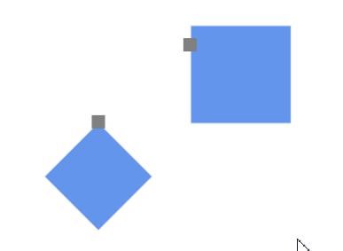
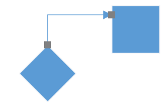
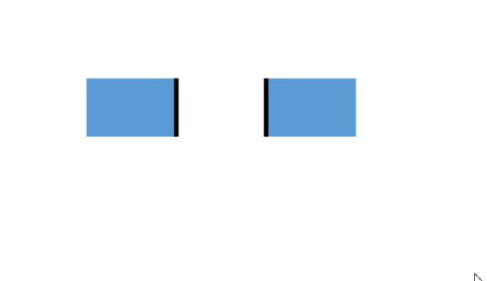

# Port to Port Connection

Connector’s `SourcePort` or `SourcePortID` and `TargetPort` or `TargetPortID` properties allows to create connections between two specific points of same or different nodes and connectors.

### Connection Between NodePort Interactively
We can create connection between the ports interactively by click and drag action on the port.



<!--Initialization of sfdiagram-->
<Syncfusion:SfDiagram x:Name="diagram" PortVisibility="Visible">
 <!--Initialization of Nodes-->
 <Syncfusion:SfDiagram.Nodes>
  <!--Initialization of NodeCollection-->
  <Syncfusion:NodeCollection>
   <Syncfusion:NodeViewModel UnitHeight="65" UnitWidth="65" OffsetX="100" OffsetY="200" Shape="{StaticResource Diamond}">
     <!--Initialization of Ports-->
     <Syncfusion:NodeViewModel.Ports>
      <!--Initialization of PortCollection-->
      <Syncfusion:PortCollection>
       <Syncfusion:NodePortViewModel ID="port1" x:Name="port1" NodeOffsetX="0.5" NodeOffsetY="0">
       </Syncfusion:NodePortViewModel>
      </Syncfusion:PortCollection>
     </Syncfusion:NodeViewModel.Ports>
    </Syncfusion:NodeViewModel>
   <Syncfusion:NodeViewModel UnitHeight="55" UnitWidth="55" OffsetX="200" OffsetY="150" Shape="{StaticResource Rectangle}">
    <Syncfusion:NodeViewModel.Ports>
     <Syncfusion:PortCollection>
      <Syncfusion:NodePortViewModel ID="port2" x:Name="port2" NodeOffsetX="0" NodeOffsetY="0.2">
      </Syncfusion:NodePortViewModel>
     </Syncfusion:PortCollection>
    </Syncfusion:NodeViewModel.Ports>
  </Syncfusion:NodeViewModel>
 </Syncfusion:NodeCollection>
</Syncfusion:SfDiagram.Nodes>
 <!--Initialization of Connectors-->
 <Syncfusion:SfDiagram.Connectors>
  <!--Initialization of ConnectorCollection-->
  <Syncfusion:ConnectorCollection/>  
 </Syncfusion:SfDiagram.Connectors>
</Syncfusion:SfDiagram>



public MainWindow()
{
//Define diagram
SfDiagram diagram = new SfDiagram();
//Initialize the visibility of the port as visible
diagram.PortVisibility = PortVisibility.Visible;
//Define Node's Collection
diagram.Nodes = new NodeCollection();
//Define Connector's Collection
diagram.Connectors = new ConnectorCollection();  

 //Define NodeProperty
 NodeViewModel node1 = AddNode(100, 200, "Diamond",65,65, "nodeport1", 0.5, 0);
 //Adding Node to Collection
 (diagram.Nodes as NodeCollection).Add(node1);
 NodeViewModel node2 = AddNode(200, 150, "Rectangle",55,55, "nodeport2", 0, 0.2);
 (diagram.Nodes as NodeCollection).Add(node2); 
}
//Method for Creating Node
public NodeViewModel AddNode(double offsetX, double offsetY,string shape,double height,double width, string id, double portX, double portY)
{ 
 NodeViewModel node = new NodeViewModel();
 node.OffsetX = offsetX;
 node.OffsetY = offsetY;
 node.UnitHeight = height;
 node.UnitWidth = width;
 node.Shape = App.Current.Resources[shape];
 node.Ports = new PortCollection()
 {
  new NodePortViewModel()
  {
   ID=id,
   NodeOffsetX=portX,
   NodeOffsetY=portY,
  }
 };
return node;
}




### Connection Between NodePort Programmatically
We can create static connection between the ports by specifying the SourcePortID and TargetPortID for the Connector.




   <Syncfusion:ConnectorViewModel SourcePortID="port1" TargetPortID="port2">





 ConnectorViewModel conn1 = new ConnectorViewModel()
 {
  SourcePortID = "nodeport1",
  TargetPortID = "nodeport2",
 };
 //Adding Connector to Collection
 (diagram.Connectors as ConnectorCollection).Add(conn1);




### Connection between ConnectorPort Interactively
We can create connection between the ports interactively by click and drag action on the port.




<!--Initialize the Node-->
   <Syncfusion:NodeViewModel UnitHeight="65" UnitWidth="100" OffsetX="100" OffsetY="50" Shape="{StaticResource Rectangle}" ID="node1">
    <Syncfusion:NodeViewModel.Ports>
     <Syncfusion:PortCollection>
      <Syncfusion:NodePortViewModel NodeOffsetX="0.5" NodeOffsetY="1">
      </Syncfusion:NodePortViewModel>
     </Syncfusion:PortCollection>
    </Syncfusion:NodeViewModel.Ports>
   </Syncfusion:NodeViewModel>
   <Syncfusion:NodeViewModel UnitHeight="65" UnitWidth="100" OffsetX="300" OffsetY="50" Shape="{StaticResource Rectangle}" ID="node2">
    <Syncfusion:NodeViewModel.Ports>
     <Syncfusion:PortCollection>
      <Syncfusion:NodePortViewModel NodeOffsetX="0.5" NodeOffsetY="1">
      </Syncfusion:NodePortViewModel>
     </Syncfusion:PortCollection>
    </Syncfusion:NodeViewModel.Ports>
   </Syncfusion:NodeViewModel>
  </Syncfusion:NodeCollection>
 </Syncfusion:SfDiagram.Nodes>
 
 <!--Initialize the Connector-->
   <Syncfusion:ConnectorViewModel ID="connector1" SourceNodeID="node1" TargetPoint="100,160">
    <!--Initialize the Port-->
     <Syncfusion:ConnectorViewModel.Ports>
      <Syncfusion:PortCollection>
       <Syncfusion:ConnectorPortViewModel ID="connectorport1" Length="0.3">
       </Syncfusion:ConnectorPortViewModel>
       <Syncfusion:ConnectorPortViewModel ID="connectorport2" Length="0.7">
       </Syncfusion:ConnectorPortViewModel>
      </Syncfusion:PortCollection>
     </Syncfusion:ConnectorViewModel.Ports>
    </Syncfusion:ConnectorViewModel>
   <Syncfusion:ConnectorViewModel ID="connector2" SourceNodeID="node2" TargetPoint="300,160" >
   <!--Initialize the Port-->
    <Syncfusion:ConnectorViewModel.Ports>
     <Syncfusion:PortCollection>
      <Syncfusion:ConnectorPortViewModel ID="connectorport3" Length="0.3">
      </Syncfusion:ConnectorPortViewModel>
      <Syncfusion:ConnectorPortViewModel ID="connectorport4" Length="0.7">
      </Syncfusion:ConnectorPortViewModel>
     </Syncfusion:PortCollection>
    </Syncfusion:ConnectorViewModel.Ports>
   </Syncfusion:ConnectorViewModel>





 
 NodeViewModel node1 = AddNode(100, 50, 65, 100,0.5,1);
 //Adding Node to Collection
 (diagram.Nodes as NodeCollection).Add(node1);
 NodeViewModel node2 = AddNode(300, 50, 65, 100, 0.5, 1);
 (diagram.Nodes as NodeCollection).Add(node2);

 ConnectorViewModel con1 = AddConnector(node1, new Point(100, 160), 0.3, 0.7,"connectorport1","connectorport2");
 //Adding connector to collection
 (diagram.Connectors as ConnectorCollection).Add(con1);
 ConnectorViewModel con2 = AddConnector(node2, new Point(300, 160), 0.3, 0.7,"connectorport3","connectorport4");
 (diagram.Connectors as ConnectorCollection).Add(con2);
    
 //Method for Creating Node
 public NodeViewModel AddNode(double offsetX, double offsetY, double height, double width, double nodeOffX, double nodOffY)
   {
     NodeViewModel node = new NodeViewModel();
     node.OffsetX = offsetX;
     node.OffsetY = offsetY;
     node.UnitHeight = height;
     node.UnitWidth = width;
     node.Shape = new RectangleGeometry { Rect = new Rect(0, 0, 10, 10) };
     node.Ports = new PortCollection()
      {
          new NodePortViewModel()
            {
              NodeOffsetX=nodeOffX,
              NodeOffsetY=nodOffY
            }
      };
     return node;
   }
   //Method for creating Connector
   public ConnectorViewModel AddConnector(object sourceNode,Point targetPoint,double length,double length1 ,string id, string id2)
     {
       ConnectorViewModel con = new ConnectorViewModel();
       con.SourceNode = sourceNode;
       con.TargetPoint = targetPoint;
       con.Ports = new PortCollection()
         {
            new ConnectorPortViewModel()
              {  
                 ID=id,            
                 Length=length,
              },
            new ConnectorPortViewModel()
              {
                 ID=id2,
                 Length=length1,
              }
         };
       return con;
     }




### Connection between ConnectorPort Programmatically
We can create static connection between the ports by specifying the SourcePortID and TargetPortID for the Connector.




  <Syncfusion:ConnectorViewModel ID="connector3" SourcePortID="connectorport1" TargetPortID="connectorport3" />
  




ConnectorViewModel conn = new ConnectorViewModel() { SourcePortID = "port1", TargetPortID = "port3" };

(diagram.Connectors as ConnectorCollection).Add(conn);




### Connection for DockPort

DockPort does not allow direct connection to it as like NodePort and ConnectorPort. But you can able to create connection interactively. 

### Connection between DockPort Interactively




<!--Initializes the SfDiagram-->
  <Syncfusion:SfDiagram x:Name="diagram" PortVisibility="Visible" HitPadding="20">
    <!--Initializes the NodeCollection-->
      <Syncfusion:SfDiagram.Nodes>
        <Syncfusion:NodeCollection>
          <Syncfusion:NodeViewModel UnitHeight="65" UnitWidth="100" OffsetX="100" OffsetY="100" Shape="{StaticResource Rectangle}" ID="node1">
           <Syncfusion:NodeViewModel.Ports>
              <Syncfusion:PortCollection>
                  <Syncfusion:DockPortViewModel SourcePoint="1,1" TargetPoint="1,0"/>
              </Syncfusion:PortCollection>
           </Syncfusion:NodeViewModel.Ports>
        </Syncfusion:NodeViewModel>
        <Syncfusion:NodeViewModel UnitHeight="65" UnitWidth="100" OffsetX="300" OffsetY="100" Shape="{StaticResource Rectangle}" ID="node2">
          <Syncfusion:NodeViewModel.Ports>
              <Syncfusion:PortCollection>
                  <Syncfusion:DockPortViewModel SourcePoint="0,0" TargetPoint="0,1"/>
              </Syncfusion:PortCollection>
          </Syncfusion:NodeViewModel.Ports>
        </Syncfusion:NodeViewModel>
      </Syncfusion:NodeCollection>
    </Syncfusion:SfDiagram.Nodes>
  <Syncfusion:SfDiagram.Connectors>
      <Syncfusion:ConnectorCollection/>
  </Syncfusion:SfDiagram.Connectors>
</Syncfusion:SfDiagram>




//Initialize HitPadding to sfdiagram.
diagram.HitPadding = 20;

//Define the DockPort
DockPortViewModel dock1 = new DockPortViewModel()
            {
                SourcePoint = new Point(1, 1),
                TargetPoint = new Point(1, 0),             
            };
DockPortViewModel dock2 = new DockPortViewModel()
            {
                SourcePoint = new Point(0, 0),
                TargetPoint = new Point(0, 1),                            
            };
          
NodeViewModel node1 = AddNode(100, 100, "Rectangle", 65, 100,dock1);                       
//Adding Node to Collection
(diagram.Nodes as NodeCollection).Add(node1);
NodeViewModel node2 = AddNode(300, 100, "Rectangle", 65, 100,dock2);            
(diagram.Nodes as NodeCollection).Add(node2);           

//Method for Creating Node
public NodeViewModel AddNode(double offsetX, double offsetY, string shape, double height, double width,DockPortViewModel dpv)
 {
    NodeViewModel node = new NodeViewModel();
    node.OffsetX = offsetX;
    node.OffsetY = offsetY;
    node.UnitHeight = height;
    node.UnitWidth = width;
    node.Shape = App.Current.Resources[shape];
    (node.Ports as PortCollection).Add(dpv);
    return node;
 }




### Connection between DockPort Programmatically




//Define the ConnectorPort
ConnectorPortViewModel cp1 = new ConnectorPortViewModel()
  {
    Length = 0.5,
  };
ConnectorPortViewModel cp2 = new ConnectorPortViewModel()
  {
    Length = 0.5,
  };
//Define the DockPort
DockPortViewModel dock1 = new DockPortViewModel()
 {
   SourcePoint = new Point(1, 1),
   TargetPoint = new Point(1, 0),
   //Adding ConnectorPort to DockPort
   Ports = new PortCollection(){cp1} 
 };
DockPortViewModel dock2 = new DockPortViewModel()
 {
   SourcePoint = new Point(0, 0),
   TargetPoint = new Point(0, 1),
   Ports = new PortCollection(){cp2}  
 };

NodeViewModel node1 = AddNode(100, 100, "Rectangle", 65, 100,dock1);
(diagram.Nodes as NodeCollection).Add(node1);

NodeViewModel node2 = AddNode(300, 100, "Rectangle", 65, 100,dock2);
(diagram.Nodes as NodeCollection).Add(node2);

ConnectorViewModel connector1 = new ConnectorViewModel()
{
  //Adding DockPort's Connector Port as Source and Target Port
  SourcePort=cp1,
  TargetPort=cp2
};
//Adding Connector to Collection
(diagram.Connectors as ConnectorCollection).Add(connector1);




For more information, refer to [Draw Connectors](https://help.syncfusion.com/wpf/sfdiagram/tools#connectors).