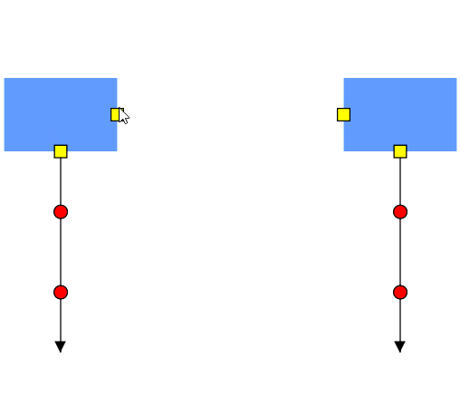

# Port-to-port-creation in WPF Diagram (SfDiagram)

The connector’s `SourcePort` or `SourcePortID` and `TargetPort` or `TargetPortID` properties allows you to create connections between two specific points of same or different nodes and connectors.

### Connection between ports (NodePort, ConnectorPort) programmatically

You can create static connection between the ports by specifying the SourcePortID and TargetPortID for the connector. Refer to [connections-with-ports](https://help.syncfusion.com/wpf/diagram/connector/defineconnector#connections-with-ports) for code example.

### Connection between ports interactively

You can create connection between the ports interactively by performing click and drag action on the port.




<!--Initialize the Node-->
<syncfusion:NodeViewModel UnitHeight="65" UnitWidth="100" 
                          OffsetX="100" OffsetY="50" 
                          Shape="{StaticResource Rectangle}" 
                          ID="node1">
  <syncfusion:NodeViewModel.Ports>
    <syncfusion:PortCollection>
      <syncfusion:NodePortViewModel NodeOffsetX="0.5" NodeOffsetY="1"/>
      <syncfusion:NodePortViewModel NodeOffsetX="1" NodeOffsetY="0.5"/>
    </syncfusion:PortCollection>
  </syncfusion:NodeViewModel.Ports>
</syncfusion:NodeViewModel>

<!--Initialize the Node-->
<syncfusion:NodeViewModel UnitHeight="65" UnitWidth="100" 
                          OffsetX="300" OffsetY="50" 
                          Shape="{StaticResource Rectangle}" 
                          ID="node2">
  <syncfusion:NodeViewModel.Ports>
    <syncfusion:PortCollection>
      <syncfusion:NodePortViewModel NodeOffsetX="0.5" NodeOffsetY="1"/>
      <syncfusion:NodePortViewModel NodeOffsetX="0" NodeOffsetY="0.5"/>
    </syncfusion:PortCollection>
  </syncfusion:NodeViewModel.Ports>
</syncfusion:NodeViewModel>
 
<!--Initialize the Connector-->
<syncfusion:ConnectorViewModel ID="connector1" 
                               SourceNodeID="node1" 
                               TargetPoint="100,260">
  <!--Initialize the Port-->
  <syncfusion:ConnectorViewModel.Ports>
    <syncfusion:PortCollection>
      <syncfusion:ConnectorPortViewModel ID="connectorport1" Length="0.3"/>
      <syncfusion:ConnectorPortViewModel ID="connectorport2" Length="0.7"/>
    </syncfusion:PortCollection>
  </syncfusion:ConnectorViewModel.Ports>
</syncfusion:ConnectorViewModel>

<syncfusion:ConnectorViewModel ID="connector2" SourceNodeID="node2" TargetPoint="400,260" >
  <!--Initialize the Port-->
  <syncfusion:ConnectorViewModel.Ports>
    <syncfusion:PortCollection>
      <syncfusion:ConnectorPortViewModel ID="connectorport3" Length="0.3"/>
      <syncfusion:ConnectorPortViewModel ID="connectorport4" Length="0.7"/>
    </syncfusion:PortCollection>
  </syncfusion:ConnectorViewModel.Ports>
</syncfusion:ConnectorViewModel>




NodeViewModel node1 = AddNode(100, 50, 65, 100,0.5,1,1,0.5);                       
//Adding Node to Collection
(Diagram.Nodes as NodeCollection).Add(node1);
NodeViewModel node2 = AddNode(400, 50, 65, 100,0.5,1,0,0.5);            
(Diagram.Nodes as NodeCollection).Add(node2);

ConnectorViewModel con1 = AddConnector(node1, new Point(100, 260), 0.3, 0.7, "connectorport1", "connectorport2");
//Adding connector to collection
(Diagram.Connectors as ConnectorCollection).Add(con1);
ConnectorViewModel con2 = AddConnector(node2, new Point(400, 260), 0.3, 0.7, "connectorport3", "connectorport4");
(Diagram.Connectors as ConnectorCollection).Add(con2);
    
//Method for Creating Node
public NodeViewModel AddNode(double offX, double offY, double height, double width, double nodex, double nodey, double nodex1,double nodey1)
{
  NodeViewModel node = new NodeViewModel();
  node.OffsetX = offX;
  node.OffsetY = offY;
  node.UnitHeight = height;
  node.UnitWidth = width;
  node.Shape = new RectangleGeometry { Rect = new Rect(0, 0, 10, 10) };
  node.Ports = new PortCollection()
  {
    new NodePortViewModel()
    {                 
      NodeOffsetX=nodex,
      NodeOffsetY=nodey,
    },
    new NodePortViewModel()
    {                 
      NodeOffsetX=nodex1,
      NodeOffsetY=nodey1,
    }
  };
  return node;
}

//Method for creating Connector
public ConnectorViewModel AddConnector(object sourceNode,Point targetPoint,double length,double length1 ,string id, string id2)
{
  ConnectorViewModel con = new ConnectorViewModel();
  con.SourceNode = sourceNode;
  con.TargetPoint = targetPoint;
  con.Ports = new PortCollection()
  {
    new ConnectorPortViewModel()
    {  
      ID=id,            
      Length=length,
    },
    new ConnectorPortViewModel()
    {
      ID=id2,
      Length=length1,
    }
  };
  return con;
}




### Connection for DockPort

Unlike `NodePort` and `ConnectorPort`, DockPort uses connector port to create connection. But you can create connection interactively like `NodePort` and `ConnectorPort`. 

### Connection between DockPort programmatically




//Initialize HitPadding to sfdiagram
diagram.HitPadding = 20;

//Define the ConnectorPort
ConnectorPortViewModel cp1 = new ConnectorPortViewModel()
{
  Length = 0.5,
};

ConnectorPortViewModel cp2 = new ConnectorPortViewModel()
{
  Length = 0.5,
};

//Define the DockPort
DockPortViewModel dock1 = new DockPortViewModel()
{
  SourcePoint = new Point(1, 1),
  TargetPoint = new Point(1, 0),
  //Adding ConnectorPort to DockPort
  Ports = new PortCollection(){cp1} 
};

DockPortViewModel dock2 = new DockPortViewModel()
{
  SourcePoint = new Point(0, 0),
  TargetPoint = new Point(0, 1),
  Ports = new PortCollection(){cp2}  
};

NodeViewModel node1 = AddNode(100, 100, "Rectangle", 65, 100,dock1);
(diagram.Nodes as NodeCollection).Add(node1);

NodeViewModel node2 = AddNode(300, 100, "Rectangle", 65, 100,dock2);
(diagram.Nodes as NodeCollection).Add(node2);

ConnectorViewModel connector1 = new ConnectorViewModel()
{
  //Adding DockPort's Connector Port as Source and Target Port
  SourcePort=cp1,
  TargetPort=cp2
};

//Adding Connector to Collection
(diagram.Connectors as ConnectorCollection).Add(connector1); 

//Method for creating node
public NodeViewModel AddNode(double offsetX, double offsetY, string shape, double height, double width,DockPortViewModel dpv)
{
  NodeViewModel node = new NodeViewModel();
  node.OffsetX = offsetX;
  node.OffsetY = offsetY;
  node.UnitHeight = height;
  node.UnitWidth = width;
  node.Shape = App.Current.Resources[shape];
  (node.Ports as PortCollection).Add(dpv);
  return node;
}




For more information, refer to [Draw Connectors](https://help.syncfusion.com/wpf/sfdiagram/tools#connectors).
