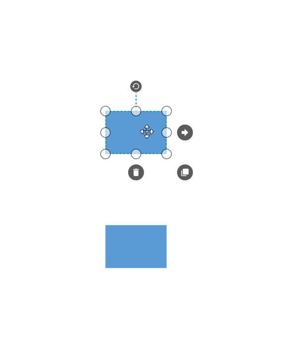
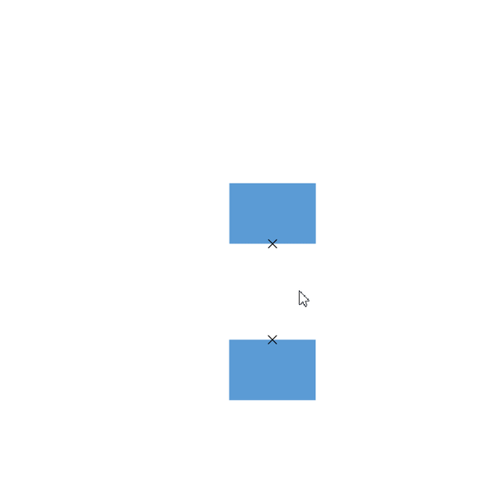

# Port in WPF Diagram (SfDiagram)

Port is a special connection point on a Node or Connector that you can glue the connectors. When you glue a connector to a node or port, they stay connected, even if one of the node is moved.

## Connections

There are two main types of connections: dynamic and port. The difference between these two connections is whether or not a connector remains glued to a specific connection point when you move the attached node or connector.

A dynamic connection is one where the connector will move around the node as you move the node. Diagram will always ensure the connector is the shortest, most direct line possible. You can create a dynamic connection by selecting the entire node (rather than the port) and connect it to another shape (rather than to a port).

A port connection is one where the connector is glued on the connection point of a node. When you move this node, the connector will always remain attached to the same connection point. You can create a port connection by connecting a specific port on one node to another port on another shape.

SfDiagram supports three types of ports: Node Port, Connector Port, and DockPort.

## Node port

A port on a node can be created using the instance of `NodePort` object. The `NodeOffsetX` and `NodeOffsetY` properties of `NodePort` class is used to specify the position of the port on a node.





<!--Style for Node-->

    </Setter.Value>
  </Setter>
</Style>

<!--style for NodePort-->

    </Setter.Value>
  </Setter> 
</Style>

<syncfusion:SfDiagram x:Name="diagram" PortVisibility="Visible">
  <!--Initializes the NodeCollection-->
  <syncfusion:SfDiagram.Nodes>
    <syncfusion:NodeCollection>
      <!--Initializes the Node-->
      <syncfusion:NodeViewModel UnitHeight="100" UnitWidth="100" 
                                OffsetX="100" OffsetY="100" 
                                Shape="{StaticResource Rectangle}">
        <!--Initialization of PortCollection-->
        <syncfusion:NodeViewModel.Ports>
          <syncfusion:PortCollection>
            <!--Initialization of NodePort-->
            <syncfusion:NodePortViewModel x:Name="port"/>
          </syncfusion:PortCollection>
        </syncfusion:NodeViewModel.Ports>
      </syncfusion:NodeViewModel>
    </syncfusion:NodeCollection>
  </syncfusion:SfDiagram.Nodes>
</syncfusion:SfDiagram>




//Define diagram
SfDiagram diagram = new SfDiagram();

//Initialize the visibility of the port as visible
diagram.PortVisibility = PortVisibility.Visible;
          
//Define Node's Collection
diagram.Nodes = new NodeCollection();

//Define Connector's Collection
diagram.Connectors = new ConnectorCollection();

//Create nodeviewmodel
NodeViewModel node = new NodeViewModel()
{
    UnitHeight = 100,
    UnitWidth = 100,
    OffsetX = 300,
    OffsetY = 300,
    Shape = App.Current.Resources["Rectangle"],
};
//Define port to the PortCollection of the Node
(node.Ports as PortCollection).Add(new NodePortViewModel());

//Add node to the NodeCollection of the diagram
(diagram.Nodes as NodeCollection).Add(node);

//RootGrid is the instance of Mainwindow Grid
RootGrid.Children.Add(diagram);
		


>N By default, port will be visible while dragging the connector thumb hover the diagram element where port presents within the diagram element. For more information , refer to the [PortVisibility](https://help.syncfusion.com/wpf/sfdiagram/port#portvisibility) 

### NodeOffset
The `NodeOffsetX` and `NodeOffsetY` properties of port is used to position the port based on fractions. 0 represents Node’s top/left corner, 1 represents Node’s bottom/right corner, and 0.5 represents Node’s center point. Default value is (0.5, 0.5).

| Offset values | Output |
|---|---|
| (0,0) |  |
| (0,0.5) |  |
| (0,1) |  |
| (0.5,0) |  |
| (0.5,0.5) |  |
| (0.5,1) |  |
| (1,0) |  |
| (1,0.5) |  |
| (1,1) |  |

### Displacement
The `Displacement` property is used to dislocate the port by the value given. By default, port will be in the center of the node. When you assign value to the `Displacement` property, port will be displaced from its position by displacment value. Default value is 0d.




<!--Displace the port 5pixel away from left side-->
<Syncfusion:NodePortViewModel x:Name="port" Displacement="5,0,0,0" UnitWidth="7" UnitHeight="7" NodeOffsetX="1" NodeOffsetY="0.5"/>




NodePortViewModel port = new NodePortViewModel()
{
    UnitHeight = 7,
    UnitWidth = 7,
    NodeOffsetX = 1,
    NodeOffsetY = 0.5,
    //Displace the port 5pixel away from left side
    Displacement = new Thickness(5,0,0,0)
};


	

## Connector port

 To specify and make connection with Connector at precise Length.
  
### Define connector port  

A port on a connector can be created using the instance of `ConnectorPort` object. The `Length` property of the `ConnectorPort` class is used to specify the position of the port on a connector path.

Find the common style for Connector and ConnectorPort.



<!--Style for the Connector-->

    </Setter.Value>
  </Setter>
  <Setter Property="TargetDecoratorStyle">
    <Setter.Value>
      
    </Setter.Value>
  </Setter>
</Style>
<!--Style For ConnectorPort-->

    </Setter.Value>
  </Setter>
  <Setter Property="Shape">
    <Setter.Value>
      <RectangleGeometry Rect="0,0,10,10"/>
    </Setter.Value>
  </Setter>
</Style>

<!--Initialize the sfdiagram-->
<syncfusion:SfDiagram x:Name="diagram" PortVisibility="Visible">
  <!--Initialize the ConnectorCollection-->
  <syncfusion:SfDiagram.Connectors>
    <syncfusion:ConnectorCollection>
      <!--Initialize the Connector-->
      <syncfusion:ConnectorViewModel SourcePoint="100,100" TargetPoint="200,200">
        <syncfusion:ConnectorViewModel.Ports>
          <!--Iitializes the PortCollection-->
          <syncfusion:PortCollection>
            <!--Initializes the ConnectorPort-->
            <syncfusion:ConnectorPortViewModel x:Name="Port"  Length="0.5"/>
          </syncfusion:PortCollection>
        </syncfusion:ConnectorViewModel.Ports>
      </syncfusion:ConnectorViewModel>
    </syncfusion:ConnectorCollection>
  </syncfusion:SfDiagram.Connectors>
</syncfusion:SfDiagram>




//Define diagram
SfDiagram diagram = new SfDiagram();
//Initialize the visibility of the port as visible
diagram.PortVisibility = PortVisibility.Visible;
//Define Connector Property
diagram.Connectors = new ConnectorCollection();
ConnectorViewModel connector = new ConnectorViewModel()
{
  SourcePoint = new Point(100, 100),
  TargetPoint = new Point(200, 200), 
};
//Define port to the PortCollection of the connector
(connector.Ports as PortCollection).Add(new ConnectorPortViewModel());
//Adding Connector to Collection
(diagram.Connectors as ConnectorCollection).Add(connector);


			

### Length 

The `Length` property of port is used to align the port based on fractions. 0 represents top/left corner, 1 represents bottom/right corner, and 0.5 represents half of width/height. Default value is 0.5.

| Length value | Output |
|---|---|
| 0 |  |
| 0.5 |  |
| 1 |  |

## Dock port

DockPort is different from standard ports like `NodePort` and `ConnectorPort`. It is a placeholder that allows us to create connections at any point within it. Using `DockPort`, you can achieve lines of connecting points within the node boundary as shown in the following image.

A DockPort on a node can be created using the instance of `DockPort` object. The `SourcePoint` and `TargetPoint` properties of DockPort allows you to define its start and end points. 




 <!--Style for DockPort-->

    </Setter.Value>
  </Setter>
</Style>

<!--Initializes the Node-->
<syncfusion:NodeViewModel x:Name="node" OffsetX="100" OffsetY="100" 
                          UnitHeight="100" UnitWidth="100" 
                          Shape="{StaticResource Rectangle}">
  <!--Initializes the PortCollection-->
  <syncfusion:NodeViewModel.Ports>
    <syncfusion:PortCollection>
      <!--Initializes the DockPort-->
      <syncfusion:DockPortViewModel x:Name="port" 
                                    SourcePoint="0,1" 
                                    TargetPoint="1,1"/>
    </syncfusion:PortCollection>
  </syncfusion:NodeViewModel.Ports>
</syncfusion:NodeViewModel>  


            
//Create nodeviewmodel
NodeViewModel node = new NodeViewModel()
{
  UnitHeight = 100,
  UnitWidth = 100,
  OffsetX = 100,
  OffsetY = 100,
  Shape = App.Current.Resources["Rectangle"]
};

//Initialize dockportviewmodel to the nodeviewmodel
(node.Ports as PortCollection).Add
(
  new DockPortViewModel()
  {
      SourcePoint = new Point(0, 1),
      TargetPoint = new Point(1, 1)
  }
);




[View Sample in GitHub](https://github.com/SyncfusionExamples/WPF-Diagram-Examples/tree/master/Samples/Port/Simple-PortCreation)

### Geometry Style
The appearance of `DockPort` such as stroke and stroke thickness can be customized using the `ConnectorGeometryStyle` property.




<!--Style for DockPort-->

    </Setter.Value>
  </Setter>
</Style>




>N To visualize the DockPort, it is must to specify the SourcePoint , TargetPoint, and ConnectorGeometryStyle properties.

## Padding

Padding is used to leave space between the connector’s end point and the object to where it is connected. The `ConnectorPadding` property of port defines the space to be left between the port bounds and its edges. Default value is 0d.




<!--Declaring the ConnectorPadding value-->
<syncfusion:NodePortViewModel NodeOffsetX="0" NodeOffsetY="0.5" 
                              ConnectorPadding="10"/>





NodePortViewModel nodePort = new NodePortViewModel()
{
  //Declaring the ConnectorPadding value
  ConnectorPadding = 10,
  NodeOffsetX = 0,
  NodeOffsetY = 0.5,
};



## HitPadding

Connection can be made from or to nodes, connectors, port or on an empty area in a diagram. Making a connection with ports is usually difficult as thickness is usually small. To make it easy to connect, it should be possible to connect when the mouse comes near its vicinity area. The `HitPadding` property allows us to customize the vicinity area when connecting. The connector can be created by clicking and dragging to any point of hit padding of ports and can be dropped at any point of hit padding region of ports. Default value is 0d.



DockPortViewModel dockPort = new DockPortViewModel()
{
    Constraints=PortConstraints.Default & ~PortConstraints.InheritHitPadding,
    //Declaring the value for HitPadding
    HitPadding = 40,
    SourcePoint = new Point(1, 0),
    TargetPoint = new Point(1, 1),
};

NodePortViewModel nodePort = new NodePortViewModel()
{
    Constraints = PortConstraints.Default & ~PortConstraints.InheritHitPadding,
    //Declaring the value for HitPadding
    HitPadding = 40,
    NodeOffsetX = 0,
    NodeOffsetY = 0.5,
};


 
 

### PortVisibility

The visibility of ports depends on the properties of `MouseOver`, `Default`, `Collapse`, `MouseOverOnConnect`, `ValidConnection`, and `Visible`.

| Property | Definition |
|---|---|
| MouseOver |  Port is visible when mousehover the DiagramElement. |
| Default | Port is visible while dragging the connector thumb hover the DiagramElement where port presents within the DiagramElement. |
| Collapse | Port is not visible for the DiagramElement. |
| MouseOverOnConnect | Port is visible while dragging the connector thumb hover the DiagramElement where port presents within the DiagramElement. |
| ValidConnection |Specifies to visible the port when mousehover the DiagramElement and enable the PortConstraints as InConnect and Outconnect. |
| Visible | Port is always visible for the DiagramElement. |

To learn more about PortVisibility, refer to [PortVisibility](https://help.syncfusion.com/cr/wpf/Syncfusion.UI.Xaml.Diagram.PortVisibility.html).

## Connection direction

The `ConnectionDirection` is a port’s property, which allows users to specify the direction in which the connector’s connection to be established to a port. This property will be active only if the port constraints contains `PortConstraints.ConnectionDirection`. Default value is Auto.




<syncfusion:NodePortViewModel NodeOffsetX="0.5" NodeOffsetY="0.5" Constraints="Connectable,ConnectionDirection" ConnectionDirection="Right"/>




NodePortViewModel port = new NodePortViewModel()
{ 
  NodeOffsetX = 0.5, 
  NodeOffsetY = 0.5 
};
port.Constraints = PortConstraints.Connectable | PortConstraints.ConnectionDirection;
//Specifying the direction in which connector need to connected to the port
port.ConnectionDirection = ConnectionDirection.Right;




#### Before ConnectionDirection 

#### After ConnectionDirection

For more information , refer to [ConnectionDirection](https://help.syncfusion.com/cr/wpf/Syncfusion.UI.Xaml.Diagram.ConnectionDirection.html)

## Appearance

* The shape of the port can be changed by using its `shape` property. The shape can be any [Built-In Shapes](https://help.syncfusion.com/wpf/sfdiagram/shapes) or any custom geometric path.

* The appearance of ports can be customized by using the `ShapeStyle` property of the port.

* Customize the port size by using the `UnitWidth` and `UnitHeight` properties of port.

* The  `PortVisibility` property allows you to define, when the port should be visible.

>N For DockPort customization, refer to [Geometry Style](https://help.syncfusion.com/wpf/sfdiagram/port#geometry-style)




<!--style for NodePort-->

    </Setter.Value>
  </Setter> 
</Style>

<!--Initializes the NodePort-->
<syncfusion:NodePortViewModel x:Name="port" UnitWidth="7" UnitHeight="7" 
                              NodeOffsetX="1" NodeOffsetY="0.5"/>  
    



NodePortViewModel port = new NodePortViewModel()
{
  UnitHeight = 7,
  UnitWidth = 7,
  NodeOffsetX=1,
  NodeOffsetY=0.5
};
(node.Ports as PortCollection).Add(port);




[View Sample in GitHub](https://github.com/SyncfusionExamples/WPF-Diagram-Examples/tree/master/Samples/Port/Port-Customization)

## Port hovering effect

When establishing a new connection or modifying the endpoint of existing connection, animation will be shown over the connecting objects. `PortHoverEffect` property of `Sfdiagram` class allows you to change the animation type.

It includes the following options:

* Ripple: Specifies the water ripple circles type animation effect for connection.
* Shrink: Specifies the plus symbol type animation effect for connection.
* None: Specifies no connection animation effect.

The default effect is Ripple.



<!--Initialize the Sfdiagram with port hover effect as ripple-->
<syncfusion:SfDiagram x:Name="diagram" PortHoverEffect="Ripple">
</syncfusion:SfDiagram>


//Initialize the SfDiagram
SfDiagram diagram = new SfDiagram();
//defines the port hover connection effect as ripple.
diagram.PortHoverEffect = PortHoverEffect.Ripple;



| PortHoverEffect | Output |
|---|---|
| Ripple | |
| Shrink | |
| Node |Connection animation effect does not appeared. |

## Events

The `PortChangedEvent` will get invoked when you drag the port.

* NodePort: The `PortChangedEvent` will notify the `OffsetX`and `OffsetY` changes with their `OldValue` and `NewValue`. 
 
* ConnectorPort: The `PortChangedEvent` will notify the `Length` changes with their `OldValue` and `NewValue`.
 
* DockPort: The `PortChangedEvent` will notify the `SourcePoint`and `TargetPoint` changes with their `OldValue` and `NewValue`.

 To explore about arguments, refer to [PortChangedEvent](https://help.syncfusion.com/cr/wpf/Syncfusion.UI.Xaml.Diagram.PortChangedEventArgs.html)

## Constraints

The `Constraints` property allows you to enable or disable certain behaviors of ports. For more information about port constraints, refer to [Port Constraints](/wpf/sfdiagram/constraints#port-constraints "Port Constraints").

## See Also

* [How to control the visibility of Ports?](https://www.syncfusion.com/kb/6687/how-to-control-the-visibility-of-ports)

* [How to connect only with port not with node?](https://www.syncfusion.com/kb/9455/how-to-connect-only-with-port-not-with-node)

* [How to validate the connection and port visibility (in-port and out-port) in the diagram?](https://www.syncfusion.com/kb/9553/how-to-validate-the-connection-and-port-visibility-inport-and-outport-in-the-diagram)

* [How to customize the connection indicator style of node and port?](https://www.syncfusion.com/kb/11400/how-to-customize-the-connection-indicator-style-of-node-and-port-in-wpf-diagramsfdiagram)

* [How to add multiple ports for the node?](https://www.syncfusion.com/kb/11435/how-to-add-multiple-ports-for-node-in-the-wpf-diagramsfdiagram)

* [How to decide whether to drag or draw a connection on port at runtime?](https://www.syncfusion.com/kb/9622/how-to-decide-whether-to-drag-or-draw-a-connection-on-port-at-runtime-in-the-wpf)
