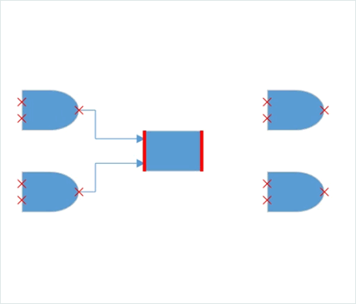

# Ports

Port is a special connection point on a Node/Connector that you can “glue” connectors. When you glue a connector to a node or to a port, they stay connected, even if one of the node is moved.


## Connections
There are two main types of connections: dynamic and port. What differentiates these two connections is whether or not a connector remains glued to a specific connection point when you move the attached node/connector.

A dynamic connection is one where the connector will move around the node as you move the node. Diagram will always ensure the connector is the shortest, most direct line possible. You create a dynamic connection by selecting the entire node (rather than the port) and connect it to another shape (rather than to a port).


A port connection is one where the connector is glued on a connection point of a node. When you move this node,  the connector will always remain attached to the same connection point. You create a port connection by connecting a specific port on one node to another port on another shape.


## Types 

* Node Port
* Connector Port
* DockPort

## Node Port

A port on a node can be created using the instance of `NodePort` object. The `NodeOffsetX` and `NodeOffsetY` properties of `NodePort` class is used to specify the position of the port on a node.


```xaml
<!--Style for Node-->
<Style TargetType="Syncfusion:Node">
 <Setter Property="ShapeStyle">
  <Setter.Value>
   <Style TargetType="Path">
    <Setter Property="Fill" Value="#FF5B9BD5"/>
    <Setter Property="Stretch" Value="Fill"/>
    <Setter Property="Stroke" Value="#FFEDF1F6 "/>
   </Style>
  </Setter.Value>
 </Setter>
</Style>
<!--style for NodePort-->
<Style TargetType="Syncfusion:NodePort">
<Setter Property="Shape">
  <Setter.Value>
   <RectangleGeometry Rect="0,0,10,10"/>
  </Setter.Value>
 </Setter>
 <Setter Property="ShapeStyle">
  <Setter.Value>
   <Style TargetType="Path">
    <Setter Property="Stretch" Value="Fill"/>
    <Setter Property="Fill" Value="#FF808081"/>
   </Style>
  </Setter.Value>
 </Setter> 
</Style>

<Syncfusion:SfDiagram x:Name="diagram" PortVisibility="Visible">
  <!--Initializes the NodeCollection-->
  <Syncfusion:SfDiagram.Nodes>
    <Syncfusion:NodeCollection>
    <!--Initializes the Node-->
      <Syncfusion:NodeViewModel  UnitHeight="100" UnitWidth="100" OffsetX="100" OffsetY="100" Shape="{StaticResource Rectangle}">
      <!--Initialization of PortCollection-->
         <Syncfusion:NodeViewModel.Ports>
           <Syncfusion:PortCollection>
            <!--Initialization of NodePort-->
             <Syncfusion:NodePortViewModel x:Name="port">
             </Syncfusion:NodePortViewModel>
          </Syncfusion:PortCollection>
        </Syncfusion:NodeViewModel.Ports>
      </Syncfusion:NodeViewModel>
    </Syncfusion:NodeCollection>
  </Syncfusion:SfDiagram.Nodes>
</Syncfusion:SfDiagram>

```

```csharp
//Define diagram
SfDiagram diagram = new SfDiagram();

//Initialize the visibility of the port as visible
diagram.PortVisibility = PortVisibility.Visible;
          
//Define Node's Collection
diagram.Nodes = new NodeCollection();

//Define Connector's Collection
diagram.Connectors = new ConnectorCollection();

//Create nodeviewmodel
NodeViewModel node = new NodeViewModel()
{
                UnitHeight = 100,
                UnitWidth = 100,
                OffsetX = 300,
                OffsetY = 300,
                Shape = this.Resources["Rectangle"],                
};
//define port to the PortCollection of the Node
(node.Ports as PortCollection).Add(new NodePortViewModel());

//add node to the NodeCollection of the diagram
(diagram.Nodes as NodeCollection).Add(node);

//RootGrid is the instance of Mainwindow Grid
RootGrid.Children.Add(diagram);
```			



>N By default , port will be visible when we mouse over on the node.For more information , refer to the [PortVisibility](https://help.syncfusion.com/wpf/sfdiagram/port#portvisibility) 

### NodeOffset
The `NodeOffsetX` and `NodeOffsetY` properties of port is used to align the port based on fractions. 0 represents Node’s top/left corner, 1 represents Node’s bottom/right corner, and 0.5 represents Node’s center point.Default value is (0.5, 0.5).

| Offset values | Output |
|---|---|
| (0,0) |  |
| (0,0.5) |  |
| (0,1) |  |
| (0.5,0) |  |
| (0.5,0.5) |  |
| (0.5,1) |  |
| (1,0) |  |
| (1,0.5) |  |
| (1,1) |  |

### Displacement
The `Displacement` property is used to dislocate the port by the value given. By default, port will be in center of the node . When you assign value to the `Displacement` property, port will be displaced from its position by displacment value. Default value is 0d.


```xaml

<!--Displace the port 5pixel away from left side-->
<Syncfusion:NodePortViewModel x:Name="port" Displacement="5,0,0,0" UnitWidth="7" UnitHeight="7" NodeOffsetX="1" NodeOffsetY="0.5"/>

```

```csharp

 NodePortViewModel port = new NodePortViewModel()
            {
                UnitHeight = 7,
                UnitWidth = 7,
                NodeOffsetX=1,
                NodeOffsetY=0.5,
                //Displace the port 5pixel away from left side
                Displacement=new Thickness(5,0,0,0)
            };

```
	


## Connector Port

 To specify and make connection with Connector at precise Length.
  
### Define Connector Port  

A port on a connector can be created using the instance of `ConnectorPort` object. The `Length` property of the `ConnectorPort` class is used to specify the position of the port on a Connector path.

Please find the common style for Connector and ConnectorPort.


```xaml
<!--Style for the Connector-->
<Style TargetType="Syncfusion:Connector">
 <Setter Property="ConnectorGeometryStyle">
  <Setter.Value>
   <Style TargetType="Path">
    <Setter Property="Stroke" Value="#FF5B9BD5"></Setter>
    <Setter Property="StrokeThickness" Value="1"></Setter>
   </Style>
  </Setter.Value>
 </Setter>
 <Setter Property="TargetDecoratorStyle">
  <Setter.Value>
   <Style TargetType="Path">
    <Setter Property="Stroke" Value="#FF5B9BD5"></Setter>
    <Setter Property="StrokeThickness" Value="1"></Setter>
   </Style>
  </Setter.Value>
 </Setter>
</Style>
<!--Style For ConnectorPort-->
<Style TargetType="Syncfusion:ConnectorPort">
 <Setter Property="ShapeStyle">
  <Setter.Value>
   <Style TargetType="Path">
    <Setter Property="Fill" Value="#FF808081"/>
   </Style>
  </Setter.Value>
 </Setter>
 <Setter Property="Shape">
  <Setter.Value>
   <RectangleGeometry Rect="0,0,10,10"/>
  </Setter.Value>
 </Setter>
</Style>

<!--Initialize the sfdiagram-->
<Syncfusion:SfDiagram x:Name="diagram" PortVisibility="Visible">
 <!--Initialize the ConnectorCollection-->
 <Syncfusion:SfDiagram.Connectors>
  <Syncfusion:ConnectorCollection>
   <!--Initialize the Connector-->
   <Syncfusion:ConnectorViewModel SourcePoint="100,100" TargetPoint="200,200">
    <Syncfusion:ConnectorViewModel.Ports>
     <!--Iitializes the PortCollection-->
     <Syncfusion:PortCollection>
      <!--Initializes the ConnectorPort-->
      <Syncfusion:ConnectorPortViewModel x:Name="Port"  Length="0.5">
      </Syncfusion:ConnectorPortViewModel>
     </Syncfusion:PortCollection>
    </Syncfusion:ConnectorViewModel.Ports>
   </Syncfusion:ConnectorViewModel>
  </Syncfusion:ConnectorCollection>
 </Syncfusion:SfDiagram.Connectors>
</Syncfusion:SfDiagram>

```

```csharp

//Define diagram
SfDiagram diagram = new SfDiagram();
//Initialize the visibility of the port as visible
diagram.PortVisibility = PortVisibility.Visible;
//Define Connector Property
diagram.Connectors = new ConnectorCollection();
ConnectorViewModel connector = new ConnectorViewModel()
{
 SourcePoint = new Point(100, 100),
 TargetPoint = new Point(200, 200), 
};
//Define port to the PortCollection of the connector
(connector.Ports as PortCollection).Add(new ConnectorPortViewModel());
//Adding Connector to Collection
(diagram.Connectors as ConnectorCollection).Add(connector);

```
			


### Length 

The `Length` property of Port is used to align the Port based on fractions. 0 represents Top/Left corner, 1 represents Bottom/Right corner, and 0.5 represents half of Width/Height.Default value is 0.5.

| Length value | Output |
|---|---|
| 0 |  |
| 0.5 |  |
| 1 |  |

## Dock Port

DockPort is different from standard ports like NodePort and ConnectorPort. It is a placeholder that allows us to create connections at any point within it. Using DockPort, we can achieve lines of connecting points within the node boundary as shown in the following image.


A DockPort on a node can be created using the instance of `DockPort` object. The `SourcePoint` and `TargetPoint` properties of DockPort allow you to define its start and end points. 


```xaml

 <!--Style for DockPort-->
 <Style TargetType="Syncfusion:DockPort">
  <Setter Property="ConnectorGeometryStyle">
   <Setter.Value>
    <Style TargetType="Path">
     <Setter Property="Stroke" Value="Black"></Setter>
     <Setter Property="StrokeThickness" Value="5"></Setter>
    </Style>
   </Setter.Value>
  </Setter>
 </Style>

 <!--Initializes the Node-->
  <Syncfusion:NodeViewModel x:Name="node" OffsetX="100" OffsetY="100" UnitHeight="100" UnitWidth="100" Shape="{StaticResource Rectangle}">
    <!--Initializes the PortCollection-->
      <Syncfusion:NodeViewModel.Ports>
          <Syncfusion:PortCollection>
            <!--Initializes the DockPort-->
            <Syncfusion:DockPortViewModel x:Name="port" SourcePoint="0,1" TargetPoint="1,1">
          </Syncfusion:DockPortViewModel>
        </Syncfusion:PortCollection>
      </Syncfusion:NodeViewModel.Ports>
    </Syncfusion:NodeViewModel>  
```
```csharp
            
  //Create nodeviewmodel
   NodeViewModel node = new NodeViewModel()
   {
      UnitHeight = 100,
      UnitWidth = 100,
      OffsetX = 100,
      OffsetY = 100,
      Shape = this.Resources["Rectangle"]
   };

   //Initialize dockportviewmodel to the nodeviewmodel
   (node.Ports as PortCollection).Add
      (
        new DockPortViewModel()
          {
             SourcePoint = new Point(0, 1),
             TargetPoint = new Point(1, 1)
          }
      );

```



### Geometry Style
The appearance of DockPort can be customized using the `ConnectorGeometryStyle` property.


```xaml

<!--Style for DockPort-->
<Style TargetType="Syncfusion:DockPort">
 <Setter Property="ConnectorGeometryStyle">
  <Setter.Value>
     <Style TargetType="Path">
       <Setter Property="Stroke" Value="DarkOrange"></Setter>
       <Setter Property="StrokeThickness" Value="5"></Setter>
     </Style>
  </Setter.Value>
 </Setter>
</Style>

```



>N To visualize the DockPort ,it is must to specify the SourcePoint , TargetPoint and ConnectorGeometryStyle properties.


## Padding

Padding is used to leave space between the Connector’s end point and the object to where it is connected. The `ConnectorPadding` property of port defines the space to be left between the port bounds and its edges.Default value is 0d.


```xaml

<!--Declaring the ConnectorPadding value-->
<Syncfusion:NodePortViewModel NodeOffsetX="0" NodeOffsetY="0.5" ConnectorPadding="10"/>

```

```csharp

NodePortViewModel nodePort = new NodePortViewModel()
{
    //Declaring the ConnectorPadding value
    ConnectorPadding = 10,
    NodeOffsetX = 0,
    NodeOffsetY = 0.5,
};
```



### HitPadding

 Connection can be made from/to Nodes, Connectors, Port or on empty area in a diagram. Making connection with Ports are usually difficult as thickness are usually small. To make it easy to connect, it should be possible to connect when mouse comes near its vicinity area. `HitPadding` property allows us to customize the vicinity area while connecting. Default value is 0d.
 
 
 ```csharp
  NodePortViewModel np1 = new NodePortViewModel()
  {
    Constraints=PortConstraints.Default|PortConstraints.Draggable&~PortConstraints.InheritHitPadding,
    //Declaring the value for HitPadding
    HitPadding = 50,
    NodeOffsetX = 1,
    NodeOffsetY = 0.5
  };
 ```
 
 


### PortVisibility

The visibility of ports depends on the properties of `MouseOver`, `Default`, `Collapse`, `MouseOverOnConnect`, `ValidConnection` and `Visible`.

| Property | Definition |
|---|---|
| MouseOver |  Port is Visible when the mousehover the DiagramElement. |
| Default | Port is Visible on Connecting the connector, over the other DiagramElement where port presents within the DiagramElement. |
| Collapse | Port shouldnot visible for the DiagramElement. |
| MouseOverOnConnect | Port is Visible on Connecting the connector, over the other DiagramElement where port presents within the DiagramElement. |
| ValidConnection |Specifies to visible the port when the mousehover the DiagramElement and enable the PortConstraints as InConnect and Outconnect. |
| Visible | Port is visible for the DiagramElement. |

To Know more about PortVisibility, please refer to [PortVisibility](https://help.syncfusion.com/cr/cref_files/wpf/Syncfusion.SfDiagram.WPF~Syncfusion.UI.Xaml.Diagram.PortVisibility.html).


## Connection Direction

`ConnectionDirection` is a port’s property which allows end-user to specify the direction in which the connector’s connection is to be established to a port. This property will be active only if the port constraints contains `PortConstraints.ConnectionDirection`. Default value is Auto.




<Syncfusion:NodePortViewModel NodeOffsetX="0.5" NodeOffsetY="0.5" Constraints="Connectable,ConnectionDirection" ConnectionDirection="Right"/>





NodePortViewModel port = new NodePortViewModel() { NodeOffsetX = 0.5, NodeOffsetY = 0.5 };
port.Constraints = PortConstraints.Connectable | PortConstraints.ConnectionDirection;
//Specifying the direction in which connector need to connected to the port
port.ConnectionDirection = ConnectionDirection.Right;




#### Before ConnectionDirection 


#### After ConnectionDirection


For more information , refer [ConnectionDirection](https://help.syncfusion.com/cr/cref_files/wpf/Syncfusion.SfDiagram.WPF~Syncfusion.UI.Xaml.Diagram.ConnectionDirection.html)

## Appearance

* The shape of port can be changed by using its `shape` property. To explore the different types of port shapes, refer to [Shapes](https://help.syncfusion.com/wpf/sfdiagram/shapes). If you need to render a custom shape, then you can set shape as path and define path as resource to the shape property of port.

>N For DockPort customization, refer [Geometry Style](https://help.syncfusion.com/wpf/sfdiagram/port#geometry-style)

* The appearance of ports can be customized by using `ShapeStyle` property of the port.

* Customize the port size by using the `UnitWidth` and `UnitHeight` properties of port.

* The  `PortVisibility` property allows you to define, when the port should be visible.




<!--style for NodePort-->
<Style TargetType="Syncfusion:NodePort" >
 <Setter Property="Shape">
   <Setter.Value>
     <EllipseGeometry RadiusX="5" RadiusY="5"/>
   </Setter.Value>
 </Setter>
 <Setter Property="ShapeStyle">
    <Setter.Value>
      <Style TargetType="Path">
        <Setter Property="Fill" Value="Yellow"/>
      </Style>
    </Setter.Value>
 </Setter> 
</Style>

<!--Initializes the NodePort-->
<Syncfusion:NodePortViewModel x:Name="port" UnitWidth="7" UnitHeight="7" NodeOffsetX="1" NodeOffsetY="0.5"/>  
    




NodePortViewModel port = new NodePortViewModel()
{
  UnitHeight = 7,
  UnitWidth = 7,
  NodeOffsetX=1,
  NodeOffsetY=0.5
};
(node.Ports as PortCollection).Add(port);





## Interaction

 Diagram provides the support to drag the port interactively using NodePort, ConnectorPort and DockPort.
 
#### Port Dragging

* For NodePort and DockPort , Port Dragging occurs within the limit of node.
* For ConnectorPort, Port Dragging occurs within the limit of Connector.
 
 

#### Events

PortChangedEvent will get invoked when we drag the port.

* NodePort -  `PortChangedEvent` will notify the `OffsetX`and `OffsetY` changes with their `OldValue` and `NewValue`. 
 
* ConnectorPort - `PortChangedEvent` will notify the `Length` changes with their `OldValue` and `NewValue`.
 
* DockPort -`PortChangedEvent` will notify the `SourcePoint`and `TargetPoint` changes with their `OldValue` and `NewValue`.


 To explore about arguments, please refer to [PortChangedEvent](https://help.syncfusion.com/cr/cref_files/wpf/Syncfusion.SfDiagram.WPF~Syncfusion.UI.Xaml.Diagram.PortChangedEventArgs.html)

## Constraints

The `Constraints` property allows to enable/disable certain behaviors of ports. For more information about port constraints, refer to [Port Constraints](/wpf/sfdiagram/constraints#port-constraints "Port Constraints").

## See Also

*[How to decide whether to drag or draw a port at runtime](https://www.syncfusion.com/kb/9622/how-to-decide-whether-to-drag-or-draw-a-connection-on-port-at-runtime)

*[How to control the visibility of Ports](https://www.syncfusion.com/kb/6687/how-to-control-the-visibility-of-ports)

*[How to connect only with port not with node](https://www.syncfusion.com/kb/9455/how-to-connect-only-with-port-not-with-node)

*[How to validate the connection and port visibility (inport and outport) in the diagram](https://www.syncfusion.com/kb/9553/how-to-validate-the-connection-and-port-visibility-inport-and-outport-in-the-diagram)