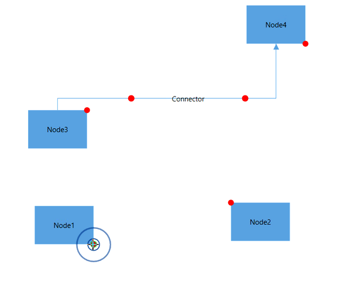
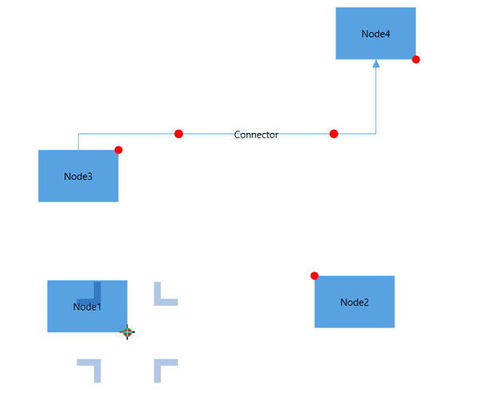

# Port hovering animation effect in WPF Diagram (SfDiagram)

When establishing a new connection or modifying the start/end points of existing connector over port, an animation will be shown while hovering on port. This animation is used to indicate that the user is moved hover the tiny port which helps to start/end the connection to the ports. The [PortHoverEffect](https://help.syncfusion.com/cr/wpf/Syncfusion.UI.Xaml.Diagram.DiagramViewModel.html#Syncfusion_UI_Xaml_Diagram_DiagramViewModel_PortHoverEffect) property of [SfDiagram](https://help.syncfusion.com/cr/wpf/Syncfusion.UI.Xaml.Diagram.DiagramViewModel.html#Syncfusion_UI_Xaml_Diagram) class allows you to specify the any one of the following animation effect. The default effect is `Ripple`.

* Ripple: Specifies the water ripple circles type animation effect for connection.
* Shrink: Specifies the plus symbol type animation effect for connection.
* None: Specifies no connection animation effect.



<!--Initialize the Sfdiagram with port hover effect as ripple-->
<syncfusion:SfDiagram x:Name="diagram" PortHoverEffect="Ripple">
</syncfusion:SfDiagram>


//Initialize the SfDiagram
SfDiagram diagram = new SfDiagram();
//defines the port hover connection effect as ripple.
diagram.PortHoverEffect = PortHoverEffect.Ripple;



| PortHoverEffect | Output |
|---|---|
| Ripple | |
| Shrink | |
| None |Connection animation effect does not appeared. |
