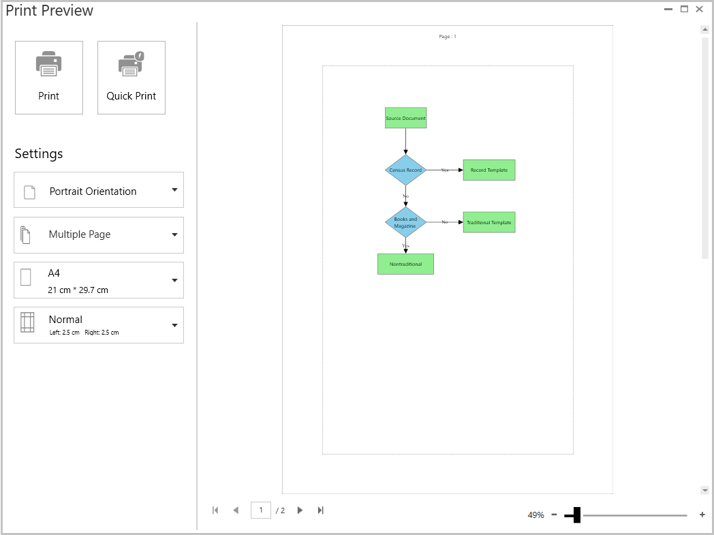
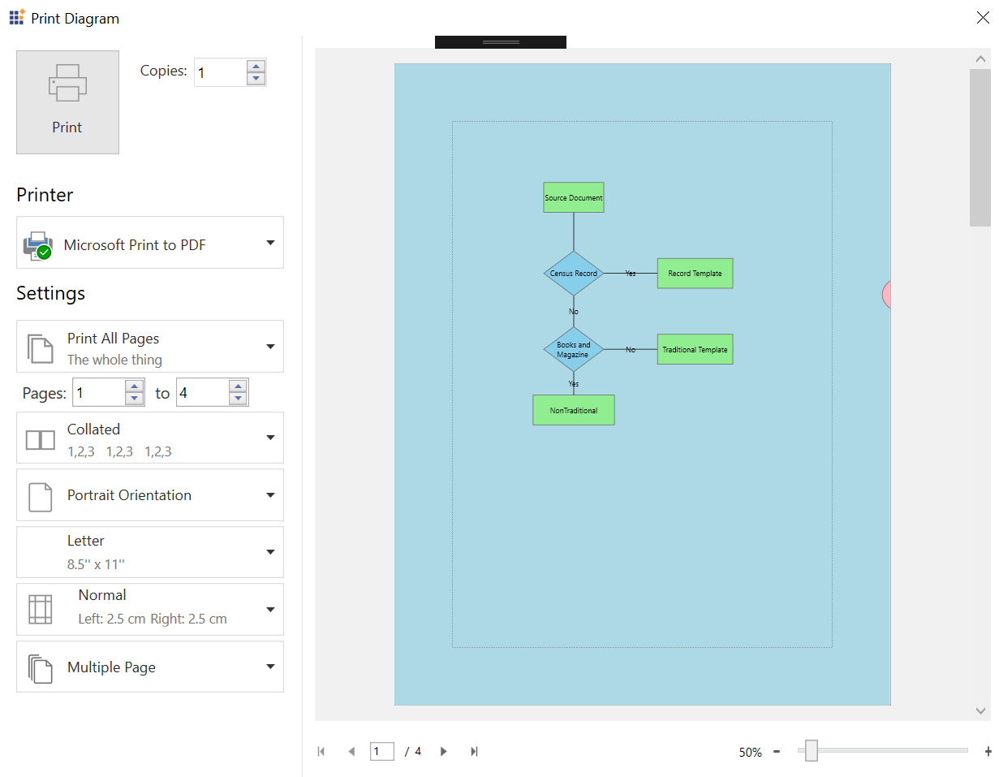
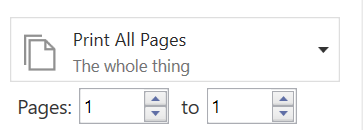
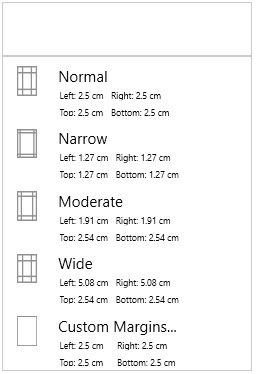
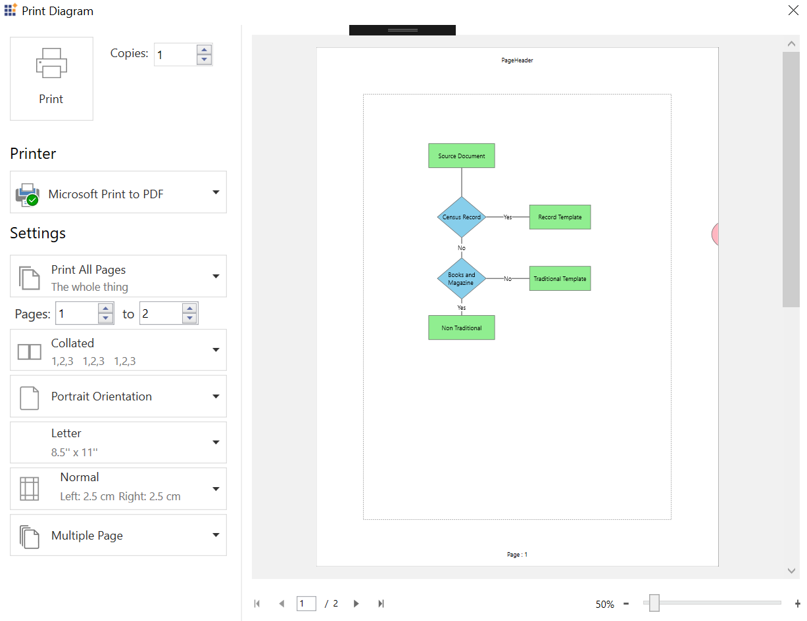
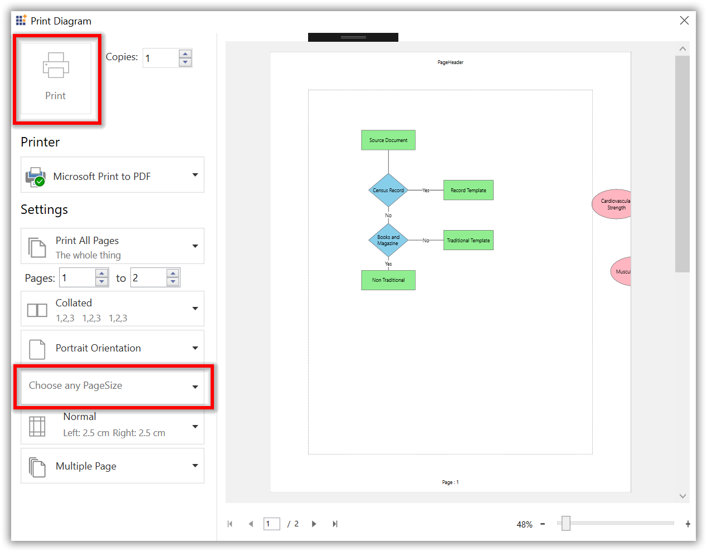

# Printing in WPF Diagram (SfDiagram)

SfDiagram provides support to print the content displayed in the diagram page using the [PrintingService.Print](https://help.syncfusion.com/cr/wpf/Syncfusion.UI.Xaml.Diagram.PrintingService.html#Syncfusion_UI_Xaml_Diagram_PrintingService_Print().html "PrintingService.Print") method.

## Direct print

Sfdiagram provides support to directly print the diagram pages using system default printer without opening the print preview window. To print the diagram by calling [SfDiagram.PrintingService.Print](https://help.syncfusion.com/cr/wpf/Syncfusion.UI.Xaml.Diagram.PrintingService.html#Syncfusion_UI_Xaml_Diagram_PrintingService_Print().html "SfDiagram.PrintingService.Print") method, refer to the following code sample.




diagram.PrintingService.Print();




## Print preview

SfDiagram provides option to display print preview to review and customize the diagram in desired format before printing. Print preview window lets users to navigate through every page, zoom in and out on a page to determine the errors if any, which need to be resolved prior to printing.

Print preview window can be opened by setting [SfDiagram.PrintingService.ShowDialog](https://help.syncfusion.com/cr/wpf/Syncfusion.UI.Xaml.Diagram.PrintingService.html#Syncfusion_UI_Xaml_Diagram_PrintingService_ShowDialog) to true and calling the[SfDiagram.PrintingService.Print](https://help.syncfusion.com/cr/wpf/Syncfusion.UI.Xaml.Diagram.PrintingService.html#Syncfusion_UI_Xaml_Diagram_PrintingService_Print().html "SfDiagram.PrintingService.Print") method.




diagram.PrintingService.ShowDialog = true;
diagram.PrintingService.Print();




## Print settings

SfDiagram provides various options to customize print preview settings using the [SfDiagram.PageSettings](https://help.syncfusion.com/cr/wpf/Syncfusion.UI.Xaml.Diagram.SfDiagram.html#Syncfusion_UI_Xaml_Diagram_SfDiagram_PageSettings) and [PrintingService.PrintSettings](https://help.syncfusion.com/cr/wpf/Syncfusion.UI.Xaml.Diagram.PrintingService.html#Syncfusion_UI_Xaml_Diagram_PrintingService_PrintSettings.html "PrintingService.PrintSettings") properties.




diagram.PageSettings=new PageSettings();
diagram.PageSettings.PageWidth = 800;
diagram.PageSettings.PageHeight = 800;
diagram.PageSettings.PageOrientation=PageOrientation.Landscape;
diagram.PrintingService.PrintSettings.PageMargin=new Thickness(5);
 



### Print

To print a diagram from the selected printer, click the Print button at the top left corner of the Print Preview window. Also, Print Preview window
has option to decide how many copies need to be printed. 

N> Copies will be effective only for real printers.

For sample, refer to [Printing](https://files2.syncfusion.com/login?ReturnUrl=%2Fdtsupport%2Fdirecttrac%2F243873%2Fze%2FPrinting_Sample-326239405.zip).

### Printer

The printer option will list all the installed printers in your system. You can choose any printer from that list before start printing.

#### How to save diagram in PDF Format
	
To save a diagram as PDF, choose any PDF printer (like “Microsoft Print To PDF”) under
Printer section. 

### Scaling 
 SfDiagram provides support to scale the diagram whether to print as single page or split into multiple pages. Scaling options can be changed by setting the `PrintingService.PrintManager.SelectedScaleIndex`
property. 




//Here, 0 denotes Single Page and 1 denotes Multiple Page.

diagram.PrintingService.PrintManager.SelectedScaleIndex = 1;




### PageRangeSelection
 When the page scaling is multiple page, then you can decide whether to print all the pages or selected page range. Find the PageRangeSelection options below:

    1) Print All Pages: All the pages to be printed.

    2) Custom Print: A specified range of pages to be printed.

     `PageRange` Allows you to specify a single page or a range of pages to be printed.
        
        1) FromPage: Specifies the start page of printing.

        2) ToPage: Specifies the end page of printing.

    
 

N> Based on the FromPage and ToPage values, the PageRangeSelection option will change.

### Collation

Collation is used to specify whether a printer collates output when it prints multiple copies of a multipage diagram.

    1) Collate - Collated output.
    2) UnCollate - UnCollated output.

N> Collation applicable when more than one copy of multiple page diagram is printed in real printer.

### Orientation 

SfDiagram provides support to switch between Portrait and Landscape orientation while printing. Orientation can be changed by setting the `PageSettings.PageOrientation` Property.




diagram.PageSettings=new PageSettings();
diagram.PageSettings.PageOrientation = PageOrientation.Landscape;




The orientation can be changed in print preview window at runtime using orientation drop-down. When the value of orientation changed in print preview, then the same will reflect in Diagram orientation.

    1) Portrait - Standard Orientation.
    2) Landscape - Content of the imageable area is rotated on the page 90 degrees counterclockwise from standard (portrait) orientation.

### Paper size 

SfDiagram provides support to change the page size. Page size can be changed by setting the `PageSettings.PageWidth` and `PageSettings.PageHeight` properties.




diagram.PageSettings=new PageSettings();
diagram.PageSettings.PageWidth = 800;
diagram.PageSettings.PageHeight = 800;




Page size can be changed in print preview window also by selecting any value from the page-size drop-down, which displays the supported page sizes of a selected printer.

 ### Page margin

SfDiagram provides support to change the page margins to adjust content in printed page. Page margin can be changed by setting `PrintingService.PrintSettings.PageMargin` property.




diagram.PrintingService.PrintSettings.PageMargin=new Thickness(5);




Page margin can be changed in print preview also by selecting from predefined page margin from margin drop-down. You can manually enter custom margins in the editors below margin drop-down and press OK to apply the custom margin.

## Header and Footer

SfDiagram provides a way to display additional content at the top (Header) or bottom (Footer) of the page while printing. This can be achieved by setting the [PageHeaderHeight](https://help.syncfusion.com/cr/wpf/Syncfusion.Windows.Shared.Printing.PrintSettingsBase.html#Syncfusion_Windows_Shared_Printing_PrintSettingsBase_PageHeaderHeight), [PageHeaderTemplate](https://help.syncfusion.com/cr/wpf/Syncfusion.Windows.Shared.Printing.PrintSettingsBase.html#Syncfusion_Windows_Shared_Printing_PrintSettingsBase_PageHeaderTemplate), [PageFooterHeight](https://help.syncfusion.com/cr/wpf/Syncfusion.Windows.Shared.Printing.PrintSettingsBase.html#Syncfusion_Windows_Shared_Printing_PrintSettingsBase_PageFooterHeight), and [PageFooterTemplate](https://help.syncfusion.com/cr/wpf/Syncfusion.Windows.Shared.Printing.PrintSettingsBase.html#Syncfusion_Windows_Shared_Printing_PrintSettingsBase_PageFooterTemplate) properties in PrintSettings.

Steps for setting Header for printing:

1.Create DataTemplate in Resources and assign it to the `PageHeaderTemplate` and `PageFooterTemplate` properties.




<DataTemplate x:Key="PrintHeaderTemplate">
    <TextBlock Text="PageHeader" FontSize="12" Foreground="Black" HorizontalAlignment="Center" VerticalAlignment="Center"/>
</DataTemplate>

<DataTemplate x:Key="PrintFooterTemplate">
    <TextBlock HorizontalAlignment="Center" VerticalAlignment="Center" Foreground="Black" FontSize="12">
        <TextBlock.Text>
            <Binding Path="PageIndex"
                RelativeSource="{RelativeSource Mode=FindAncestor,AncestorType={x:Type Printing:PrintPageControl}}"
                StringFormat="Page : {0}" />
                </TextBlock.Text>
            </TextBlock>
</DataTemplate>




2.Set the above defined DataTemplate to `PrintSettings.PageHeaderTemplate` and `PrintSettings.PageFooterTemplate`, then assign value for `PrintSettings.PageHeaderHeight` and `PrintSettings.PageFooterHeight` properties also.




diagram.PrintingService.PrintSettings.PageHeaderHeight = 50;
diagram.PrintingService.PrintSettings.PageHeaderTemplate = this.Resources["PrintHeaderTemplate"] as DataTemplate;
 
diagram.PrintingService.PrintSettings.PageFooterHeight = 50;
diagram.PrintingService.PrintSettings.PageFooterTemplate =this.Resources["PrintFooterTemplate"] as DataTemplate;




3.Now, run the application and you can see page header and footer in all the pages. 

 
 
N> [View Sample in GitHub](https://github.com/SyncfusionExamples/WPF-Diagram-Examples/tree/master/Samples/Printing/CustomHeaderFooter)

## Skip empty pages

Sfdiagram provides support to skip the empty pages while navigating through preview and in printed document, thus reduces paper wastage.

The `GetPrintInfo` virtual method of `PrintingService` is used to cancel the empty pages. This method will execute for page navigation, printing each diagram pages, and changes made in the print preview area.




public class CustomPrintingService : PrintingService
{
    protected override void GetPrintInfo(PrintInfo args)
    {
        if (!(args.Elements as IEnumerable<object>).Any())
        {
            args.Cancel = true;
        }
        else
            base.GetPrintInfo(args);
    }
}
 



## Printing event

The `Printing` event will notify the different state of the printing with [PrintingEventArgs](https://help.syncfusion.com/cr/wpf/Syncfusion.UI.Xaml.Diagram.PrintingEventArgs.html).The argument will provide the print dialog and print state value of the printing. 

| PrintStatus | Description |
|---|---|
| Started |  Specifies that printing has been started. |
| Printing | Specifies the progress status of the printing. |
| Completed | Specifies the completed status of the printing. |
| PagePrepared | Specifies the completed status of the page preparation. |
| DocumentPrepared | Specifies the completed status of the document preparation. |
| Cancelled | Specifies the cancelled status of the printing. |




(diagram.Info as IGraphInfo).Printing += MainWindow_Printing;
   
private void MainWindow_Printing(object sender, PrintingEventArgs args)
{
}



## Custom paper size

Print preview window's page size drop down will display only the suported paper sizes of the selected printer. When the Diagram page size is not supported by the selected printer, then the Print button will be disabled and Page Size drop-down will ask you to choose the supported page size.

 

Using the `OnSelectedPrinterChanged` virtual method of `DiagramPrintManager`, you can add the custom pager sizes to the selected printer apart from the default supported paper sizes. Refer to the following code example.




public class CustomDiagramPrintManager : DiagramPrintManager
{
    public CustomDiagramPrintManager(PrintingService printingService) : base(printingService)
    {
    }

    public override void OnSelectedPrinterChanged(PrintQueue printQueue)
    {
        if (printQueue.Name.Contains("Microsoft Print to PDF"))
        {
            List<string> pagesizename = PageSizeOptions.Select(c => c.PageSizeName).ToList();
            if (!(pagesizename.Contains("Ansi B")))
            {
                PageSizeOptions.Add(new Syncfusion.Windows.Controls.Printing.PrintPageSize() { PageSizeName = "Ansi B", Size = new Size(1055, 1632) });
            }
            if (!(pagesizename.Contains("Ansi C")))
            {
                PageSizeOptions.Add(new Syncfusion.Windows.Controls.Printing.PrintPageSize() { PageSizeName = "Ansi C", Size = new Size(1632, 2112) });
            }
            if (!(pagesizename.Contains("Ansi D")))
            {
                PageSizeOptions.Add(new Syncfusion.Windows.Controls.Printing.PrintPageSize() { PageSizeName = "Ansi D", Size = new Size(2112, 3264) });
            }
            if (!(pagesizename.Contains("A0")))
            {
                PageSizeOptions.Add(new Syncfusion.Windows.Controls.Printing.PrintPageSize() { PageSizeName = "A0", Size = new Size(3179, 4494) });
            }
        }
    }
}

public class CustomPrintingService : PrintingService
{
    public CustomPrintingService()
    {
        this.PrintManager = new CustomDiagramPrintManager(this);
    }
}
 



Here, the `Microsoft Print to PDF` printer won't support Ansi B, Ansi C, Ansi D, and A0 paper sizes by default, so the above code will add the Ansi B, Ansi C, Ansi D, and A0 paper sizes in the Print Preview window's page size combo box.

However, we have added custom paper sizes manually in the page size drop-down. The printer won't print the diagram in the custom paper size, to print the diagram in custom page size, set the chosen custom paper size to `PrintDialog.PrintTicket.PageMediaSize` to true and enable `CanUseCustomPageMediaSize` in the printing event when the printing state is started. Refer to the following code example.




private void MainWindow_Printing(object sender, PrintingEventArgs args)
{
    if (args.PrintState == PrintStatus.Started)
    {
        var customPages = new System.Collections.Generic.Dictionary<string, Size>();
        var printerName = args.PrintDialog.PrintQueue.Name;
        if (printerName.Contains("Microsoft Print to PDF"))
        {
            customPages.Add("Ansi B", new Size(1055, 1632));
            customPages.Add("Ansi C", new Size(1632, 2112));
            customPages.Add("Ansi D", new Size(2112, 3264));
        }
        else if (printerName.Contains("Microsoft XPS Document Writer"))
        {
            customPages.Add("A0", new Size(3179, 4494));
        }

        foreach (var customPage in customPages)
        {
            if (args.SelectedPageMediaSizeName.Contains(customPage.Key))
            {
                var pageSize = customPage.Value;
                var mediaSize = new PageMediaSize(PageMediaSizeName.Unknown, pageSize.Width, pageSize.Height);
                args.PrintDialog.PrintTicket.PageMediaSize = mediaSize;
                args.CanUseCustomPageMediaSize = true;
                break;
            }
        }
    }
}
 



N> Custom page size print is not applicable for any real printer. When you choose any custom paper size and try to print it in any real printer, then the printer will print the next supported paper size instead of the choosen one. The above mentioned option is only applicable for "Microsoft Print to PDF" printer.

## Classic PrintPreview

SfDiagram provides backward compatibility to show the older or classic print preview by calling the `ShowClassicPrintPreview` method instead of `Print()` method.




diagram.PrintingService.ShowDialog = true;
diagram.PrintingService.ShowClassicPrintPreview();




## See Also

* [How to customize the Header or Footer of the print preview?](https://www.syncfusion.com/kb/11481/how-to-customize-the-header-or-footer-of-the-print-preview-in-the-wpf-diagramsfdiagram)
