# Printing in WPF Diagram

[WPF Diagram](https://www.syncfusion.com/diagram-sdk/wpf-diagram) provides support to print the content displayed in the diagram page using the [PrintingService.Print](https://help.syncfusion.com/cr/wpf/Syncfusion.UI.Xaml.Diagram.PrintingService.html#Syncfusion_UI_Xaml_Diagram_PrintingService_Print().html "PrintingService.Print") method.

## Direct print

Diagram provides support to directly print the diagram pages using system default printer without opening the print preview window. Call the [`SfDiagram.PrintingService.Print`](https://help.syncfusion.com/cr/wpf/Syncfusion.UI.Xaml.Diagram.PrintingService.html#Syncfusion_UI_Xaml_Diagram_PrintingService_Print().html "SfDiagram.PrintingService.Print") method to print the diagram:




diagram.PrintingService.Print();




## Print preview

Diagram provides option to display print preview to review and customize the diagram in desired format before printing. Print preview window lets users navigate through pages, zoom in and out, and identify errors before printing.

Print preview window can be opened by setting [SfDiagram.PrintingService.ShowDialog](https://help.syncfusion.com/cr/wpf/Syncfusion.UI.Xaml.Diagram.PrintingService.html#Syncfusion_UI_Xaml_Diagram_PrintingService_ShowDialog) to true and calling the [SfDiagram.PrintingService.Print](https://help.syncfusion.com/cr/wpf/Syncfusion.UI.Xaml.Diagram.PrintingService.html#Syncfusion_UI_Xaml_Diagram_PrintingService_Print().html "SfDiagram.PrintingService.Print") method.




diagram.PrintingService.ShowDialog = true;
diagram.PrintingService.Print();




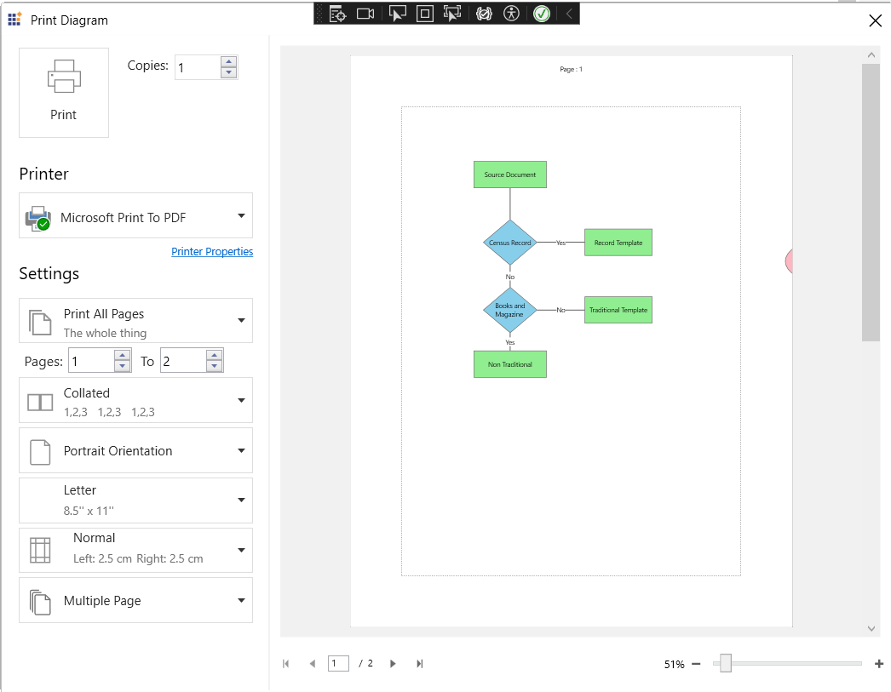

## Print settings

SfDiagram provides various options to customize print preview settings using the [SfDiagram.PageSettings](https://help.syncfusion.com/cr/wpf/Syncfusion.UI.Xaml.Diagram.SfDiagram.html#Syncfusion_UI_Xaml_Diagram_SfDiagram_PageSettings) and [PrintingService.PrintSettings](https://help.syncfusion.com/cr/wpf/Syncfusion.UI.Xaml.Diagram.PrintingService.html#Syncfusion_UI_Xaml_Diagram_PrintingService_PrintSettings.html "PrintingService.PrintSettings") properties.




diagram.PageSettings = new PageSettings();
diagram.PageSettings.PageWidth = 800;
diagram.PageSettings.PageHeight = 800;
diagram.PageSettings.PageOrientation = PageOrientation.Landscape;
diagram.PrintingService.PrintSettings.PageMargin = new Thickness(5);
 



### Print

To print a diagram from the selected printer, click the Print button at the top left corner of the Print Preview window. Also, the Print Preview window has an option to decide how many copies need to be printed.

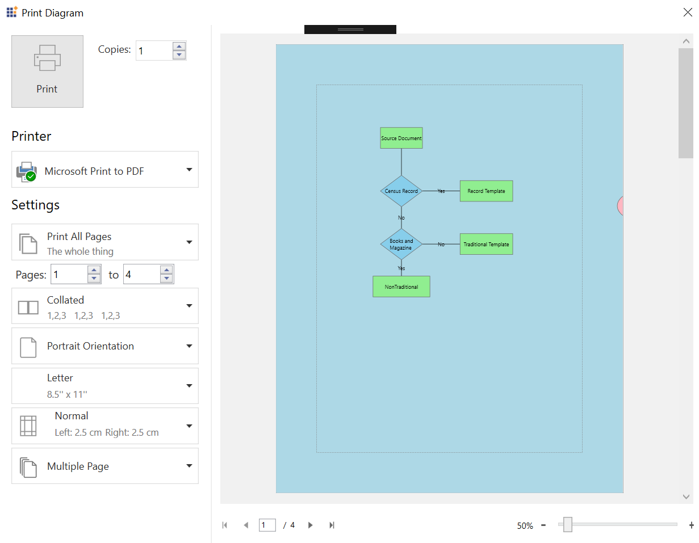

N> Copies will be effective only for real printers.

For a sample, refer to [Printing](https://github.com/SyncfusionExamples/WPF-Diagram-Examples/tree/master/Samples/Printing).

### Printer

The printer option will list all the installed printers in your system. You can choose any printer from that list before starting to print.

#### How to Save a Diagram in PDF Format

To save a diagram as PDF, choose any PDF printer (like "Microsoft Print To PDF") in the Printer section.

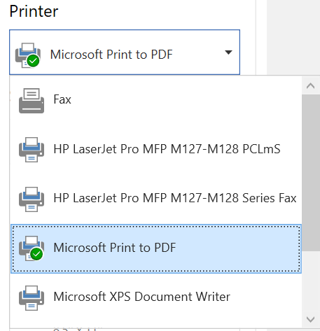

#### Printer Properties

The **Printer Properties** option allows you to configure advanced settings for the selected printer before printing the diagram. The available options may vary depending on the printer model and driver, but commonly include:

- **Paper Size**: Select from supported paper sizes such as A4, Letter, Legal, etc.
- **Orientation**: Choose between Portrait and Landscape.

To access these settings, click the **Printer Properties** button in the Print Preview window after selecting your printer. The available options vary by printer model and driver, but commonly include paper size and orientation.

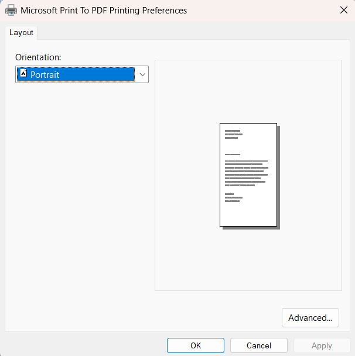

### Scaling

Diagram provides support to scale the diagram whether to print as single page or split into multiple pages. The available scale options are `Single Page` (index `0`), `Multiple Page` (index `1`), and `FitToPage` (index `2`). Scaling options can be changed by setting the `PrintingService.PrintManager.SelectedScaleIndex` property.




// Here, 0 denotes Single Page and 1 denotes Multiple Page.

diagram.PrintingService.PrintManager.SelectedScaleIndex = 1;




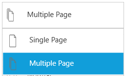

### Page Range Selection

When the page scaling is set to Multiple Page, you can decide whether to print all the pages or a selected page range. Find the `PageRangeSelection` options below:

    1. Print All Pages: All the pages to be printed.

    2. Custom Print: A specified range of pages to be printed.

     `PageRange` Allows you to specify a single page or a range of pages to be printed.
        
        1. FromPage: Specifies the start page of printing.

        2. ToPage: Specifies the end page of printing.

    
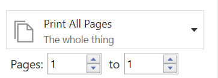 

N> Based on the FromPage and ToPage values, the PageRangeSelection option will change.

### Collation

`Collation` specifies whether a printer collates output when printing multiple copies of a multipage diagram.

    1. Collate - Collated output.
    2. UnCollate - UnCollated output.

N> Collation applicable when more than one copy of a multi-page diagram is printed on a real printer.

### Orientation

Diagram provides support to switch between Portrait and Landscape orientation while printing. Orientation can be changed by setting the [`PageSettings.PageOrientation`](https://help.syncfusion.com/cr/wpf/Syncfusion.UI.Xaml.Diagram.PageSettings.html#Syncfusion_UI_Xaml_Diagram_PageSettings_PageOrientation) property.




diagram.PageSettings = new PageSettings();
diagram.PageSettings.PageOrientation = PageOrientation.Landscape;




The orientation can be changed in the print preview window at runtime using the orientation drop-down. When the orientation is changed in the print preview, the change is reflected in the diagram's orientation.

    1) Portrait - Standard Orientation.
    2) Landscape - Content of the imageable area is rotated on the page 90 degrees counterclockwise from standard (portrait) orientation.

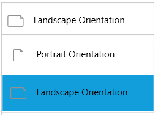

### Paper Size

Diagram provides support to change the page size. Page size can be changed by setting the [`PageSettings.PageWidth`](https://help.syncfusion.com/cr/wpf/Syncfusion.UI.Xaml.Diagram.PageSettings.html#Syncfusion_UI_Xaml_Diagram_PageSettings_PageWidth) and [`PageSettings.PageHeight`](https://help.syncfusion.com/cr/wpf/Syncfusion.UI.Xaml.Diagram.PageSettings.html#Syncfusion_UI_Xaml_Diagram_PageSettings_PageHeight) properties.




diagram.PageSettings = new PageSettings();
diagram.PageSettings.PageWidth = 800;
diagram.PageSettings.PageHeight = 800;




Page size can be changed in print preview window also by selecting any value from the page-size drop-down, which displays the supported page sizes of a selected printer.

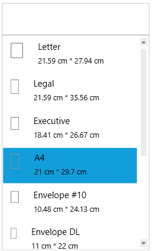

### Page Margin

Diagram provides support to change the page margins to adjust content in printed page. Page margin can be changed by setting the `PrintingService.PrintSettings.PageMargin` property.




diagram.PrintingService.PrintSettings.PageMargin = new Thickness(5);




You can also change the page margin in the Print Preview window by selecting a predefined margin from the margin drop-down. To use custom margins, enter the values in the editors below the margin drop-down and click **OK** to apply them.

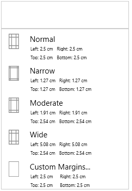

## Header and Footer

Diagram provides a way to display additional content at the top (header) or bottom (footer) of the page while printing. This can be achieved by setting the [PageHeaderHeight](https://help.syncfusion.com/cr/wpf/Syncfusion.Windows.Shared.Printing.PrintSettingsBase.html#Syncfusion_Windows_Shared_Printing_PrintSettingsBase_PageHeaderHeight), [PageHeaderTemplate](https://help.syncfusion.com/cr/wpf/Syncfusion.Windows.Shared.Printing.PrintSettingsBase.html#Syncfusion_Windows_Shared_Printing_PrintSettingsBase_PageHeaderTemplate), [PageFooterHeight](https://help.syncfusion.com/cr/wpf/Syncfusion.Windows.Shared.Printing.PrintSettingsBase.html#Syncfusion_Windows_Shared_Printing_PrintSettingsBase_PageFooterHeight), and [PageFooterTemplate](https://help.syncfusion.com/cr/wpf/Syncfusion.Windows.Shared.Printing.PrintSettingsBase.html#Syncfusion_Windows_Shared_Printing_PrintSettingsBase_PageFooterTemplate) properties in PrintSettings.

Steps to set a header and footer for printing:

1. Create a `DataTemplate` in `Window.Resources` and assign it to the `PageHeaderTemplate` and `PageFooterTemplate` properties.




<Window.Resources>
    <DataTemplate x:Key="PrintHeaderTemplate">
        <TextBlock Text="PageHeader" FontSize="12" Foreground="Black"
                   HorizontalAlignment="Center" VerticalAlignment="Center"/>
    </DataTemplate>

    <DataTemplate x:Key="PrintFooterTemplate">
        <TextBlock HorizontalAlignment="Center" VerticalAlignment="Center"
                   Foreground="Black" FontSize="12"
                   Text="{Binding Path=PageIndex,
                                  RelativeSource={RelativeSource Mode=FindAncestor, AncestorType={x:Type Printing:PrintPageControl}},
                                  StringFormat=Page : {0}}"/>
    </DataTemplate>
</Window.Resources>




2. Set the previously defined `DataTemplate` to `PrintSettings.PageHeaderTemplate` and `PrintSettings.PageFooterTemplate`, then assign values for `PrintSettings.PageHeaderHeight` and `PrintSettings.PageFooterHeight`.




diagram.PrintingService.PrintSettings.PageHeaderHeight = 50;
diagram.PrintingService.PrintSettings.PageHeaderTemplate = this.Resources["PrintHeaderTemplate"] as DataTemplate;

diagram.PrintingService.PrintSettings.PageFooterHeight = 50;
diagram.PrintingService.PrintSettings.PageFooterTemplate = this.Resources["PrintFooterTemplate"] as DataTemplate;




3. Now, run the application and you can see the page header and footer on all pages.

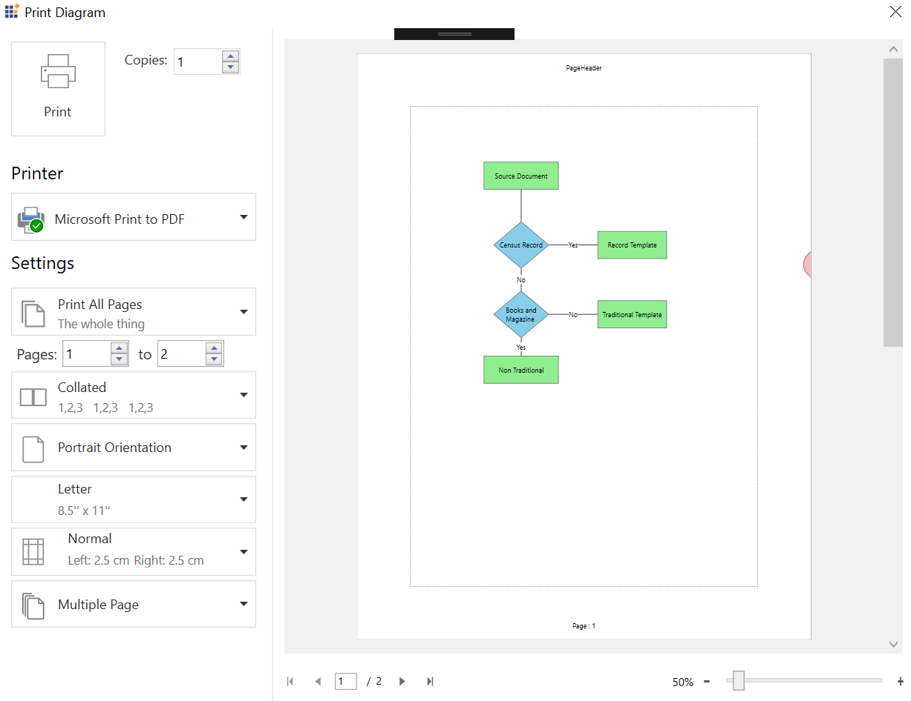

N> [View Sample in GitHub](https://github.com/SyncfusionExamples/WPF-Diagram-Examples/tree/master/Samples/Printing/CustomHeaderFooter)

## Skip Empty Pages

Diagram provides support to skip empty pages while navigating through the preview and in the printed document, thus reducing paper wastage.

The `GetPrintInfo` virtual method of `PrintingService` is used to cancel the empty pages. This method will execute for page navigation, printing each diagram page, and changes made in the print preview area.

After defining the custom service, assign it to the diagram so the override takes effect:




public class CustomPrintingService : PrintingService
{
    protected override void GetPrintInfo(PrintInfo args)
    {
        if (!(args.Elements as IEnumerable<object>).Any())
        {
            args.Cancel = true;
        }
        else
            base.GetPrintInfo(args);
    }
}

// In MainWindow constructor or initialization code:
diagram.PrintingService = new CustomPrintingService();




## Printing Event

The `Printing` event will notify the different states of printing with [PrintingEventArgs](https://help.syncfusion.com/cr/wpf/Syncfusion.UI.Xaml.Diagram.PrintingEventArgs.html). The argument provides the print dialog and the current print state.

| PrintStatus | Description |
|---|---|
| Started | Specifies that printing has been started. |
| Printing | Specifies the progress status of the printing. |
| Completed | Specifies the completed status of the printing. |
| PagePrepared | Specifies the completed status of the page preparation. |
| DocumentPrepared | Specifies the completed status of the document preparation. |
| Cancelled | Specifies the cancelled status of the printing. |




(diagram.Info as IGraphInfo).Printing += MainWindow_Printing;

private void MainWindow_Printing(object sender, PrintingEventArgs args)
{
}




## Custom Paper Size

The Print Preview window's page size drop-down will display only the supported paper sizes of the selected printer. When the diagram page size is not supported by the selected printer, the Print button is disabled and the Page Size drop-down asks you to choose a supported page size.

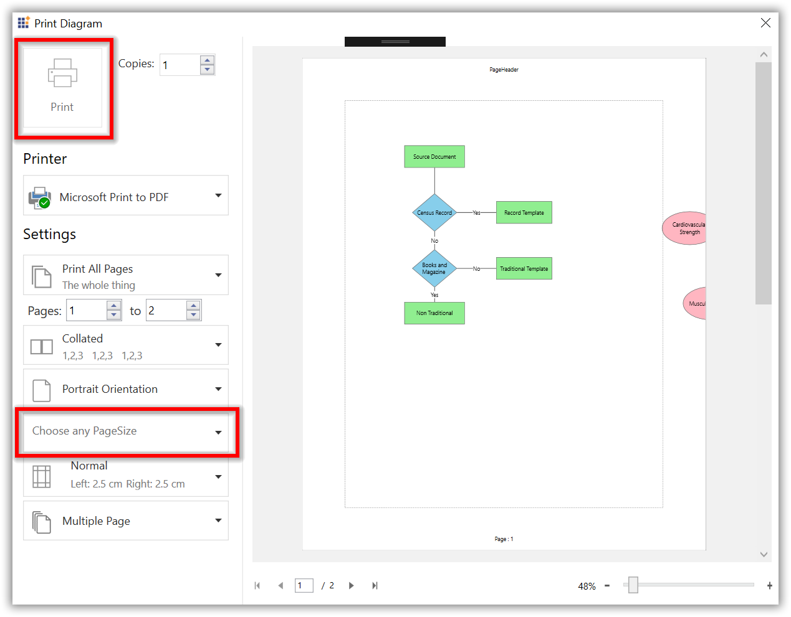

Using the `OnSelectedPrinterChanged` virtual method of `DiagramPrintManager`, you can add the custom paper sizes to the selected printer apart from the default supported paper sizes. Refer to the following code example.




public class CustomDiagramPrintManager : DiagramPrintManager
{
    public CustomDiagramPrintManager(PrintingService printingService) : base(printingService)
    {
    }

    public override void OnSelectedPrinterChanged(PrintQueue printQueue)
    {
        if (printQueue.Name.Contains("Microsoft Print to PDF"))
        {
            List<string> pagesizename = PageSizeOptions.Select(c => c.PageSizeName).ToList();
            if (!(pagesizename.Contains("Ansi B")))
            {
                PageSizeOptions.Add(new Syncfusion.Windows.Controls.Printing.PrintPageSize() { PageSizeName = "Ansi B", Size = new Size(1055, 1632) });
            }
            if (!(pagesizename.Contains("Ansi C")))
            {
                PageSizeOptions.Add(new Syncfusion.Windows.Controls.Printing.PrintPageSize() { PageSizeName = "Ansi C", Size = new Size(1632, 2112) });
            }
            if (!(pagesizename.Contains("Ansi D")))
            {
                PageSizeOptions.Add(new Syncfusion.Windows.Controls.Printing.PrintPageSize() { PageSizeName = "Ansi D", Size = new Size(2112, 3264) });
            }
            if (!(pagesizename.Contains("A0")))
            {
                PageSizeOptions.Add(new Syncfusion.Windows.Controls.Printing.PrintPageSize() { PageSizeName = "A0", Size = new Size(3179, 4494) });
            }
        }
    }
}

public class CustomPrintingService : PrintingService
{
    public CustomPrintingService()
    {
        this.PrintManager = new CustomDiagramPrintManager(this);
    }
}

// Subscribe to the Printing event to apply the custom paper size when printing starts.
(diagram.Info as IGraphInfo).Printing += MainWindow_Printing;

// In MainWindow initialization code:
diagram.PrintingService = new CustomPrintingService();




Here, the `Microsoft Print to PDF` printer won't support Ansi B, Ansi C, Ansi D, and A0 paper sizes by default, so the above code will add the Ansi B, Ansi C, Ansi D, and A0 paper sizes in the Print Preview window's page size combo box.

However, we have added custom paper sizes manually in the page size drop-down. The printer won't print the diagram in the custom paper size; to print the diagram in the custom page size, assign the chosen custom paper size to `PrintDialog.PrintTicket.PageMediaSize` and enable `CanUseCustomPageMediaSize` in the printing event when the printing state is `Started`. Refer to the following code example.




private void MainWindow_Printing(object sender, PrintingEventArgs args)
{
    if (args.PrintState == PrintStatus.Started)
    {
        var customPages = new System.Collections.Generic.Dictionary<string, Size>();
        var printerName = args.PrintDialog.PrintQueue.Name;
        if (printerName.Contains("Microsoft Print to PDF"))
        {
            customPages.Add("Ansi B", new Size(1055, 1632));
            customPages.Add("Ansi C", new Size(1632, 2112));
            customPages.Add("Ansi D", new Size(2112, 3264));
        }
        else if (printerName.Contains("Microsoft XPS Document Writer"))
        {
            customPages.Add("A0", new Size(3179, 4494));
        }

        foreach (var customPage in customPages)
        {
            if (args.SelectedPageMediaSizeName.Contains(customPage.Key))
            {
                var pageSize = customPage.Value;
                var mediaSize = new PageMediaSize(PageMediaSizeName.Unknown, pageSize.Width, pageSize.Height);
                args.PrintDialog.PrintTicket.PageMediaSize = mediaSize;
                args.CanUseCustomPageMediaSize = true;
                break;
            }
        }
    }
}




N> Custom page size print is not applicable for a real printer. When you choose a custom paper size and try to print it on a real printer, the printer will print the next supported paper size instead of the chosen one. The above option is only applicable for "Microsoft Print to PDF" printer.

## Classic Print Preview

Diagram provides backward compatibility to show the older or classic print preview by calling the `ShowClassicPrintPreview` method instead of the `Print()` method.




diagram.PrintingService.ShowDialog = true;
diagram.PrintingService.ShowClassicPrintPreview();




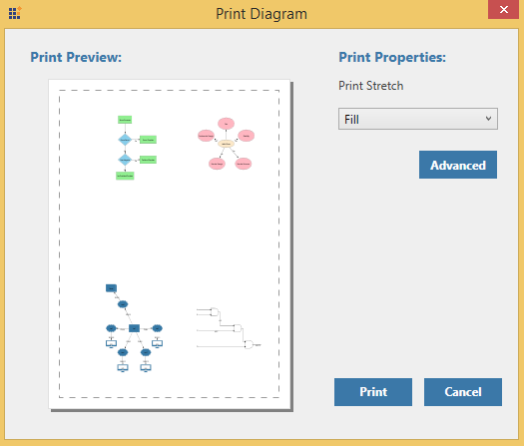

## See Also

[How to customize the header or footer of the print preview](https://support.syncfusion.com/kb/article/11481/how-to-customize-the-header-or-footer-of-the-print-preview-in-the-wpf-diagramsfdiagram)

[How to ignore empty pages while printing the WPF Diagram](https://support.syncfusion.com/kb/article/8537/how-to-ignore-empty-pages-while-printing-the-wpf-diagram-sfdiagram)

[How to get progress notification while printing the diagram pages](https://support.syncfusion.com/kb/article/8465/how-to-get-progress-notification-while-printing-in-wpf-diagram-sfdiagram)

[How to show classic print preview](https://support.syncfusion.com/kb/article/8186/how-to-show-classic-print-preview-in-wpf-diagram-sfdiagram)

[How to enable the Print Properties option in the Print dialog in WPF Diagram](https://support.syncfusion.com/kb/article/18697/how-to-enable-the-print-properties-option-in-the-print-dialog-in-wpf-diagram-sfdiagram)