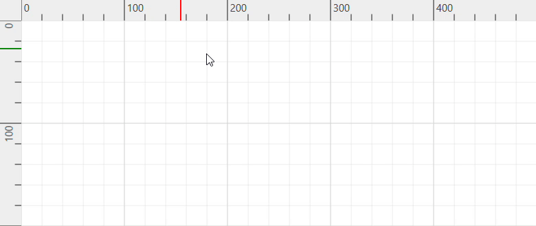

# Rulers in WPF Diagram (SfDiagram)

The Ruler provides a Horizontal and Vertical guide for measuring in the Diagram control. The Ruler can be used to measure the Diagram objects, indicate positions, and align Diagram elements. This is especially useful in creating scale models. You can set the unit of measure, such as centimeters or inches. The default [Unit](https://help.syncfusion.com/cr/wpf/Syncfusion.UI.Xaml.Diagram.LengthUnit.html#Syncfusion_UI_Xaml_Diagram_LengthUnit_Unit) of measure is pixels. The ruler also includes a Position Indicator that displays the precise location of the mouse cursor on the diagram canvas, and the default color of position indicator marker is black.

Please refer to the sample from Dashboard->Desktop->WPF->Diagram->GettingStarted->Rulers and Units.

## Define Rulers




xmlns:Syncfusion="clr-namespace:Syncfusion.UI.Xaml.Diagram;assembly=Syncfusion.SfDiagram.WPF"
xmlns:SyncControls="clr-namespace:Syncfusion.UI.Xaml.Diagram.Controls;assembly=Syncfusion.SfDiagram.WPF"

<syncfusion:SfDiagram x:Name="diagram">
    <syncfusion:SfDiagram.HorizontalRuler>
        <syncfusion:Ruler/>
    </syncfusion:SfDiagram.HorizontalRuler>
    <syncfusion:SfDiagram.VerticalRuler>
        <syncfusion:Ruler Orientation="Vertical"/>
    </syncfusion:SfDiagram.VerticalRuler>
</syncfusion:SfDiagram>
		



diagram.HorizontalRuler = new Ruler();
diagram.VerticalRuler = new Ruler() { Orientation = Orientation.Vertical };




## Customizing the Ruler
### Customizing Measurement Units

By default, ruler segments are arranged based on the `MeasurementUnit`. See the available [LengthUnits](https://help.syncfusion.com/cr/wpf/Syncfusion.UI.Xaml.Diagram.LengthUnit.html) for Ruler.

Segment width, the textual description of the ruler segment, and the appearance of the ruler ticks can be customized. 

### Customizing Position Indicator Marker Brush Color

You can change the color of the ruler's position indicator marker to any preferred shade by using `MarkerBrush` property of the `Ruler` class.




xmlns:Syncfusion="clr-namespace:Syncfusion.UI.Xaml.Diagram;assembly=Syncfusion.SfDiagram.WPF"
xmlns:SyncControls="clr-namespace:Syncfusion.UI.Xaml.Diagram.Controls;assembly=Syncfusion.SfDiagram.WPF"

<syncfusion:SfDiagram x:Name="diagram">
    <syncfusion:SfDiagram.HorizontalRuler>
        <syncfusion:Ruler MarkerBrush="Red"/>
    </syncfusion:SfDiagram.HorizontalRuler>
    <syncfusion:SfDiagram.VerticalRuler>
        <syncfusion:Ruler Orientation="Vertical" MarkerBrush="Green"/>
    </syncfusion:SfDiagram.VerticalRuler>
</syncfusion:SfDiagram>
		



diagram.HorizontalRuler = new Ruler();
diagram.VerticalRuler = new Ruler() { Orientation = Orientation.Vertical };




Please refer to the sample to [Customize the Ruler](https://github.com/SyncfusionExamples/WPF-Diagram-Examples/tree/master/Samples/Rulers).

## See Also

[How to customize the ruler units?](https://support.syncfusion.com/kb/article/5944/how-to-customize-the-ruler-units-in-wpf-diagram-sfdiagram)