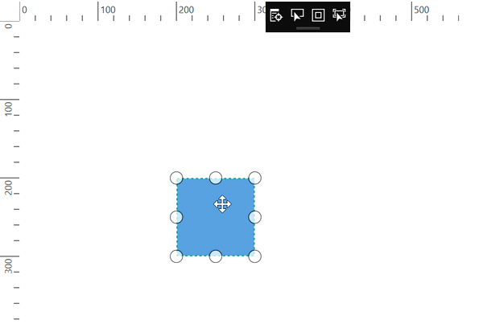
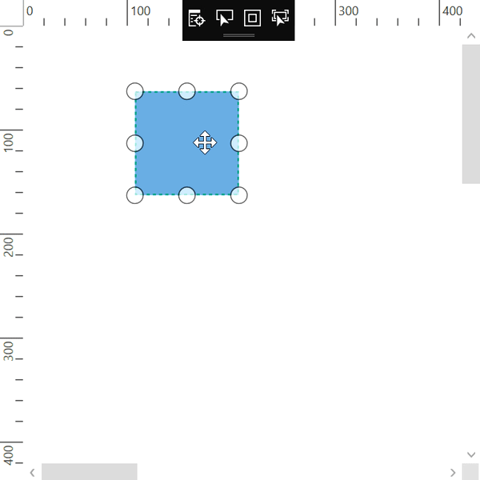
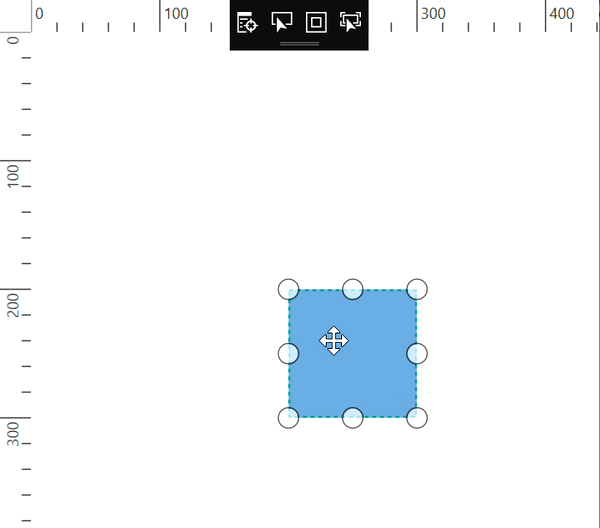

# Auto-Scroll Limit in WPF Diagram (SfDiagram)

The auto-scroll limit allows you to define the scrollable region of the Diagram while the page is getting auto scrolled. The `AutoScrollLimit` property of scroll settings class helps to limit the auto scrolling area. It includes the following options:

* Infinity: Allows auto-scroll in all directions without any restriction.
* Diagram: Allows auto-scroll within the Diagram content.
* Limited: Allows auto-scroll within the specified area.

The default operation is `Infinity`.



<!--Initialize the Sfdiagram-->
<syncfusion:SfDiagram x:Name="diagram">
    <!--Initialize the scroll setting class with auto scroll limit-->
    <syncfusion:SfDiagram.ScrollSettings>
        <syncfusion:ScrollSettings AutoScrollLimit="Limited" ScrollableArea="0,0,1500,1500"/>
    </syncfusion:SfDiagram.ScrollSettings>
</syncfusion:SfDiagram>


//Initialize the SfDiagram
SfDiagram diagram = new SfDiagram();
//Initialize the scroll setting with auto scroll limit and scrolling area
diagram.ScrollSettings = new ScrollSettings()
{
    AutoScrollLimit = ScrollLimit.Limited,
    ScrollableArea = new Rect(0,0,1500,1500),
};



| AutoScrollLimit | Output |
|---|---|
| Infinity | |
| Diagram | |
| Limited   ScrollableArea = (0,0,1500,1500) |  |
