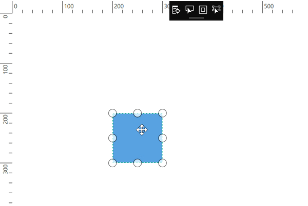
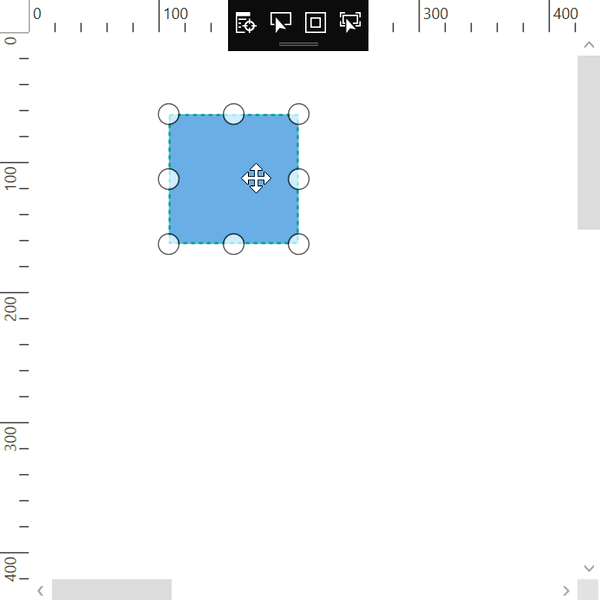
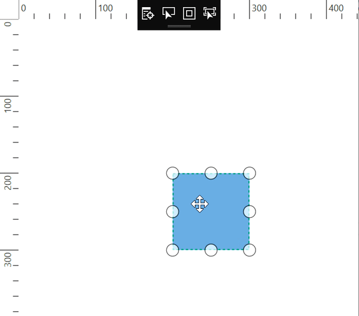

# Auto-Scroll Limit in WPF SfDiagram

The auto-scroll limit allows you to define the scrollable region of the Diagram while the page is being auto-scrolled. The [AutoScrollLimit](https://help.syncfusion.com/cr/wpf/Syncfusion.UI.Xaml.Diagram.ScrollSettings.html#Syncfusion_UI_Xaml_Diagram_ScrollSettings_AutoScrollLimit) property of ScrollSettings class helps to limit the auto scrolling area. It includes the following options:

* **Infinity**: Allows auto-scroll in all directions without any restriction.
* **Diagram**: Allows auto-scroll within the Diagram content.
* **Limited**: Allows auto-scroll within the specified area.

The default value is `Infinity`.



<!--Initialize the SfDiagram-->
<syncfusion:SfDiagram x:Name="diagram">
    <!--Initialize the ScrollSetting class with auto scroll limit-->
    <syncfusion:SfDiagram.ScrollSettings>
        <syncfusion:ScrollSettings AutoScrollLimit="Limited" ScrollableArea="0,0,1500,1500"/>
    </syncfusion:SfDiagram.ScrollSettings>
</syncfusion:SfDiagram>


//Initialize the SfDiagram
SfDiagram diagram = new SfDiagram();
//Initialize the ScrollSetting with auto scroll limit and scrolling area
diagram.ScrollSettings = new ScrollSettings()
{
    AutoScrollLimit = ScrollLimit.Limited,
    ScrollableArea = new Rect(0,0,1500,1500),
};



| AutoScrollLimit | Output |
|---|---|
| Infinity | |
| Diagram | |
| Limited   ScrollableArea = (0,0,1500,1500) |  |
