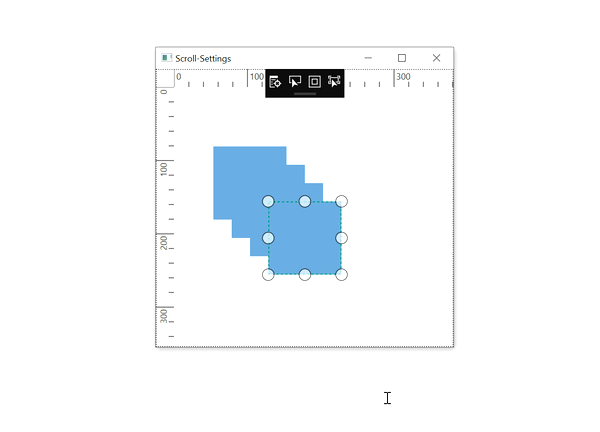
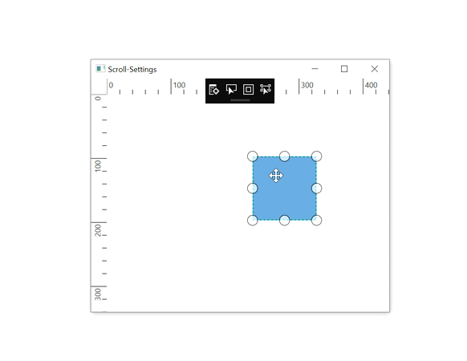
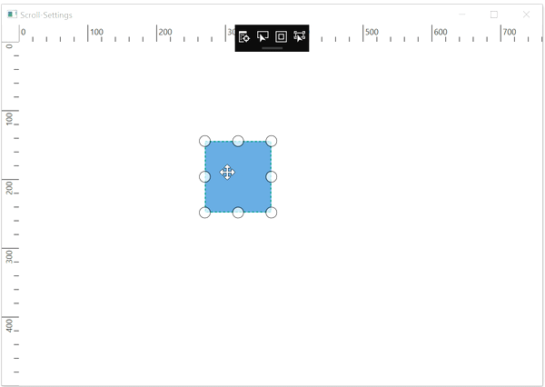

# Drag Limit in WPF Diagram (SfDiagram)

The drag limit allows you to define the dragging region of the Diagram while diagram objects are getting dragged. The `DragLimit` property of scroll settings class helps to limit the dragging area. It includes the following options:

* Infinity: Allows you to drag the diagram objects in all directions without any restriction.
* Diagram: Allows you to drag the diagram objects within the Diagram content.
* Limited: Allows you to drag the diagram objects within the specified area. The `EditableArea` property is used to specify the area that is allowed to dragging.

The default operation is `Infinity`. 

Drag limit behaviour will be enabled by handling the `SelectorChangedEvent` and its arguments of `SelectorChangedEventArgs` class of diagram control.



<!--Initialize the Sfdiagram-->
<syncfusion:SfDiagram x:Name="diagram">
    <!--Initialize the scroll setting class with drag limit value-->
    <syncfusion:SfDiagram.ScrollSettings>
        <syncfusion:ScrollSettings DragLimit="Limited" EditableArea="100,100,400,300"/>
    </syncfusion:SfDiagram.ScrollSettings>
</syncfusion:SfDiagram>


//Initialize the SfDiagram
SfDiagram diagram = new SfDiagram();
//Register the selector changed event to handle it
(diagram.Info as IGraphInfo).SelectorChangedEvent += Diagram_SelectorChangedEvent;
//Initialize the scroll settings with drag limit and drag limit area
diagram.ScrollSettings = new ScrollSettings()
{
    DragLimit = ScrollLimit.Limited,
    EditableArea = new Rect(100, 100, 400, 300),
};

//Selector changed event
private void Diagram_SelectorChangedEvent(object sender, SelectorChangedEventArgs args)
{
    //Changing the cursor to indicate the dragging restriction 
    args.BlockCursor = Cursors.No;
    //Enabling the dragging limit
    args.Block = true;
}



| DragLimit | Output |
|---|---|
| Infinity | |
| Diagram | |
| Limited   EditableArea = (100, 100, 400, 300) |  |



[How to snap the diagram objects on the diagram page](/wpf/diagram/snapping/definesnapping)

[How to change the page settings of the diagram control](/wpf/diagram/page-settings)

[How to add the gridlines for the diagram control](/wpf/diagram/gridlines)

[How to add the rulers for the diagram control](/wpf/diagram/rulers)


